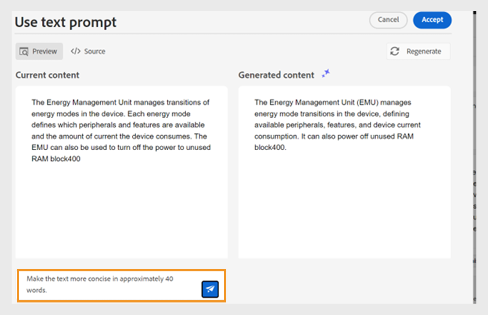
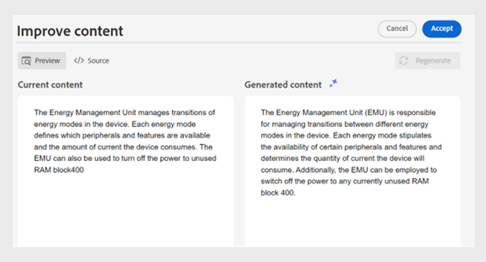
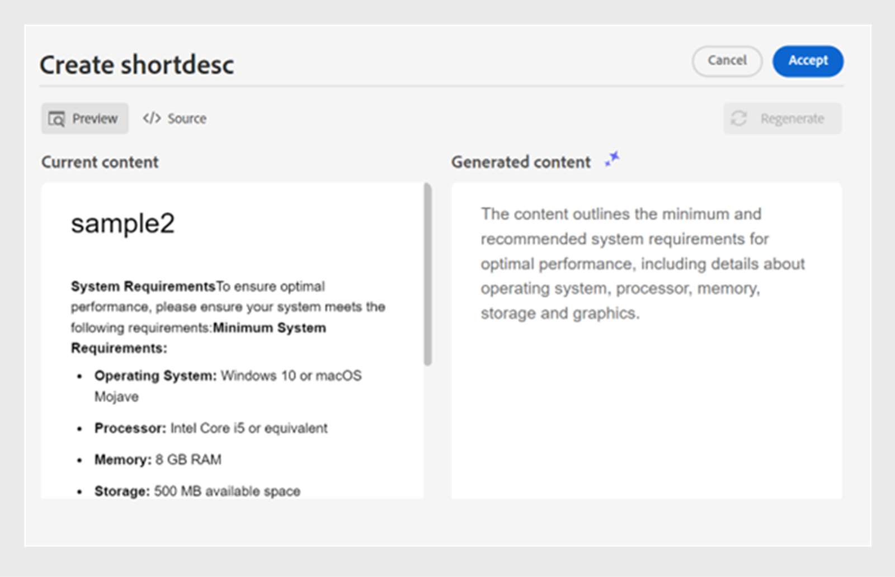
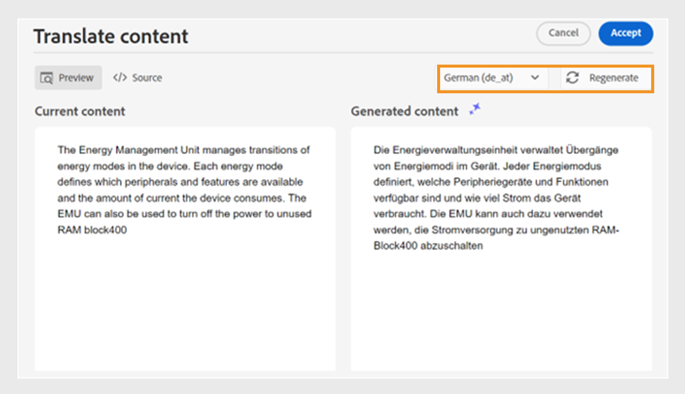

# Assistant d’IA pour créer des documents avec une efficacité intelligente

Experience Manager Guides fournit un outil d’assistant d’IA qui vous aide à rendre votre création plus intelligente et plus rapide. La gestion des documents est simplifiée grâce à des suggestions et une optimisation intelligentes. À l’aide de cet outil, affichez les suggestions intelligentes pour réutiliser le contenu du référentiel de contenu existant. Utilisez la fonction d’invite de texte pour fournir une invite et modifier le contenu ou générer une sortie selon vos besoins. Utilisez l’assistant d’IA pour convertir intelligemment un paragraphe en liste. Vous pouvez créer une brève description pour la rubrique actuelle. Cette fonctionnalité vous permet également d’améliorer et de traduire facilement le contenu sélectionné.

>[!NOTE]
>
> Pour ajouter la fonction Assistant IA dans le panneau de droite, votre administrateur système doit sélectionner l’option **Assistant IA** sous l’onglet **Panneaux** dans l’icône des paramètres **Workspace** .
> En outre, vous devez extraire votre document pour afficher l’icône de l’assistant d’IA.

Cette fonctionnalité est disponible uniquement pour les rubriques DITA. Après avoir sélectionné le texte d’une rubrique, vous pouvez choisir d’effectuer l’une des actions de l’assistant AI :

## Suggérer du contenu réutilisable

Utilisez la fonction **Suggérer du contenu réutilisable**  de contenu réutilisable pour créer du contenu de manière cohérente et précise. Vous pouvez sélectionner le contenu et Experience Manager Guides fournit des suggestions sur la manière de réutiliser le contenu existant dans votre référentiel.
En savoir plus sur l’utilisation de suggestions intelligentes optimisées par [IA pour créer du contenu](authoring-ai-based-smart-suggestions.md).

## Utiliser une invite de texte

Une invite de texte est une instruction, une question ou une instruction qui guide l’assistant d’IA dans la génération d’une réponse ou d’une sortie spécifique.

Vous pouvez utiliser une invite de texte pour modifier le contenu et générer une sortie.  Par exemple, vous pouvez générer un résumé des fonctionnalités d’un produit et l’utiliser dans votre rapport pour présenter le produit. Vous pouvez également utiliser cette fonctionnalité pour comparer deux produits. Par exemple, vous pouvez également créer un tableau de comparaison pour les fonctionnalités de deux produits.

1. Sélectionnez le texte pour lequel vous souhaitez utiliser l’invite de texte.
1. Sélectionnez **Utiliser l’invite de texte** dans le panneau **Assistant AI**.
1. Envoyez une invite de l’une des manières suivantes :

   - Choisissez une invite parmi les invites suggérées.
   - Révisez ou modifiez une invite suggérée pour créer une invite personnalisée selon vos besoins.

     >[!NOTE]
     >
     > Les invites suggérées sont configurées dans le `ui_config.json` par votre administrateur.

   - Saisissez votre invite dans la zone de texte.

1. Sélectionnez **Régénérer**  pour obtenir une autre réponse ou sortie en fonction de votre invite, comme les outils d’IA.

1. (Facultatif) Sélectionnez **Développer**  pour ouvrir l’éditeur **Utiliser une invite de texte**. Il affiche le contenu actuel et le contenu généré. Vous pouvez modifier le contenu de la disposition source et vérifier l’aperçu.

   >[!NOTE]
   >
   > Les réponses sont générées en fonction du contenu sélectionné.

1. Vous pouvez également modifier l’invite dans l’éditeur et générer à nouveau la réponse. Par exemple, vous pouvez modifier l’invite pour rendre le texte plus concis avec environ 40 mots.

   

1. Vous pouvez vérifier la source du contenu généré et le modifier si nécessaire.

1. Sélectionnez **Accepter** pour remplacer le contenu sélectionné dans la rubrique par le contenu généré.
1. **Annuler** : annule l’action d’invite de texte. Retourne à l’état initial du panneau.

   >[!NOTE]
   >
   > Si vous sélectionnez l’icône **Annuler** dans le panneau des fonctionnalités, vous revenez également à l’état initial.

## Améliorer le contenu

Améliore le contenu sélectionné. Vérifiez l’orthographe, la langue et la structure grammaticale, puis suggérez une meilleure version du contenu. Elle améliore également la qualité des peines.

1. Sélectionnez le contenu.
1. Sélectionnez **Améliorer le contenu**  pour trouver les suggestions relatives au contenu amélioré.
1. Sélectionnez **Régénérer** pour obtenir une autre suggestion d’amélioration du contenu.

1. (Facultatif) Sélectionnez **Développer** pour ouvrir l’éditeur de contenu amélioré. Il affiche le contenu actuel et généré. Vous pouvez modifier le contenu dans la disposition source et également vérifier l’aperçu.

Acceptez la suggestion, effectuez une régénération pour une réponse différente ou annulez l’action pour revenir à l’état précédent.

## Créer des raccourcis

Créez une brève description du sujet en fonction du contenu sélectionné, composée de 30 à 50 mots environ. La description courte permet aux utilisateurs et utilisatrices de rechercher et de trouver du contenu pertinent.
Par exemple, vous pouvez répertorier la configuration système requise et générer une brève description en conséquence.

1. Sélectionnez le contenu.
1. Sélectionnez **Créer une description courte**  pour créer une description courte pour la rubrique actuelle.
1. Sélectionnez **Accepter** pour créer une description courte si elle n’est pas déjà présente. S’il existe une description courte, vous devez la confirmer avant de la remplacer par la nouvelle description courte.

Vous pouvez également effectuer les actions suivantes :

- Sélectionnez **Régénérer** pour générer une autre brève description pour votre rubrique, comme les outils d’IA.
- Sélectionnez **Développer** pour ouvrir l’éditeur **Créer une description courte**.

## Détailler le contenu

Cette fonctionnalité convertit intelligemment un paragraphe sélectionné en liste.  Il analyse le contenu et crée une liste logique d’éléments. Il n’est pas nécessaire de créer les éléments manuellement. Par exemple, si vous disposez d’un paragraphe détaillant les étapes de création d’un compte d’utilisateur, l’outil peut le transformer en une liste détaillée, éliminant la nécessité de créer manuellement des éléments un par un.

1. Sélectionnez le contenu.
1. Select **Itemize content**  to convert the selected content into a list.
The AI Assistant tool converts the content smartly into a list of items.
1. (Optional) Select **Expand** to open the **Itemize content** editor.
1. Once your list is ready, accept the changes in the generated content. The generated content then replaces the selected content.

## Traduction du contenu

Use this intelligent feature to translate the selected content to the target language. For example, you can add content in English and quickly translate it into German.
Perform the following steps to translate the content:

1. Select the content that you want to translate.
1. Select **Translate content**  from the AI Assistant panel.
1. Select the target language from the dropdown. The translated content appears in the AI Assistant panel.

1. (Optional) Select **Expand** to open the **Translate content** editor.
1. You can also select another language from the dropdown menu and regenerate the content in the chosen language. For example, if you select French and then select **Regenerate**, the content is translated into French.

