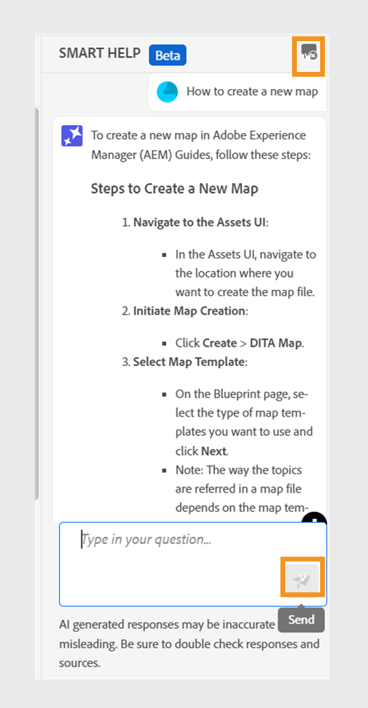

# Aide intelligente optimisée par l’IA pour rechercher du contenu

Experience Manager Guides fournit l’aide intelligente basée sur GenAI, une fonctionnalité de recherche conversationnelle qui vous aide à trouver le contenu approprié à partir de la [documentation Adobe Experience Manager Guides](https://experienceleague.adobe.com/fr/docs/experience-manager-guides/using/overview).
Vous pouvez poser vos questions et obtenir des réponses d&#39;une manière informative. La réponse à votre requête est basée sur le contenu de la documentation du produit . Cette recherche est entièrement conversationnelle. Vous pouvez poser des questions, puis, en fonction de la réponse, vous pouvez poser d&#39;autres questions. La réponse inclut également des liens vers les documents sources, auxquels vous pouvez vous reporter pour plus de détails.

Par exemple, vous pouvez créer une rubrique dans Experience Manager Guides pour votre documentation. Vous pouvez demander : *Comment créer une rubrique ?* Vous obtenez une réponse et les liens pour les articles associés. Ensuite, si vous souhaitez savoir comment générer la sortie PDF pour le document, vous pouvez poser des questions à son sujet. Par exemple, *Comment publier une rubrique dans un PDF ?* ou *Comment générer la sortie PDF pour une rubrique ?*

Lorsque vous ouvrez l’éditeur web, le panneau **Aide dynamique** s’affiche à droite.

>[!NOTE]
>
> Votre administrateur doit configurer la fonction **Aide intelligente**. Pour plus d’informations, consultez la section [Configurer l’aide intelligente optimisée par l’IA pour rechercher du contenu](/help/product-guide/cs-install-guide/conf-smart-help.md) du Guide d’installation et de configuration des services cloud.

{width="300"}

*Afficher le panneau **Aide intelligente**.*

Effectuez les étapes suivantes pour utiliser la recherche conversationnelle afin de trouver le contenu approprié et de résoudre vos requêtes :

1. Sélectionnez **Aide dynamique**  pour ouvrir le panneau.

   >[!NOTE]
   >
   > Dans les [profils globaux ou au niveau du dossier](/help/product-guide/cs-install-guide/conf-folder-level.md#conf-ai-guides-assistant), votre administrateur ou administratrice doit définir les questions par défaut qui apparaissent dans le panneau.

1. Saisissez la question pour rechercher le contenu associé dans la documentation de Experience Manager Guides. Vous pouvez sélectionner la question par défaut dans le panneau ou saisir votre question dans la zone de texte.

1. Sélectionnez **Envoyer**  ou appuyez sur **Entrée** pour afficher la réponse à vos questions.

   Selon votre question, vous pouvez afficher le contenu, les images applicables et les liens vers les articles.

   {width="300"}

   *Sélectionnez l’exemple de question et affichez le contenu et les images en réponse.*

1. Sélectionnez les liens vers les articles à la fin et affichez des informations détaillées sur votre question.

1. Sélectionnez **Effacer la conversation**  pour supprimer l’historique des conversations du panneau. Vous pouvez ensuite lancer une nouvelle conversation et trouver du contenu pertinent.

Cette fonctionnalité dynamique vous permet de trouver rapidement des solutions, de vous concentrer sur votre documentation et d’effectuer efficacement vos tâches.
