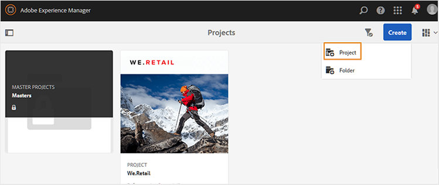

# Créer un projet DITA {#id1645HA00NM6}

AEM Guides fournit un modèle de projet DITA que vous pouvez utiliser pour créer et gérer vos tâches de révision.

Vous pouvez créer un projet DITA, puis l&#39;utiliser pour lancer vos révisions. Un projet vous permet de définir une date limite et de contrôler les tâches et le temps requis pour terminer la tâche de révision pour laquelle vous avez créé le projet.

Vous pouvez ajouter des membres de l’équipe à un projet, qui pourront ensuite se voir attribuer différents rôles : Auteurs, Réviseurs et Éditeurs.

Une fois que vous avez créé votre projet DITA, vous pouvez lancer la révision à partir de l’éditeur web ou de l’interface utilisateur d’Assets. Pour plus d’informations, voir [Envoyer les rubriques pour révision](review-send-topics-for-review.md#).

De même, chaque fois qu’un auteur lance un workflow de révision, les membres sélectionnés du projet reçoivent une notification par e-mail. Pour configurer les notifications par e-mail, voir *Personnaliser les modèles d’e-mail* dans Installation et configuration d’Adobe Experience Manager Guides as a Cloud Service.

Pour créer un projet DITA, procédez comme suit :

1. Ouvrez la console Projets .

   Vous pouvez également accéder à la console Projets à l’aide de l’URL suivante :

   ```http
   http://<server name>:<port>/projects.html
   ```

1. Cliquez sur **Créer** \> **Projet** pour lancer l’assistant Créer un projet.

   {width="650" align="left"}

1. Sur la page Créer un projet , sélectionnez le modèle **Projet DITA** et cliquez sur **Suivant**.

1. Sur la page Propriétés du projet , saisissez les détails suivants :

   Informations de l’onglet **De base** :

   {width="650" align="left"}

   - Saisissez le **titre**, la **description** et la **date d’échéance** de votre projet.

   - Vous pouvez éventuellement choisir une miniature pour le projet.

   - Par défaut, vous êtes nommé propriétaire du projet. Pour ajouter d’autres utilisateurs à ce projet :

   1. Saisissez ou choisissez un utilisateur dans la liste déroulante **Utilisateur**.

   1. Choisissez un type d’utilisateur : Auteurs, Réviseurs ou Éditeurs.

      >[!NOTE]
      >
      >D&#39;autres types d&#39;utilisateurs apparaissent dans cette liste déroulante, mais pour un projet DITA, vous ne devez choisir que parmi les types d&#39;utilisateurs Auteurs, Réviseurs ou Éditeurs. Même si vous ajoutez un utilisateur d&#39;un autre type, cet utilisateur ne pourra accéder à aucune fonctionnalité spécifique à DITA disponible dans AEM Guides.

   1. Cliquez sur **Ajouter**.

      >[!NOTE]
      >
      >Si vous utilisez AEM Guides version 3.5 ou antérieure, une option vous permettant de sélectionner un fichier de plan DITA s&#39;affiche pour résoudre les références essentielles des workflows de modification de rubrique, de prévisualisation et de révision. Dans la version 3.6 et les versions ultérieures, vous pouvez définir la carte racine via l’éditeur web. Pour plus d’informations, voir [Préférences utilisateur](web-editor-features.md#id2087G0P40SB) dans l’éditeur web. Vous pouvez également définir la carte racine en la configurant au niveau des profils globaux ou au niveau du dossier. Pour plus d’informations, consultez *Configuration de profils globaux ou de niveau dossier* dans le Guide d’installation et de configuration.

   Informations de l’onglet **Avancé** :

   - Saisissez un nom pour le projet. Ce nom est utilisé pour créer l’URL de ce projet.

1. Cliquez sur **Créer**.

   La boîte de dialogue Projet créé s’affiche.

1. Cliquez sur **Ouvrir** pour ouvrir la page de votre projet.


**Rubrique parente :**[ consulter des rubriques ou des cartes](review.md)
