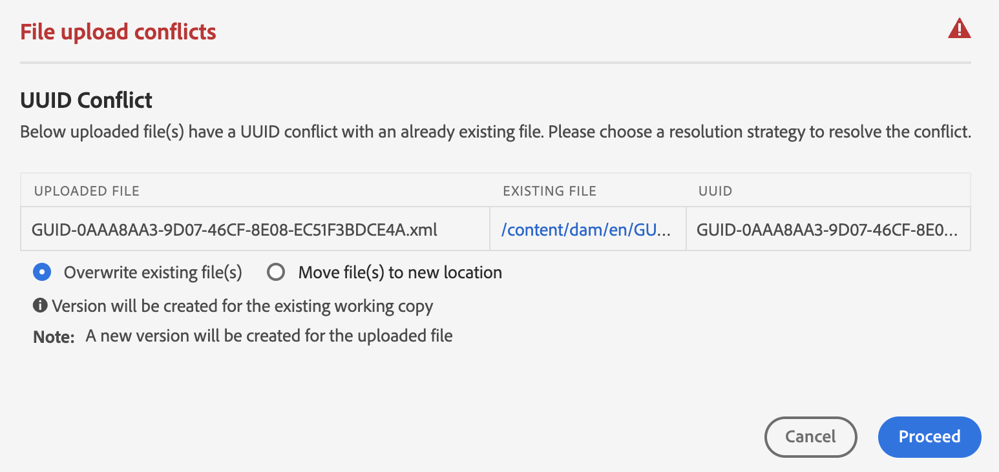

# Gestion des fichiers et des dossiers {#id2116G0L08XA}

Cette section explique comment AEM Guides gère les opérations de base sur les fichiers, telles que les opérations de copie, de collage, de glisser-déposer et de suppression. Les scénarios possibles sont les suivants :

## Copier/coller des fichiers

**Si le fichier a un nom lisible par l’utilisateur**

- *Si le fichier portant le même nom n’existe pas dans le dossier de destination* : une nouvelle copie du fichier est créée et un UUID lui est également attribué. Ici, le nom de fichier est identique au nom de fichier d’origine.
- *Si le fichier portant le même nom existe déjà dans le dossier de destination* : une nouvelle copie du fichier est créée avec un suffixe \(comme nom_fichier0.extension\). Un UUID est également attribué au fichier nouvellement créé.

**Si le nom de fichier est basé sur un modèle UUID**

- *Si le fichier portant le même nom n’existe pas dans le dossier de destination* : une nouvelle copie du fichier est créée et un nouvel UUID lui est également affecté au nouvel emplacement. Ici, le nom de fichier est identique à l’UUID.
- *Si le fichier portant le même nom existe déjà dans le dossier de destination* : une nouvelle copie du fichier est créée et un nouvel UUID lui est également attribué. Le nom du fichier est identique à l’UUID.

## Copie et collage de dossiers

**Copiez et collez un dossier au même emplacement**

- *Le dossier contient des fichiers dont les noms sont lisibles par l’utilisateur* : une nouvelle copie du dossier est créée avec un suffixe \(comme nom_dossier0\). Un nouvel UUID est également affecté aux fichiers dans le dossier . Toutefois, les noms des fichiers ne changent pas.

- *Le dossier contient des fichiers dont les noms sont basés sur un modèle UUID* : une nouvelle copie du dossier est créée avec un suffixe \(comme foldername0\). Un nouvel UUID est également attribué à tous les fichiers du nouveau dossier. Les noms de fichiers sont également modifiés ; ils sont identiques au nouvel UUID.

**Copiez et collez un dossier à un autre emplacement**

- *Le dossier contient des fichiers dont les noms sont lisibles par l’utilisateur* : une nouvelle copie du dossier est créée et un nouvel UUID est également affecté à tous les fichiers du dossier au nouvel emplacement. Ici, les noms de dossier ou de fichier ne changent pas.

- *Le dossier contient des fichiers dont les noms reposent sur un modèle UUID* : une nouvelle copie du dossier est créée avec le même nom que le dossier d’origine. Un nouvel UUID est également attribué à tous les fichiers du nouveau dossier. Les noms de fichiers sont également modifiés ; ils sont identiques au nouvel UUID.

## Glisser-déposer des fichiers

**Glisser-déposer avec des noms de fichier lisibles**

- *Glisser-déposer au même emplacement* : les options suivantes vous sont proposées : **Remplacer le(s) fichier(s) existant(s)**, **Conserver le(s) fichier(s)\)** et une option vous permettant de créer une version de la copie de travail existante.

  {width="650" align="center"}

  Si vous sélectionnez l’option **Remplacer le ou les fichiers existants\(s\)**, le fichier en cours de chargement remplace la version de travail actuelle du fichier existant à l’emplacement d’origine. L&#39;UUID n&#39;est pas créé ni modifié.

  Si vous choisissez l’option **Conserver les deux fichiers\(s\)**, une nouvelle copie du fichier est créée avec un suffixe \(comme nom_fichier0.extension\). Un nouvel UUID est également affecté au fichier nouvellement copié.

  Avec l’option Remplacer le(s) fichier(s) existant(s) , si vous choisissez de créer une version à partir de la copie de travail existante, une nouvelle version de la copie de travail du document est également créée.

  >[!NOTE]
  >
  > La fonction **Créer une version pour le fichier téléchargé** doit être activée par votre administrateur. Si cette fonctionnalité est activée, une nouvelle version du fichier chargé est créée. Si vous désélectionnez cette option, aucune version du fichier chargé n’est créée. Pour plus d’informations, consultez la section *Créer une nouvelle version du fichier téléchargé* dans Installation et configuration d’Adobe Experience Manager Guides as a Cloud Service.

  Si un fichier est déjà extrait pour des modifications par un autre utilisateur et que vous tentez de charger et de remplacer le fichier existant, il échoue et affiche une erreur.

  >[!NOTE]
  >
  >La fonction **Remplacer le fichier extrait au chargement** doit être désactivée par votre administrateur. Si cette fonctionnalité est activée, vous pouvez remplacer les fichiers extraits. Si la fonction n&#39;est pas activée, un fichier extrait ne peut pas être remplacé. Pour plus d’informations, consultez la section *Remplacer le fichier extrait lors du chargement* dans la section Installation et configuration d’Adobe Experience Manager Guides as a Cloud Service.

- *Glisser-déposer des fichiers à un autre emplacement* : une nouvelle copie du fichier est créée et un nouvel UUID lui est également affecté au nouvel emplacement. Ici, le nom de fichier est identique au nom de fichier d’origine.

**Glisser-déposer avec des noms de fichier basés sur un modèle UUID**

*Glisser-déposer un fichier au même emplacement* : les options suivantes vous sont proposées : **Remplacer le(s) fichier(s) existant(s)** ainsi que l’option de création d’une version de la copie de travail existante.

{width="650" align="center"}

Lorsque le fichier est remplacé, le nom du fichier ou son UUID ne change pas.

Si vous sélectionnez l’option **Créer une version pour la copie de travail existante**, une nouvelle version de la copie de travail du document est créée ; le nouveau fichier est chargé, une nouvelle version du fichier est également créée et elle est transformée en copie de travail du document.

La fonction **Créer une version pour le fichier téléchargé** doit être activée par votre administrateur. Si cette fonctionnalité est activée, une nouvelle version du fichier chargé est créée. Si vous désélectionnez cette option, aucune version du fichier chargé n’est créée. Pour plus d’informations, consultez la section *Créer une nouvelle version du fichier téléchargé* dans Installation et configuration d’Adobe Experience Manager Guides as a Cloud Service.

*Glisser-déposer le fichier à un autre emplacement* : les options suivantes vous sont proposées : **Remplacer le(s) fichier(s) existant(s)**, **Déplacer le(s) fichier(s) vers un nouvel emplacement** et une option permettant de créer une version de la copie de travail existante.

{width="650" align="center"}

Si vous sélectionnez l’option **Remplacer le ou les fichiers existants\(s\)**, le fichier en cours de chargement remplace le fichier existant à l’emplacement d’origine. L&#39;UUID n&#39;est pas créé ni modifié.

Si vous sélectionnez l’option **Déplacer le(s) fichier(s) vers un nouvel emplacement**, le fichier existant est déplacé vers l’emplacement actuel, puis il est remplacé par le fichier en cours de chargement. Le déplacement d’un fichier vers le nouvel emplacement n’interrompt aucune référence existante vers le fichier ou à partir de ce dernier.

Avec remplacer ou déplacer les fichiers, si vous choisissez l&#39;option de création d&#39;une version à partir de la copie existante, une nouvelle version de la copie de travail du document est créée ; le nouveau fichier est remplacé à l&#39;emplacement existant ou déplacé vers le nouvel emplacement.

## Déplacer des fichiers en bloc {#move-files-bulk}

AEM Guides est fourni avec l’outil de déplacement en bloc qui permet à un administrateur de déplacer un dossier contenant un grand nombre de fichiers d’un emplacement à un autre. Cet outil peut facilement déplacer des fichiers d’un ou plusieurs dossiers vers un autre dossier de votre référentiel AEM. L’une des principales fonctionnalités de cet outil est qu’il déplace non seulement un grand nombre de fichiers, mais il conserve également les références aux fichiers déplacés et depuis ceux-ci. Vous pouvez ajuster le nombre de fichiers que vous pouvez déplacer par lots sans entraver les tâches de création et de publication.

>[!NOTE]
>
> L’outil de déplacement en bloc fonctionne uniquement au niveau du dossier. Si vous souhaitez déplacer des fichiers de rubrique ou de mappage individuels, utilisez l’outil de déplacement standard de l’interface utilisateur d’AEM Assets.

Voici quelques-unes des fonctionnalités fournies par l’outil de déplacement en bloc :

- Vous pouvez ajuster le nombre de fichiers à traiter dans chaque lot. Cela peut nécessiter l’exécution de quelques tests avant d’atteindre un nombre optimal que votre système peut facilement gérer.
- Les services de création et de publication s’exécutent correctement, sans interruption de l’opération de déplacement.
- Contrôlez entièrement l’intervalle de temps entre les processus \(exécution de\) par lots suivants. Cet intervalle de temps garantit que l’opération de post-traitement est terminée avant de démarrer le lot de fichiers suivant.

- Gestion automatique des dossiers de même nom. Cette fonctionnalité permet de s’assurer que même si des dossiers portant le même nom sont déplacés, ils ne sont pas remplacés.

- Gestion automatique des références vers et depuis les fichiers en cours de déplacement.

Vous devez tenir compte des points suivants avant d’exécuter le traitement par lots :

- Si vous envisagez de déplacer des sujets en cours de révision, vous devez fermer le processus de révision pour tous ces sujets avant de les déplacer. Si vous ne fermez pas la tâche de révision, le processus de révision sera interrompu.
- Vous ne devez exécuter qu’une seule opération de déplacement en bloc à tout moment sur le système. Cela permet de gérer correctement les références aux rubriques déplacées et à partir de celles-ci.

Pour déplacer des fichiers en bloc, procédez comme suit :

1. Cliquez sur le lien Adobe Experience Manager en haut et choisissez **Outils**.
1. Sélectionnez **Guides** dans la liste des outils.
1. Cliquez sur la mosaïque **Outil de déplacement en bloc**.
1. La page Outil de déplacement en bloc s’affiche en fonction de votre configuration. Fournissez les informations suivantes sur la page **Outil de déplacement en bloc** :

   

   
 Services cloud et système de fichiers basé sur l’UUID On-Premise 

   {width="650" align="center"}

   >[!TIP]
   >
   > Sélectionner    près de n’importe quel champ pour en savoir plus.

   - **Ajouter un suffixe aux dossiers en double** : si vous déplacez des dossiers portant le même nom, vous devez sélectionner cette option. Par exemple, dans la capture d’écran précédente, le chemin **Source** contient le nom des dossiers à déplacer. Le dossier nommé topic existe à deux emplacements différents : test-A et test-B. Lorsque vous sélectionnez cette option, les dossiers sont déplacés avec succès. Le premier dossier déplacé sera nommé topic tandis que le deuxième dossier sera nommé topic0. L’opération de déplacement ajoute un suffixe dans la série séquentielle \(0, 1, 2, etc.\) aux dossiers portant le même nom.

     Si vous déplacez des dossiers portant le même nom sans sélectionner cette option, l’opération est abandonnée avec un message.

   - **Chemin d’accès Source\(s\)** : indiquez l’emplacement des dossiers à déplacer.

      - Sélectionnez **Parcourir le dossier**      pour ouvrir la boîte de dialogue parcourir le fichier . Sélectionnez les dossiers à déplacer, puis cliquez sur **Sélectionner** pour terminer le processus.

      - Vous pouvez également saisir ou copier et coller l’emplacement source. Appuyez sur Entrée pour ajouter le dossier à la liste.

        Les dossiers sélectionnés sont répertoriés avec leur chemin d’accès. Pointez sur la balise du dossier pour afficher le chemin d’accès complet.
      - Vous pouvez également supprimer un dossier en cliquant sur **Supprimer**  près du dossier .

   - **Chemin de destination** : indiquez l’emplacement où vous souhaitez déplacer les dossiers sources.

      - Sélectionnez **Parcourir le dossier**  d’ouvrir la boîte de dialogue parcourir le fichier . Sélectionnez l’emplacement où vous souhaitez déplacer les dossiers sources. et cliquez sur Sélectionner pour terminer le processus.
      - Vous pouvez également saisir ou copier et coller le chemin de destination.

     Le dossier sélectionné s’affiche avec son chemin d’accès dans la zone de texte.

   - Cliquez sur **Déplacer en bloc**.

     Le système commence à déplacer les fichiers de l’emplacement source vers l’emplacement de destination. Une fois le processus terminé, un résumé du processus de déplacement s’affiche à droite de la page.

     {width="650" align="center"}

   

   

   
 Système de fichiers On-premise non basé sur UUID 

   {width="650" align="center"}

   >[!TIP]
   >
   > Sélectionner    près de n’importe quel champ pour en savoir plus.

   - **Taille du lot** : indiquez le nombre de fichiers à déplacer dans un seul lot. Les valeurs par défaut sont de 50 fichiers.
   - **Intervalle de veille (secondes)** : indiquez le temps, en secondes, que le processus doit attendre avant de démarrer le lot suivant. Pendant cet intervalle de mise en veille, le système corrige les références aux fichiers déplacés et à partir de ces fichiers. L’intervalle de veille par défaut est de 60 secondes.

   - **Ajouter un suffixe aux dossiers en double** : si vous déplacez des dossiers portant le même nom, vous devez sélectionner cette option. Par exemple, dans la capture d’écran précédente, le **Chemin Source** contient le nom des dossiers à déplacer. Le dossier nommé topic existe à deux emplacements différents : test-A et test-B. Lorsque vous sélectionnez cette option, les dossiers sont déplacés avec succès. Le premier dossier déplacé sera nommé topic tandis que le deuxième dossier sera nommé topic0. L’opération de déplacement ajoute un suffixe dans la série séquentielle \(0, 1, 2, etc.\) aux dossiers portant le même nom.

     Si vous déplacez des dossiers portant le même nom sans sélectionner cette option, l’opération est abandonnée avec un message.

   - **Mettre à jour les références des fichiers extraits** : si vous déplacez des dossiers contenant des fichiers extraits, il est recommandé de sélectionner cette option. Si vous sélectionnez cette option, tous les fichiers qui sont extraits seront enregistrés et archivés avec une nouvelle révision. Cette nouvelle révision est ensuite déplacée vers l’emplacement de destination.

     Si vous ne sélectionnez pas cette option, les fichiers extraits sont déplacés vers le dossier de destination dans le même statut d’extraction. Cependant, il pourrait y avoir une certaine perte de données dans ce processus de déplacement.

   - **Chemin d’accès Source\(s\)** : indiquez l’emplacement des dossiers à déplacer.

      - Sélectionnez **Parcourir le dossier**      pour ouvrir la boîte de dialogue parcourir le fichier . Sélectionnez les dossiers à déplacer, puis cliquez sur **Sélectionner** pour terminer le processus.

      - Vous pouvez également saisir ou copier et coller l’emplacement source. Appuyez sur Entrée pour ajouter le dossier à la liste.

        Les dossiers sélectionnés sont répertoriés avec leur chemin d’accès. Pointez sur la balise du dossier pour afficher le chemin d’accès complet.
      - Vous pouvez également supprimer un dossier en cliquant sur **Supprimer**  près du dossier .

   - **Chemin de destination** : indiquez l’emplacement où vous souhaitez déplacer les dossiers sources.

      - Sélectionnez **Parcourir le dossier**  d’ouvrir la boîte de dialogue parcourir le fichier . Sélectionnez l’emplacement où vous souhaitez déplacer les dossiers sources. et cliquez sur Sélectionner pour terminer le processus.
      - Vous pouvez également saisir ou copier et coller le chemin de destination.

        Le dossier sélectionné s’affiche avec son chemin d’accès dans la zone de texte.

   - Cliquez sur **Déplacer en bloc**.

     Le système commence à déplacer les fichiers de l’emplacement source vers l’emplacement de destination. Une fois le processus terminé, un résumé du processus de déplacement s’affiche à droite de la page.
     {width="650" align="center"}

## Recherche de contenu DITA

Par défaut, AEM ne reconnaît pas le contenu DITA. Par conséquent, il ne fournit aucun mécanisme pour rechercher du contenu DITA dans son référentiel. AEM Guides ajoute une couche supplémentaire à AEM, ce qui permet à AEM de comprendre et de traiter le contenu DITA. La fonction Rechercher du contenu DITA d&#39;AEM Guides vous permet de rechercher du contenu DITA dans le référentiel AEM.

>[!NOTE]
>
>Votre administrateur système peut configurer le composant de recherche **Élément DITA**, puis vous pouvez utiliser la fonction à partir de l’interface utilisateur d’AEM Assets. Pour plus d’informations, consultez la section *Ajout d’un composant de recherche d’élément DITA dans l’interface utilisateur d’Assets* dans Installation et configuration d’Adobe Experience Manager Guides as a Cloud Service.

La fonction de recherche vous permet d’effectuer les opérations suivantes :

- Rechercher du contenu DITA en fonction d&#39;une valeur d&#39;élément, par exemple `author`= xml
- Recherchez du contenu DITA en fonction d&#39;une valeur d&#39;attribut, par exemple, `@platform`= windows
- Utilisez une combinaison d&#39;élément DITA et de valeur d&#39;attribut ; par exemple, `author`= xml `AND` `@platform`= windows

Pour rechercher du contenu DITA dans le référentiel AEM, procédez comme suit :

1. Ouvrez l’interface utilisateur d’Assets.

1. Dans le rail de gauche, sélectionnez **Filtres**.

   {width="450" align="center"}

   Les options de filtrage du contenu s’affichent dans le rail de gauche. Vous trouverez également l&#39;option de filtrage, DITA Element, qui est utilisé pour filtrer le contenu DITA.

   {width="450" align="center"}

1. *\(Facultatif\)* Dans le champ **Sélectionner le répertoire de recherche** recherchez l’emplacement dans lequel vous souhaitez effectuer une recherche.

1. Dans le filtre **Élément DITA**, indiquez le **Nom de l’élément**, **Attribut** et une valeur que vous souhaitez rechercher. Par exemple, pour rechercher des documents dont `author` élément appartient `@type` créateur, vous devez fournir les informations comme illustré dans la capture d’écran suivante :

   {width="650" align="center"}

   Les critères de recherche saisis dans le filtre **Élément DITA** s’affichent en haut de la barre de recherche. Les fichiers correspondant aux critères de recherche s’affichent dans la zone **Résultats de la recherche**.

   Tenez compte des points suivants lors de la spécification des critères de recherche :

   - Pour rechercher une expression exacte, saisissez-la dans le champ Valeur entre guillemets `"`recherche d’expression`"`.
   - Vous pouvez ajouter jusqu&#39;à 3 critères de recherche d&#39;élément DITA.
   - Si vous spécifiez plusieurs critères de recherche, ils sont tous combinés à l’aide de la logique ET.
   - Vous ne pouvez pas utiliser de caractère générique dans vos critères de recherche. Par exemple, pour rechercher la plateforme \(attribute\) avec la valeur Windows, vous ne pouvez pas spécifier \*form ou Windows?s.

**Filtre du statut de passage en caisse dans la recherche**

Outre le filtre d&#39;élément DITA, AEM Guides vous permet également de rechercher du contenu en fonction de son statut de passage en caisse. Cela s’avère utile lorsque vous souhaitez filtrer rapidement les fichiers que vous êtes en train d’extraire et que vous souhaitez les archiver à nouveau.

Effectuez les étapes suivantes pour rechercher des fichiers en fonction de leur statut d’extraction :

1. Ouvrez l’interface utilisateur d’Assets.

1. Cliquez sur **Filtrer** dans le rail de gauche.
1. Saisissez votre mot-clé de recherche dans la barre de recherche.
1. Appliquez les filtres requis à partir du rail de gauche.

   Par exemple, vous pouvez appliquer le filtre **Statut de passage en caisse** pour afficher les rubriques extraites ou archivées. Vous pouvez affiner davantage cette liste en choisissant l&#39;utilisateur ou le groupe dans la liste Extrait par .

   Le résultat de la recherche s’affiche.

## Supprimer les fichiers

La suppression de fichiers du référentiel AEM est une fonctionnalité restreinte, qui est contrôlée par votre administrateur système. Selon les configurations, la suppression de fichiers peut être limitée s’ils sont :

- Extrait
- Disposer de références entrantes ou sortantes

Vous pouvez également supprimer des fichiers uniquement si vous appartenez à un groupe d’utilisateurs spécifique disposant de droits de suppression sur les fichiers.

>[!NOTE]
>
> Pour plus d’informations sur les configurations de la gestion des fichiers, consultez les sections *Empêcher la suppression des fichiers extraits* et *Empêcher la suppression des fichiers référencés* dans la section Installation et configuration d’Adobe Experience Manager Guides as a Cloud Service.

Si votre administrateur a accordé l’autorisation de suppression de fichier à tous les utilisateurs, le message suivant s’affiche lorsque vous supprimez des fichiers contenant des références :

{width="650" align="center"}

Dans ce scénario, vous pouvez forcer la suppression de fichiers sans supprimer les références entrantes ou sortantes des fichiers.

Si les autorisations de suppression sont accordées à un groupe d’utilisateurs spécifique, le message ci-dessus s’affiche également pour les utilisateurs appartenant à ce groupe. Toutefois, pour les autres utilisateurs, le message suivant s’affiche :

{width="650" align="center"}

Dans ce scénario, les utilisateurs ne seront pas autorisés à supprimer des fichiers tant que toutes les références entrantes et sortantes n’auront pas été supprimées.

## Utiliser des fichiers multimédias

Les fichiers multimédias tels que les images et les vidéos font partie intégrante de votre contenu. Lorsque vous chargez et gérez votre contenu, vous pouvez également utiliser des fichiers multimédias.

Si votre fichier multimédia a subi des modifications, vous pouvez rechercher et prévisualiser les fichiers dans le fichier **Historique des versions**.Pour connaître les modifications apportées aux différentes versions d’un fichier multimédia :

1. Accédez au fichier dans **l’interface utilisateur d’Assets**.
1. Sélectionnez le fichier pour lequel vous souhaitez afficher l’historique des versions.
1. Dans le rail de gauche, cliquez sur **Historique des versions** et sélectionnez une version.
1. Vous pouvez également afficher les miniatures des différentes versions sous Historique des versions.

   {width="800" align="center"}

1. Dans la liste des versions, sélectionnez celle que vous souhaitez utiliser comme version de base, puis cliquez sur **Aperçu de la version**. La prévisualisation de la version sélectionnée s’affiche dans la fenêtre Aperçu de la version .

   {width="650" align="center"}

**Rubrique parente :**&#x200B;[ Gérer le contenu](authoring.md)
