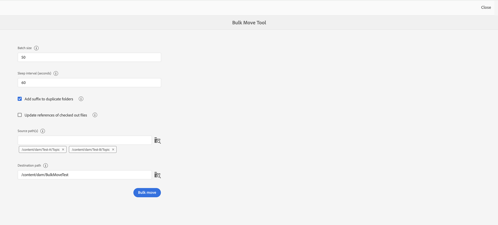

# Gestion des fichiers et des dossiers {#id2116G0L08XA}

Cette section explique comment AEM Guides gère les opérations de base sur les fichiers, telles que les fichiers de copie, de collage, de glisser-déposer et de suppression. Les scénarios possibles sont les suivants :

## Copier et coller des fichiers

**Si le fichier a un nom de fichier lisible par l’utilisateur**

- *Si le fichier portant le même nom n’existe pas dans le dossier de destination* : une nouvelle copie du fichier est créée et un UUID lui est également affecté. Ici, le nom du fichier est identique à celui du fichier d’origine.
- *Si le fichier portant le même nom existe déjà dans le dossier de destination* : une nouvelle copie du fichier est créée avec un suffixe \(comme filename0.extension\). Un UUID est également affecté au fichier nouvellement créé.

**Si le nom de fichier est basé sur un modèle UUID**

- *Si le fichier portant le même nom n’existe pas dans le dossier de destination* : une nouvelle copie du fichier est créée et un nouvel UUID lui est également affecté au nouvel emplacement. Ici, le nom de fichier est identique à l’UUID.
- *Si le fichier portant le même nom existe déjà dans le dossier de destination* : une nouvelle copie du fichier est créée et un nouvel UUID lui est également affecté. Le nom de fichier est identique à l’UUID.

## Copier et coller des dossiers

**Copier et coller le dossier au même emplacement**

- *Le dossier contient des fichiers avec des noms de fichier lisibles par l’utilisateur* : une nouvelle copie du dossier est créée avec un suffixe \(comme foldername0\). Un nouvel UUID est également affecté aux fichiers du dossier. Toutefois, les noms de fichier ne changent pas.

- *Le dossier contient des fichiers avec des noms de fichier basés sur un modèle UUID* : une nouvelle copie du dossier est créée avec un suffixe \(comme foldername0\). Un nouvel UUID est également affecté à tous les fichiers du nouveau dossier. Les noms de fichier sont également modifiés ; les noms de fichier sont identiques au nouvel UID.

**Copier et coller le dossier à un autre emplacement**

- *Le dossier contient des fichiers avec des noms de fichier lisibles par l’utilisateur* : une nouvelle copie du dossier est créée et un nouvel UUID est également affecté à tous les fichiers du dossier au nouvel emplacement. Ici, les noms de dossier ou de fichier ne changent pas.

- *Le dossier contient des fichiers dont les noms reposent sur un modèle UUID* : une nouvelle copie du dossier est créée avec le même nom que le dossier d’origine. Un nouvel UUID est également affecté à tous les fichiers du nouveau dossier. Les noms de fichier sont également modifiés ; les noms de fichier sont identiques au nouvel UID.

## Glisser-déposer des fichiers

**Effectuez un glisser-déposer avec des noms de fichier lisibles par l’utilisateur**

- *Faites glisser et déposez au même emplacement* : les options disponibles sont les suivantes : **Remplacer le fichier existant\(s\)**, **Conserver les deux fichiers\(s\)** et une option pour créer une version de la copie de travail existante.

  {width="650" align="center"}

  Si vous choisissez l’option **Remplacer le fichier existant\(s\)**, le fichier en cours de téléchargement remplace la version de travail actuelle du fichier existant à l’emplacement d’origine. L’UUID n’est pas créé ni modifié.

  Si vous choisissez l’option **Conserver les deux fichiers\(s\)**, une nouvelle copie du fichier est créée avec un suffixe \(comme filename0.extension\). Un nouvel UUID est également affecté au fichier nouvellement copié.

  Avec l’option Remplacer le fichier existant\(s\) , si vous choisissez de créer une version à partir de la copie de travail existante, une nouvelle version de la copie de travail du document est également créée.

  >[!NOTE]
  >
  > La fonction **Créer une version pour le fichier téléchargé** doit être activée par votre administrateur. Si cette fonction est activée, une nouvelle version du fichier chargé est créée. Si cette option est désélectionnée, aucune version du fichier chargé n’est créée. Pour plus d’informations, voir la section *Création d’une version pour le fichier téléchargé* dans l’as a Cloud Service Installation et configuration d’Adobe Experience Manager Guides.

  Si un fichier est déjà extrait pour modification par un autre utilisateur et que vous tentez de charger et de remplacer le fichier existant, il échoue et affiche une erreur.

  >[!NOTE]
  >
  >La fonction **Remplacer le fichier extrait lors du téléchargement** doit être désactivée par votre administrateur. Si cette fonction est activée, vous pouvez remplacer les fichiers extraits. Si la fonction n’est pas activée, un fichier extrait ne peut pas être remplacé. Pour plus d’informations, voir la section *Remplacer le fichier extrait lors du téléchargement* dans l’as a Cloud Service Installation et configuration d’Adobe Experience Manager Guides.

- *Faites glisser des fichiers à un autre emplacement* : une nouvelle copie du fichier est créée et un nouvel UID lui est également affecté au nouvel emplacement. Ici, le nom du fichier est identique à celui du fichier d’origine.

**Effectuez un glisser-déposer avec les noms de fichier en fonction d’un modèle UID**

*Faites glisser le fichier au même emplacement* : les options de **Remplacer le fichier existant\(s\)** vous sont proposées, ainsi que l’option permettant de créer une version de la copie de travail existante.

{width="650" align="center"}

Lorsque le fichier est remplacé, le nom du fichier ou son UUID ne change pas.

Si vous sélectionnez l’option **Créer la version de la copie de travail existante**, une nouvelle version de la copie de travail du document est créée ; le nouveau fichier est téléchargé, une nouvelle version du fichier est également créée et il est créé en tant que copie de travail du document.

La fonction **Créer une version pour le fichier téléchargé** doit être activée par votre administrateur. Si cette fonction est activée, une nouvelle version du fichier chargé est créée. Si cette option est désélectionnée, aucune version du fichier chargé n’est créée. Pour plus d’informations, voir la section *Création d’une version pour le fichier téléchargé* dans l’as a Cloud Service Installation et configuration d’Adobe Experience Manager Guides.

*Faites glisser un fichier à un autre emplacement* : les options disponibles sont les suivantes : **Remplacer le fichier existant\(s\)**, **Déplacer le fichier\(s\) vers un nouvel emplacement** et une option pour créer une version de la copie de travail existante.

{width="650" align="center"}

Si vous choisissez l’option **Remplacer le fichier existant\(s\)**, le fichier en cours de téléchargement remplace le fichier existant à l’emplacement d’origine. L’UUID n’est pas créé ni modifié.

Si vous choisissez l’option **Déplacer le fichier\(s\) vers un nouvel emplacement**, le fichier existant est déplacé vers l’emplacement actuel, puis il est remplacé par le fichier en cours de chargement. Le déplacement d’un fichier vers le nouvel emplacement ne rompt aucune référence existante depuis ou vers le fichier.

Lorsque vous remplacez ou déplacez les fichiers, si vous choisissez de créer une version à partir de la copie existante, une nouvelle version de la copie de travail du document est créée. Le nouveau fichier est remplacé à l’emplacement existant ou déplacé vers le nouvel emplacement.

## Déplacer des fichiers en masse {#move-files-bulk}

AEM Guides est fourni avec l’outil de déplacement en masse qui permet à un administrateur de déplacer d’un emplacement vers un autre un dossier contenant un grand nombre de fichiers. Cet outil peut facilement déplacer des fichiers dans un ou plusieurs dossiers dans un autre dossier de votre référentiel AEM. L’une des principales fonctionnalités de cet outil est qu’il déplace non seulement un grand nombre de fichiers, mais il conserve également les références vers et depuis les fichiers en cours de déplacement. Vous pouvez régler le nombre de fichiers que vous pouvez déplacer par lots sans entraver les tâches de création et de publication.

>[!NOTE]
>
> L’outil de déplacement en masse fonctionne uniquement au niveau du dossier. Si vous souhaitez déplacer des fichiers de rubrique ou de mappage individuels, utilisez l’outil de déplacement standard à partir de l’interface utilisateur Assets d’AEM.

Voici quelques-unes des fonctionnalités de l’outil de déplacement en masse :

- Vous pouvez ajuster le nombre de fichiers à traiter dans chaque lot. Cela peut nécessiter l’exécution de quelques tests avant d’obtenir un nombre optimal que votre système peut facilement gérer.
- Les services de création et de publication s’exécutent sans interruption à partir de l’opération de déplacement.
- Posséder un contrôle concurrentiel sur l’intervalle de temps entre les processus par lots \(en cours d’exécution\) suivants. Cet intervalle de temps garantit que l’opération de post-traitement est terminée avant de démarrer le lot de fichiers suivant.

- Gestion automatique des dossiers portant le même nom. Cette fonctionnalité permet de s’assurer que même si des dossiers portant le même nom sont déplacés, ils ne sont pas remplacés.

- Gestion automatique des références vers et depuis les fichiers en cours de déplacement.

Vous devez tenir compte des points suivants avant d’exécuter le traitement par lot :

- Si vous prévoyez de déplacer les rubriques en cours de révision, vous devez fermer le processus de révision sur toutes ces rubriques avant de les déplacer. Si vous ne fermez pas la tâche de révision, le processus de révision est interrompu.
- Vous ne devez exécuter qu’une seule opération de déplacement en masse sur le système à tout moment. Cela permet de gérer correctement les références vers et depuis les rubriques déplacées.

Pour déplacer des fichiers en bloc, procédez comme suit :

1. Cliquez sur le lien Adobe Experience Manager en haut de l’écran et sélectionnez **Outils**.
1. Sélectionnez **Guides** dans la liste des outils.
1. Cliquez sur la mosaïque **Bulk Move Tool**.
1. La page Outil de déplacement en masse s’affiche en fonction de votre configuration. Fournissez les détails suivants sur la page **Bulk Move Tool** :

   

   
 Cloud Service et système de fichiers basé sur l’UUID On-premise 

   {width="650" align="center"}

   >[!TIP]
   >
   > Sélectionner    à proximité de n’importe quel champ pour en afficher plus de détails.

   - **Ajouter un suffixe pour dupliquer des dossiers** : si vous déplacez des dossiers portant le même nom, vous devez sélectionner cette option. Par exemple, dans la capture d’écran précédente, le **chemin Source** contient le nom des dossiers à déplacer. Le dossier nommé rubrique existe à deux emplacements différents : test-A et test-B. Lorsque vous sélectionnez cette option, les dossiers se déplacent correctement. Le premier dossier déplacé sera nommé topic , tandis que le second sera topic0. L’opération de déplacement ajoute un suffixe dans les séries séquentielles \(0, 1, 2, etc.\) aux dossiers portant le même nom.

     Si vous déplacez des dossiers portant le même nom sans sélectionner cette option, l’opération se termine avec un message.

   - **Chemin d’accès Source\(s\)** : spécifiez l’emplacement des dossiers à déplacer.

      - Sélectionnez **Parcourir le dossier**      pour ouvrir la boîte de dialogue parcourir le fichier. Sélectionnez les dossiers à déplacer et cliquez sur **Sélectionner** pour terminer le processus.

      - Vous pouvez également saisir ou copier et coller l’emplacement source. Appuyez sur Entrée pour ajouter le dossier à la liste.

        Les dossiers sélectionnés sont répertoriés avec leur chemin d’accès. Passez la souris sur la balise de dossier pour afficher le chemin d’accès complet.
      - Vous pouvez également supprimer n’importe quel dossier en cliquant sur **Supprimer**  près du dossier.

   - **Chemin de destination** : indiquez l’emplacement où déplacer les dossiers source.

      - Sélectionnez **Parcourir le dossier**  pour ouvrir la boîte de dialogue parcourir le fichier. Sélectionnez l’emplacement où déplacer les dossiers sources. et cliquez sur Sélectionner pour terminer le processus.
      - Vous pouvez également saisir ou copier et coller le chemin de destination.

     Le dossier sélectionné s’affiche avec son chemin dans la zone de texte.

   - Cliquez sur **Bulk move**.

     Le système commence à déplacer les fichiers de la source vers l’emplacement de destination. Une fois le processus terminé, un résumé du processus de déplacement s’affiche à droite de la page.

     {width="650" align="center"}

   

   

   
 Système de fichiers sur site non basé sur UUID 

   {width="650" align="center"}

   >[!TIP]
   >
   > Sélectionner    à proximité de n’importe quel champ pour en afficher plus de détails.

   - **Taille du lot** : spécifiez le nombre de fichiers à déplacer dans un seul lot. Valeurs par défaut si 50 fichiers.
   - **Intervalle de sommeil (secondes)** : spécifiez la durée (en secondes) d’attente du processus avant de démarrer le prochain lot. Pendant cet intervalle de temps de sommeil, le système corrige les références aux fichiers déplacés et aux fichiers déplacés. L’intervalle de sommeil par défaut est de 60 secondes.

   - **Ajouter un suffixe pour dupliquer des dossiers** : si vous déplacez des dossiers portant le même nom, vous devez sélectionner cette option. Par exemple, dans la capture d’écran précédente, le **chemin Source** contient le nom des dossiers à déplacer. Le dossier nommé rubrique existe à deux emplacements différents : test-A et test-B. Lorsque vous sélectionnez cette option, les dossiers se déplacent correctement. Le premier dossier déplacé sera nommé topic , tandis que le second sera topic0. L’opération de déplacement ajoute un suffixe dans les séries séquentielles \(0, 1, 2, etc.\) aux dossiers portant le même nom.

     Si vous déplacez des dossiers portant le même nom sans sélectionner cette option, l’opération se termine avec un message.

   - **Mettre à jour les références des fichiers extraits** : si vous déplacez des dossiers contenant des fichiers extraits, il est recommandé de sélectionner cette option. Si vous sélectionnez cette option, tous les fichiers extraits seront enregistrés et archivés avec une nouvelle révision. Cette nouvelle révision est ensuite déplacée vers l’emplacement de destination.

     Si vous ne sélectionnez pas cette option, les fichiers extraits sont déplacés vers le dossier de destination dans le même état d’extraction. Cependant, ce processus de déplacement peut entraîner une perte de données.

   - **Chemin d’accès Source\(s\)** : spécifiez l’emplacement des dossiers à déplacer.

      - Sélectionnez **Parcourir le dossier**      pour ouvrir la boîte de dialogue parcourir le fichier. Sélectionnez les dossiers à déplacer et cliquez sur **Sélectionner** pour terminer le processus.

      - Vous pouvez également saisir ou copier et coller l’emplacement source. Appuyez sur Entrée pour ajouter le dossier à la liste.

        Les dossiers sélectionnés sont répertoriés avec leur chemin d’accès. Passez la souris sur la balise de dossier pour afficher le chemin d’accès complet.
      - Vous pouvez également supprimer n’importe quel dossier en cliquant sur **Supprimer**  près du dossier.

   - **Chemin de destination** : indiquez l’emplacement où déplacer les dossiers source.

      - Sélectionnez **Parcourir le dossier**  pour ouvrir la boîte de dialogue parcourir le fichier. Sélectionnez l’emplacement où déplacer les dossiers sources. et cliquez sur Sélectionner pour terminer le processus.
      - Vous pouvez également saisir ou copier et coller le chemin de destination.

        Le dossier sélectionné s’affiche avec son chemin dans la zone de texte.

   - Cliquez sur **Bulk move**.

     Le système commence à déplacer les fichiers de la source vers l’emplacement de destination. Une fois le processus terminé, un résumé du processus de déplacement s’affiche à droite de la page.
     {width="650" align="center"}

## Recherche de contenu DITA

Par défaut, AEM ne reconnaît pas le contenu DITA, il ne fournit donc aucun mécanisme pour rechercher le contenu DITA dans son référentiel. AEM Guides ajoute un calque au-dessus d’AEM, ce qui permet à AEM de comprendre et de traiter le contenu DITA. La fonction de recherche de contenu DITA dans AEM Guides vous permet de rechercher du contenu DITA dans AEM référentiel.

>[!NOTE]
>
>Votre administrateur système peut configurer le composant de recherche **Elément DITA**, puis vous pouvez utiliser la fonctionnalité depuis l’interface utilisateur d’AEM Assets. Pour plus d’informations, reportez-vous à la section *Ajout d’un composant de recherche d’élément DITA dans l’interface utilisateur d’Assets* de la section Installation et configuration as a Cloud Service Adobe Experience Manager Guides.

La fonction de recherche vous permet d’effectuer les opérations suivantes :

- Recherchez du contenu DITA basé sur une valeur d’élément ; par exemple, `author`= xml
- Recherchez du contenu DITA en fonction d’une valeur d’attribut ; par exemple, `@platform`= windows
- Utilisez une combinaison d’élément DITA et de valeur d’attribut ; par exemple, `author`= xml `AND` `@platform`= windows

Effectuez les étapes suivantes pour rechercher du contenu DITA dans AEM référentiel :

1. Ouvrez l’interface utilisateur d’Assets.

1. Dans le rail de gauche, sélectionnez **Filtres**.

   {width="450" align="center"}

   Les options de filtrage de contenu s’affichent dans le rail de gauche. Vous trouverez également l’option de filtrage, l’élément DITA, qui est utilisé pour filtrer le contenu DITA.

   {width="450" align="center"}

1. *\(Facultatif\)* Dans le champ **Sélectionner le répertoire de recherche**, recherchez l’emplacement dans lequel vous souhaitez effectuer une recherche.

1. Dans le filtre **Elément DITA**, indiquez le **Nom de l’élément**, l’ **Attribut** et une valeur que vous souhaitez rechercher. Par exemple, pour rechercher des documents comportant un élément `author` du créateur `@type`, vous devez fournir les informations comme illustré dans la capture d’écran suivante :

   {width="650" align="center"}

   Les critères de recherche saisis dans le filtre **Elément DITA** s’affichent en haut de la barre de recherche. Les fichiers correspondant aux critères de recherche s’affichent dans la zone **Résultats de la recherche**.

   Tenez compte des points suivants lors de la spécification des critères de recherche :

   - Pour rechercher une expression exacte, saisissez l’expression dans le champ Valeur entre guillemets `"`recherche d’expression`"`.
   - Vous pouvez ajouter jusqu’à 3 critères de recherche d’éléments DITA.
   - Si vous spécifiez plusieurs critères de recherche, tous seront combinés à l’aide de la logique ET.
   - Vous ne pouvez pas utiliser de caractère générique dans vos critères de recherche. Par exemple, pour rechercher la plateforme \(attribute\) avec la valeur de Windows, vous ne pouvez pas spécifier \*form ou Windows ?

**Filtre d’état d’extraction dans la recherche**

Outre le filtre d’élément DITA, AEM Guides vous permet également de rechercher du contenu en fonction de leur état d’extraction. Cela s’avère utile lorsque vous souhaitez filtrer rapidement les fichiers actuellement extraits par vous et que vous souhaitez les réarchiver.

Effectuez les étapes suivantes pour rechercher des fichiers en fonction de leur état d’extraction :

1. Ouvrez l’interface utilisateur d’Assets.

1. Cliquez sur **Filtrer** dans le rail de gauche.
1. Saisissez votre mot-clé de recherche dans la barre de recherche.
1. Appliquez les filtres requis à partir du rail de gauche.

   Par exemple, vous pouvez appliquer le filtre **État du passage en caisse** pour afficher les rubriques extraites ou archivées. Vous pouvez affiner davantage cette liste en sélectionnant l’utilisateur ou le groupe dans la liste Extraits par .

   Le résultat de la recherche s’affiche.

## Suppression de fichiers

La suppression de fichiers du référentiel d’AEM est une fonctionnalité limitée, qui est contrôlée par votre administrateur système. En fonction des configurations, la suppression de fichiers peut être limitée s’ils :

- Extraits
- contiennent des références entrantes ou sortantes ;

Vous pouvez également supprimer des fichiers uniquement si vous appartenez à un groupe d’utilisateurs spécifique disposant des privilèges de suppression des fichiers.

>[!NOTE]
>
> Pour plus d’informations sur les configurations de la gestion des fichiers, voir les sections *Empêcher la suppression des fichiers extraits* et *Empêcher la suppression des fichiers référencés* dans l’as a Cloud Service Installer et configurer Adobe Experience Manager Guides.

Si votre administrateur a autorisé tous les utilisateurs à supprimer le fichier, le message suivant s’affiche lorsque vous supprimez des fichiers contenant des références :

{width="650" align="center"}

Dans ce scénario, vous pouvez supprimer des fichiers avec force sans supprimer les références entrantes ou sortantes des fichiers.

Si les autorisations de suppression sont accordées à un groupe d’utilisateurs spécifique, le message ci-dessus s’affiche également pour les utilisateurs appartenant à ce groupe. Cependant, pour les autres utilisateurs, le message suivant s&#39;affiche :

{width="650" align="center"}

Dans ce scénario, les utilisateurs ne seront pas autorisés à supprimer les fichiers tant que toutes les références entrantes et sortantes n’auront pas été supprimées.

## Utilisation de fichiers multimédias

Les fichiers multimédias tels que les images et les vidéos font partie intégrante de votre contenu. Lorsque vous chargez et gérez votre contenu, vous pouvez également utiliser des fichiers multimédias.

Si votre fichier multimédia a subi des modifications, vous pouvez rechercher et prévisualiser les fichiers dans l’ **historique de version**. Pour découvrir les modifications dans les différentes versions d’un fichier multimédia :

1. Accédez au fichier dans l’ **interface utilisateur d’Assets**.
1. Sélectionnez le fichier pour lequel vous souhaitez afficher l’historique des versions.
1. Dans le rail de gauche, cliquez sur **Historique de version** et sélectionnez une version.
1. Vous pouvez également voir les miniatures des différentes versions sous Historique des versions.

   {width="800" align="center"}

1. Dans les versions répertoriées, sélectionnez celle que vous souhaitez utiliser comme version de base et cliquez sur **Aperçu de la version**. L’aperçu de la version sélectionnée s’affiche dans la fenêtre Aperçu de la version .

   {width="650" align="center"}

**Rubrique parente :**[ Gérer le contenu](authoring.md)
