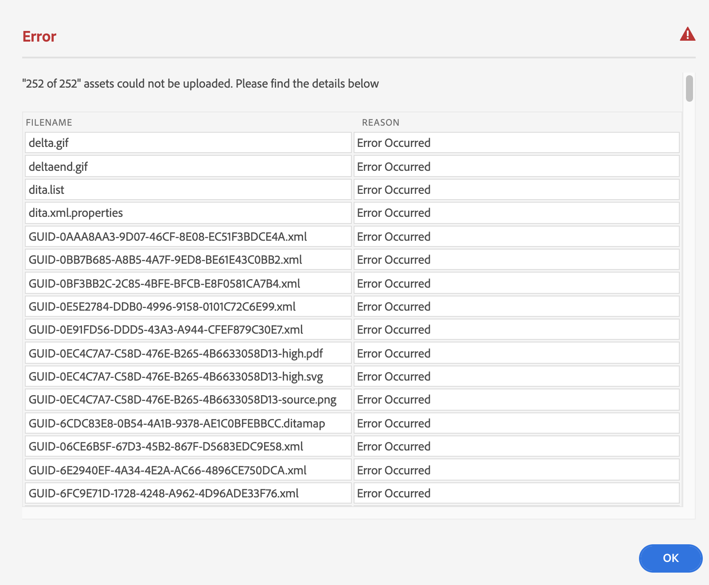

# Charger des fichiers {#id176FF000JUI}

Il est probable que vous disposiez d&#39;un référentiel de contenu DITA existant que vous souhaitez utiliser avec AEM Guides. Pour ce type de contenu existant, vous pouvez utiliser l’une des approches suivantes pour charger en bloc votre contenu dans le référentiel AEM :

>[!IMPORTANT]
>
> Consultez [Ajout de ressources numériques à Adobe Experience Manager as a Cloud Service Assets](https://experienceleague.adobe.com/docs/experience-manager-cloud-service/assets/manage/add-assets.html) pour plus d’informations sur les méthodes de chargement de contenu prises en charge dans AEM.

## Interface utilisateur de la console Assets

Vous pouvez sélectionner du contenu sur votre bureau et le faire glisser sur l’interface utilisateur d’AEM \(navigateur web\) vers le dossier de destination. Pour plus d’informations, consultez [Chargement de ressources](https://experienceleague.adobe.com/docs/experience-manager-cloud-service/assets/manage/add-assets.html#upload-assets) dans la documentation d’AEM.

## Application de bureau AEM

Utilisez l’application de bureau AEM si vous êtes un professionnel de la création et que vous souhaitez gérer les ressources sur votre bureau local. Vous pouvez ouvrir et modifier ces ressources à l’aide de vos applications de bureau. Vous pouvez également gérer des versions et partager vos fichiers avec d’autres utilisateurs. Pour plus d’informations, voir l’appli de bureau [AEM](https://experienceleague.adobe.com/docs/experience-manager-desktop-app/using/using.html?lang=fr).

## Ingérant en bloc des ressources

Si vous disposez de migrations à grande échelle et d’ingestions en bloc occasionnelles, utilisez l’outil d’ingestion en bloc des ressources pour charger votre contenu. À l’aide de cet outil, vous pouvez charger du contenu en bloc à partir de magasins de données pris en charge tels qu’Azure ou S3. Pour plus d’informations, voir [Asset bulk ingestor](https://experienceleague.adobe.com/docs/experience-manager-cloud-service/assets/manage/add-assets.html?lang=en#asset-bulk-ingestor).

## Utilisation de FrameMaker pour le chargement en masse

Adobe FrameMaker s’accompagne d’un puissant connecteur AEM qui vous permet de charger facilement vos documents DITA et autres documents FrameMaker \(`.book` et `.fm`\) dans AEM. Vous pouvez utiliser diverses fonctionnalités de chargement de fichier, telles que le chargement d’un seul fichier ou d’un dossier complet avec ou sans dépendances \(comme les références de contenu, les références croisées et les graphiques\).

Pour plus d’informations sur l’utilisation de la fonction de chargement en bloc dans FrameMaker, consultez la section *Création d’un dossier CRX et chargement de fichiers* dans le guide d’utilisation de FrameMaker.

## Gestion des erreurs lors du chargement du contenu {#id201MI0I04Y4}

En cas d’échec de chargement d’un ou de plusieurs fichiers, une invite s’affiche à la fin du processus de chargement avec une liste des fichiers dont le chargement a échoué :

{width="650" align="center"}

Pour plus d&#39;informations sur les différents scénarios de chargement de fichiers, consultez [Charger du contenu DITA](authoring-file-management.md#).

Si vous utilisez un outil tel que l’application de bureau AEM ou l’outil d’ingestion de ressources en bloc, l’action à effectuer sur un fichier en double est contrôlée par un paramètre dans le serveur AEM. Contactez votre administrateur système pour en savoir plus sur cette configuration.

**Rubrique parente :**[ Gérer le contenu](authoring.md)
