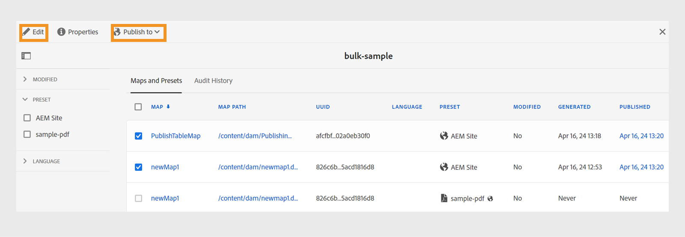

# Activer la sortie {#id214GGF00V5U}

Une fois que vous avez créé une collection de cartes pour l’activation en bloc, l’étape suivante consiste à activer votre contenu sur l’instance de publication. Pour activer votre contenu, procédez comme suit :

1. Sélectionnez **Guides** dans la liste des outils.

1. Cliquez sur le lien Adobe Experience Manager en haut de l’écran et sélectionnez **Outils**.

1. Cliquez sur la mosaïque **Tableau de bord Publish en bloc** .

   Une liste des collections de cartes d’activation en bloc s’affiche.

1. Sélectionnez la collection que vous souhaitez publier et cliquez sur **Ouvrir**.

   {width="800" align="left"}

1. \(*Facultatif*\) Appliquez les filtres requis du rail de gauche pour filtrer la carte en fonction de leur \(état\), de leur paramètre prédéfini de sortie ou de leur langue modifiés.

   >[!NOTE]
   >
   >Générez la sortie pour la carte à l’aide du paramètre prédéfini de sortie avant de l’activer dans la collection de cartes.

Affichez les différentes manières d’activer votre collection selon votre configuration.

 Services cloud 

{width="650" align="left"}

Vous pouvez activer la sortie vers les instances **Preview** ou **Publish**.

**Aperçu**

* Pour activer la sortie des cartes sélectionnées, sélectionnez la sortie de carte prégénérée et sélectionnez **Publish to** > **Aperçu**.
* Pour activer la sortie de toutes les cartes DITA avec leurs paramètres prédéfinis configurés, cochez la case en regard de la colonne **Map**, puis sélectionnez **Publish to** > **Publish**.

**Publication**

* Pour activer la sortie des cartes sélectionnées, sélectionnez la sortie de carte prégénérée et sélectionnez **Publish to** > **Publish**.

* Pour activer la sortie de toutes les cartes DITA avec leurs paramètres prédéfinis configurés, cochez la case en regard de la carte (colonne), puis sélectionnez **Publish to** > **Publish**.

>[!NOTE]
> 
> La case à cocher d’une sortie de carte n’est activée que si vous avez généré la sortie pour une carte.

Un message de réussite s’affiche lorsque la sortie du mappage est mise en file d’attente pour publication.

Une fois que la sortie est activée pour les fichiers de mappage sélectionnés, l’onglet Historique d’audit est mis à jour et la dernière sortie activée s’affiche en haut. La colonne **Publié** est mise à jour avec la date et l’heure de publication.

    

  Logiciel On-Premise 

Utilisez l’une des méthodes suivantes :

* Pour activer la sortie des cartes sélectionnées, sélectionnez la sortie de carte prégénérée et sélectionnez **Quick Publish**.
* Pour activer la sortie de toutes les cartes DITA avec leurs paramètres prédéfinis configurés, cochez la case en regard de la carte (colonne), puis sélectionnez **Quick Publish.**
  {width="650" align="left"}

  >[!NOTE]
  > 
  >La case à cocher d’une sortie de carte n’est activée que si vous avez généré la sortie pour une carte.

Un message de réussite s’affiche lorsque la sortie du mappage est mise en file d’attente pour publication.

Une fois que la sortie est activée pour les fichiers de mappage sélectionnés, l’onglet Historique d’audit est mis à jour et la dernière sortie activée s’affiche en haut. La colonne **Publié** est mise à jour avec la date et l’heure de publication.

**Rubrique parente : **[Activation en masse du contenu publié](conf-bulk-activation.md)
