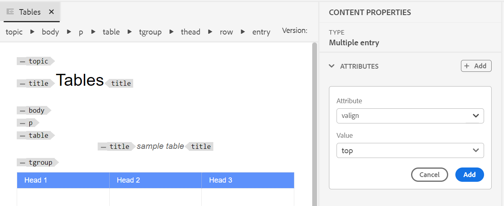

# Afficher le statut de la tâche de génération de sortie {#viewing_output_history}

Une fois que vous avez lancé la tâche de génération de sortie pour un document FrameMaker, AEM Guides envoie cette tâche à la file d’attente de génération de sortie. Cette file d’attente est mise à jour en temps réel, affichant le statut de chaque tâche de génération de sortie dans la file d’attente.

Pour afficher la file d’attente de génération de sortie, procédez comme suit :

1. Dans l’interface utilisateur d’Assets, accédez au document FrameMaker pour lequel vous souhaitez vérifier le statut de génération de sortie et cliquez dessus.

1. Cliquez sur Sorties.

   {width="800"}

1. La page Sorties est divisée en deux parties :

   - **Sorties mises en file d’attente :**

     Répertorie les sorties qui sont en attente de génération ou qui sont en cours de génération. Vous pouvez également trouver le paramètre ou le préréglage de génération de sortie utilisé pour la tâche mise en file d’attente, le type, l’utilisateur qui a initié la tâche, la durée écoulée depuis la mise en file d’attente de la tâche et le statut actuel.

   - **Sorties générées**

     Répertorie les tâches de sortie qui ont été terminées. Là encore, les informations affichées dans cette section sont similaires à celles de la section Sorties mises en file d’attente, à la seule différence du temps de génération de sortie.

     Dans cette liste, il peut y avoir des tâches exécutées avec succès ou des tâches ayant échoué. Pour les tâches qui se sont terminées avec succès, le processus de publication crée un fichier journal \(logs.txt\) accessible en cliquant sur le lien dans la colonne Généré à .

> **Comment définir des attributs sur plusieurs cellules, une ligne entière ou une colonne d’un tableau**
>
> Vous pouvez définir des attributs au niveau des cellules, des lignes ou des colonnes
>
> 

&gt; 
Afficher les étapes

>
> Vous pouvez également définir des attributs sur plusieurs cellules, une ligne entière ou une colonne d’un tableau. Par exemple, pour aligner une cellule de tableau, faites glisser et sélectionnez la cellule souhaitée. Dans le panneau Propriétés du contenu (à droite), la propriété **Type** devient **entrée**.
>
> 1. Dans la section **Attributs**, sélectionnez **+Ajouter**.
> 1. Sélectionnez l’attribut `@valign` dans la liste déroulante **Attribut**.
> 1. Dans la liste déroulante Valeur , sélectionnez l’alignement du texte à appliquer aux cellules de tableau sélectionnées.
> 1. Sélectionnez **Ajouter.**
>
> 
>
> 

**Définir des attributs sur plusieurs cellules, une ligne entière ou une colonne d’un tableau**

Vous pouvez définir des attributs au niveau de la cellule, de la ligne ou de la colonne.

Afficher les étapes

Vous pouvez également définir des attributs sur plusieurs cellules, une ligne entière ou une colonne d’un tableau. Par exemple, pour aligner une cellule de tableau, faites glisser et sélectionnez la cellule souhaitée. Dans le panneau Propriétés du contenu (à droite), la propriété **Type** devient **entrée**.

1. Dans la section **Attributs**, sélectionnez **+Ajouter**.
1. Sélectionnez l’attribut `@valign` dans la liste déroulante **Attribut**.
1. Dans la liste déroulante Valeur , sélectionnez l’alignement du texte à appliquer aux cellules de tableau sélectionnées.
1. Sélectionnez **Ajouter.**

   

   

>[!BEGINSHADEBOX]
>
> **Comment définir des attributs sur plusieurs cellules, une ligne entière ou une colonne d’un tableau**
>
> Vous pouvez définir des attributs au niveau de la cellule, de la ligne ou de la colonne.
>
> 

&gt; 
Afficher les étapes

>
> Vous pouvez également définir des attributs sur plusieurs cellules, une ligne entière ou une colonne d’un tableau. Par exemple, pour aligner une cellule de tableau, faites glisser et sélectionnez la cellule souhaitée. Dans le panneau Propriétés du contenu (à droite), la propriété **Type** devient **entry**.
>
> 1. Dans la section **Attributs**, sélectionnez **+Ajouter**.
> 1. Sélectionnez l’attribut `@valign` dans le menu déroulant **Attribut**.
> 1. Dans la liste déroulante **Valeur**, sélectionnez l’alignement du texte souhaité.
> 1. Sélectionnez **Ajouter**.
>
> 
>
> 

>
>[!ENDSHADEBOX]

**Rubrique parente :**[ générer la sortie des documents FrameMaker](fm-output-generatation.md)

