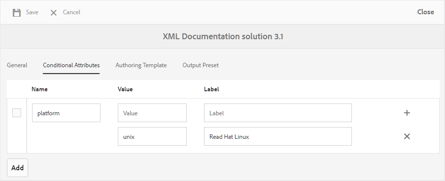

# Création de profils d’attributs conditionnels {#id1843I0HN0Y4}

Au niveau de l’entreprise, il est extrêmement important de s’assurer que vous disposez d’un système de balisage standard. Les balises ou les attributs conditionnels peuvent être associés aux ressources numériques dans le référentiel, ce qui permet de publier la sortie en fonction des conditions sélectionnées. Par exemple, vous pouvez créer un attribut conditionnel pour le contenu Windows et Mac. Vous ajoutez ensuite ces attributs au contenu approprié dans vos rubriques. Au moment de publier du contenu, vous pouvez choisir de publier du contenu Windows ou Mac uniquement.

AEM Guides vous permet de créer et d&#39;associer facilement des attributs conditionnels à l&#39;aide des attributs DITA appropriés. Vous pouvez définir des attributs conditionnels au niveau global ou au niveau du dossier. Les conditions définies globalement sont visibles dans tous les projets et les conditions spécifiques aux dossiers ne sont visibles que dans les projets créés dans le dossier spécifié. Les auteurs de contenu peuvent utiliser ces attributs conditionnels pour conditionner le contenu de leurs rubriques ou mappages DITA qu&#39;ils créent ou utilisent. Ces conditions peuvent ensuite être utilisées par l’éditeur pour créer des paramètres prédéfinis conditionnels. À l’aide des paramètres prédéfinis conditionnels, l’éditeur peut décider quelle condition inclure et exclure de la sortie publiée.

>[!NOTE]
>
> Vous pouvez créer ou modifier les attributs conditionnels dans un profil de dossier auquel vous avez accès. Si votre administrateur système ne vous a pas donné accès à un profil de dossier, vous ne pouvez pas créer ni modifier les attributs conditionnels dans le profil de dossier.

Pour définir des attributs conditionnels, procédez comme suit :

1. Cliquez sur le lien Adobe Experience Manager en haut et choisissez **Outils**.

1. Sélectionnez **Guides** dans la liste des outils.

1. Cliquez sur la mosaïque **Profils de dossier** et sélectionnez un profil de dossier.

   >[!NOTE]
   >
   > Vous ne pouvez pas modifier le profil global.

1. Cliquez sur l’onglet **Attributs conditionnels**, puis sur **Modifier**.

   Le tableau Attributs conditionnels s’affiche.

1. Cliquez sur **Ajouter**.

1. Saisissez les **Nom**, **Valeur** et un **Libellé** pour l’attribut.

   Vous pouvez enregistrer un profil avec uniquement le nom d’attribut. Cependant, un attribut ne peut être utilisé que lorsqu’une valeur lui est spécifiée. Si vous spécifiez à la fois - valeur et libellé pour un attribut, l’éditeur web affiche toujours uniquement la valeur de l’attribut. Le libellé est présenté à l’administrateur de publication au moment de la création d’un paramètre prédéfini conditionnel.

   La capture d’écran suivante montre la définition de l’attribut `platform` avec la valeur `unix` et un libellé `Red Hat Linux`.

   {width="800" align="left"}

1. Si vous souhaitez ajouter d’autres valeurs pour le même attribut, cliquez sur l’icône **+** et saisissez une valeur et un libellé supplémentaires.

1. Si vous souhaitez ajouter d’autres attributs, cliquez sur **Ajouter**.

1. Cliquez sur **Enregistrer** pour enregistrer les modifications.

L’attribut `platform` est stocké dans le système. Chaque fois qu’un auteur décide d’utiliser l’attribut `platform` dans une rubrique DITA d’un dossier, les valeurs s’affichent dans l’onglet Propriétés de l’éditeur web.

{width="350" align="left"}

**Rubrique parente :**[ Génération de sortie](generate-output.md)
