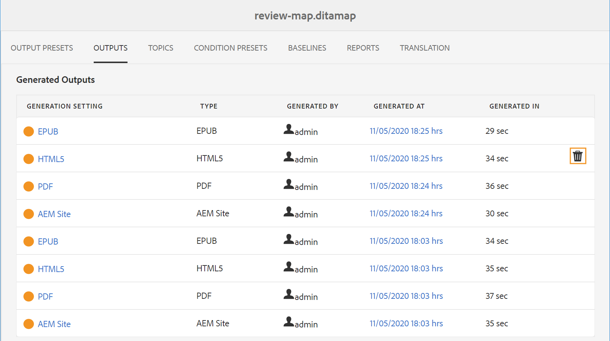

# Générer une sortie pour un plan DITA à partir de la console de plans {#id1825FG00UHT}

Effectuez les étapes suivantes pour générer une sortie pour un plan DITA :

1. Dans l’interface utilisateur d’Assets, accédez au fichier DITA map à publier, puis cliquez dessus.

   La console de mappage DITA s&#39;affiche avec la liste des paramètres prédéfinis de sortie disponibles pour générer la sortie.

1. Sélectionnez un ou plusieurs paramètres prédéfinis de sortie à utiliser pour générer la sortie.

   {width="800" align="left"}

   >[!NOTE]
   >
   > Si vous générez la sortie du site AEM, le processus de publication utilise la structure définie dans le fichier `.ditamap` pour créer la structure du site AEM.

1. Cliquez sur l’icône Générer pour lancer le processus de génération de sortie.

Vous pouvez afficher le statut actuel de la demande de génération de sortie en cliquant sur Sorties. Pour plus d’informations, voir [Afficher l’état de la tâche de génération de sortie](#viewing_output_history)

>[!IMPORTANT]
>
> Si un processus de génération de sortie pour un paramètre prédéfini est en file d’attente ou en cours, vous ne pouvez pas lancer une autre tâche de génération de sortie pour le même paramètre prédéfini.

Vous pouvez générer la sortie PDF pour un ou plusieurs paramètres prédéfinis de sortie créés pour un plan DITA à partir de l&#39;éditeur web. Pour plus d’informations, consultez [Utilisation du panneau Génération rapide pour générer et afficher la sortie des paramètres prédéfinis](web-editor-quick-generate-panel.md#).

Vous pouvez également générer la sortie du site AEM pour une ou plusieurs rubriques, ou l&#39;ensemble du plan DITA à partir de l&#39;éditeur web. Pour plus d’informations, consultez la section [ Publication basée sur des articles à partir de l’éditeur web ](web-editor-article-publishing.md#id218CK0U019I).

## Génération incrémentielle de la sortie {#generating_standalone_topic}

>[!NOTE]
>
> La génération de sortie incrémentielle s’applique uniquement à la sortie du site AEM. En outre, vous ne pouvez régénérer que les rubriques DITA \(.dita/.xml\) à partir d&#39;un plan DITA ou de sous-plans. Si vous sélectionnez un plan DITA, un sous-plan, un groupe de sujets ou un sujet avec `@processing-role="resource-only"`, l&#39;option de régénération n&#39;est pas disponible.

Dans certains cas, vous pouvez mettre à jour seulement quelques rubriques dans votre plan DITA et activer uniquement ces rubriques mises à jour. Pour gérer ces scénarios, AEM Guides vous permet de créer des sorties incrémentielles. Si vous avez mis à jour quelques rubriques, vous n&#39;avez pas besoin de régénérer l&#39;ensemble du plan DITA. Vous pouvez sélectionner uniquement les rubriques mises à jour et les générer de nouveau.

Si votre mappage est segmenté et que vous avez mis à jour une seule rubrique dans ce mappage, vous devez régénérer l’ensemble du mappage pour que la rubrique ou le contenu mis à jour soit reflété dans la sortie. Vous n’obtiendrez pas l’option de régénération de sortie au niveau d’une rubrique, elle est uniquement disponible au niveau du mappage \(chunked\). Ceci s&#39;applique au mappage parent et à tous les sous-mappages.

Effectuez les étapes suivantes pour régénérer la sortie d’une rubrique spécifique ou d’un groupe de rubriques :

>[!IMPORTANT]
>
> Lorsque vous régénérez la sortie du site AEM, la sortie est créée à l’aide de la version actuelle des fichiers et non de la ligne de base jointe.

1. Dans l’interface utilisateur d’Assets, accédez au fichier DITA map et cliquez dessus.

   La console de mappage DITA s&#39;affiche avec la liste des paramètres prédéfinis de sortie disponibles pour générer la sortie.

1. Sélectionnez l’onglet **Rubriques**.

   Une liste des rubriques disponibles dans le plan DITA s&#39;affiche.

1. Sélectionnez les rubriques à régénérer.

   >[!NOTE]
   >
   > Si vous avez ajouté de nouvelles rubriques au plan DITA, vous ne pourrez pas générer ces nouvelles rubriques à partir d&#39;ici. Vous devez d&#39;abord publier les rubriques nouvellement ajoutées à l&#39;aide de la fonction de publication de plan DITA.

   {width="800" align="left"}

1. Cliquez sur **Régénérer**.

   La page Régénérer les rubriques sélectionnées s&#39;affiche.

1. Sélectionnez le paramètre prédéfini de sortie à utiliser pour générer de nouveau les rubriques sélectionnées.

1. Cliquez sur **Régénérer** pour lancer le processus de génération de sortie.

>[!IMPORTANT]
>
> Si vous renommez un titre de rubrique et que vous régénérez la rubrique, le titre de rubrique mis à jour n&#39;apparaît pas dans la table des matières du plan DITA. Pour mettre à jour le titre de la rubrique dans la table des matières, vous devez générer l&#39;ensemble du plan DITA.

Vous pouvez afficher le statut actuel de la demande de génération de sortie en cliquant sur Sorties. Pour plus d’informations, voir [Afficher l’état de la tâche de génération de sortie](#viewing_output_history).

## Afficher le statut de la tâche de génération de sortie {#viewing_output_history}

Une fois que vous avez lancé la tâche de génération de sortie pour un mappage ou que vous avez régénéré les rubriques sélectionnées, AEM Guides envoie cette tâche à la file d’attente de génération de sortie. Cette file d’attente est mise à jour en temps réel, affichant le statut de chaque tâche de génération de sortie dans la file d’attente.

Pour afficher la file d’attente de génération de sortie, procédez comme suit :

1. Dans l’interface utilisateur d’Assets, accédez au fichier de mappage dont vous souhaitez vérifier le statut de génération de sortie, puis cliquez dessus.

1. Click **Outputs**.

   {width="800" align="left"}

   The Outputs page is divided into two parts:

   - **Queued Outputs:**

     Lists the outputs that are either waiting to be generated or are under generation process. The queued or in progress tasks are shown with a blue color icon before the preset name. You can also find the output generation setting or preset used for the queued task, the type, user who initiated the task, time since when the task is queued, and the current status.

     Click on the link to access the **Publish Dashboard** and view the current running status. A list of all active publishing tasks is available in the Publish Dashboard. The **Queued Outputs** and the **Publish Dashboard** link are displayed only when there are outputs that are either waiting to be generated or are under generation process. They don&#39;t appear when the output tasks have been completed.For more details on Publish Dashboard, see [Manage publish tasks using the Publish Dashboard](generate-output-publish-dashboard.md#).

   - **Generated Outputs**

     Lists the output tasks that have been completed. Again, the information shown here is similar to the Queued Outputs section with a few differences. You have new set of information in the form of output result icon and the output generation time.

     In this list, you could have tasks that have executed successfully, tasks that have executed with message, or failed tasks. The successful tasks are shown with green color icon, the tasks with a message have an orange color icon, and the failed tasks are shown with red color icon.

     For all the tasks, the publishing process creates a log file \(logs.txt\) that can be accessed by clicking the link in the Generated At column. For tasks that have failed or have messages, you can check the log file, which is explained in the section [View and check the log file](generate-output-basic-troubleshooting.md#id1822G0P0CHS).

     >[!NOTE]
     >
     > When you click on a link of the generated PDF output, you are asked to download the PDF. This is the default behavior in AEM 6.5 and 6.4.

## Cancel an output generation task {#id2061H100T5Z}

AEM Guides gives publishers a simple and easy way to cancel any ongoing publishing task. As a publisher, you can cancel an ongoing publishing task from the DITA map console or the [Publish Dashboard](generate-output-publish-dashboard.md#).

Perform the following steps to cancel an output generation task from the DITA map console:

1. Dans l’interface utilisateur d’Assets, accédez au fichier de mappage pour lequel vous souhaitez annuler une tâche de génération de sortie en cours, puis cliquez dessus.

1. Cliquez sur **Sorties**.

1. Dans la liste Sorties mises en file d’attente , placez le pointeur sur une tâche à annuler.

1. Cliquez sur l’icône *Annuler ce traitement*.

   {width="800" align="left"}

1. Cliquez sur **Oui** à l’invite du message Confirmer l’annulation.

   {width="800" align="left"}

   Si la tâche n&#39;est pas encore démarrée, la commande d&#39;annulation est exécutée sur la tâche. Pour une tâche en cours d&#39;annulation, le Statut est défini sur Annulation.

   Une fois la tâche annulée, elle est déplacée vers la liste **Sorties générées** avec un statut **Annulé**. Lorsque vous pointez sur la tâche annulée, le nom de l’utilisateur qui a annulé la tâche s’affiche. Dans la capture d’écran suivante, la tâche *HTML5* est annulée.

   {width="800" align="left"}

## Supprimer une tâche de sortie de la console de mappage DITA

Lorsque vous générez plusieurs sorties pour un plan DITA, la liste des sorties générées pour un tel plan devient très longue au fil du temps. En tant qu’éditeur, vous pouvez nettoyer l’historique de sortie de n’importe quel fichier de mappage en supprimant les tâches obsolètes de la liste *Sorties générées*. Notez que la sortie n’est pas supprimée du système, seule l’entrée de la sortie générée est supprimée de la liste *Sorties générées*.

Effectuez les étapes suivantes pour supprimer une tâche de sortie de la liste Sortie générée :

1. Dans l’interface utilisateur d’Assets, accédez au fichier de mappage à partir duquel vous souhaitez supprimer les tâches, puis cliquez dessus.

1. Cliquez sur **Sorties**.

1. Dans la liste Sorties générées , placez le pointeur sur une tâche à supprimer.

1. Cliquez sur l’icône de suppression.

   {width="800" align="left"}

1. Cliquez sur **Oui** à l’invite du message Confirmer la suppression .

   La tâche est supprimée de la liste des Sorties générées .

**Rubrique parente :**[ Génération de sortie](generate-output.md)
