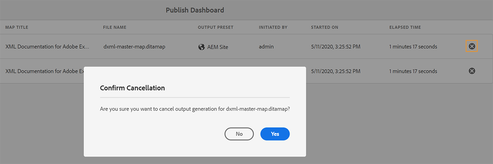

# Gérer les tâches de publication à l’aide du tableau de bord de publication {#id205CC08305Z}

Lorsqu&#39;un grand nombre de tâches de publication sont exécutées sur votre système, il devient pratiquement impossible de vérifier chaque plan DITA individuellement pour surveiller sa tâche de publication. AEM Guides offre aux administrateurs et aux éditeurs une vue unifiée de toutes les tâches de publication exécutées dans le système. Une liste de toutes les tâches de publication actives est disponible dans le tableau de bord de publication.

Le tableau de bord de publication donne un aperçu complet de toutes les tâches de publication actuellement en cours d’exécution dans le système.

{width="800" align="left"}

Le tableau de bord de publication contient les détails suivants :

- **Titre du mappage** - Titre d’un fichier de mappage en cours de publication ou se trouvant dans la file d’attente de publication.

- **Nom de fichier** - Nom de fichier du plan DITA.

- **Paramètre prédéfini de sortie** - Nom du paramètre prédéfini de sortie utilisé pour générer la sortie.

- **Déclenché par** - Nom d’utilisateur de l’utilisateur qui a lancé la tâche de publication.

- **Démarré le** - Date et heure de début de la tâche de publication.

- **Temps écoulé** - Temps écoulé depuis le moment où la tâche de publication est en cours d’exécution dans le système.

- **Icône Supprimer** - Annulez ou mettez fin à une tâche de publication.

Le panneau de gauche du tableau de bord de publication propose les options de filtrage suivantes :

- **Paramètre prédéfini de sortie** - Sélectionnez un ou plusieurs paramètres prédéfinis de sortie pour lesquels vous souhaitez afficher les tâches de publication actuellement actives. Dans la capture d’écran suivante, les tâches de publication sont filtrées afin d’afficher uniquement les tâches qui utilisent le paramètre prédéfini de sortie du site AEM :

  {width="800" align="left"}

- **Initié par** - Sélectionnez un nom d’utilisateur dans la liste pour afficher les tâches de publication initiées par l’utilisateur sélectionné.

- **Mapper** - Sélectionnez un fichier de mappage dans la liste pour afficher les tâches de publication exécutées pour le mappage sélectionné.

## Accès au tableau de bord de publication {#id205CC100DY4}

Pour accéder au tableau de bord de publication, procédez comme suit :

>[!NOTE]
>
> Seul un administrateur ou un éditeur peut accéder au tableau de bord de publication.

1. Cliquez sur le lien Adobe Experience Manager en haut et choisissez **Outils**.

1. Select **Guides** from the list of tools.

1. Click on the **Publish Dashboard** tile.

   The Publish Dashboard opens with a list of all active publishing tasks in the system.

   If you click on the File Name link, the DITA map console of the selected map is shown.

   {width="800" align="left"}

>[!NOTE]
>
> You can also access the Publish Dashboard from the Outputs tab while you generate output from the map dashboard. For more details, see [View the status of the output generation task](generate-output-for-a-dita-map.md#viewing_output_history).

## Cancel a publishing task

Perform the following steps to cancel an output generation task from the Publish Dashboard:

1. [Access the Publish Dashboard](#id205CC100DY4).

1. From the list of active publishing tasks, click the delete icon of a task that you want to cancel.

   {width="800" align="left"}

1. Cliquez sur **Oui** à l’invite du message Confirmer l’annulation.

   The cancel command is accepted and cancellation is attempted as long as the task remains active. Once the task is successfully terminated, it is removed from the currently active task list. The task&#39;s status also gets updated in the DITA map console as Cancelled. In the following screenshot, the *HTML5* task is canceled from the Publish Dashboard and its status is also changed in the DITA map console.

   {width="800" align="left"}

**Rubrique parente :**[ Génération de sortie](generate-output.md)
