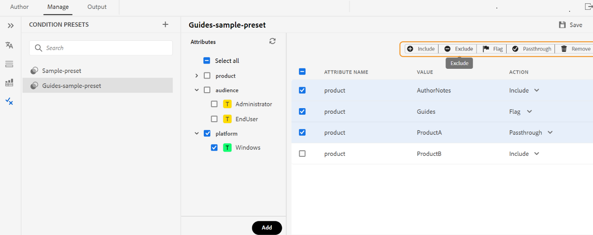

# Utilisation de paramètres prédéfinis de condition {#id1825FL004PN}

You can define attributes in your DITA topics and the use the condition preset to specify what happens with the attribute in the final output. For example, you can add attributes as version 1.0 and version 2.0 in your content, and use a condition preset to include version 1.0 for release 1.0 and exclude version 2.0. Similarly, you can add attributes as OS Windows and OS Linux to your content, and then include or exclude the relevant content for your final output according to the operating system.

You can create condition presets in two ways:

* From the Web Editor: Allows you to create and manage the condition presets for a DITA map from the Web Editor.
* From the map dashboard: Allows you to create and manage the condition presets for a DITA map from the map dashboard.

## Condition presets from the Web Editor

Experience Manager Guides allows you to manage condition presets from the Web Editor and use them within the Output presets to generate the final output.
You can create and view the condition presets, view the attributes, and manage the actions for the current map from the **Condition Presets** view in the Web Editor.

### Create a condition preset

The **Condition Presets** view provides detailed information about the condition presets, such as their attributes, values,  and the actions.
You can create a condition preset of the topics by performing the following steps:

1. Dans le panneau **Référentiel**, ouvrez le fichier DITA map en mode Carte.
1. Select the **Manage** tab.
1. Select **Condition Presets** on the left. The list of conditions presets defined for the DITA map is displayed.
1. Select the + icon next to **Condition Presets** to open the **New Condition Preset** dialog.
1. Enter a unique name for the preset.

   >[!NOTE]
   >
   > You view an error if the name field is empty or if you enter an Invalid character or a name that is the same as an existing condition preset. You can use a hyphen &#39;-&#39; or underscore &#39;_&#39; as a separator.

1. Sélectionnez **Créer**.
Le nouveau paramètre prédéfini de condition est ajouté à la liste.
1. Double-cliquez sur un paramètre prédéfini de condition pour afficher les attributs et les actions.
Le panneau **Attributs** affiche tous les attributs ajoutés aux références présentes dans le mappage. Le panneau de droite affiche uniquement les conditions que vous avez ajoutées aux paramètres prédéfinis de condition.
1. Effectuez l’une des opérations suivantes pour ajouter les attributs :
   * Sélectionnez un ou plusieurs attributs pour ajouter toutes les valeurs sous eux au paramètre prédéfini de condition. Par exemple, vous pouvez sélectionner l’attribut `platform` pour ajouter toutes ses valeurs.
   * Sélectionnez une ou plusieurs valeurs d’attribut pour les ajouter au paramètre prédéfini de condition. Par exemple, vous pouvez sélectionner les valeurs `Unix` et `Win` de l’attribut platform
   * Sélectionnez une paire d’attributs et de valeurs et faites-la glisser vers le panneau central. Par exemple, vous pouvez sélectionner la valeur `Unix` de l’attribut platform et la faire glisser.
   * **Tout sélectionner** pour ajouter tous les attributs et leurs valeurs au paramètre prédéfini de condition.
Par défaut, l’action d’un attribut est `Include`.

1. Sélectionnez **Ajouter**. Vous pouvez répéter cette étape pour ajouter d’autres attributs. Les attributs que vous ajoutez se déplacent du panneau central vers le panneau de droite.
1. Sélectionnez Supprimer dans la barre d’actions située en haut pour supprimer les attributs sélectionnés dans le panneau de droite.
1. (Facultatif) Si nécessaire, vous pouvez remplacer l’action appliquée aux attributs.
Utilisez l’une des méthodes suivantes :
   * Pour un attribut, sélectionnez l’une des actions suivantes dans le menu déroulant Action .
      * Inclure
      * Exclure
      * Passthrough
      * Marquer
   * Sélectionnez plusieurs lignes d’attribut dans le panneau de droite et choisissez une action dans la barre d’actions située en haut. Par exemple, vous pouvez sélectionner l’action Exclure pour les attributs sélectionnés.
1. Sélectionnez **Enregistrer** pour enregistrer le paramètre prédéfini de condition.

   >[!NOTE]
   >
   > Un avertissement s’affiche si vous sélectionnez un autre paramètre prédéfini ou si vous fermez le paramètre prédéfini sans l’enregistrer.

Une fois que vous avez créé un paramètre prédéfini de condition, il apparaît dans la liste déroulante **Paramètres prédéfinis de condition** des paramètres prédéfinis de sortie. En savoir plus sur la procédure de [Publication d’une sortie PDF](/help/product-guide/web-editor/native-pdf-web-editor.md).

### Renommer un paramètre prédéfini de condition

Pour renommer un paramètre prédéfini de condition, procédez comme suit :

1. Pointez sur un paramètre prédéfini de condition dans le panneau **Paramètres prédéfinis de condition**.
1. Sélectionnez **Renommer** dans le menu Options pour ouvrir la boîte de dialogue **Renommer le paramètre prédéfini de condition**.
1. Modifiez le nom du paramètre prédéfini de condition.
1. Cliquez sur **Renommer**.

### Duplication d’un préréglage de condition

Effectuez les étapes suivantes pour dupliquer un paramètre prédéfini de condition :

1. Pointez sur un paramètre prédéfini de condition dans le panneau **Paramètres prédéfinis de condition**.
1. Sélectionnez **Dupliquer** dans le menu Options pour ouvrir la boîte de dialogue **Dupliquer le paramètre prédéfini de condition**.
   >[!NOTE]
   >
   > Le nom par défaut du paramètre prédéfini est `<selected condition preset name>_1`. Vous pouvez modifier le nom en fonction de vos besoins.

1. Cliquez sur **Dupliquer**.

### Supprimer le paramètre prédéfini de condition

Pour supprimer des paramètres prédéfinis de condition, procédez comme suit :

1. Pointez sur un paramètre prédéfini de condition dans le panneau **Paramètres prédéfinis de condition**.
1. Sélectionnez **Supprimer** dans le menu Options pour ouvrir la boîte de dialogue **Supprimer le paramètre prédéfini de condition**.
1. Cliquez sur **Supprimer**.

## Paramètres prédéfinis de condition dans le tableau de bord de mappage

### Création d’un paramètre prédéfini de condition

Pour créer un paramètre prédéfini de condition, procédez comme suit :

1. Sélectionnez l&#39;onglet **Paramètres prédéfinis de condition** dans la console de plan DITA.
1. Cliquez sur le bouton **Créer**.
1. Saisissez le nom du paramètre prédéfini dans **Condition de nom**.
1. Sélectionnez l’une des actions par défaut suivantes dans le menu déroulant **Définir l’action par défaut sur** :

   * Inclure
   * Exclure
   * Passthrough
   * Marquer
L’action est définie comme action par défaut pour tous les attributs, qu’ils soient ajoutés ou non au paramètre prédéfini de condition.

   Par exemple, votre document contient 15 attributs de condition et vous en avez inclus quatre dans le paramètre prédéfini de condition. Si vous sélectionnez **exclure** comme action par défaut, elle est appliquée aux 15 attributs.

1. Effectuez l’une des opérations suivantes pour ajouter les attributs :
   * Cliquez sur **Ajouter** pour ajouter un attribut au préréglage de condition. Vous pouvez répéter cette étape pour ajouter d’autres attributs.
   * Cliquez sur **Ajouter tout** pour ajouter tous les attributs au préréglage de condition.
1. \(Facultatif\) Si nécessaire, vous pouvez remplacer l’action par défaut appliquée aux attributs à l’étape 4. Utilisez l’une des méthodes suivantes :
   * Sélectionnez plusieurs attributs, choisissez une action dans **Définir l’action pour les conditions sélectionnées sur**, puis cliquez sur **Appliquer**.
   * Sélectionnez une action pour un attribut dans le menu déroulant **Action**.
1. Cliquez sur **Enregistrer**.

### Modification d’un paramètre prédéfini de condition

Vous pouvez apporter des modifications à un paramètre prédéfini de condition existant pour modifier les actions appliquées aux attributs du paramètre prédéfini de condition. Pour modifier un paramètre prédéfini de condition, procédez comme suit :

1. Sélectionnez l&#39;onglet **Paramètres prédéfinis de condition** dans la console de plan DITA.
1. Cliquez sur le bouton **Modifier**.
1. Apportez les modifications requises pour tous les attributs du paramètre prédéfini de condition.
1. Cliquez sur **Enregistrer**.

### Création d’une copie d’un paramètre prédéfini de condition

Vous pouvez créer une copie d’un paramètre prédéfini de condition, puis le modifier en fonction de vos besoins. Pour créer une copie d’un paramètre prédéfini de condition, procédez comme suit :

1. Sélectionnez l&#39;onglet **Paramètres prédéfinis de condition** dans la console de plan DITA.
1. Cliquez sur le bouton **Dupliquer**.

   >[!NOTE]
   >
   > Le nom par défaut du paramètre prédéfini est `<selected condition preset name>_Duplicate`

   Vous pouvez modifier le nom en fonction de vos besoins.

1. \(Facultatif\) Effectuez les modifications requises pour tous les attributs du paramètre prédéfini de condition.
1. Cliquez sur **Enregistrer**.

### Supprimer le paramètre prédéfini de condition

Vous pouvez supprimer un ou plusieurs paramètres prédéfinis de condition dans l&#39;onglet **Paramètre prédéfini de condition** de la console de mappage DITA. Pour supprimer des paramètres prédéfinis de condition, procédez comme suit :

1. Sélectionnez l&#39;onglet **Paramètres prédéfinis de condition** dans la console de plan DITA.
1. Sélectionnez le ou les préréglages de condition à supprimer.
1. Cliquez sur le bouton **Supprimer**.
1. Cliquez sur **Supprimer** pour confirmer l’action.

**Rubrique parente :**&#x200B;[&#x200B; Génération de sortie](generate-output.md)
