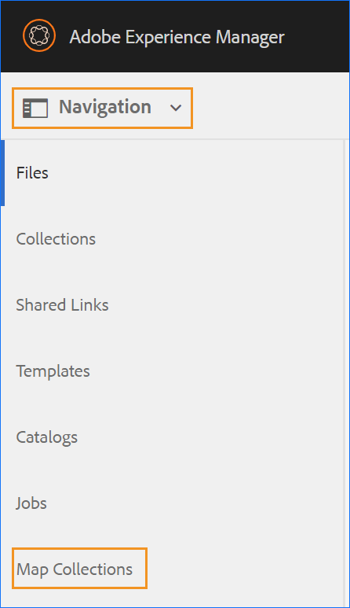

# Utilisation de Map Collection pour la génération de sortie {#id1723F20G0HS}

Dans n’importe quelle organisation, un produit peut avoir plusieurs types de documentation. En tant que spécialiste de la publication, vous souhaitez contrôler la sortie que vous souhaitez générer pour chaque document. En outre, il doit exister un moyen de publier plusieurs documents par lots en un seul clic.

AEM Guides vous offre la possibilité d’organiser votre contenu pour publication à l’aide d’un tableau de bord appelé Collection de cartes. Une collection Map vous permet d’assembler tous les différents types de documents dans une seule unité. Vous pouvez choisir le type de sortie que vous souhaitez générer pour chaque document de votre collection Map. En outre, vous pouvez également générer une sortie et voir la progression de la génération de la sortie à partir du tableau de bord de publication.

Map Collection vous donne une option pour voir s&#39;il y a une modification dans un mappage à partir de la dernière sortie publiée. Vous pouvez afficher les détails dans l’onglet Cartes et paramètres prédéfinis de votre collection de cartes, puis republier la sortie si nécessaire. Pour plus d&#39;informations, voir Ajouter un mappage à une collection de mappages.

## Créer une collection de plans et ajouter des plans DITA

Pour créer une collection Map et ajouter des cartes DITA à la collection, procédez comme suit :

1. Dans l’interface utilisateur d’Assets, cliquez sur **Mapper des collections**.

   Si le lien Mapper les collections n’est pas disponible, sélectionnez l’option **Navigation** dans le rail de gauche, puis cliquez sur **Mapper les collections**.

   {width="350" align="left"}

1. Saisissez un Titre pour votre collection de cartes.
1. Cliquez sur **Créer**.

   Un message de réussite s’affiche lors de la création de la collection de mappages.

1. Cliquez sur **Fermer** dans le message de réussite.

   Le fichier de mappage nouvellement créé s’affiche sur la page Mapper les collections .

1. Cliquez sur la zone grise de la mosaïque de la collection à modifier.
1. Cliquez sur **Modifier** puis sur **Ajouter des cartes**.
1. Recherchez et ajoutez les mappages DITA que vous souhaitez ajouter à la collection Map.

   Par défaut, tous les paramètres prédéfinis et locaux associés à la carte sont ajoutés automatiquement.

1. Sélectionnez la sortie souhaitée en activant ou en désactivant le bouton coulissant.
1. Cliquez sur **Terminé**.

   Les fichiers map DITA sont ajoutés à votre collection Map.

   {width="800" align="left"}

Les options de filtrage et les détails de mappage suivants sont affichés sur la page de collection :

- **Filtre :** le rail de gauche affiche les filtres suivants :
   - **Modifié** : vous pouvez sélectionner Oui ou Non. Si vous sélectionnez oui, seuls les mappages DITA modifiés seront affichés dans le tableau Mappages et paramètres prédéfinis.
   - **Paramètre prédéfini** : sélectionnez un paramètre prédéfini pour lequel vous souhaitez filtrer les fichiers de mappage. Par exemple, si vous choisissez le paramètre prédéfini *Site AEM*, seuls les mappages sur lesquels le paramètre prédéfini de sortie *Site AEM* est configuré s’affichent.
   - **Langue** : vous pouvez sélectionner l’un des codes de langue disponibles et afficher uniquement la langue sélectionnée dans le tableau Cartes et paramètres prédéfinis.
- **Tableau des mappages et des paramètres prédéfinis** : le tableau des mappages et des paramètres prédéfinis présente les informations dans les colonnes suivantes :
   - **Map** : affiche le titre du fichier de plan DITA.
   - **Nom de fichier** : affiche le nom de fichier du plan DITA.
   - **Langue** : affiche la langue du plan DITA.
   - **Paramètre prédéfini** : affiche le type de paramètre prédéfini de sortie configuré sur le fichier map.
   - **Ligne de base** : affiche la ligne de base utilisée par le paramètre prédéfini de sortie.  Si aucune ligne de base n&#39;est utilisée, un trait d&#39;union (-) apparaît
   - **Modifié** : indique si le plan DITA est mis à jour après la dernière publication. En fonction de ces informations, vous pouvez décider de republier ou non la sortie de ce plan DITA.
   - **Dernière génération** : affiche la date et l’heure de la dernière sortie générée.

## Configurer et générer la sortie à l’aide d’une collection de cartes

Pour configurer et générer la sortie à l’aide d’une collection Map, procédez comme suit :

1. Ouvrez la collection de cartes . Vous pouvez afficher les différents paramètres prédéfinis de sortie tels que le site AEM, PDF (y compris Native PDF), HTML5, EPUB et les paramètres prédéfinis personnalisés. Vous pouvez également afficher les paramètres prédéfinis de profil globaux et de dossier créés par votre administrateur.

   The  icon indicates a folder profile level preset.
1. \(Optional\) Do any of the following based on your requirement:
   - Apply Filters from the left rail to filter the modified maps, output preset, or language.
   - If required, click **Edit** and change the desired output by turning the sliding button on or off.

     >[!NOTE]
     >  
     > By default, any new preset is disabled.

1. You can enable the presets for a DITA map  in the following ways:

   - Enable any individual preset.
   - Enable **All presets** for a DITA map to select all presets in one go. Par défaut, cette option est désactivée.
   - Enable **Folder profile presets** for a DITA map to select all the folder profile presets for it. Par défaut, cette option est désactivée.
     {width="800" align="left"}

1. Utilisez l’une des méthodes suivantes :

   - To generate output of selected maps, select the map files and click **Generate Selected**.
   - To generate output of all DITA maps with their configured presets, click **Generate All**.

   >[!IMPORTANT]
   >
   > If an output generation process for a preset or DITA map is either in the queue or in progress, you cannot initiate another output generation task for the same preset or map.

## Configure the metadata properties

In the map collection, you can configure the metadata properties in bulk for the DITA maps. Select **Configure Metadata**  to open the **Asset Metadata** page. On the **Asset Metadata** page, all the maps present in the collection are listed on the left.

{width="800" align="left"}

Perform the following steps to configure the metadata properties:

1. You can choose the maps you wish to update the metadata for. By default, all the DITA maps present are selected.

1. Once you select the DITA maps, you can view properties like metadata, schedule (de)activation, references, document state, and more.

1. Update the metadata properties.

1. Click **Save &amp; Close** on the top to save the updates.
1. (Optional) When you update the tags, you can also select Append in the **Save &amp; Close** dropdown to append the new tags to the existing list.
1. Cliquez sur **Envoyer** dans le menu déroulant **Enregistrer et fermer**.
Les propriétés de métadonnées sont mises à jour pour les plans DITA que vous sélectionnez en bloc dans la collection de plans.

>[!NOTE]
> 
>Dans le menu déroulant **État du document**, vous pouvez sélectionner uniquement les états de document autorisés en commun pour tous les plans DITA sélectionnés. Pour en savoir plus, consultez [**État du document**](./web-editor-document-states.md).

Les propriétés de métadonnées sont synchronisées avec les propriétés du fichier. Une fois mises à jour, vous pouvez les afficher à partir du panneau **Propriétés du fichier** dans l’éditeur web.

## Suppression d&#39;une collection Map ou d&#39;un plan DITA dans la collection Map

- Pour supprimer une collection de cartes, sélectionnez une collection dans la page Collection de cartes, puis cliquez sur **Supprimer**.
- Pour supprimer un plan DITA d&#39;une collection de plans, ouvrez la collection de plans en mode d&#39;édition, sélectionnez le fichier de plan DITA, puis cliquez sur **Supprimer de la collection**.

Cela supprimera également tous les paramètres prédéfinis ou les paramètres régionaux associés au plan DITA de la collection Map.

## Annuler une tâche de génération de sortie à partir d’une collection Map

De la même manière que vous pouvez annuler une tâche de génération de sortie à partir de la [console de mappage DITA](generate-output-for-a-dita-map.md#id2061H100T5Z) ou du [tableau de bord de publication](generate-output-publish-dashboard.md#), vous pouvez annuler une tâche de génération de sortie à partir d&#39;une collection de mappages. Accédez à l’onglet Sorties d’une collection Map, accédez à la tâche de publication que vous souhaitez annuler, puis cliquez sur l’icône **Annuler cette tâche** pour annuler la tâche de publication.

{width="800" align="left"}

**Rubrique parente :**[ Génération de sortie](generate-output.md)
