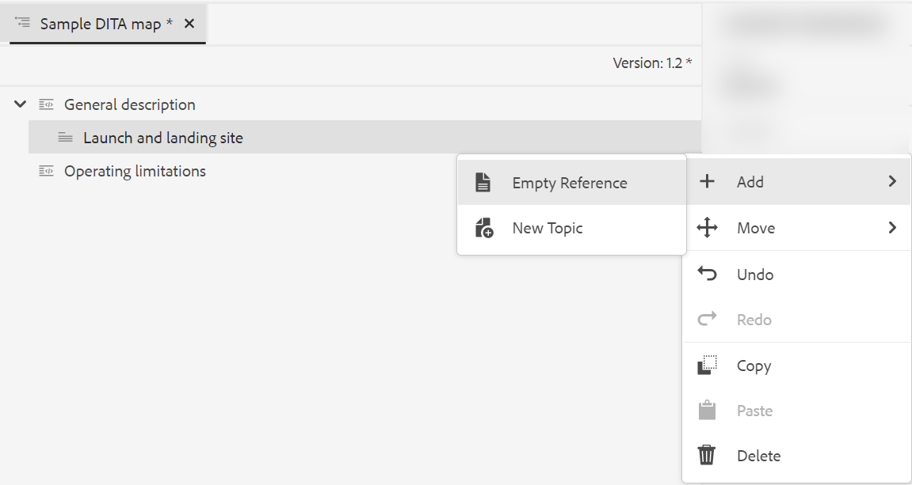
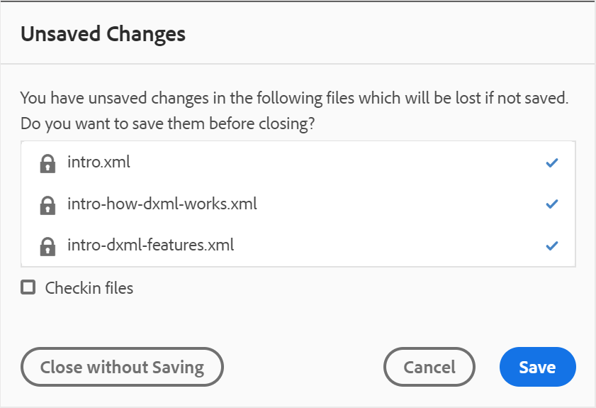

# Utilisation de l’éditeur de mappage avancé {#id1942D0S0IHS}

L’éditeur de carte avancé est fourni avec une interface utilisateur intuitive et est similaire à l’éditeur web. Lorsque vous ouvrez un fichier de carte dans l’éditeur Web, vous avez la possibilité de modifier le fichier de carte à l’aide de l’interface de l’éditeur de carte avancé. L’éditeur de mappage avancé vous permet d’ajouter des références de rubrique, des références clés, de structurer votre contenu, etc.

Outre la modification de fichiers de mappage directement à partir de l’éditeur web, vous pouvez également ouvrir les fichiers de rubrique dans un mappage pour modifier l’éditeur web. Cette rubrique vous guide tout au long des fonctionnalités de l’éditeur de mappage avancé et de la manière dont vous pouvez ouvrir et modifier des fichiers dans un mappage DITA dans l’éditeur web.

## Ajout de rubriques à un fichier map

Effectuez les étapes suivantes pour créer votre fichier de carte à l’aide de l’éditeur de carte avancé :

1. Dans l’interface utilisateur d’Assets, accédez au fichier de mappage à modifier.

   >[!NOTE]
   >
   > Assurez-vous que vous n’avez pas activé le mode de sélection de la ressource.

1. Pour obtenir un verrou exclusif sur le fichier map, sélectionnez le fichier map et cliquez sur **Check Out**.

   >[!NOTE]
   >
   > Une fois que vous disposez d’un verrou exclusif sur un fichier de carte, les autres utilisateurs ne peuvent plus modifier la carte. Cependant, ils pourraient travailler sur les rubriques du fichier de mappage. Si votre administrateur a configuré l’éditeur web pour extraire des fichiers avant de les modifier, vous ne pourrez pas modifier un fichier tant que vous ne l’aurez pas extrait. De même, s’il est configuré, vous serez invité à archiver tout fichier extrait avant de le fermer.

1. Une fois le fichier de mappage sélectionné, cliquez sur **Modifier les rubriques**.

   {width="800" align="left"}

   Vous pouvez également sélectionner l’option **Modifier les rubriques** dans le menu d’actions du fichier de carte :

   {width="800" align="left"}

   Le fichier de mappage est ouvert pour modification dans l’éditeur web.

1. Cliquez sur l’icône **Modifier**.

   {width="550" align="left"}

   La carte s’ouvre dans l’interface de l’éditeur de cartes avancé. Si vous avez ouvert un nouveau fichier de carte, seul le titre de la carte s’affiche dans l’éditeur.

   {width="800" align="left"}

   - **A** - \(*Barre d’outils principale*\) : similaire à la barre d’outils principale de l’éditeur web. Pour plus d’informations, voir [Barre d’outils principale](web-editor-features.md#id2051EA0G05Z) dans l’éditeur web.

   - **B** - \(*Barre d’outils Secondaire*\) Il s’agit de la barre d’outils Secondaire qui vous permet d’utiliser des fichiers de mappage. Pour plus d’informations sur les fonctionnalités disponibles dans la barre d’outils Secondaire, voir [Fonctionnalités disponibles dans la barre d’outils de l’éditeur de mappage avancé](#id205DEC0005Z).

   - **C** - \(*Mappage des vues*\) : permet de basculer l’éditeur de cartes entre la mise en page, l’auteur, Source et l’aperçu. La vue **Disposition** vous permet d’organiser les rubriques dans un mappage DITA. Cela donne l’arborescence ou la vue hiérarchique de la carte. La vue **Auteur** vous permet de modifier les rubriques dans l’éditeur de cartes. Cela donne également la vue WYSIWYG du fichier de carte. La vue **Source** vous permet de travailler avec le code XML sous-jacent du fichier map. L’aperçu vous donne une vue consolidée de toutes les rubriques et sous-mappages dans le fichier de mappage. Le lien **Fermer** ferme le fichier de mappage.

   - **D** - \(*Panneau de gauche*\) : donne accès au panneau de gauche qui vous donne accès aux Favoris, au Référentiel, à la Carte, au Contour et à d’autres fonctionnalités. Vous pouvez la développer ou la réduire en cliquant sur l’icône Développer la barre latérale \(\). Pour plus d’informations sur les fonctionnalités disponibles dans le panneau de gauche, voir [Panneau de gauche](web-editor-features.md#id2051EA0M0HS) dans l’éditeur web.

   - **E** - \(*Zone moyenne*\) : mappez la zone de modification du contenu.

   - **F** - \(*Panneau de droite*\) : donne accès au panneau Propriétés. Vous pouvez afficher les propriétés de contenu et de mappage de la rubrique ou du mappage sélectionné. Pour plus d’informations sur les fonctionnalités disponibles dans ce panneau, voir [Panneau de droite](web-editor-features.md#id2051EB003YK) dans l’éditeur web.

1. Dans le panneau de gauche, passez à la **vue du référentiel**.

1. Dans le référentiel AEM, accédez au dossier contenant les rubriques ou sous-mappages à ajouter.

1. Sélectionnez le fichier de rubrique ou de mappage dans la **vue du référentiel** et faites-le glisser dans la zone d’édition du contenu de mappage \(milieu\).

   La rubrique est ajoutée dans la carte.

   {width="800" align="left"}

1. Pour ajouter des rubriques ou une sous-map suivantes, faites glisser la rubrique ou la sous-map vers l’emplacement requis dans la carte.

   Tenez compte des points suivants lors de la création de votre fichier de carte :

   - Le fichier est ajouté à un emplacement où la barre horizontale s’affiche dans la zone de modification de la carte. Dans la capture d’écran suivante, la rubrique *Aperçu* sera ajoutée entre les rubriques *Description générale* et *Launch and Landing Site* .

     {width="350" align="left"}

   - Pour remplacer une rubrique, placez-la en haut, à gauche ou à droite de la rubrique que vous souhaitez remplacer. Une barre verticale située à gauche ou à droite d’une rubrique indique qu’elle sera remplacée par la rubrique qui y est déposée.

     {width="550" align="left"}

     Toutefois, avant de remplacer une rubrique, vous recevez une invite de confirmation. La rubrique n’est remplacée qu’une fois la confirmation effectuée.

     {width="300" align="left"}

   - Si vous ajoutez une sous-map à votre mappage DITA, la sous-map s’affiche sous la forme d’un lien dans le mappage DITA. Pour afficher toutes les rubriques de la sous-map, appuyez sur Ctrl+Clic sur le lien de la sous-map. Le contenu du sous-mapping s&#39;affiche dans un nouvel onglet. De même, pour ouvrir une rubrique à partir du mappage DITA, maintenez la touche Ctrl enfoncée et cliquez sur le lien de la rubrique pour l’ouvrir dans le nouvel onglet.

   - Vous pouvez utiliser les touches de raccourci CTRL+Z et CTRL+Y ou leurs icônes respectives dans la barre d’outils pour annuler ou rétablir toute modification dans la carte.

   - Pour modifier la position d’une rubrique, sélectionnez la rubrique \(en cliquant sur l’icône de rubrique\), puis faites-la glisser à l’emplacement souhaité dans le fichier de mappage. Assurez-vous que la barre horizontale est visible à l’emplacement où vous souhaitez placer la rubrique. Dans la capture d’écran suivante, la rubrique *Launch and Landing Site* est en cours de déplacement après la rubrique *Overview* .

     {width="350" align="left"}

   - Pour vérifier les propriétés de votre fichier de carte, cliquez avec le bouton droit de la souris n’importe où dans la zone d’édition de carte et choisissez **Propriétés** dans le menu contextuel. En fonction de votre version d’AEM, vous pouvez voir des propriétés telles que les métadonnées, l’activation de la planification \(de\), les références, l’état du document, etc.

1. Cliquez sur **Enregistrer**.

## Fonctionnalités disponibles dans la barre d’outils de l’éditeur de carte avancé {#id205DEC0005Z}

La barre d’outils de l’éditeur de mappage avancé est similaire à la rubrique Éditeur web. Les opérations de base telles que le basculement du panneau de gauche, l’enregistrement du mappage, la création d’une nouvelle version du mappage, l’annulation/le rétablissement de la dernière opération et la suppression des éléments sélectionnés sont courantes dans les deux éditeurs. Pour plus d&#39;informations sur le fonctionnement de ces opérations, consultez la section [Connaître les fonctionnalités de l&#39;éditeur web](web-editor-features.md#) .

Les opérations spécifiques à la carte suivantes sont également disponibles sur la barre d’outils dans les vues Disposition et Auteur :

## Mode Mise en page {#id205DEC0005Z_layout_view}

Lorsque vous ouvrez une carte pour la modifier, la vue Mise en page de l’éditeur de mappages s’affiche. La vue Mise en page affiche la hiérarchie des mappages dans une arborescence et vous permet d’organiser les rubriques dans une carte.

>[!NOTE]
>
> La vue Disposition affiche uniquement les références présentes dans une carte. Si des références sont rompues, un petit croix est affiché à gauche de la référence.

Vous pouvez effectuer les tâches suivantes en mode Mise en page :

**Insérer une référence de rubrique** - 

Affiche la boîte de dialogue de recherche de rubrique. Accédez au fichier de rubrique/mappage à insérer, puis cliquez sur Sélectionner pour l’ajouter à la carte.
{width="800" align="left"}

**Insérer un groupe de rubriques** - 

Insérez l’élément `topicgroup` . Pour plus d’informations sur le regroupement de rubriques, consultez la documentation [topicgroup](https://docs.oasis-open.org/dita/v1.0/langspec/topicgroup.html) dans Spécification du langage OASIS DITA.

**Insérer une définition de clé** - 

Affiche la boîte de dialogue Insérer une clé. Utilisez cette boîte de dialogue pour définir toute définition de clé que vous souhaitez utiliser dans la carte.

{width="300" align="left"}

**Insérer avant/Insérer après** -  / 

Affiche la boîte de dialogue Insérer un élément . Sélectionnez l’élément que vous souhaitez insérer dans la carte. Selon l’opération, le nouvel élément est inséré avant ou après l’élément actif dans la carte.

**Insérer une matière recto** - 

Cette icône s’affiche lorsque vous ouvrez un bookmap en vue de le modifier. Vous pouvez insérer des composants au début du livre comme une table des matières, un index et une liste de tableaux.

**Insérer de la matière première** - 

Cette icône s’affiche lorsque vous ouvrez un bookmap en vue de le modifier. Vous pouvez insérer des composants pour une fin de livre comme un index, un glossaire et une liste de chiffres.

**Déplacer l’élément sélectionné gauche/droite** -  / 

Cliquez sur la flèche gauche pour déplacer la rubrique vers la gauche dans la hiérarchie. Cela permet essentiellement de promouvoir le sujet respectif à un niveau dans la hiérarchie. Par exemple, si vous cliquez sur la flèche gauche alors qu’une rubrique enfant est sélectionnée, elle devient la soeur de la rubrique ci-dessus. De même, si vous cliquez sur la flèche droite, la rubrique est dirigée vers la droite, ce qui en fait l’enfant de la rubrique au-dessus.

**Déplacer l’élément sélectionné vers le haut/bas** - / 

Cliquez sur les icônes de flèche vers le haut ou vers le bas pour déplacer la rubrique vers le haut ou vers le bas dans la hiérarchie.

>[!NOTE]
>
> Vous pouvez également faire glisser et déposer les références pour les déplacer dans une carte.

**Verrouillage/déverrouillage** -  / 

Obtient un verrou sur le fichier map et libère le verrou. Si vous avez des modifications non enregistrées dans votre fichier de carte, vous êtes invité à enregistrer le fichier de carte au moment de la publication du verrouillage. Les modifications sont enregistrées dans la version actuelle du fichier de mappage.

**Fusionner** - 

Pour plus d’informations sur la fusion du contenu d’une autre version du même fichier ou d’un autre fichier, voir [Fusion](web-editor-features.md#id205DF04E0HS) dans l’éditeur web.

**Historique de version** - 

Vérifiez les versions et les libellés disponibles sur votre rubrique active, puis revenez à n’importe quelle version à partir de l’éditeur.

**Libellé de version** - 

Affiche la boîte de dialogue de gestion des libellés de version. Sélectionnez une version dans la liste déroulante. Sélectionnez le libellé que vous souhaitez appliquer à la version sélectionnée et cliquez sur **Ajouter une étiquette** pour l’ajouter.

**Options d’affichage** - 

Affiche une liste déroulante qui vous permet d’afficher les numéros de ligne, de cocher les cases et d’afficher le nom du fichier.

- **Afficher les numéros de ligne**

Affiche ou masque le numéro de ligne de chaque rubrique. Les numéros de ligne sont affichés en fonction du niveau de la hiérarchie.

- **Afficher la case à cocher**

Affiche ou masque une case à cocher pour chaque rubrique. Vous pouvez utiliser la case à cocher pour sélectionner la ou les rubriques\ et effectuer diverses tâches à l’aide du menu Options. Pour plus d’informations, voir le menu [Options](#id228ID8006H8) .

- **Afficher le nom de fichier**

Affiche le nom de fichier des titres des rubriques.

>[!NOTE]
>
> Lorsque vous placez le pointeur sur le titre d’une rubrique, le chemin d’accès au fichier s’affiche.

**Afficher les rubriques en fonction des filtres conditionnels** Si vous avez appliqué des conditions sur une rubrique, une icône de filtre s’affiche à droite de la rubrique. Lorsque vous placez le pointeur sur une icône de filtre, la condition appliquée et sa valeur d’attribut s’affichent.

**Menu Options dans la vue Disposition**

Outre l’organisation des rubriques dans le fichier de mappage, vous pouvez effectuer les actions suivantes à l’aide du menu Options disponible pour un élément dans la vue Mise en page :

{width="650" align="left"}

- **Ajouter** : vous pouvez choisir d’ajouter une nouvelle rubrique ou une référence vide dans l’éditeur de cartes :
   - **Référence vide** : cette option vous permet d’ajouter une référence vide dans votre mappage DITA. Vous pouvez double-cliquer sur la référence vide insérée ultérieurement et ajouter les détails de la rubrique. Pour plus d’informations, voir [Création d’une rubrique](web-editor-features.md#id228ICI0105U) dans l’éditeur web.
   - **Nouvelle rubrique** : lorsque vous choisissez de créer une rubrique à partir du menu, la boîte de dialogue Créer une nouvelle rubrique s’affiche. Dans la boîte de dialogue Créer une nouvelle rubrique, fournissez les détails requis, puis cliquez sur Créer. Pour plus d’informations, voir [Création d’une rubrique](web-editor-features.md#id228ICI0105U) dans l’éditeur web.
- **Déplacer** : vous pouvez choisir de déplacer une rubrique vers le haut/vers le bas/vers la droite/vers la gauche dans la hiérarchie. Vous pouvez également faire glisser une rubrique ou une map du panneau du référentiel vers la carte ouverte dans l’éditeur de cartes.
- **Annuler** : annulez la dernière opération dans la vue Disposition.
- **Redo** : rétablir la dernière opération dans la vue Disposition.
- **Copier** : copiez la référence sélectionnée dans le fichier de mappage.

  >[!NOTE]
  >
  > Vous pouvez afficher, puis cocher les cases pour copier plusieurs références.

- **Coller** : collez les références copiées à l’emplacement actuel dans la hiérarchie.
- **Supprimer** : supprimez les références sélectionnées du fichier de mappage.

  >[!NOTE]
  >
  > Vous pouvez afficher, puis cocher les cases pour supprimer plusieurs références.

## Panneau de droite dans l’éditeur de cartes

Le panneau de droite affiche les propriétés du contenu et les propriétés de mappage dans la vue Disposition de l’éditeur de cartes.

**Propriétés du contenu**

Le panneau Propriétés du contenu contient des informations sur le type de rubrique actuellement sélectionnée dans la carte, son URL de lien et ses attributs. Pour plus d’informations, voir [Propriétés du contenu](web-editor-features.md#id228IDB00HMM) dans l’éditeur web.

- **Autres attributs** Si votre administrateur a créé un profil pour les attributs, vous obtiendrez ces attributs avec leurs valeurs configurées. À l’aide du panneau des propriétés de contenu, vous pouvez choisir ces attributs et les affecter au contenu approprié de votre rubrique. Vous pouvez également attribuer des attributs configurés par votre administrateur sous l’onglet **Attributs d’affichage** des paramètres de l’éditeur. Les attributs définis pour un élément sont affichés dans les vues Disposition et Contour. Vous pouvez ainsi jeter un coup d’oeil rapide à toutes les rubriques d’une carte pour lesquelles un attribut particulier est défini. Par exemple, toutes les rubriques dont l&#39;attribut de plateforme est défini comme &quot;Android&quot;.

  {width="650" align="left"}

  Pour plus d’informations, reportez-vous à la description de la fonction *Attributs d’affichage* dans les *Paramètres de l’éditeur* de la section [Panneau de gauche](web-editor-features.md#id2051EA0M0HS).

- **Métadonnées** À l’aide des métadonnées , vous pouvez définir les informations de métadonnées. Vous pouvez définir le titre de navigation, le texte du lien, la description courte et les mots-clés.

Pour plus d’informations sur les métadonnées et les attributs de rubrique standard, consultez la documentation [topicref](https://docs.oasis-open.org/dita/v1.2/os/spec/langref/topicref.html) dans Spécification du langage OASIS DITA.

**Propriétés de carte**

Affiche la boîte de dialogue Propriétés de la carte dans laquelle vous pouvez définir les attributs et les informations de métadonnées de la carte.

## Vue Auteur {#id205DEC0005Z_author_view}

La vue **Auteur** vous permet de modifier votre mappage DITA dans l’éditeur web. La vue WYSIWYG de l’éditeur de cartes s’affiche. Certaines icônes affichées dans la vue Auteur sont identiques à la vue Mise en page. Pour plus d’informations, voir [Vue de la mise en page](#id205DEC0005Z_layout_view). En outre, vous pouvez voir les icônes suivantes et effectuer les tâches associées à partir de la vue Auteur :

**Insérer avant/Insérer après** -  / 

Affiche la boîte de dialogue Insérer un élément . Sélectionnez l’élément que vous souhaitez insérer dans la carte. Selon l’opération, le nouvel élément est inséré avant ou après l’élément actif dans la carte.

**Insérer un élément** - 

Affiche la boîte de dialogue Insérer un élément . Sélectionnez l’élément à insérer. Vous pouvez utiliser le clavier pour faire défiler la liste des éléments et appuyer sur Entrée pour insérer l’élément requis. Vous pouvez également cliquer directement sur l’élément pour l’insérer dans la carte.

**Insérer une table de relation** - 

Insère un tableau de relation dans le mappage. Comme le concept d’utilisation de la table de relation est identique à celui expliqué dans la section Éditeur de carte de base , voir [Utilisation des tables de relation dans l’éditeur de carte de base](map-editor-basic-map-editor.md#id1944B0I0COB) pour plus d’informations.

**Insérer du contenu réutilisable** - 

Affiche la boîte de dialogue Réutiliser le contenu . Utilisez cette boîte de dialogue pour insérer le contenu que vous souhaitez réutiliser dans votre carte.

**Actualiser l’attribut Titre de navigation** - 

Synchronise l’élément `title` d’un fichier référencé dans une carte avec la valeur spécifiée dans son attribut `@navtitle`. Vous pouvez ajouter différents types de fichiers de référence dans un mappage, par exemple rubrique, référence, tâche, mappages \(sub\), etc. La plupart de ces fichiers prennent en charge l’attribut `@navtitle`. Si un fichier contient l’attribut `@navtitle`, l’attribut `@navtitle` du même fichier dans map est mis à jour. Si l’attribut `@navtitle` n’est pas présent, l’attribut `@navtitle` est ajouté à ce fichier de référence et son `title` est également mis à jour pour afficher le `@navtitle`.

>[!NOTE]
>
> Votre administrateur peut configurer l’ajout automatique de l’attribut `@navtitle` à chaque fichier de référence que vous ajoutez à un mappage. Pour plus d’informations sur la configuration de l’attribut `@navtitle` d’ajout automatique, voir *Inclure l’attribut @navtitle par défaut* dans Installation et configuration d’Adobe Experience Manager Guides as a Cloud Service.

Cliquez sur l’icône Actualiser l’attribut du titre de navigation pour synchroniser les valeurs de l’élément `title` et de l’attribut `@navtitle`.

**Activer/désactiver la vue Balises** - 

Affiche ou masque les balises XML. Les balises servent de repères visuels indiquant la limite d’un élément. Dans ce mode, si vous souhaitez insérer une référence de rubrique/mappage, faites glisser et déposez le fichier souhaité avant ou après la balise . La barre horizontale n’est pas affichée en mode d’affichage Balises.

**Activer/Désactiver le suivi des modifications** - 

Vous pouvez effectuer un suivi de toutes les mises à jour effectuées dans le fichier de mappage en activant le mode de suivi des modifications . Après avoir activé le suivi des modifications, toutes les insertions et les suppressions sont capturées dans le document. Pour plus d’informations, voir [Activer/Désactiver le suivi des modifications](web-editor-features.md#id205DF0203Y4) dans l’éditeur web.

**Créer une tâche de révision** - 

Vous pouvez créer une tâche de révision de la rubrique ou du fichier de mappage actif directement à partir de l’éditeur web. Ouvrez le fichier pour lequel vous souhaitez créer la tâche de révision, puis cliquez sur Créer une tâche de révision pour lancer le processus de création de révision. Suivez les instructions fournies dans la [Revue des rubriques ou des cartes](review.md#) pour plus d’informations.

## Modification des rubriques à l’aide de la carte DITA {#id17ACJ0F0FHS}

La modification d’une rubrique individuelle ne donne pas le contexte complet à l’auteur. Un auteur n’a aucune information sur l’emplacement d’une rubrique dans un mappage DITA. Sans cette information contextuelle, il devient un peu difficile pour les auteurs de créer du contenu.

AEM Guides permet aux auteurs d’ouvrir un mappage DITA dans l’éditeur web et de voir le positionnement des rubriques dans le mappage. Cela permet aux auteurs de savoir où exactement la rubrique est placée dans la carte et de créer un contenu plus pertinent. En outre, si plusieurs auteurs travaillent sur un projet, ils peuvent connaître toutes les rubriques disponibles dans le mappage et le contenu de réutilisation, le cas échéant.

Pour modifier des rubriques via un mappage DITA, procédez comme suit :

1. Dans l’interface utilisateur d’Assets, accédez au mappage DITA qui contient les rubriques que vous souhaitez modifier.
1. Cliquez sur le mappage DITA pour l’ouvrir dans la console de mappage DITA.
1. Sélectionnez l’onglet **Rubriques** pour afficher la liste des rubriques disponibles dans le mappage DITA.

   >[!TIP]
   >
   > L’onglet Rubriques vous permet de télécharger le fichier de mappage avec ses dépendances. Pour plus d’informations, voir [Exportation d’un fichier de mappage DITA](authoring-download-assets.md#id218UBA00IXA).

1. Dans la barre d’outils principale, cliquez sur **Modifier les rubriques**.

   Le mappage DITA s’ouvre dans l’éditeur web.

   >[!NOTE]
   >
   > Vous pouvez également sélectionner le fichier de mappage DITA dans l’interface utilisateur d’Assets et cliquer sur **Modifier les rubriques** dans la barre d’outils principale pour lancer l’éditeur web.

   {width="350" align="left"}

1. \(*Facultatif*\) Vous pouvez également sélectionner une rubrique dans la carte et extraire le fichier avant de le modifier. Pour extraire un fichier\(s\), sélectionnez un ou plusieurs fichiers dans le volet de gauche, puis cliquez sur **Extraction**. Vous pouvez également libérer le verrouillage d’un fichier en sélectionnant le fichier extrait et en cliquant sur l’icône **Annuler l’extraction et Déverrouiller** dans la vue Carte.

   >[!IMPORTANT]
   >
   > Si votre administrateur a configuré l’option **Désactiver la modification sans extraction**, vous devez extraire le fichier avant de le modifier. Si vous n’extrayez pas le fichier, le document s’ouvre dans l’éditeur en mode lecture seule.

   La capture d’écran suivante met en évidence les icônes Checkout and Lock \(A\), Cancel Checkout and Unlock \(B\), Save As New Version et Unlock \(C\), Edit \(D\), Preview \(E\), différentes icônes affichant différents types de fichiers DITA \(F\) et les fichiers extraits \(G\).

   {width="550" align="left"}

1. Cliquez sur un lien de rubrique pour l’ouvrir dans l’éditeur web en vue de sa modification.

   Vous pouvez ouvrir plusieurs rubriques dans l’éditeur. Chaque rubrique est alors ouverte dans un nouvel onglet de l’éditeur. Même si votre mappage DITA contient des sous-mappages, les rubriques des sous-mappages sont également ouvertes dans un nouvel onglet pour modification. Si vous souhaitez afficher les rubriques sous une sous-carte, vous pouvez cliquer et développer la sous-carte.

   {width="800" align="left"}

   Si vous cliquez sur un fichier de carte, le mappage est ouvert dans un nouvel onglet du navigateur web.

1. Une fois que vous avez terminé de modifier les rubriques, vous pouvez procéder comme suit :

   - Vous pouvez les enregistrer individuellement. Si vous cliquez sur **Fermer sans enregistrer** vos rubriques, une boîte de dialogue s’affiche et vous invite à enregistrer les rubriques non enregistrées :

     {width="550" align="left"}

     Vous pouvez choisir d’enregistrer toutes les rubriques sélectionnées ou de désélectionner les rubriques que vous ne souhaitez pas enregistrer.

   - Vous pouvez archiver la rubrique à l’aide du bouton **Enregistrer comme nouvelle version et Déverrouiller** . Lorsque vous enregistrez une version de la rubrique, une nouvelle version est créée et le verrouillage est également publié.

     Il est recommandé d’enregistrer vos modifications avant d’archiver les fichiers.  Lorsque vous enregistrez les modifications, le fichier XML est validé.

   - Vous pouvez également sélectionner et archiver plusieurs rubriques à l’aide du bouton **Enregistrer comme nouvelle version et Déverrouiller** . Lorsque vous enregistrez une version des rubriques, une nouvelle version est créée pour chaque rubrique et le verrou est également publié. Vous pouvez également afficher la progression de l’archivage des rubriques à partir de la boîte de dialogue **Enregistrer comme nouvelle version et Déverrouiller** . Un message de réussite s’affiche lorsque les fichiers sont archivés.

   - Si votre administrateur a activé l’option d’archivage des fichiers à la fermeture, vous serez invité à enregistrer les fichiers à la fermeture des fichiers extraits. Lorsque cette option est activée, lorsque vous fermez l’éditeur avec des fichiers modifiés, la liste des fichiers extraits qui doivent être enregistrés s’affiche. Les fichiers extraits s’affichent avec une icône de verrouillage :

     {width="550" align="left"}

      - Cliquez sur le bouton **Fermer sans enregistrer** pour fermer les fichiers sans enregistrer les modifications.

      - Cliquer sur le bouton **Enregistrer** enregistre les modifications, mais n’extrait pas les fichiers.

      - Sélectionnez l’option **Vérifier les fichiers** , puis cliquez sur le bouton **Enregistrer** pour archiver les fichiers \(crée une autre version\) et enregistrer également les fichiers.

## Aperçu d’une carte

En plus de pouvoir voir la position de chaque fichier de rubrique dans une carte, il est souhaitable de voir le contenu de la carte dans un flux consécutif. La fonction Aperçu de la carte vous permet d’afficher l’intégralité du contenu du fichier de carte en un seul clic. Il n’est pas nécessaire de générer une sortie du fichier de carte pour voir à quoi ressemblera la carte entière une fois publiée. Vous pouvez simplement accéder à l&#39;aperçu de la carte et toutes les rubriques et sous-cartes sont rendues sous la forme d&#39;un livre.

Vous pouvez accéder à l’aperçu d’une carte à partir de :

- **Interface utilisateur d’Assets** : dans l’interface utilisateur d’Assets, accédez à l’emplacement de mappage, sélectionnez le fichier de mappage et choisissez **Aperçu de la carte** dans la barre d’outils. L’aperçu de la carte s’affiche dans un nouvel onglet. Vous pouvez afficher le contenu de toutes les rubriques en mode Aperçu. Dans cet affichage, vous ne pouvez pas modifier de rubrique.

  >[!NOTE]
  >
  > Si l’option *Aperçu de la carte* n’est pas visible dans la barre d’outils principale, elle a peut-être été déplacée sous le menu de la barre d’outils **Plus**.

- **Éditeur de carte avancé** : dans l’éditeur de carte avancé, cliquez sur l’icône Aperçu pour afficher l’aperçu de la carte actuelle.

  {width="350" align="left"}

  Vous pouvez effectuer les tâches supplémentaires suivantes en mode aperçu :

   - Cliquez avec le bouton droit sur une rubrique, puis sélectionnez **Modifier** pour ouvrir la rubrique à modifier dans un nouvel onglet.

     >[!NOTE]
     >
     > Si vous ne disposez pas des droits de modification, la rubrique s’ouvre en mode lecture seule.

   - Accédez à la rubrique souhaitée en cliquant sur le titre de la rubrique dans l’arborescence de mappage \(dans le panneau de gauche\).

   - La rubrique actuelle dans l’aperçu de la carte est également mise en surbrillance dans l’arborescence.

**Rubrique parente :**[ Utilisation de l’éditeur de cartes](map-editor.md)
