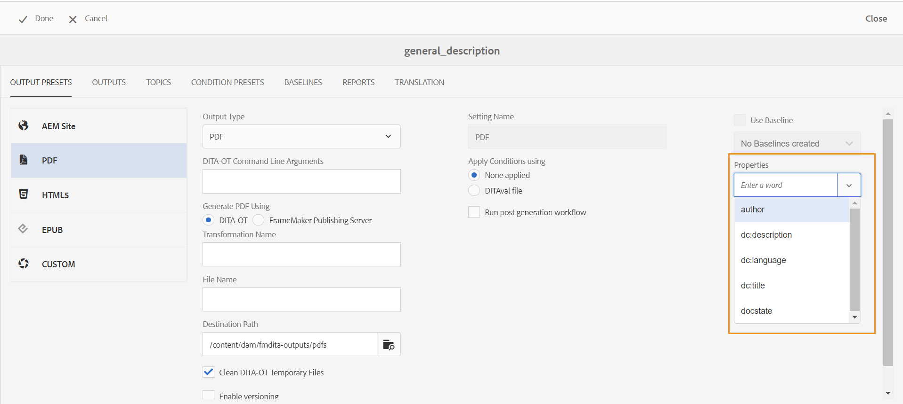

# Transmettre les métadonnées à la sortie à l’aide de DITA-OT {#id21BJ00QD0XA}

Les métadonnées sont des informations supplémentaires sur la sortie. Dans AEM Guides, vous pouvez transmettre les métadonnées existantes ou créer des balises de métadonnées personnalisées. Vous pouvez transmettre des métadonnées à des sorties AEM, PDF, HTML5, EPUB et au format personnalisé à l’aide de la publication DITA-OT.

Effectuez les étapes suivantes pour transmettre les métadonnées à la sortie à l’aide de la publication DITA-OT :

1. Dans l’interface utilisateur **Assets**, accédez au fichier de mappage DITA pour lequel vous souhaitez transmettre les métadonnées au DITA-OT, puis cliquez dessus.
1. Sélectionnez et modifiez un paramètre prédéfini de sortie auquel vous souhaitez transmettre les champs de métadonnées. Par exemple, sélectionnez le paramètre prédéfini de sortie PDF.
1. Sélectionnez **DITA-OT** sous l’option Générer &lt;sortie\> à l’aide du paramètre prédéfini de sortie sélectionné.

   {width="800" align="left"}

1. Dans la liste déroulante Propriétés , sélectionnez les métadonnées que vous souhaitez transmettre à la publication DITA-OT.

   La liste déroulante Propriétés répertorie les propriétés personnalisées et par défaut. Par exemple, dans la capture d’écran ci-dessus, l’auteur est la propriété personnalisée tandis que `dc:description`, `dc:language`, `dc:title` et `docstate` sont les propriétés par défaut.

   >[!NOTE]
   >
   > Ces propriétés sont sélectionnées à partir du fichier metadataList disponible à l’emplacement suivant :`/libs/fmdita/config/metadataList`. Par défaut, ce fichier répertorie quatre propriétés : `dc:description`, `dc:language`, `dc:title` et `docstate`.

   Ce fichier peut être recouvert à l’adresse : `/apps/fmdita/config/metadataList`.

   Pour transmettre une propriété personnalisée pour laquelle vous avez déjà défini les valeurs, reportez-vous à la section [Utilisation des métadonnées AEM dans la sortie PDF DITA-OT](https://experienceleaguecommunities.adobe.com/t5/xml-documentation-discussions/use-aem-metadata-in-dita-ot-pdf-output/td-p/411880).

1. Dans la liste déroulante **Propriétés**, sélectionnez les propriétés personnalisées et par défaut requises. Par exemple, sélectionnez `author`, `dc:title` et `dc:description`. Il s’agit des `metadata/properties` standard qui sont créées une fois que nous créons un fichier. Les propriétés sélectionnées sont répertoriées sous la liste déroulante.

   {width="300" align="left"}

1. Cliquez sur **Terminé** en haut à gauche pour enregistrer les modifications.
1. Générez la sortie.

Les propriétés de métadonnées sélectionnées seront transmises à la sortie générée à l&#39;aide de DITA-OT.

**Rubrique parente :**&#x200B;[ Génération de sortie](generate-output.md)
