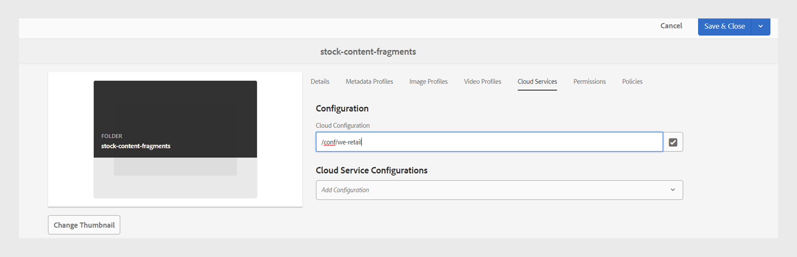

# Publier des fragments de contenu

Content Fragments are discrete pieces of content in Adobe Experience Manager. They are structured content based on a content model. Content Fragments are pure content without design or layout information. They can be authored and managed independently of the channels that Adobe Experience Manager supports. Content Fragments are modular, where content is broken down into smaller components.

Experience Manager Guides allows you to publish a topic or its elements to a content fragment.

>[!NOTE]
>
>You can choose only those elements in a topic that have an id attribute  defined.

To create a Content Fragment, perform the following steps:

1. Create a [Content Fragment model](https://experienceleague.adobe.com/docs/experience-manager-65/assets/content-fragments/content-fragments-models.html?lang=fr) in Adobe Experience Manager Assets.
1. Create a folder where you want to save the Content Fragments that you create based on the Content Fragment model. For example, &quot;stock-content-fragments&quot;.
1. Edit the folder&#39;s properties (for example, &quot;stock-content-fragments&quot;) and add the path of the folder, which contains the Content Fragment model in the cloud configuration.
For example, add `/conf/we-retail` in the cloud configuration. This configuration connects all the Content Fragment models with the folder.\
   {width="650" align="left"}
   *Add the cloud configuration in the folder properties to connect it with the fragment models.*

1. To generate a Content Fragment, select **New Output**  from the **Outputs** section in the **File Properties** of a topic.
1. Select **Content Fragment**.\
    {width="300" align="left"}

   *Add a new Content Fragment from the File Properties of a topic*.

1. In the **Generate Content Fragment** dialog box, fill in the following details under the **General** and **Mapping** tabs.

   **General** tab
   
   *Ajoutez le chemin, le nom, le titre et le filtrage des conditions pour publier une rubrique ou ses éléments en tant que fragment de contenu.*

   * **Chemin d’accès** : recherchez et sélectionnez le chemin d’accès du dossier dans lequel vous souhaitez publier le fragment de contenu. Si vous sélectionnez un fragment de contenu existant, il remplace le contenu des champs mappés.
   * **Titre** : saisissez le titre du fragment de contenu. Par défaut, le titre est renseigné avec le titre de la rubrique. Vous pouvez le modifier. Ce titre est utilisé pour générer le nom du fragment de contenu.
   * **Nom** : saisissez le nom du fragment de contenu. Par défaut, le nom est renseigné avec le titre du topic et les espaces sont remplacés par « _ ». Par exemple, *sample_content_fragment*. Vous pouvez le modifier.  Ce nom est utilisé pour générer l’URL du fragment de contenu.

   * Vous pouvez sélectionner différentes conditions pour créer des variantes de fragment de contenu. Sélectionnez l’une des options suivantes :
     >[!NOTE]
     > 
     > Les conditions ne sont activées que si les attributs de condition sont définis dans la rubrique.

      * **Aucune** : sélectionnez cette option si vous ne souhaitez appliquer aucune condition sur la sortie publiée.
      * **Utilisation de DITAVAL** : sélectionnez le fichier DITAVAL pour inclure ou exclure un contenu spécifique de la sortie générée. Vous pouvez sélectionner le fichier DITAVAL à l’aide de la boîte de dialogue de navigation ou en saisissant le chemin d’accès au fichier.
      * **Utilisation d&#39;attributs** : vous pouvez définir des attributs de condition dans vos rubriques DITA. Sélectionnez ensuite l’attribut de condition pour publier le contenu approprié.

   Onglet **Mappage**

   

   *Sélectionnez le modèle de fragment de contenu et ajoutez les détails du mappage pour publier une rubrique ou ses éléments en tant que fragment de contenu.*

   * **Modèle** : sélectionnez le modèle de fragment de contenu que vous souhaitez utiliser pour créer votre fragment de contenu. Les modèles sont sélectionnés dans le dossier que vous avez configuré sur le serveur Experience Manager Guides.
   * **Mappage** : vous pouvez afficher les éléments de rubrique auxquels un attribut id est appliqué. Faites glisser les éléments de la rubrique vers les champs présents dans le modèle de fragment de contenu.
Le contenu du fragment de contenu publié s’il existe un fragment de contenu existant se trouve sur le côté droit. Elles peuvent être remplacées par le contenu de la rubrique, si nécessaire. Vous pouvez également sélectionner **Annuler** pour annuler les modifications du mappage.

     >[!NOTE]
     >
     > Si vous utilisez la version 4.4 ou antérieure, sélectionnez un mappage dans la liste déroulante. Il sélectionne les mappages dans le fichier *contentFragmentMapping.json*.  Votre administrateur peut ajouter les mappages dans le fichier *contentFragmentMapping.json*. Découvrez comment [créer un mappage entre une rubrique et un fragment de contenu](/help/product-guide/cs-install-guide/conf-content-fragment-mapping-cs.md) dans le Guide d’installation et de configuration.

1. Cliquez sur **Générer** pour publier le fragment de contenu.

1. Vous pouvez afficher les fragments de contenu d’une rubrique dans la section **Sorties** de la **Propriétés du fichier**.

   {width="300" align="left"}

   *Afficher les fragments de contenu présents pour une rubrique et les republier.*

Une fois les fragments de contenu publiés, vous pouvez également les utiliser dans n’importe quel site Adobe Experience Manager.

## Menu Options d’un fragment de contenu

Vous pouvez également effectuer les actions suivantes pour un fragment de contenu à partir du menu **Options** :

* **Générer** : republiez le fragment de contenu pour le mettre à jour avec le contenu le plus récent de la rubrique DITA. Lorsque vous régénérez la sortie, vous pouvez modifier le chemin, le nom, le titre, le modèle et le mappage du fragment de contenu. Vous pouvez également sélectionner différentes conditions lors de la régénération de la sortie.

* **Dupliquer** : dupliquez un fragment de contenu. Vous pouvez modifier le chemin, le nom, le titre, le modèle et le mappage. Vous pouvez également sélectionner différentes conditions lorsque vous dupliquez un fragment de contenu pour créer une variante de fragment de contenu.

* **Supprimer** : permet de supprimer un fragment de contenu de la liste des sorties. Une invite de confirmation s’affiche. Une fois que vous avez confirmé, le fragment de contenu est supprimé de la liste **Sorties**.

  >[!NOTE]
  >
  > Aucun contenu n’est supprimé du fragment de contenu par cette action.

* **Affichage** : affichez l’éditeur de fragment de contenu. Vous pouvez également apporter des modifications et les enregistrer.

## Amélioration de la migration de contenu non-UUID vers UUID

Le nouveau script de migration de contenu UUID a été considérablement optimisé, ce qui rend la migration de contenu de Non-UUID vers UUID 30 fois plus rapide que le script précédent. Il comprend des fonctionnalités telles que la reprise à partir des points de contrôle, des informations en direct, un délai d’achèvement estimé et des rapports détaillés, afin d’assurer un processus de migration harmonieux. Le processus de migration préserve notamment les métadonnées des ressources sans modification. Le script a été testé et vérifié sur un jeu de données volumineux de 3 millions de ressources, confirmant son efficacité et sa fiabilité pour les migrations à grande échelle.

En savoir plus sur [Migration de contenu non-UUID vers UUID](/help/product-guide/install-guide/migrate-non-uuid-4-3.md).
