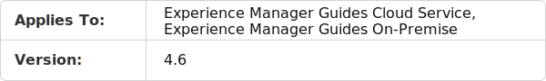

# Rapport sur la réutilisation du contenu {#id205BB900OQD}

Le rapport de réutilisation du contenu est un autre rapport utile que vous pouvez générer. Ce rapport calcule le pourcentage moyen d’utilisation du contenu, ce qui est très utile pour les chefs de projet et les propriétaires d’entreprise qui souhaitent voir la quantité de contenu réutilisée.

>[!TIP]
>
> Pour garantir le bon fonctionnement du rapport de réutilisation du contenu, vous devez activer le workflow de post-traitement. Contactez votre administrateur système pour activer les workflows de post-traitement.

Pour afficher le rapport de réutilisation du contenu, procédez comme suit :

1. Cliquez sur le lien Adobe Experience Manager en haut et choisissez **Outils**.

1. Sélectionnez **Guides** dans la liste des outils.

1. Cliquez sur la mosaïque **Rapport de réutilisation du contenu**.

1. Cliquez sur **Parcourir** pour choisir un chemin d’accès où se trouvent vos rubriques ou saisissez manuellement le chemin d’accès.

   Le rapport est généré en analysant le contenu dans le dossier parent et tous les dossiers enfants.

1. Cliquez sur **Générer le rapport** pour obtenir le rapport de réutilisation du contenu.

   {width="800" align="left"}

   La page du rapport est divisée en deux parties :

   - **Résumé du rapport :**

     Répertorie la réutilisation moyenne du contenu, calculée en tant qu’instances de réutilisation de contenu/nombre total de rubriques. Ce rapport prend en compte toutes les références de contenu direct de premier niveau et les références de rubrique pour le calcul. Les instances de réutilisation de contenu sont calculées comme la somme totale des valeurs du champ Nombre de fois réutilisées . La rubrique la plus largement réutilisée est également répertoriée dans le résumé du rapport. Cliquez sur le lien de la rubrique dans la rubrique la plus réutilisée pour ouvrir l’aperçu de la rubrique.

   - **Détails:**

     La section Détails contient les colonnes suivantes :

      - **Titre** : titre de la rubrique. Clicking on the topic&#39;s title link opens the topic preview.

      - **UUID**: The universally unique identifier \(UUID\) of the file.

      - **Size**: Files size in bytes.

      - **Status**: The current state of the document - Draft, In-Review or Reviewed.

      - **Number of Times Reused**: Number of times the corresponding topic has been reused. This calculated as sum total of entries in Referenced By columns minus 1.

      - **Referenced By**: The topics in which the corresponding topic has been referenced. Here, only the direct \(first level\) references are considered. Multiple topics are separated by comma. The UUID of the referenced file is also mentioned in brackets.Clicking on the topic&#39;s title link opens the topic preview.

>[!NOTE]
>
> You can also export the Content Reuse Report in CSV format. To do so, click the Export to CSV link at the top-left corner of the screen and choose a location to save the CSV file. You can then open this CSV file in any CSV editor.

**Parent topic:**&#x200B;[&#x200B; Reports](reports-intro.md)
