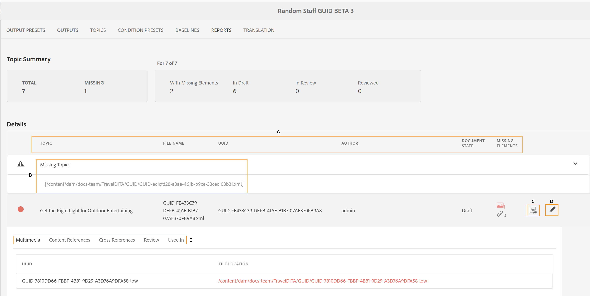
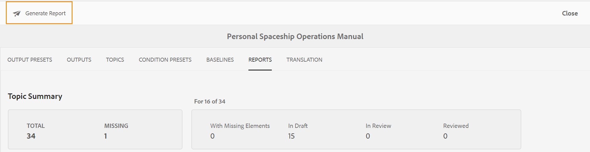
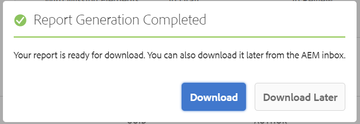

# DITA map report from the map dashboard {#id205BB800EEN}

AEM Guides provides your administrators the reporting capabilities to check the overall integrity of the documentation before it is pushed live or made available to end users. DITA map report from the map dashboard in AEM Guides provides valuable information such as the missing topics, topics with missing elements, UUID of referenced topics and media files,and review status of each topic. A detailed individual topic-level report also provides DITA content-related information such as content references and missing images or cross-references.

>[!NOTE]
>
> AEM Guides refreshes this report on every event that results in a change in your map file or when any reference within your topic file is updated.

Perform the following steps to view the DITA Map Report:

1. In the Assets UI, navigate to and click on the DITA map file for which you want to view the report.

1. Click **Reports**.

   {width="800" align="left"}

   The Reports page is divided into two parts:

   - **Topic Summary:**

     Lists the overall summary of the selected map file. By looking at the Summary, you can quickly know the total number of topics in the map, missing topics, number of topics that have missing elements, topics&#39; state — In Draft, In Review, or Reviewed state.

   - **Détails:**

     When you click on a topic, a detailed report of the selected topic is displayed.

     {width="800" align="left"}

     Items highlighted under **A**, **B**, **C** and **D** are described below:

      - **Topic**: The title of the topic specified in the DITA map. Hovering the mouse pointer over the topic&#39;s title displays the complete path of the topic. If there are issues in the topic, like missing references or images, then a red dot is shown before the topic&#39;s title.

      - **File Name**: Name of the file.

      - **UUID**: The universally unique identifier \(UUID\) of the file.

      - **Author**: User who worked last on this topic.

      - **Document State**: The current state of the document - Draft, In-Review or Reviewed.

      - **Rubriques manquantes \(B\)** : s’il existe des rubriques dont les références sont rompues, elles sont répertoriées sous la liste Rubriques manquantes .

      - **Éléments manquants** : indique le nombre d’images manquantes ou de références croisées rompues, le cas échéant.

      - **Ouvrir dans l’éditeur \(D\)** : cliquez sur cette icône pour ouvrir la rubrique dans l’éditeur web.

   Les éléments mis en surbrillance sous **E** sont décrits ci-dessous :

   - **Multimédia** : le chemin des images utilisées dans la rubrique s’affiche avec son UUID. Si vous cliquez sur le chemin de l’image, l’image correspondante s’ouvre dans une fenêtre pop-up. Les liens d’image rompus sont répertoriés en rouge.

   - **Références de contenu** : le chemin d’accès du contenu référencé dans la rubrique s’affiche avec son UUID. Si vous cliquez sur le titre du contenu référencé, la rubrique correspondante est ouverte en mode Aperçu.

   - **Référence croisée** : le chemin d’accès du contenu référencé s’affiche avec son UUID. Si vous cliquez sur le titre du contenu référencé, la rubrique correspondante est ouverte en mode Aperçu. Les références croisées rompues sont répertoriées en rouge.

   - **Révision** : affiche le statut de la tâche de révision de la rubrique. Vous pouvez voir le statut \(ouvert ou fermé\), la date d’échéance et la personne désignée pour la rubrique en cours de révision. Si vous cliquez sur le lien de la rubrique, celle-ci s’ouvre en mode Révision.

   - **Utilisé dans** : affiche une liste d’autres rubriques ou mappages dans lesquels la rubrique est utilisée. L&#39;UUID de toutes ces rubriques et cartes est également répertorié.

Outre le rapport de chaque rubrique, les administrateurs ont également accès à des informations telles que l&#39;historique de publication d&#39;un plan DITA. Pour plus d&#39;informations sur l&#39;historique des sorties générées, voir [Afficher l&#39;état de la tâche de génération des sorties](generate-output-for-a-dita-map.md#viewing_output_history).

## Générer le CSV du rapport de plan DITA

Vous pouvez télécharger et exporter le fichier CSV d&#39;un rapport DITA map. Le fichier CSV contient le rapport détaillé de plan DITA.

Effectuez les étapes suivantes pour générer le fichier CSV d&#39;un rapport DITA map :

1. Cliquez sur **Générer le rapport** en haut à gauche pour générer le rapport DITA map.

   {width="800" align="left"}

1. Vous recevrez une notification une fois que le rapport sera prêt à être téléchargé. Cliquez sur **Télécharger** pour télécharger le fichier CSV du rapport généré.

   {width="550" align="left"}

   Vous pouvez également télécharger ultérieurement le fichier CSV du rapport généré à partir de la boîte de réception de notifications d’AEM.

   Cliquez sur le rapport généré dans la boîte de réception pour le télécharger.

   {width="300" align="left"}

Une fois le rapport téléchargé dans la boîte de réception, vous pouvez également sélectionner le rapport et utiliser l’icône Ouvrir en haut pour ouvrir le rapport sélectionné.

**Rubrique parente :**&#x200B;[&#x200B; Rapports](reports-intro.md)
