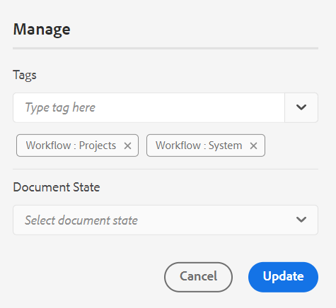
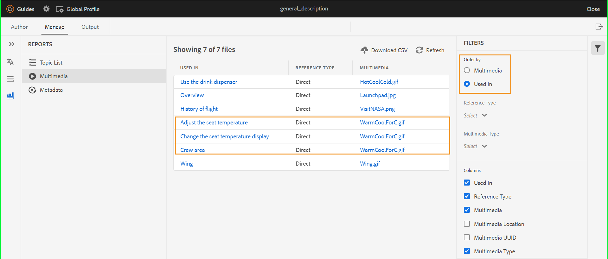

# DITA map report from the Web Editor {#id231HF0Z0NXA}

AEM Guides comes with a feature in the Web Editor that enables you to check the overall integrity of your references and generate reports for them.

You can view the topic list, manage the metadata of all references, and view the multimedia list for the current map from the **Reports** tab in the Web Editor.

## Generate a CSV from the Topic List view

The **Topic List** view provides detailed information about your topics, such as the reference type, document state, and author.

You can create a report of the topics by performing the following steps:

1. In the **Repository** panel, open the DITA map file in Map View.
1. Cliquez sur l’onglet **Gérer**.
1. Double-click **Topic List** on the left. The list of topics present in the DITA map is displayed.

   {width="800" align="left"}

1. From the **Filters** Panel you can filter your topics based on the **Reference type** \(direct or indirect\), **Document State** \(the current state of your topics. For example if your topics are in Edit, In-Review, or Reviewed state, these are listed\) or the **Author** of the topic.

1. You can also use the following topic filtering options to choose to display the following columns in the list:

   - **Topic** The title of the topic is specified in the DITA map. You can click the topic to edit it.
   - **File Name** Name of the file.
   - **UUID** The universally unique identifier \(UUID\) of the file.
   - **File Location** The complete path of the topic.
   - **Reference Type** The type of reference – direct or indirect.
   - **Document State** The current state of the topic.
   - **Author** The user who worked last on the topic.
   - **Parent Map** The list of all maps where the topic is directly referenced.
   >[!NOTE]
   >
   > Click **Refresh** to get a fresh list of topics and view any change in your map file or if any reference within your topic file is updated.

1. Click **Download CSV** to download the current snapshot of the topics in the DITA map. The CSV contains the selected columns and the topics filtered in the **Topic List** view. You can then open this topic list CSV file in any CSV editor.

**Manage metadata in bulk from the Metadata report**

AEM Guides allows you to tag DITA content from the Web editor. You can apply tags on an individual topic or use the bulk tagging feature to apply multiple tags on multiple topics, a DITA map, or on a sub-map. You can also change the document state of all selected topics to the next possible common document state.

## View metadata

To view the metadata of your references in the current DITA map, perform the following steps:

1. Dans le panneau Référentiel, ouvrez le fichier DITA map en mode Carte.
1. Cliquez sur l’onglet **Gérer**.
1. Double-click **Metadata** on the left. The metadata list of all the references in the DITA map is displayed. This includes the media references also.

   {width="800" align="left"}

1. From the **Filters** panel you can filter your topics based on the **Document State** \(the current state of your topics. For example if your topics are in Edit, In-Review, or Reviewed state, these are listed\), **References** \(direct or indirect\), **File Type** \(Map, Topic, and Image\) of the reference.
1. You can also choose to view only the **Files with no tags** or also choose specific tags from the **Tags** filter to view the files associated with them.
   1. You can also use the following topic filtering options to choose to display the following columns in the metadata list:
      - **Title** \(selected by default\) The title of the referenced file is specified in the DITA map. You can click the file to edit it.You can also click and play an audio or video file in the Web Editor. You can change the volume or the view of the video. In the shortcut menu you also have the options to download, change playback speed, or view picture in picture.

        >[!NOTE]
        >
        > A checked-out icon also appears near the title of a checked-out file. Vous pouvez pointer sur l’icône pour afficher le nom de l’utilisateur.

      - **Nom de fichier** Nom du fichier.
      - **Emplacement du fichier** Chemin d’accès complet du fichier.
      - **Balises** \(sélectionné par défaut\) Balises appliquées au fichier.

        >[!NOTE]
        >
        > Par défaut, vous pouvez afficher deux balises pour un fichier. Pour afficher d’autres balises, cliquez sur **Afficher plus**. Cliquez sur **Afficher moins** pour réduire à nouveau la liste.

      - **Type de référence** Type de référence : directe ou indirecte
      - **État du document** \(sélectionné par défaut\) État actuel du fichier de référence.
      - **Type de fichier** \(sélectionné par défaut\) Type du fichier source. Les options disponibles sont Carte, Rubrique et Image.
      - **Extrait par** Utilisateur qui a extrait le fichier.
1. Cliquez sur **Télécharger CSV** pour télécharger l&#39;instantané actuel des références dans le plan DITA. Le fichier CSV contient les colonnes sélectionnées et les références filtrées dans la vue Liste de rubriques. Vous pouvez ensuite ouvrir ce fichier CSV de métadonnées dans n’importe quel éditeur CSV.

**Mise à jour les métadonnées**

1. Pour mettre à jour les métadonnées, sélectionnez les fichiers à mettre à jour.

   >[!NOTE]
   >
   > Vous ne pouvez pas sélectionner de fichiers extraits. Une icône extraite s’affiche également à côté du titre d’un fichier extrait. Vous pouvez pointer sur l’icône pour afficher le nom de l’utilisateur.

1. Sélectionnez **Gérer** dans la partie supérieure.

   {width="350" align="left"}

1. Si vous souhaitez ajouter de nouvelles balises, sélectionnez-les dans la liste déroulante pour les appliquer à toutes les rubriques sélectionnées. Vous pouvez également supprimer une balise en cliquant sur la croix située à proximité de celle-ci.

   >[!NOTE]
   >
   > Les balises courantes appliquées à toutes les rubriques sélectionnées sont répertoriées.

1. Sélectionnez un nouvel état de document si vous souhaitez modifier l&#39;état de document de toutes les références sélectionnées. La liste déroulante affiche l’état commun possible pour toutes les rubriques sélectionnées. Par exemple, si l’état actuel de vos rubriques est En cours de révision, vous pouvez afficher l’état Brouillon, Approuvé ou Révisé.
1. Cliquez sur **Mettre à jour** pour mettre à jour les métadonnées. Un message de confirmation s’affiche pour les métadonnées, indiquant si elles ont été mises à jour avec succès ou si des mises à jour ont échoué. Vous pouvez également cliquer sur **Télécharger le rapport** pour télécharger le fichier CSV de métadonnées à partir de la boîte de dialogue de confirmation. Ce fichier CSV contient les détails du statut de mise à jour des références sélectionnées.

## Générer un rapport multimédia

Le rapport **Multimédia** fournit des informations détaillées sur le contenu multimédia utilisé dans votre carte, telles que le titre, le type \(audio, vidéo et images\), les fichiers dans lesquels le contenu multimédia est utilisé et le type de référence des fichiers dans lesquels il a été utilisé. Vous pouvez également afficher l’UUID et l’emplacement du fichier multimédia dans le référentiel. Vous pouvez créer un rapport multimédia en procédant comme suit :

1. Dans le panneau **Référentiel**, ouvrez le fichier DITA map en mode Carte.
1. Cliquez sur l’onglet **Gérer**.
1. Double-cliquez sur **Multimédia** à gauche. La liste des fichiers multimédias présents dans le plan DITA s&#39;affiche.
1. Dans le panneau **Filtres**, vous pouvez classer la liste par multimédia ou par les noms des éléments utilisés dans les références.

   - Lorsque vous triez par **Multimédia**, le nom **&#x200B;**&#x200B;multimédia est affiché dans la première colonne, puis les noms de toutes les références dans lesquelles ils ont été utilisés sont affichés dans une autre colonne de la même ligne. Par exemple, la capture d’écran suivante montre le fichier multimédia WarmCoolForC.gif dans la première colonne et trois références dans lesquelles il est utilisé sont affichées dans la troisième colonne de la même ligne.

     {width="650" align="left"}

   - Si vous triez par colonne **Utilisé dans**, vous verrez la vue transposée dans laquelle les noms des références dans lesquelles le contenu multimédia a été utilisé sont répertoriés dans la première colonne tandis que les noms du contenu multimédia sont répertoriés dans une autre colonne sur des lignes distinctes. Par exemple, la capture d’écran suivante montre les noms de trois références \(Régler la température du siège, Modifier l’affichage de la température du siège et Zone d’équipage\) dans la première colonne et le fichier multimédia WarmCoolForC.gif s’affiche dans la troisième colonne sur trois lignes distinctes.

     {width="650" align="left"}

1. Vous pouvez filtrer vos fichiers multimédias en fonction des **Type multimédia** et **Type de référence**. La liste des fichiers multimédias s’affiche en fonction de votre choix dans la liste déroulante. Par exemple, vous pouvez choisir d&#39;afficher uniquement les références audio dans votre plan DITA et un fichier affiche uniquement les références audio utilisées.

   >[!NOTE]
   >
   > Selon le type de multimédia utilisé dans votre carte, Image, Vidéo et Audio sont répertoriés dans la liste déroulante **Type de multimédia** et Direct ou Indirect dans la liste déroulante **Type de référence**.

1. Vous pouvez également utiliser les options de filtrage suivantes pour choisir d&#39;afficher les colonnes suivantes dans la liste :

   - **Multimédia** \(sélectionné par défaut\) Le titre du fichier multimédia est spécifié dans le plan DITA. Vous pouvez cliquer sur le fichier multimédia pour le modifier.
   - **Emplacement multimédia** Chemin d’accès complet du fichier multimédia.
   - **UUID multimédia** Identifiant universel unique \(UUID\) du fichier.
   - **Type multimédia** \(sélectionné par défaut\) Type du fichier multimédia. Les options disponibles sont Audio, Vidéo ou Image.
   - **Utilisé dans** \(sélectionné par défaut\) Références dans lesquelles le contenu multimédia a été utilisé. Vous pouvez cliquer sur la référence pour la modifier.
   - **Type de référence** \(sélectionné par défaut\) Le type de référence - direct ou indirect.
   >[!NOTE]
   >
   > Cliquez sur **Actualiser** pour obtenir une nouvelle liste des fichiers multimédias et afficher les modifications apportées à votre fichier de carte ou les fichiers multimédias de votre carte DITA mis à jour.

1. Vous pouvez également cliquer sur un fichier audio ou vidéo et le lire dans l’éditeur web. Vous pouvez modifier le volume ou la vue de la vidéo. Dans le menu contextuel, vous avez également les options pour télécharger, modifier la vitesse de lecture ou afficher une image dans une image.

   {width="800" align="left"}

1. Cliquez sur **Télécharger CSV** pour télécharger l&#39;instantané actuel du multimédia dans le plan DITA. Le fichier CSV contient les colonnes sélectionnées et les fichiers multimédias filtrés dans la vue **Multimédia**. Vous pouvez ensuite ouvrir ce fichier CSV multimédia dans n’importe quel éditeur CSV.

## Affichage et correction des liens rompus{#report-broken-links}

Le **Liens rompus** est un rapport utile qui vous fournit les détails des liens rompus présents dans votre carte actuelle. Vous pouvez afficher les liens rompus, qui peuvent être destinés aux rubriques DITA, aux références de fichiers multimédias, aux références de clés de contenu, etc. Vous avez également la possibilité de les réparer ici même.
Le rapport fournit des informations détaillées telles que le lien rompu, le type de lien, les fichiers dans lesquels la référence est utilisée et le type de fichiers dans lesquels elles ont été utilisées.
Vous pouvez afficher le rapport pour les liens rompus en procédant comme suit :
1. Dans le panneau **Référentiel**, ouvrez le fichier DITA map en mode Carte.
1. Cliquez sur l’onglet **Gérer**.
1. Double-cliquez sur **Liens rompus** sur la gauche. La liste des liens ou références rompus présents dans le plan DITA s&#39;affiche.
1. Dans le panneau **Filtres** vous pouvez classer la liste par liens ou par noms d’utilisateurs dans les références.

   - Lorsque vous triez par **Lien rompu**, les chemins d’accès des liens rompus sont affichés dans la première colonne, puis les noms de toutes les références dans lesquelles ils ont été utilisés sont affichés dans une autre colonne sur des lignes distinctes. Si le même lien rompu est utilisé dans plusieurs fichiers, ils sont affichés sur une ligne et présentés comme regroupés ou sous-lignes. Par exemple, la capture d’écran suivante montre trois liens rompus dans la première colonne et la référence dans laquelle ils sont utilisés, `TestMap.ditamap` s’affiche dans la troisième colonne sur trois lignes distinctes.
   {width="800" align="left"}

   - Si vous triez par colonne **Utilisé dans**, vous verrez la vue transposée dans laquelle les noms des références dans lesquelles les liens rompus ont été utilisés sont répertoriés dans la première colonne tandis que les liens rompus sont répertoriés dans une autre colonne de la même ligne. Par exemple, la capture d’écran suivante montre la référence (dans laquelle le lien rompu est utilisé) `TestMap.ditamap` dans la première colonne et les liens rompus sont affichés dans la troisième colonne de la même ligne.
   {width="800" align="left"}
1. Vous pouvez filtrer les liens rompus en fonction du **Type de fichier** et du **Type de lien**. La liste des liens rompus s’affiche en fonction de votre sélection dans la liste déroulante. Par exemple, vous pouvez choisir d&#39;afficher uniquement les références de contenu dans votre plan DITA et un fichier affiche uniquement les références de contenu utilisées.

   Selon le type de références utilisé dans votre mappage, Référence de fichier, Référence de clé, Référence de contenu, Référence de clé de contenu, Référence d&#39;image et Référence de fichier multimédia sont répertoriées dans la liste déroulante **Type de lien** et **Rubrique DITA** ou **Mappage DITA** sont répertoriées dans la liste déroulante **Type de fichier**.
1. Vous pouvez également utiliser les options de filtrage suivantes pour choisir d&#39;afficher les colonnes suivantes dans la liste :

   - **Lien rompu** (sélectionné par défaut) Le chemin d&#39;accès du lien rompu est spécifié dans le plan DITA.

   - **Type de lien** (sélectionné par défaut) Type des liens. Les options disponibles sont Référence de clé de contenu, Référence de contenu, Rubrique DITA, Référence de fichier, Référence d&#39;image, Référence de clé et Référence de fichier multimédia.

   - **Utilisé dans** (sélectionné par défaut) Références dans lesquelles le lien rompu a été utilisé. Vous pouvez cliquer sur la référence pour l’afficher en mode création.

   - **Type de fichier** (sélectionné par défaut) Type de référence - Plan DITA ou Rubrique DITA.
Cliquez sur **Actualiser** pour obtenir une nouvelle liste des liens rompus et afficher les modifications apportées à votre fichier de mappage ou si un lien rompu dans votre mappage DITA est mis à jour.
1. Vous pouvez cliquer sur l’icône **Corriger le lien** () pour réparer le lien rompu.

   >[!NOTE]
   >
   > Pointez sur le chemin du lien rompu sous la colonne Lien rompu pour afficher l’icône Corriger le lien ().

   Vous pouvez corriger un lien dans les deux vues lorsque vous avez trié par **Liens rompus** ou par **Utilisé dans**.

   >[!NOTE]
   >
   > Lorsque vous corrigez un lien rompu alors que vous l’avez ordonné par Liens rompus, le lien est corrigé dans tous les fichiers dans lesquels il est utilisé (qui sont regroupés dans une seule ligne).

1. Vous devez mettre à jour les détails de référence requis dans la boîte de dialogue **Mettre à jour le lien**. Les détails requis dans la boîte de dialogue **Mettre à jour le lien** dépendent du type de référence.\
   Une fois que vous avez corrigé un lien, il ne s’affiche pas sous la liste des liens rompus. Au lieu de cela, vous pouvez l’afficher sous Liste de rubriques ou Métadonnées.

1. Cliquez sur **Télécharger CSV** pour télécharger l&#39;instantané actuel des liens rompus dans le plan DITA. Le fichier CSV contient les colonnes sélectionnées et les liens rompus filtrés dans la vue Liens rompus . Vous pouvez ensuite ouvrir et afficher ce fichier CSV dans n’importe quel éditeur de fichiers CSV.

**Rubrique parente :**&#x200B;[&#x200B; Rapports](reports-intro.md)
