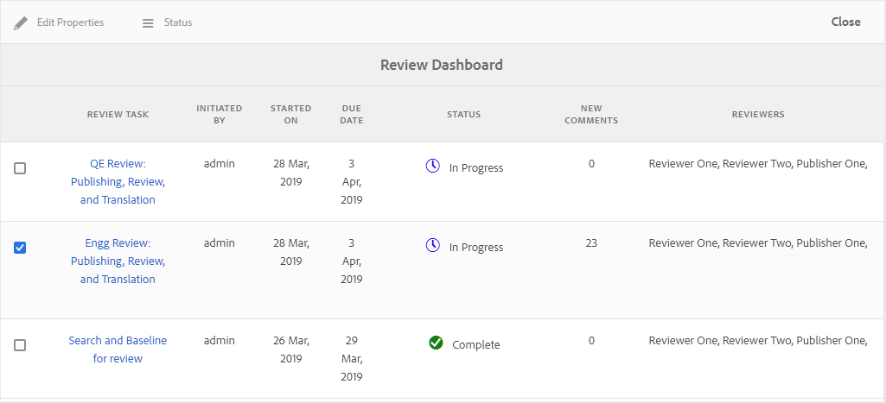
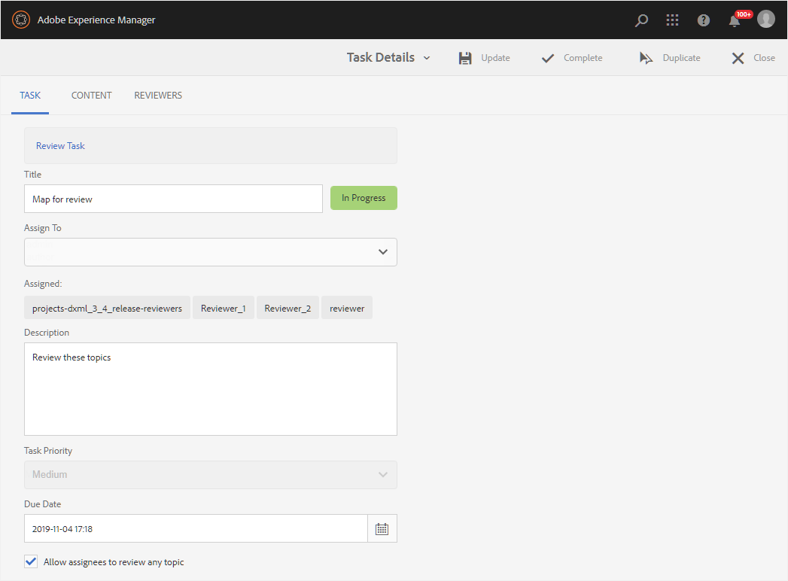

# Gestion des tâches de révision à l’aide du tableau de bord de révision {#id2056B0Y70X4}

Le processus de gestion des révisions peut inclure diverses tâches. Par exemple, vous pouvez ajouter des réviseurs pour une rubrique spécifique ou prolonger le délai d’une révision. Vous pouvez également marquer la tâche de révision comme terminée si vous pensez que toutes les parties prenantes ont fait part de leurs commentaires. Ces tâches peuvent être gérées à l’aide du tableau de bord de révision.

Effectuez les étapes suivantes pour accéder au tableau de bord des révisions et l’utiliser :

>[!NOTE]
>
> Vous pouvez gérer les tâches de révision uniquement pour les projets pour lesquels vous êtes l’auteur \(ou l’initiateur\). Même si vous êtes un réviseur ou un éditeur \(utilisateur\), vous n’avez accès à aucune des tâches du projet.

1. Dans la console **Projets**, cliquez sur le projet de révision à gérer.

   Un panneau Projet avec des mosaïques de tâche s’affiche.

   {width="800" align="left"}

1. Cliquez sur les trois points de la mosaïque **Révisions** .

   Le tableau de bord de révision s’affiche. Le tableau de bord répertorie toutes les tâches de révision que vous avez créées.

   {width="800" align="left"}

   Le tableau de bord des révisions affiche les détails de la tâche de révision, tels que le nom de la tâche, le début de la révision, la date de début de la révision, l’échéance, l’état, le nombre de nouveaux commentaires qui n’ont pas été acceptés ou rejetés par l’auteur et le nom des réviseurs. Les tâches sont répertoriées dans l’ordre des tâches nouvellement créées par rapport aux tâches plus anciennes.

   >[!NOTE]
   >
   > Si vous cliquez sur le lien Tâche de révision , le fichier de rubrique ou de mappage envoyé pour révision est ouvert.

1. Sélectionnez une tâche de révision.

   Les options Modifier les propriétés et [État](#check-review-status-id199RF0A0UHS) s’affichent dans la barre d’outils.

1. Si vous cliquez sur **Modifier les propriétés**, la page Détails de la tâche s’affiche.

   La page Détails de la tâche comporte trois onglets : Tâche, Contenu et Réviseurs. Les sections suivantes décrivent les différentes fonctions disponibles sous chaque onglet.

## Onglet Tâche

{width="800" align="left"}

Vous pouvez effectuer les actions suivantes sous l’onglet **Tâche** :

- Modifiez le titre de la tâche dans le champ **Titre** .
- Ajoutez les personnes désignées par défaut dans la liste déroulante **Attribuer à**. Les réviseurs que vous ajoutez à partir de là ont accès à toutes les rubriques qui font partie de cette tâche de révision. Vous pouvez choisir de supprimer ou d’ajouter de manière sélective d’autres réviseurs à des rubriques spécifiques à partir de l’onglet [Réviseurs](#reviewer-tab-id199RF0N0MUI).
- Mettez à jour la description de la tâche dans le champ **Description**.
- Modifiez la **date d’échéance**. Vous pouvez différer ou retarder la date limite d’achèvement de la tâche.
- Sélectionnez l’option permettant de limiter les utilisateurs à la révision des rubriques qui leur sont affectées.
- Cliquez sur **Mettre à jour** pour mettre à jour les détails modifiés.
- Cliquez sur **Terminé** pour marquer la tâche de révision comme terminée avant la date d’échéance. Lorsque la tâche d’une rubrique individuelle est marquée comme terminée, la révision de la rubrique sélectionnée est fermée. Cependant, dans le cas des rubriques partagées pour révision via un mappage DITA, le fait de marquer la tâche de mappage DITA comme terminée ferme la révision de toutes les rubriques du mappage qui ont été partagées pour révision.
- Cliquez sur **Dupliquer** pour créer une copie de la tâche de révision. Le processus de création d’une tâche de révision en double est similaire à la création d’une nouvelle tâche de révision. Une fois que vous avez lancé le processus de tâche en double, la page Créer une tâche de révision s’affiche. Vous devez fournir les détails de la nouvelle tâche, comme expliqué dans [Envoi de rubriques pour révision](review-send-topics-for-review.md#).

  Si vous avez sélectionné une tâche de révision créée à partir d’un mappage DITA, les rubriques qui sont un expert de la carte s’affichent. Vous pouvez ensuite choisir les rubriques que vous souhaitez inclure dans la nouvelle tâche de révision.

  Si une tâche de révision est dupliquée à partir d’une ou de plusieurs rubriques de révision, seules ces rubriques sont affichées dans la liste des tâches de révision. Vous pouvez choisir de partager ces rubriques pour révision avec un autre ensemble de réviseurs.

- Cliquez sur **Fermer** pour accéder à la page Boîte de réception.

## Onglet Contenu

{width="800" align="left"}

Vous pouvez effectuer les actions suivantes sous l’onglet **Contenu** :

- Modifiez la version de la rubrique envoyée pour révision. Vous pouvez choisir la dernière version de la rubrique, la version à jour, la version avec un libellé spécifique ou la version avec une ligne de base spécifique \(pour un mappage DITA\).

- Cliquez sur **Mettre à jour** pour partager la version mise à jour de la rubrique avec les réviseurs. Les réviseurs reçoivent une notification par e-mail indiquant que la version la plus récente de la rubrique a été envoyée pour révision. La prochaine fois qu’un réviseur ouvre la rubrique, il voit la version mise à jour de la rubrique.

  >[!NOTE]
  >
  > Dans le cas d’une version mise à jour d’une rubrique, les anciens commentaires sont également conservés dans la version la plus récente. Les réviseurs peuvent également voir les différences entre les deux versions.

- Cliquez sur **Terminé** pour marquer la tâche de révision comme terminée avant la date d’échéance. Lorsque la tâche d’une rubrique individuelle est marquée comme terminée, la révision de la rubrique sélectionnée est fermée. Cependant, dans le cas des rubriques partagées pour révision via un mappage DITA, le fait de marquer la tâche de mappage DITA comme terminée ferme la révision de toutes les rubriques du mappage qui ont été partagées pour révision.

- Cliquez sur **Dupliquer** pour créer une tâche de révision à l’aide de la tâche en cours comme base.

## Onglet Réviseurs {#reviewer-tab-id199RF0N0MUI}

{width="800" align="left"}

Vous pouvez effectuer les actions suivantes sous l’onglet **Réviseurs** :

- **Sélectionner tout** : sélectionne toutes les rubriques de la liste des rubriques. Vous pouvez facilement effectuer une opération par lot après avoir sélectionné toutes les rubriques.
- **Effacer la sélection** : supprime les rubriques sélectionnées dans la liste des rubriques.

  >[!NOTE]
  >
  > Vous pouvez également sélectionner ou désélectionner une rubrique individuellement en cochant la case en regard de la rubrique.

- **Ajouter** : affiche la boîte de dialogue Ajouter les réviseurs . Vous pouvez saisir le nom d’un rôle de réviseur ou d’utilisateur \(ou groupe\) que vous souhaitez ajouter en tant que réviseur aux rubriques sélectionnées.
- **Supprimer** : affiche la boîte de dialogue Supprimer les réviseurs . Vous pouvez saisir le nom d’un rôle de réviseur ou d’utilisateur \(ou groupe\) que vous souhaitez supprimer en tant que réviseur des rubriques sélectionnées.
- **Réaffecter** : affiche la boîte de dialogue Réaffecter les réviseurs . Vous pouvez saisir le nom d’un rôle de réviseur ou d’utilisateur \(ou groupe\) auquel vous souhaitez affecter la tâche de révision. Cela supprime tous les réviseurs existants des rubriques sélectionnées et affecte les nouveaux réviseurs à ces rubriques.
- **Export** : permet d’exporter les détails de la tâche de révision dans un fichier CSV. Le fichier contient des détails tels que le chemin et le titre de la rubrique, le nom du réviseur et la version des rubriques envoyées pour révision.
- **Modifier les réviseurs** : lorsque vous cliquez sur l’icône  dans la liste des rubriques, la boîte de dialogue Modifier les réviseurs s’affiche. Vous pouvez ajouter ou supprimer des réviseurs pour la rubrique sélectionnée dans cette boîte de dialogue.

## Vérification de l’état d’une tâche de révision {#check-review-status-id199RF0A0UHS}

Sur la page principale Tableau de bord des révisions , si vous sélectionnez une tâche de révision et cliquez sur **État**, le rapport d’état de la tâche de révision s’affiche :

{width="800" align="left"}

Le rapport d’état de la tâche de révision contient les détails suivants :

- Nom\(s\) du réviseur auquel la tâche de révision est affectée.
- La colonne État indique l’état de révision. L’état peut être l’un des suivants :
   - **Pas commencé** : le réviseur n’a pas encore ouvert le lien de révision.
   - **En cours** : le réviseur a ouvert le lien de révision et est en cours de révision de la rubrique.
   - **Terminé** : le réviseur a terminé la révision en exécutant la tâche de révision qui lui a été affectée. La tâche de révision se trouve dans la boîte de réception de notification AEM pour chaque réviseur.
- Lorsqu’un réviseur ouvre un lien de révision et accède à une rubrique spécifique qui est ajoutée à la liste Rubriques consultées . Cela permet aux auteurs de déterminer si les réviseurs ont ouvert leurs sections respectives ou non. Si des commentaires sont donnés, ils sont indiqués entre parenthèses.
- Nombre total de commentaires sur tous les sujets. Dans le cas de plusieurs rubriques en cours de révision, le nombre de commentaires pour chaque rubrique est indiqué \(entre crochets\) par rapport au nom de la rubrique.
- Date à laquelle le réviseur a accédé à une rubrique pour la dernière fois.

**Rubrique parente :**[ Réviser des rubriques ou des cartes](review.md)
