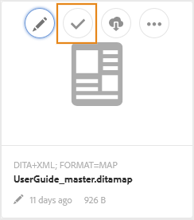

# Envoyer les rubriques à réviser {#id199RD0S035Z}

Le workflow de révision crée un environnement à réviseurs multiples dans lequel l’initiateur spécifie une liste de rubriques à réviser, ajoute plusieurs réviseurs et affecte une chronologie à la tâche de révision. AEM Guides permet aux utilisateurs appartenant aux groupes Auteurs et Éditeurs de lancer une révision.

Comme le workflow de révision est spécifique au projet, l’initiateur de la révision doit faire partie de l’équipe du projet ou disposer des droits pour créer un projet. Au moment de la création d’un projet, vous définissez les membres de l’équipe du projet et leur affectez différents rôles ou groupes. Pour plus d&#39;informations sur les projets, voir [Créer un projet DITA](authoring-create-dita-project.md#).

Vous pouvez créer une tâche de révision à partir de :

- **Éditeur web** : permet d&#39;envoyer une rubrique ou un plan DITA individuel pour révision. Notez que le workflow de création d’une tâche de révision est courant dans l’éditeur web et l’interface utilisateur d’Assets. Seule la méthode de lancement du workflow de révision diffère. Pour plus d’informations sur le lancement du workflow de révision à partir de l’éditeur web, consultez la fonction [Créer une tâche de révision](web-editor-features.md#id215OCJ00JXA) dans l’éditeur web.

- **Interface utilisateur d&#39;Assets** : permet d&#39;envoyer une ou plusieurs rubriques et un plan DITA pour révision. Le partage de documents à réviser à partir du workflow de l’interface utilisateur d’Assets est traité dans cette rubrique.

Dans l’interface utilisateur d’Assets, un auteur/éditeur peut créer une tâche de révision de deux façons :

- Envoyer une ou plusieurs rubriques pour révision
- Envoyer plusieurs rubriques à partir d&#39;un plan DITA pour révision

## Envoyer une ou plusieurs rubriques pour révision {#id1721E600FY4}

>[!IMPORTANT]
>
> Avant de créer une tâche de révision, assurez-vous d’avoir créé un projet et ajouté des réviseurs à ce projet.

Pour créer une tâche de révision et envoyer des rubriques à réviser, procédez comme suit :

>[!NOTE]
>
> Vous ne pouvez créer une tâche de révision que si vous êtes auteur ou éditeur dans un projet DITA.

1. Accédez au dossier requis dans l’interface utilisateur d’Assets.

1. Cliquez sur l’icône Sélectionner dans l’action rapide et sélectionnez les rubriques à envoyer pour révision.

   {width="300" align="left"}

1. In the toolbar, click **Create Review Task**. The review task creation page is displayed.

   >[!NOTE]
   >
   > You can create a review task for only those topics that have a revision. In case the selected topic does not have a revision, you will be shown a prompt.

   {width="650" align="left"}

1. Enter a **Title** for the task and select a DITA **Project** from the drop-down list.

1. In the **Assign To** drop-down field, select the reviewers to whom you want to send the topics for review.

   You can assign a review task to individual users of the project or to user groups. Note that you can assign a review task to individual users only when you are a part of the project&#39;s administrator group, else you will only see the user groups in the Assign To field.

   >[!NOTE]
   >
   > Review workflow is project-specific. When you create projects, you add the team members to the project and assign them to groups. So when you select the project here, you get to choose the members who are a part of that project. Pour plus d&#39;informations sur les projets, voir [Créer un projet DITA](authoring-create-dita-project.md#).

1. Enter a **Description** for the task.

   This description is used as the body of the notification email sent to the reviewers.

1. Select the **Due Date** and time to mark the deadline for the review.

   >[!NOTE]
   >
   > On reaching the deadline, an email is sent to the initiator notifying that the review task has completed. The initiator can extend the deadline of the review task from the [Review Dashboard](review-manage-tasks-review-dashboard.md#).

1. Select the root map from the **Rootmap path**. This rootmap is used to resolve all the key references and glossary terms used in the review content. If you do not select the rootmap then the key references or glossary terms associated with the DITA topic, are not resolved before sending the topic for review.

   If you are creating the review for a DITA map, then by default **Rootmap path** is set to that map&#39;s path. If you are creating the review for a single or multiple topics, then by default the **Rootmap path** is set to the map defined in the User Preferences.

   >[!NOTE]
   >
   > The selected root map takes the highest precedence to resolve key references. For more details, see [Resolve key references](map-editor-other-features.md#id176GD01H05Z).

1. As you can assign different reviewers to different topics, **Allow Assignees to Review Any Topic** option controls whether reviewers can review all topics in a review task or only those topics that they are assigned to review.

   Si vous souhaitez permettre à tous les réviseurs et réviseuses de réviser n’importe quelle rubrique de la tâche de révision, sélectionnez **Autoriser les personnes désignées à réviser n’importe quelle rubrique**.

   Si vous ne sélectionnez pas cette option, les réviseurs ajoutés dans le champ **Affecter à** auront accès à la révision uniquement des rubriques qui leur sont affectées.

1. Cliquez sur **Suivant**.

   La page Contenu s’affiche.

   {width="800" align="left"}

1. Sur la page Contenu, sélectionnez une version de la rubrique que vous souhaitez partager pour révision.

   Vous pouvez utiliser l’une des méthodes suivantes pour sélectionner une version :

   - *\(Par défaut\)* Sélectionnez l’option **Leur dernière version** pour sélectionner la dernière révision enregistrée des rubriques.
   - Sélectionnez l’option **Version activée** et indiquez la date et l’heure auxquelles sélectionner une version en fonction de la date et de l’heure spécifiées. Si aucune version de rubrique n&#39;est disponible à la date spécifiée, une version disponible immédiatement après la date et l&#39;heure spécifiées est sélectionnée.
   - Sélectionnez l’option **Sélectionner un libellé** et sélectionnez un libellé dans la liste déroulante.
1. Après avoir effectué votre sélection pour choisir une version, cliquez sur **Appliquer**.

   La version basée sur l’option sélectionnée est choisie pour les rubriques.

   >[!NOTE]
   >
   > Vous pouvez également sélectionner manuellement la version souhaitée dans la liste déroulante **Version** de chaque rubrique.

1. Cliquez sur **Suivant**.

   La page Réviseurs s’affiche et vous permet d’ajouter ou de supprimer des réviseurs. Par défaut, les réviseurs ajoutés dans le champ Affecter à sont automatiquement ajoutés à chaque rubrique sélectionnée pour la révision.

   {width="650" align="left"}

1. Sur la page Réviseurs, vous pouvez ajouter ou supprimer des réviseurs. Les opérations suivantes sont disponibles sur la page Réviseurs :

   - **Tout sélectionner** : sélectionne toutes les rubriques de la liste des rubriques. Vous pouvez facilement effectuer une opération par lots après avoir sélectionné toutes les rubriques.
   - **Effacer la sélection** : désélectionne les rubriques sélectionnées dans la liste des rubriques.

     >[!NOTE]
     >
     > Vous pouvez également sélectionner ou désélectionner individuellement une rubrique en cliquant sur la case à cocher située en regard de celle-ci.

   - **Ajouter** : affiche la boîte de dialogue Ajouter des réviseurs. Vous pouvez saisir le nom d’un réviseur ou d’un rôle utilisateur \(ou groupe\) que vous souhaitez ajouter en tant que réviseur aux rubriques sélectionnées.
   - **Supprimer** : permet d’afficher la boîte de dialogue Supprimer les réviseurs. Vous pouvez saisir le nom d’un réviseur ou d’un rôle d’utilisateur \(ou d’un groupe\) que vous souhaitez supprimer des rubriques sélectionnées en tant que réviseur.

     >[!NOTE]
     >
     > Vous pouvez également supprimer une révision d&#39;une rubrique en cliquant sur le signe croisé dans la zone du réviseur.

   - **Réaffecter** : affiche la boîte de dialogue Réaffecter les réviseurs. Vous pouvez saisir le nom d’un réviseur ou d’un rôle d’utilisateur \(ou d’un groupe\) auquel vous souhaitez affecter la tâche de révision. Cette action supprime tous les réviseurs existants des rubriques sélectionnées et affecte les nouveaux réviseurs à ces rubriques.
   - **Exporter** : permet d’exporter les détails de la tâche de révision dans un fichier CSV. Le fichier contient des détails tels que le chemin et le titre de la rubrique, le nom du réviseur et la version des rubriques envoyées pour révision.
   - **Modifier les réviseurs** : cliquez sur l’icône dans la liste de rubriques pour afficher la boîte de dialogue Modifier les réviseurs. Vous pouvez ajouter ou supprimer des réviseurs et réviseuses pour la rubrique sélectionnée à partir de cette boîte de dialogue.
1. Cliquez sur **Créer** pour créer la tâche de révision.

   Un message de confirmation s’affiche lorsque la tâche de révision est créée avec succès. Le [état du document](web-editor-document-states.md#) pour les sujets envoyés pour révision est défini sur En cours de révision.

   >[!NOTE]
   >
   > Vous pouvez également cliquer sur Notifications en haut à droite de l’écran et confirmer que la tâche de révision a été créée avec succès. Dans le panneau Notifications , vous trouverez une notification pour chaque réviseur ou réviseuse qui a participé à la tâche de révision et une notification pour l’initiateur de la révision.

Un e-mail est envoyé à tous les réviseurs et réviseuses pour les informer qu’une ou plusieurs rubriques leur ont été affectées pour la révision. L’e-mail contient un lien direct sur lequel ils peuvent cliquer et accéder à la rubrique dans une fenêtre de navigateur.

Si plusieurs rubriques sont affectées, les réviseurs et réviseuses peuvent les afficher et les sélectionner dans une liste déroulante de rubriques dans le navigateur web.

## Envoyer plusieurs rubriques à réviser à partir d&#39;un plan DITA

Un plan DITA est une organisation logique de rubriques dans un livre. Lorsque vous envoyez une rubrique individuelle pour révision, le réviseur n’obtient aucune information sur l’emplacement de cette rubrique dans le livre. Si le réviseur ou la réviseuse dispose d’informations sur le lieu exact de la rubrique en cours de révision, il ou elle obtient un meilleur contexte pour la rubrique en cours de révision.

AEM Guides vous permet d&#39;envoyer une ou plusieurs rubriques d&#39;un plan DITA pour révision en même temps. Le réviseur peut voir le fichier de mappage complet ainsi que les rubriques qui ont été partagées pour la révision. Cela permet au réviseur ou à la réviseuse d’obtenir plus facilement un contexte pour la rubrique dans le fichier de carte ou de livre.

Vous pouvez partager le même plan DITA dans pour révision dans plusieurs tâches de révision. Par exemple, si dans un plan DITA, il existe des rubriques A, B, C, D et E. Dans une tâche de révision, vous pouvez partager A, B et C pour révision et dans une autre tâche de révision, vous pouvez envoyer les rubriques C, D et E pour révision. Le processus de révision permet de partager la même rubrique et de mapper le fichier dans plusieurs tâches de révision. For the common topic in multiple review tasks, the comments given in one review task do not overwrite or merge with the comments in the other review tasks.

>[!IMPORTANT]
>
> In case a topic of a map file has been shared in multiple review tasks, their status would show In-Review until all review tasks have completed.

To send one or multiple topics along with the map file for review, perform the following steps:

>[!IMPORTANT]
>
> Once you initiate a review through a map file, you must not change the structure of the map file by adding new topics or removing existing topics.

1. Accédez au dossier requis dans l’interface utilisateur d’Assets.

   >[!NOTE]
   >
   > Make sure the view of the console is set to either card view or list view.

1. Select the map from where you want to send the topics for review.

1. In the toolbar, click **Create Review Task**. The review task creation page is displayed.

1. Enter a **Title** for the task and select a DITA **Project** from the drop-down list.

   >[!NOTE]
   >
   > You can create a review task for only those topics that have a revision. In case your map contains topics that do not have a revision, then you are shown a prompt with a list of such files. Files without a revision are excluded from the review task.

1. In the **Assign To** drop-down field, select the reviewers to whom you want to send the topics for review.

   You can assign a review task to individual users of the project or to user groups. Note that you can assign a review task to individual users only when you are a part of the project&#39;s administrator group, else you will only see the user groups in the Assign To field.

   >[!NOTE]
   >
   > Review workflow is project specific. When you create projects, you add the team members to the project and assign them to groups. So when you select the project here, you get to choose the members who are a part of that project. Pour plus d&#39;informations sur les projets, voir [Créer un projet DITA](authoring-create-dita-project.md#).

1. Enter a **Description** for the task.

   This description is used as the body of the notification email sent to the reviewers.

1. Select the **Due Date** and time to mark the deadline for the review.

   >[!NOTE]
   >
   > On reaching the deadline, an email is sent to the initiator notifying that the review task has completed. The initiator can extend the deadline of the review task from the [Review Dashboard](review-manage-tasks-review-dashboard.md#).

1. Comme vous pouvez affecter différents réviseurs à différentes rubriques, l&#39;option **Autoriser les personnes désignées à réviser n&#39;importe quelle rubrique** contrôle si les réviseurs peuvent réviser toutes les rubriques d&#39;une tâche de révision ou uniquement les rubriques qui leur sont affectées.

   Si vous souhaitez permettre à tous les réviseurs et réviseuses de réviser n’importe quelle rubrique de la tâche de révision, sélectionnez **Autoriser les personnes désignées à réviser n’importe quelle rubrique**.

   Si vous ne sélectionnez pas cette option, les réviseurs ajoutés dans le champ **Affecter à** auront accès à la révision uniquement des rubriques qui leur sont affectées.

1. Cliquez sur **Suivant**.

   La page Contenu s’affiche avec toutes les rubriques référencées à partir du fichier de mappage. Si votre plan DITA contient des plans imbriqués, les rubriques des plans imbriqués sont également répertoriées ici.

   {width="800" align="left"}

1. Sur la page Contenu, sélectionnez une version de la rubrique que vous souhaitez partager pour révision.

   Vous pouvez utiliser l’une des méthodes suivantes pour sélectionner une version :

   - *\(Par défaut\)* Sélectionnez l’option **Leur dernière version** pour sélectionner la dernière révision enregistrée des rubriques.
   - Sélectionnez l’option **Version activée** et indiquez la date et l’heure afin de sélectionner une version en fonction de la date et de l’heure. Si aucune version de rubrique n&#39;est disponible à la date spécifiée, une version disponible immédiatement après la date et l&#39;heure spécifiées est sélectionnée.
   - Sélectionnez l’option **Sélectionner un libellé** et sélectionnez un libellé dans la liste déroulante. Toutes les rubriques contenant le libellé sélectionné sont sélectionnées dans la liste déroulante **Version**.
   - Choisissez l&#39;option **Sélectionner une ligne de base** et sélectionnez une ligne de base dans la liste déroulante. Toutes les versions de rubrique faisant partie de la ligne de base sélectionnée sont sélectionnées dans la liste déroulante **Version**.
1. Après avoir effectué votre sélection pour choisir une version, cliquez sur **Appliquer**.

   La version basée sur l’option sélectionnée est choisie pour les rubriques.

   >[!NOTE]
   >
   > Vous pouvez également sélectionner manuellement la version souhaitée dans la liste déroulante **Version** de chaque rubrique.

1. Cliquez sur **Suivant**.

   La page Réviseurs s’affiche et vous permet d’ajouter ou de supprimer des réviseurs. Par défaut, les réviseurs ajoutés dans le champ Affecter à sont automatiquement ajoutés à chaque rubrique sélectionnée pour la révision.

1. Sur la page Réviseurs, vous pouvez ajouter ou supprimer des réviseurs. Les opérations suivantes sont disponibles sur la page Réviseurs :

   - **Tout sélectionner** : sélectionne toutes les rubriques de la liste des rubriques. Vous pouvez facilement effectuer une opération par lots après avoir sélectionné toutes les rubriques.
   - **Effacer la sélection** : désélectionne les rubriques sélectionnées dans la liste des rubriques.

     >[!NOTE]
     >
     > Vous pouvez également sélectionner ou désélectionner individuellement une rubrique en cliquant sur la case à cocher située en regard de celle-ci.

   - **Ajouter** : affiche la boîte de dialogue Ajouter des réviseurs. Vous pouvez saisir le nom d’un réviseur ou d’un rôle utilisateur \(ou groupe\) que vous souhaitez ajouter en tant que réviseur aux rubriques sélectionnées.
   - **Supprimer** : permet d’afficher la boîte de dialogue Supprimer les réviseurs. Vous pouvez saisir le nom d’un réviseur ou d’un rôle d’utilisateur \(ou d’un groupe\) que vous souhaitez supprimer des rubriques sélectionnées en tant que réviseur.
   - **Réaffecter** : affiche la boîte de dialogue Réaffecter les réviseurs. Vous pouvez saisir le nom d’un réviseur ou d’un rôle d’utilisateur \(ou d’un groupe\) auquel vous souhaitez affecter la tâche de révision. Cette action supprime tous les réviseurs existants des rubriques sélectionnées et affecte les nouveaux réviseurs à ces rubriques.
   - **Exporter** : permet d’exporter les détails de la tâche de révision dans un fichier CSV. Le fichier contient des détails tels que le chemin et le titre de la rubrique, le nom du réviseur et la version des rubriques envoyées pour révision.
   - **Modifier les réviseurs** : cliquez sur l’icône dans la liste de rubriques pour afficher la boîte de dialogue Modifier les réviseurs. Vous pouvez ajouter ou supprimer des réviseurs et réviseuses pour la rubrique sélectionnée à partir de cette boîte de dialogue.
   >[!IMPORTANT]
   >
   > You must assign at least one reviewer to create the review task.

1. Cliquez sur **Créer** pour créer la tâche de révision.

   Un message de confirmation s’affiche lorsque la tâche de révision est créée avec succès. Le [état du document](web-editor-document-states.md#) pour les sujets envoyés pour révision est défini sur En cours de révision.

   >[!NOTE]
   >
   > You can also click Notifications panel at the top right of the interface and confirm that the task has been created successfully. In the Notifications panel, you will find one notification each for the reviews who were a part of the review task and one notification for the initiator of the review.

   >[!IMPORTANT]
   >
   > Once you have initiated a review, you must not move or delete the DITA map or topics to a different location. Doing so will result in a break in the review process.

An email is sent to all the reviewers, notifying that they have been assigned topics for review. L’e-mail contient un lien direct sur lequel ils peuvent cliquer et accéder à la rubrique dans une fenêtre de navigateur. The topics along with the DITA map are opened in the review mode.

**Rubrique parente :**&#x200B;[&#x200B; consulter des rubriques ou des cartes](review.md)
