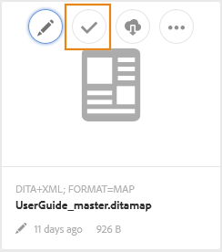

# Envoi de rubriques en révision {#id199RD0S035Z}

Le workflow de révision crée un environnement de réviseurs multiples dans lequel l’initiateur spécifie une liste de rubriques à réviser, ajoute plusieurs réviseurs et affecte une chronologie à la tâche de révision. AEM Guides permet aux utilisateurs appartenant aux groupes Auteurs et Éditeurs de lancer une révision.

Comme le processus de révision est spécifique au projet, l’initiateur de la révision doit faire partie de l’équipe du projet ou avoir les droits de créer un projet. Au moment de la création d’un projet, vous définissez les membres de l’équipe du projet et leur affectez différents rôles ou groupes. Pour plus d’informations sur les projets, voir [Création d’un projet DITA](authoring-create-dita-project.md#).

Vous pouvez créer une tâche de révision à partir de :

- **Éditeur web** : vous permet d’envoyer une rubrique ou un mappage DITA individuel pour révision. Notez que le processus de création d’une tâche de révision est courant dans l’éditeur web et l’interface utilisateur d’Assets. Seule la méthode de lancement du workflow de révision diffère. Pour plus d’informations sur le lancement du processus de révision à partir de l’éditeur web, voir la fonction [Créer une tâche de révision](web-editor-features.md#id215OCJ00JXA) dans l’éditeur web.

- **Interface utilisateur d’Assets** : vous permet d’envoyer une ou plusieurs rubriques et mappage DITA à des fins de révision. Le partage de documents à réviser à partir du workflow de l’interface utilisateur d’Assets est traité dans cette rubrique.

Dans l’interface utilisateur d’Assets, il existe deux façons dont un auteur/éditeur peut créer une tâche de révision :

- Envoi d’une ou de plusieurs rubriques pour révision
- Envoi de plusieurs rubriques à partir d’un mappage DITA pour révision

## Envoi d’une ou de plusieurs rubriques pour révision {#id1721E600FY4}

>[!IMPORTANT]
>
> Avant de créer une tâche de révision, vérifiez que vous avez créé un projet et ajouté des réviseurs à ce projet.

Pour créer une tâche de révision et envoyer des rubriques à des fins de révision, procédez comme suit :

>[!NOTE]
>
> Vous ne pouvez créer une tâche de révision que si vous êtes un auteur ou un éditeur dans un projet DITA.

1. Accédez au dossier requis dans l’interface utilisateur d’Assets.

1. Cliquez sur l’icône Sélectionner dans l’action rapide et sélectionnez les rubriques que vous souhaitez envoyer pour révision.

   {width="300" align="left"}

1. Dans la barre d’outils, cliquez sur **Créer une tâche de révision**. La page de création de la tâche de révision s’affiche.

   >[!NOTE]
   >
   > Vous pouvez créer une tâche de révision uniquement pour les rubriques qui comportent une révision. Si la rubrique sélectionnée ne comporte pas de révision, une invite s’affiche.

   {width="650" align="left"}

1. Saisissez un **titre** pour la tâche et sélectionnez un projet DITA **Project** dans la liste déroulante.

1. Dans le champ déroulant **Attribuer à** , sélectionnez les réviseurs auxquels vous souhaitez envoyer les rubriques à réviser.

   Vous pouvez affecter une tâche de révision à des utilisateurs individuels du projet ou à des groupes d’utilisateurs. Notez que vous ne pouvez affecter une tâche de révision qu’à des utilisateurs individuels lorsque vous faites partie du groupe d’administrateurs du projet. Dans le cas contraire, seuls les groupes d’utilisateurs seront affichés dans le champ Affecter à .

   >[!NOTE]
   >
   > Le processus de révision est spécifique au projet. Lorsque vous créez des projets, vous ajoutez les membres de l’équipe au projet et les affectez à des groupes. Donc quand vous sélectionnez le projet ici, vous pouvez choisir les membres qui font partie de ce projet. Pour plus d’informations sur les projets, voir [Création d’un projet DITA](authoring-create-dita-project.md#).

1. Saisissez une **Description** pour la tâche.

   Cette description est utilisée comme corps de l&#39;email de notification envoyé aux opérateurs validants.

1. Sélectionnez la **Date d’échéance** et l’heure de la date d’échéance de la révision.

   >[!NOTE]
   >
   > Lorsque vous atteignez l’échéance, un email est envoyé à l’initiateur pour l’informer que la tâche de révision est terminée. L’initiateur peut prolonger l’échéance de la tâche de révision à partir du [tableau de bord de révision](review-manage-tasks-review-dashboard.md#).

1. Sélectionnez la carte racine dans le **chemin d’accès Rootmap**. Cette feuille de route est utilisée pour résoudre toutes les références clés et tous les termes du glossaire utilisés dans le contenu de la révision. Si vous ne sélectionnez pas la feuille de route, les références ou les termes de glossaire clés associés à la rubrique DITA ne sont pas résolus avant d’envoyer la rubrique pour révision.

   Si vous créez la révision d’un mappage DITA, le **chemin Rootmap** est défini par défaut sur le chemin de ce mappage. Si vous créez la révision pour une ou plusieurs rubriques, le **chemin Rootmap** est défini par défaut sur la carte définie dans les préférences utilisateur.

   >[!NOTE]
   >
   > La carte racine sélectionnée a la priorité la plus élevée pour résoudre les références clés. Pour plus d’informations, voir [Résoudre les références de clé](map-editor-other-features.md#id176GD01H05Z).

1. Comme vous pouvez affecter différents réviseurs à différentes rubriques, l’option **Autoriser les personnes à examiner n’importe quelle rubrique** contrôle si les réviseurs peuvent consulter toutes les rubriques d’une tâche de révision ou uniquement les rubriques qu’ils sont chargés de réviser.

   Si vous souhaitez autoriser tous les réviseurs à passer en revue une rubrique de la tâche de révision, sélectionnez **Autoriser les personnes à affecter à la révision de n’importe quelle rubrique**.

   Si vous ne sélectionnez pas cette option, les réviseurs ajoutés dans le champ **Attribuer à** auront accès à la révision uniquement des rubriques qui leur sont affectées.

1. Cliquez sur **Suivant**.

   La page Contenu s’affiche.

   {width="800" align="left"}

1. Sur la page Contenu, sélectionnez une version de la rubrique que vous souhaitez partager en vue de la révision.

   Vous pouvez utiliser l’une des méthodes suivantes pour sélectionner une version :

   - *\(Par défaut\)* Sélectionnez l’option **Leur dernière version** pour sélectionner la dernière révision enregistrée des rubriques.
   - Choisissez l’option **Version On** et spécifiez la date et l’heure de sélection d’une version à la date et l’heure spécifiées. Si aucune version de la rubrique n’est disponible à la date spécifiée, une version est disponible immédiatement après la date et l’heure spécifiées.
   - Choisissez l&#39;option **Sélectionner un libellé** et sélectionnez un libellé dans la liste déroulante.
1. Après avoir effectué votre sélection pour choisir une version, cliquez sur **Appliquer**.

   La version basée sur l’option sélectionnée est sélectionnée pour les rubriques.

   >[!NOTE]
   >
   > Vous pouvez également sélectionner manuellement la version souhaitée dans la liste déroulante **Version** de chaque rubrique.

1. Cliquez sur **Suivant**.

   La page Réviseurs s’affiche, dans laquelle vous pouvez ajouter ou supprimer des réviseurs. Par défaut, les réviseurs ajoutés dans le champ Attribuer à sont automatiquement ajoutés à chaque rubrique sélectionnée pour la révision.

   {width="650" align="left"}

1. Sur la page Réviseurs , vous pouvez ajouter ou supprimer des réviseurs. Les opérations suivantes sont disponibles sur la page Réviseurs :

   - **Sélectionner tout** : sélectionne toutes les rubriques de la liste des rubriques. Vous pouvez facilement effectuer une opération par lot après avoir sélectionné toutes les rubriques.
   - **Effacer la sélection** : supprime les rubriques sélectionnées dans la liste des rubriques.

     >[!NOTE]
     >
     > Vous pouvez également sélectionner ou désélectionner une rubrique individuellement en cochant la case en regard de la rubrique.

   - **Ajouter** : affiche la boîte de dialogue Ajouter les réviseurs . Vous pouvez saisir le nom d’un rôle de réviseur ou d’utilisateur \(ou groupe\) que vous souhaitez ajouter en tant que réviseur aux rubriques sélectionnées.
   - **Supprimer** : affiche la boîte de dialogue Supprimer les réviseurs . Vous pouvez saisir le nom d’un rôle de réviseur ou d’utilisateur \(ou groupe\) que vous souhaitez supprimer en tant que réviseur des rubriques sélectionnées.

     >[!NOTE]
     >
     > Vous pouvez également supprimer une révision d’une rubrique en cliquant sur le signe croisé dans la zone du réviseur.

   - **Réaffecter** : affiche la boîte de dialogue Réaffecter les réviseurs . Vous pouvez saisir le nom d’un rôle de réviseur ou d’utilisateur \(ou groupe\) auquel vous souhaitez affecter la tâche de révision. Cela supprime tous les réviseurs existants des rubriques sélectionnées et affecte les nouveaux réviseurs à ces rubriques.
   - **Export** : permet d’exporter les détails de la tâche de révision dans un fichier CSV. Le fichier contient des détails tels que le chemin et le titre de la rubrique, le nom du réviseur et la version des rubriques envoyées pour révision.
   - **Modifier les réviseurs** : lorsque vous cliquez sur l’icône  dans la liste des rubriques, la boîte de dialogue Modifier les réviseurs s’affiche. Vous pouvez ajouter ou supprimer des réviseurs pour la rubrique sélectionnée dans cette boîte de dialogue.
1. Cliquez sur **Créer** pour créer la tâche de révision.

   Un message de confirmation s’affiche lorsque la tâche de révision est créée avec succès. L’ [état du document](web-editor-document-states.md#) pour les rubriques envoyées pour révision est défini sur In-Review.

   >[!NOTE]
   >
   > Vous pouvez également cliquer sur la cloche Notifications en haut à droite de l’écran et confirmer que la tâche de révision a bien été créée. Dans le panneau Notifications, vous trouverez une notification pour chaque réviseur qui faisait partie de la tâche de révision et une notification pour l’initiateur de la révision.

Un courrier électronique est envoyé à tous les réviseurs, leur indiquant qu’un ou plusieurs sujets leur ont été attribués pour révision. L’email contient un lien direct sur lequel ils peuvent cliquer et accéder au sujet dans une fenêtre de navigateur.

Si plusieurs rubriques sont affectées, les réviseurs peuvent les afficher et les sélectionner dans une liste déroulante de rubriques dans le navigateur web.

## Envoi de plusieurs rubriques pour révision à partir d’un mappage DITA

Une carte DITA est une organisation logique de rubriques dans un livre. Lorsque vous envoyez une rubrique individuelle pour révision, le réviseur n’obtient aucune information sur l’emplacement de cette rubrique dans le livre. Si un réviseur dispose d’informations sur l’emplacement exact de la rubrique en cours de révision, il obtient un meilleur contexte de la rubrique en cours de révision.

AEM Guides vous permet d’envoyer simultanément une ou plusieurs rubriques dans un mappage DITA en vue de leur révision. Le réviseur peut voir le fichier de mappage complet ainsi que les rubriques qui ont été partagées pour révision. Cela permet au réviseur d’obtenir plus facilement un contexte de rubrique dans le mappage ou le fichier de livre.

Vous pouvez partager le même mappage DITA dans pour révision dans plusieurs tâches de révision. Par exemple, si dans un mappage DITA, il y a les rubriques A, B, C, D et E. Dans une tâche de révision, vous pouvez partager A, B et C pour révision, et dans une autre tâche de révision, vous pouvez envoyer les rubriques C, D et E pour révision. Le processus de révision permet de partager la même rubrique et le même fichier de mappage dans plusieurs tâches de révision. Pour la rubrique courante dans plusieurs tâches de révision, les commentaires fournis dans une tâche de révision ne remplacent ni ne fusionnent les commentaires des autres tâches de révision.

>[!IMPORTANT]
>
> Si une rubrique d’un fichier de mappage a été partagée dans plusieurs tâches de révision, leur état s’affiche en révision jusqu’à ce que toutes les tâches de révision soient terminées.

Pour envoyer une ou plusieurs rubriques avec le fichier de mappage à des fins de révision, procédez comme suit :

>[!IMPORTANT]
>
> Une fois que vous avez lancé une révision via un fichier de mappage, vous ne devez pas modifier la structure du fichier de mappage en ajoutant de nouvelles rubriques ou en supprimant des rubriques existantes.

1. Accédez au dossier requis dans l’interface utilisateur d’Assets.

   >[!NOTE]
   >
   > Assurez-vous que l’affichage de la console est défini sur le mode Carte ou Liste.

1. Sélectionnez le mappage à partir duquel vous souhaitez envoyer les rubriques pour révision.

1. Dans la barre d’outils, cliquez sur **Créer une tâche de révision**. La page de création de la tâche de révision s’affiche.

1. Saisissez un **titre** pour la tâche et sélectionnez un projet DITA **Project** dans la liste déroulante.

   >[!NOTE]
   >
   > Vous pouvez créer une tâche de révision uniquement pour les rubriques qui comportent une révision. Si votre carte contient des rubriques qui n’ont pas de révision, une invite s’affiche avec une liste de ces fichiers. Les fichiers sans révision sont exclus de la tâche de révision.

1. Dans le champ déroulant **Attribuer à** , sélectionnez les réviseurs auxquels vous souhaitez envoyer les rubriques à réviser.

   Vous pouvez affecter une tâche de révision à des utilisateurs individuels du projet ou à des groupes d’utilisateurs. Notez que vous ne pouvez affecter une tâche de révision qu’à des utilisateurs individuels lorsque vous faites partie du groupe d’administrateurs du projet. Dans le cas contraire, seuls les groupes d’utilisateurs seront affichés dans le champ Affecter à .

   >[!NOTE]
   >
   > Le processus de révision est spécifique au projet. Lorsque vous créez des projets, vous ajoutez les membres de l’équipe au projet et les affectez à des groupes. Donc quand vous sélectionnez le projet ici, vous pouvez choisir les membres qui font partie de ce projet. Pour plus d’informations sur les projets, voir [Création d’un projet DITA](authoring-create-dita-project.md#).

1. Saisissez une **Description** pour la tâche.

   Cette description est utilisée comme corps de l&#39;email de notification envoyé aux opérateurs validants.

1. Sélectionnez la **Date d’échéance** et l’heure de la date d’échéance de la révision.

   >[!NOTE]
   >
   > Lorsque vous atteignez l’échéance, un email est envoyé à l’initiateur pour l’informer que la tâche de révision est terminée. L’initiateur peut prolonger l’échéance de la tâche de révision à partir du [tableau de bord de révision](review-manage-tasks-review-dashboard.md#).

1. Comme vous pouvez affecter différents réviseurs à différentes rubriques, l’option **Autoriser les personnes à examiner n’importe quelle rubrique** contrôle si les réviseurs peuvent consulter toutes les rubriques d’une tâche de révision ou uniquement les rubriques qu’ils sont chargés de réviser.

   Si vous souhaitez autoriser tous les réviseurs à passer en revue une rubrique de la tâche de révision, sélectionnez **Autoriser les personnes à affecter à la révision de n’importe quelle rubrique**.

   Si vous ne sélectionnez pas cette option, les réviseurs ajoutés dans le champ **Attribuer à** auront accès à la révision uniquement des rubriques qui leur sont affectées.

1. Cliquez sur **Suivant**.

   La page Contenu s’affiche avec toutes les rubriques référencées à partir du fichier de mappage. Si votre mappage DITA contient des mappages imbriqués, les rubriques des mappages imbriqués sont également répertoriées ici.

   {width="800" align="left"}

1. Sur la page Contenu, sélectionnez une version de la rubrique que vous souhaitez partager en vue de la révision.

   Vous pouvez utiliser l’une des méthodes suivantes pour sélectionner une version :

   - *\(Par défaut\)* Sélectionnez l’option **Leur dernière version** pour sélectionner la dernière révision enregistrée des rubriques.
   - Choisissez l’option **Version On** et indiquez la date et l’heure de sélection d’une version en fonction de la date et de l’heure. Si aucune version de la rubrique n’est disponible à la date spécifiée, une version est disponible immédiatement après la date et l’heure spécifiées.
   - Choisissez l&#39;option **Sélectionner un libellé** et sélectionnez un libellé dans la liste déroulante. Toutes les rubriques contenant le libellé sélectionné sont sélectionnées dans la liste déroulante **Version** .
   - Choisissez l’option **Sélectionner une ligne de base** et sélectionnez une ligne de base dans la liste déroulante. Toutes les versions de rubrique qui font partie de la ligne de base sélectionnée sont sélectionnées dans la liste déroulante **Version** .
1. Après avoir effectué votre sélection pour choisir une version, cliquez sur **Appliquer**.

   La version basée sur l’option sélectionnée est sélectionnée pour les rubriques.

   >[!NOTE]
   >
   > Vous pouvez également sélectionner manuellement la version souhaitée dans la liste déroulante **Version** de chaque rubrique.

1. Cliquez sur **Suivant**.

   La page Réviseurs s’affiche, dans laquelle vous pouvez ajouter ou supprimer des réviseurs. Par défaut, les réviseurs ajoutés dans le champ Attribuer à sont automatiquement ajoutés à chaque rubrique sélectionnée pour la révision.

1. Sur la page Réviseurs , vous pouvez ajouter ou supprimer des réviseurs. Les opérations suivantes sont disponibles sur la page Réviseurs :

   - **Sélectionner tout** : sélectionne toutes les rubriques de la liste des rubriques. Vous pouvez facilement effectuer une opération par lot après avoir sélectionné toutes les rubriques.
   - **Effacer la sélection** : supprime les rubriques sélectionnées dans la liste des rubriques.

     >[!NOTE]
     >
     > Vous pouvez également sélectionner ou désélectionner une rubrique individuellement en cochant la case en regard de la rubrique.

   - **Ajouter** : affiche la boîte de dialogue Ajouter les réviseurs . Vous pouvez saisir le nom d’un rôle de réviseur ou d’utilisateur \(ou groupe\) que vous souhaitez ajouter en tant que réviseur aux rubriques sélectionnées.
   - **Supprimer** : affiche la boîte de dialogue Supprimer les réviseurs . Vous pouvez saisir le nom d’un rôle de réviseur ou d’utilisateur \(ou groupe\) que vous souhaitez supprimer en tant que réviseur des rubriques sélectionnées.
   - **Réaffecter** : affiche la boîte de dialogue Réaffecter les réviseurs . Vous pouvez saisir le nom d’un rôle de réviseur ou d’utilisateur \(ou groupe\) auquel vous souhaitez affecter la tâche de révision. Cela supprime tous les réviseurs existants des rubriques sélectionnées et affecte les nouveaux réviseurs à ces rubriques.
   - **Export** : permet d’exporter les détails de la tâche de révision dans un fichier CSV. Le fichier contient des détails tels que le chemin et le titre de la rubrique, le nom du réviseur et la version des rubriques envoyées pour révision.
   - **Modifier les réviseurs** : lorsque vous cliquez sur l’icône  dans la liste des rubriques, la boîte de dialogue Modifier les réviseurs s’affiche. Vous pouvez ajouter ou supprimer des réviseurs pour la rubrique sélectionnée dans cette boîte de dialogue.
   >[!IMPORTANT]
   >
   > Vous devez affecter au moins un réviseur pour créer la tâche de révision.

1. Cliquez sur **Créer** pour créer la tâche de révision.

   Un message de confirmation s’affiche lorsque la tâche de révision est créée avec succès. L’ [état du document](web-editor-document-states.md#) pour les rubriques envoyées pour révision est défini sur In-Review.

   >[!NOTE]
   >
   > Vous pouvez également cliquer sur le panneau Notifications en haut à droite de l’interface et confirmer que la tâche a bien été créée. Dans le panneau Notifications, vous trouverez une notification pour chaque révision qui faisait partie de la tâche de révision et une notification pour l’initiateur de la révision.

   >[!IMPORTANT]
   >
   > Une fois que vous avez lancé une révision, vous ne devez pas déplacer ni supprimer le mappage DITA ou les rubriques vers un autre emplacement. Ce faisant, le processus de révision sera interrompu.

Un email est envoyé à tous les réviseurs, leur indiquant que des rubriques leur ont été affectées pour révision. L’email contient un lien direct sur lequel ils peuvent cliquer et accéder au sujet dans une fenêtre de navigateur. Les rubriques ainsi que le mappage DITA sont ouverts en mode de révision.

**Rubrique parente :**[ Réviser des rubriques ou des cartes](review.md)
