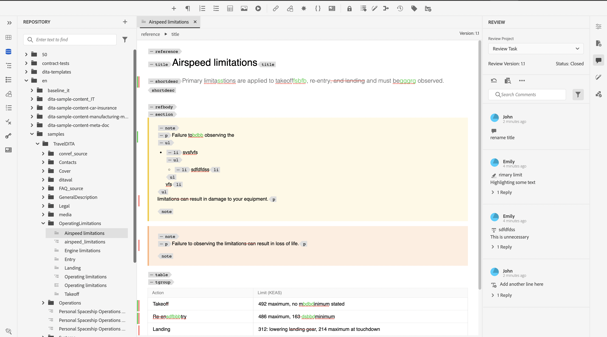

# Afficher une tâche de révision terminée

Vous pouvez effectuer des tâches de révision pour les projets dont vous êtes l’auteur (ou l’initiateur). Une fois qu’une tâche de révision est terminée, vous et tous les réviseurs pouvez y accéder en mode lecture seule.

## En tant que réviseur/réviseuse

En tant que réviseur ou réviseuse, vous pouvez voir un indicateur dans le panneau des commentaires pour indiquer que la révision est terminée. La barre d’outils des commentaires n’est pas affichée. Vous ne pouvez donc pas mettre en surbrillance, barrer, insérer du texte ou ajouter des commentaires. Vous pouvez lire un commentaire, mais ne pouvez ni en modifier ni en supprimer. Vous ne pouvez pas non plus ajouter de réponse aux commentaires. Vous ne pouvez pas voir la barre d’outils contextuelle (utilisée pour mettre en surbrillance ou barrer du texte). L’icône de commentaires obsolètes ne s’affiche pas non plus dans une tâche de révision terminée.

Vous pouvez toutefois rechercher ou filtrer des commentaires. Vous pouvez également choisir d’afficher ou de masquer des conditions et d’afficher du contenu conditionné en conséquence. Vous pouvez télécharger des pièces jointes, mais vous ne pouvez ni télécharger ni supprimer de pièces jointes pour les commentaires.

{width="800" align="left"}

## En tant qu’auteur

En tant qu’auteur, vous pouvez voir le statut comme fermé dans le panneau de révision. Vous pouvez lire un commentaire, mais vous ne pouvez pas l’accepter ni le rejeter. Vous ne pouvez pas modifier ni supprimer de commentaires. Vous ne pouvez pas non plus ajouter la réponse au commentaire. L’icône Commentaires obsolètes et l’icône Importer des commentaires dans la vue Auteur ne sont pas affichées dans une tâche de révision terminée.

Vous pouvez toutefois rechercher ou filtrer des commentaires. Vous pouvez télécharger des pièces jointes, mais vous ne pouvez ni télécharger ni supprimer de pièces jointes pour les commentaires.

{width="800" align="left"}

Ainsi, en tant que réviseur ou auteur, vous pouvez afficher le contenu révisé avec les commentaires, mais vous ne pouvez pas apporter de modifications à une tâche de révision terminée.
