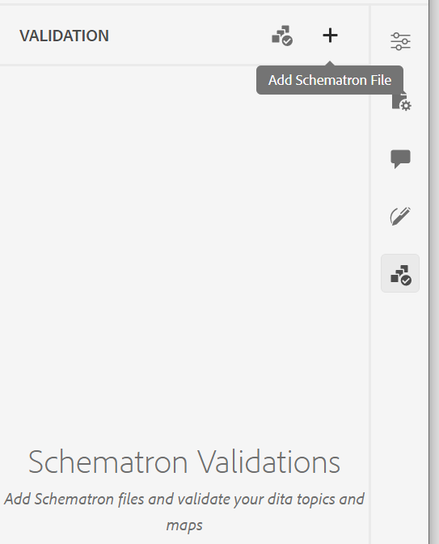

# Prise en charge des fichiers Schematron

« Schéma » fait référence à un langage de validation basé sur des règles utilisé pour définir des tests pour un fichier XML. L’éditeur web prend en charge les fichiers Schematron. Vous pouvez importer les fichiers Schematron et les modifier également dans l&#39;éditeur Web. À l&#39;aide d&#39;un fichier Schematron, vous pouvez définir certaines règles, puis les valider pour une rubrique DITA ou une carte.

>[!NOTE]
>
> L’éditeur web prend en charge le schéma ISO.


## Importer des fichiers Schematron

Pour importer les fichiers Schematron, procédez comme suit :

{width="300" align="left"}

1. Accédez au dossier requis (dans lequel vous souhaitez charger les fichiers) dans *Vue du référentiel*.
1. Cliquez sur l’icône **Options** pour afficher le menu contextuel et choisissez **Télécharger Assets**.
1. Dans la boîte de dialogue **Télécharger Assets**, vous pouvez modifier le dossier de destination dans le champ **Sélectionner le dossier de ressources**.
1. Cliquez sur **Choisir des fichiers** et recherchez les fichiers Schematron. Vous pouvez sélectionner un ou plusieurs fichiers Schematron, puis cliquer sur **Télécharger**.

## Validation d&#39;une rubrique ou d&#39;un mappage DITA avec Schematron

Après avoir importé les fichiers Schematron, vous pouvez les modifier dans l&#39;éditeur Web. Vous pouvez utiliser les fichiers Schematron pour valider les rubriques ou un plan DITA. Par exemple, vous pouvez créer les règles suivantes pour un plan ou une rubrique DITA :

* Un titre est défini pour un plan DITA.
* Ajout d&#39;une brève description d&#39;une certaine longueur.
* Il doit y avoir au moins une rubrique dans la carte.

Lorsque vous ouvrez une rubrique dans l’éditeur web, un panneau Validation du schéma s’affiche à droite. Effectuez les étapes suivantes pour ajouter et valider une rubrique ou un mappage avec un fichier Schematron :
{width="300" align="left"}

1. Cliquez sur l’icône Schéma () pour ouvrir le panneau Schéma .
1. Utilisez Ajouter un fichier Schematron pour ajouter des fichiers Schematron.
1. Si le fichier Schematron ne comporte aucune erreur, il est ajouté et répertorié dans le panneau Validation . Un message d’erreur s’affiche pour le fichier Schematron contenant les erreurs.
   >[!NOTE]
   >
   >Vous pouvez utiliser l’icône en forme de croix près du nom du fichier Schematron pour le supprimer.
1. Cliquez sur Valider avec Schematron pour valider la rubrique.

   * Si la rubrique n’enfreint aucune règle, le message de réussite de la validation s’affiche pour le fichier.
   * Si la rubrique enfreint une règle, par exemple, si elle ne contient pas de titre et est validée pour le schéma donné ci-dessus, une erreur de validation s’affiche.

1. Cliquez sur le message d’erreur pour mettre en surbrillance l’élément contenant l’erreur dans la rubrique/le mappage ouvert.

La prise en charge de Schematron dans l’éditeur web vous permet de valider les fichiers par rapport à un ensemble de règles, tout en préservant la cohérence et l’exactitude des rubriques.

## Utilisez des instructions d’assertion et de rapport pour rechercher des règles{#schematron-assert-report}

AEM Guides prend également en charge les instructions d’assertion et de rapport dans Schematron. Ces instructions vous aident à valider vos rubriques DITA.

### Instruction Assert

Une instruction d’assertion génère un message lorsqu’une instruction de test est évaluée sur false. Par exemple, si vous souhaitez que votre titre apparaisse en gras, vous pouvez définir une instruction d’assertion pour celui-ci.

```XML
<sch:rule context="title"> 
    <sch:assert test = "b"> Title should be bold </sch:assert>
  </sch:rule>
```

Lorsque vous validez vos rubriques DITA avec le Schematron, vous obtenez un message pour les rubriques dont le titre n&#39;est pas en gras.

### Instruction du rapport

Une instruction de rapport génère un message lorsqu’une instruction de test est évaluée comme vraie. Par exemple, si vous souhaitez que la description courte comporte moins de 150 caractères ou qu’elle soit égale à 1, vous pouvez définir une instruction de rapport pour vérifier les rubriques dont la description courte comporte plus de 150 caractères.
Lorsque vous validez vos rubriques DITA avec le schéma, vous obtenez un rapport complet des règles où l&#39;instruction du rapport est vraie. Ainsi, vous obtenez un message pour les sujets dont la description courte dépasse 150 caractères.


```XML
<sch:rule context="shortdesc"> 
        <sch:let name="characters" value="string-length(.)"/> 
        <sch:report test="$characters &gt; 150">  
        The short description has <sch:value-of select="$characters"/> characters. It should contain more than 150 characters.      
        </sch:report>   
    </sch:rule> 
```

>[!NOTE]
>
> Utilisez uniquement des expressions Xpath 2.0 lors de l’écriture des règles Schematron.

## Utilisation d’expressions Regex{#schematron-regex-espressions}

Vous pouvez également utiliser des expressions Regex pour définir une règle avec la fonction matches() , puis effectuer la validation à l’aide du fichier Schematron.

Par exemple, vous pouvez l’utiliser pour afficher un message si le titre ne contient qu’un seul mot.

```XML
<assert test="not(matches(.,'^\w+$'))"> 
No one word titles.
</assert>  
```


## Définition de modèles abstraits{#schematron-abstract-patterns}

AEM Guides prend également en charge les modèles abstraits dans Schematron. Vous pouvez définir des modèles abstraits génériques et les réutiliser.  Vous pouvez créer des paramètres d’espace réservé qui spécifient le modèle réel.


L’utilisation de modèles abstraits peut simplifier votre schéma Schematron en réduisant la duplication des règles et en facilitant la gestion et la mise à jour de votre logique de validation. Cela peut également faciliter la compréhension de votre schéma, dans la mesure où vous pouvez définir une logique de validation complexe dans un modèle abstrait unique qui peut être réutilisé dans l’ensemble du schéma.


Par exemple, le code XML suivant crée un modèle abstrait, puis le modèle réel y fait référence à l’aide de l’identifiant .

```XML
<sch:pattern abstract="true" id="LimitNoOfWords"> 

<sch:rule context="$parentElement"> 

<sch:let name="words" value="string-length(.)"/> 

<sch:assert test="$words &lt; $maxWords"> 

You have <sch:value-of select="$words"/> letters. This should be lesser than <sch:value-of select="$maxWords"/>. 

</sch:assert>  

<sch:assert test="$words &gt; $minWords"> 

You have <sch:value-of select="$words"/> letters. This should be greater than <sch:value-of select="$minWords"/>. 

</sch:assert>  

</sch:rule> 

</sch:pattern> 

<sch:pattern is-a="LimitNoOfWords" id="extend-LimitNoOfWords"> 

<sch:param name="parentElement" value="title"/> 

<param name="minWords" value="1"/> 

<param name="maxWords" value="8"/> 

</sch:pattern> 
```
