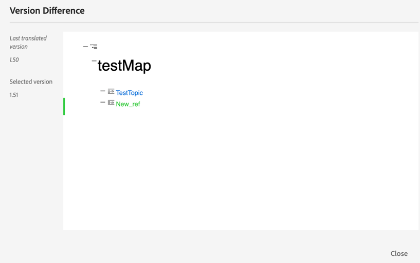

# Translate documents from the Web Editor {#id21BKF0Z0YZF}

>[!TIP]
>
> It is recommended to use this Translation feature from the Web Editor if you have upgraded to AEM Guides as a Cloud Service February 2022 release or later.

AEM Guides comes with a powerful feature in the Web Editor that enables you to translate your content into multiple languages. You can create a new translation project and later add the translation jobs to the existing translation project. You can also create a multi-lingual translation project which includes translation jobs for all the selected languages.

>[!NOTE]
>
> Your administrator can configure the Manage tab \(used for translation\) in the Web Editor. For more details, see *Configure the translation feature in the Web Editor* section in the Install and configure Adobe Experience Manager Guides as a Cloud Service.

## Avant de commencer

Before performing steps in this procedure, ensure that you have created the required language root and target folders

1. Create a root folder to store your source content. The root folder must be created with the language name \(such as English\) or language code \(en\).
1. Create the destination folders to which you want to translate your content. For example, if you want to translate your content into German or French, then you must create folder named as -de \(for German\) or -fr \(for French\).

>[!NOTE]
>
> The root folder and the destination folders must be created at the same level.

## Créer un projet de traduction

1. In the **Repository** panel, open the DITA map file in map view.
1. Cliquez sur l’onglet **Gérer**. The **Translation panel** displays the available language groups.

1. En tant qu’utilisateur, vous pouvez afficher les groupes linguistiques configurés sur votre profil de dossier. The language groups display the language folders along with their language codes. For example, the language group named G1 contains Italian \(it\), German \(de\), French \(fr\), and English \(en\) language folders.

   {width="300" align="left"}

   *Select the language groups or languages in which you want to translate your documents.*

   >[!IMPORTANT]
   >
   > You can only select and translate to the languages for which you have created the target folder parallel to the source language. Un dossier de langue créé à un autre niveau, par exemple un niveau vers le bas à partir du dossier de langue source, n’est pas affiché non plus. Veillez à créer tous vos dossiers de langue cible au même niveau que votre dossier de langue source.

1. Vous pouvez sélectionner n’importe quel groupe de langues en tant que cible pour la traduction. Si vous **Tout sélectionner**, les fichiers sélectionnés sont traduits dans toutes les langues disponibles dans les groupes de langues existants.

   L’option Dossier de langue est grisée et affiche un signe d’avertissement :

   - Si le dossier cible d’une langue est manquant.
   - Si la langue cible est la même que la langue source.

   >[!NOTE]
   >
   > Si vous créez le dossier cible pour une langue après avoir créé le groupe de langues, actualisez le navigateur pour activer la langue dans les groupes de langues.

1. Si vous choisissez une langue particulière, elle apparaît comme sélectionnée sous tous les groupes linguistiques que vous avez sélectionnés. Donc, quand vous traduisez dans n&#39;importe quelle langue, c&#39;est traduit en une seule fois pour tous les groupes linguistiques. Par exemple, si l’allemand est présent dans les deux groupes linguistiques G1 et G2, il est sélectionné pour les deux.

1. Dans la section **Autres langues**, vous pouvez choisir n’importe quelle langue pour laquelle vous avez créé le dossier cible, mais qui ne fait partie d’aucun groupe de langues.

1. Vous pouvez également sélectionner l’une des options suivantes pour traduire votre projet :

   **Aucun** sélectionnez cette option pour traduire les versions par défaut des fichiers. Cette option est sélectionnée par défaut.

   **Utiliser la ligne de base :** vous pouvez sélectionner une ligne de base pour traduire votre projet. Cliquez sur Utiliser niveau de référence et choisissez une ligne de base créée sur la carte. Tous les fichiers faisant partie de la ligne de base sélectionnée sont affichés sur la page Traduction . Une fois votre contenu traduit, vous pouvez exporter la ligne de base traduite. Pour plus d&#39;informations sur l&#39;exportation de la ligne de base traduite, voir [&#x200B; Exporter la ligne de base traduite &#x200B;](generate-output-use-baseline-for-publishing.md#id196SE600GHS).

   **Utiliser la dernière version comme activée** : choisissez de filtrer la version des rubriques en fonction de leur date et heure de création. Lorsque vous sélectionnez une date et une heure, seules la dernière version des fichiers créés le ou avant la date et l’heure sélectionnées s’affichent.

1. Cliquez sur **Appliquer**. Une liste comportant des détails sur les rubriques et les ressources associées s’affiche.
1. Sélectionnez les rubriques à envoyer pour traduction. Vous pouvez également utiliser les options de filtrage par rubrique pour les colonnes suivantes :

   - **Title** : titre du fichier source.  Passez la souris sur le titre du fichier source pour afficher le titre du fichier cible ou traduit.
   - **Nom de fichier** : nom du fichier source
   - **Type de fichier** : type du fichier source. Les options disponibles sont Carte, Rubrique et Image.
   - **Type de référence** : références directes ou indirectes.
   - **Version** : numéro de version du fichier source
   - **Libellé de la version** : libellé de la version sélectionnée du fichier source
   - **Version cible** : numéro de version du fichier cible
   - **Document State** : état du fichier source. Les options disponibles sont Brouillon, En cours de révision et Révisé.
   - **Langue cible** : langue vers laquelle vous souhaitez traduire le fichier source
   - **Statut de traduction** : les options disponibles sont les suivantes : Désynchronisé, Copie manquante, En cours et Synchronisé.
   - **Libellé cible** : libellé de la version sélectionnée du fichier cible
1. Cliquez sur **Envoyer pour traduction** dans le coin supérieur droit.

   {width="800" align="left"}

1. Dans la liste déroulante, sélectionnez **Créer un projet de traduction**.

   {width="350" align="left"}

   Outre un nouveau projet de traduction, vous pouvez également choisir parmi les options suivantes :

   - Vous pouvez choisir de **Créer une structure** uniquement pour le projet de traduction.
   - Vous pouvez choisir de **Créer un projet de traduction XLIFF** pour convertir le contenu XML au format XLIFF (XML Localization Interchange File Format). XLIFF est un format XML ouvert utilisé pour normaliser le transfert de données entre différents outils utilisés dans le processus de traduction de contenu. AEM Guides prend en charge XLIFF version 1.2.
Dans un projet XLIFF, le contenu est exporté au format XLIFF standard du secteur, qui peut être fourni aux fournisseurs de services de traduction. Le format XLIFF permet la réutilisation potentielle des segments que vous avez déjà traduits lors de la phase de traduction.\
     Une fois le contenu XLIFF traduit, il peut être importé dans AEM Guides, créant une version traduite du projet DITA d’origine.

     >[!NOTE]
     >
     > L’exportation XLIFF ne fonctionne qu’avec la configuration de traduction humaine.

   - Vous pouvez sélectionner **Créer un projet de traduction multilingue** qui inclura les tâches de traduction pour toutes les langues que vous avez sélectionnées pour la traduction. Par exemple, si vous avez sélectionné le français, l’allemand et l’espagnol, un projet contenant des tâches de traduction pour les trois langues sera créé.
   - Si vous disposez déjà d’un projet de traduction, vous pouvez y ajouter des rubriques. Select Add to **Existing Translation Project** option from the Project list and choose a project from the Existing Translation Project list. You can sort these projects by most recent, ascending, or descending order.

- If you select **Existing Translation Project**, this operation updates the existing asset entry in the project if the asset is already added and the related translation job state is in the *Draft* state.
   - If the destination language is not present in the project, a new project is created for the single-language translation project, and a new job is created for multi-language translation project.
   - If the job is already present for the destination language and the job status isn&#39;t in the *Draft* state, a new job is created within the same project to add the assets for translation.

  >[!NOTE]
  >
  > If your existing project is a scoping project, it has &#39;\(Scoping\)&#39; appended in its name.

- If you need to create the scope for a project to be translated, you can select **Create a new scoping translation project**. This will not send the copies for translation and the original translation status of the files is maintained. There is no impact on the destination language copy of the referred topics which are sent for scoping.
1. Dans le champ **Titre du projet**, saisissez un titre pour le projet.
1. Click **Create** to create a new translation project.

   Un nouveau projet de traduction est créé avec la version sélectionnée des rubriques. À ce stade, un message pop-up s’affiche pour confirmer que le projet de traduction a été créé. Une fois que toutes les copies de langue cible sont disponibles dans le projet de traduction, vous recevez une notification dans la boîte de réception. Once the target language copies are available in the translation project, you can then go ahead and start the translation job. For details see, [Start the translation job](translation-first-time.md#id225IK030OE8).

   >[!NOTE]
   >
   > Si vous rejetez la traduction d’une ou de plusieurs rubriques dans une tâche de traduction, le statut de traduction **En cours** de toutes les rubriques rejetées revient à son statut d’origine. Le statut des rubriques référencées est vérifié et rétabli en fonction du dernier état de traduction. En outre, les fichiers de traduction créés dans le projet de destination ne sont pas supprimés, même si la traduction est rejetée pour eux.

## Add the translation rules

AEM Guides allows your administrators to configure the translation rules. The SRX (Segmentation Rules eXchange) format is a standard for exchanging segmentation rules between different users and different translation environments. You can create a folder and add your custom SRX files to it.

SRX files should be named as `<language-code>.srx`. For example, en-US, or ar-AE.

>[!NOTE]
>The title is not case-sensitive, so you can have &#39;en-US&#39; or &#39;en-us&#39; or &#39;EN-us&#39;. Also, AEM guides can resolve &#39;-&#39; (hyphen) or &#39;_&#39; (underscore). So, you can have &#39;en-US&#39; or &#39;en_US&#39;.

Also, you can put these files inside any folder under AEM assets root that is `./content/dam`.

Once you&#39;ve created the folder which contains the SRX files, you can add the folder path in the Translation SRX location configuration inside your folder profile.

It is recommended that for a better performance you should keep only SRX files in the folder that is configured in the folder profile.

AEM Guides picks the SRX rules according to the source language of the translation project. It looks for a custom SRX file for a language, and if you do not define a custom SRX file, then it picks the rules as per the out of the box translation rules.

For details on setting up global and folder-level profiles, see *Configure authoring templates* section in Install and configure Adobe Experience Manager Guides as a Cloud Service.

## Pass the version label to the target version

AEM Guides allows you to pass the label of the source file to the target file. This will help you easily identify the source version for the translated file.

To add the source version label in the target copy, your system administrator must select the option **Propagate source version labels to the target version** under the **Translation** tab in **Editor Settings**.

For example, if you have some source files with the version label `Release 1.0` applied to them, then you can also pass on the source label \(`Release 1.0`\) to the translated file.

{width="650" align="left"}

>[!NOTE]
>
> The source label is only attached to one target version. If you move the source label to another version, it is automatically reflected in the latest target label.

## View version difference for Out of Sync files 

AEM Guides provides the feature to check the differences between the selected version and the last translated source version of the topics. You can choose to translate the **Out of Sync** files based on the changes made.

{width="650" align="left"}

Select the **Show difference** icon \(\) for a topic to see the differences between the last translated version and the current version of the selected file.

>[!NOTE]
>
> **Show difference** icon \(\) appears only for DITA files that have the translation status as **Out of Sync**.

The **Version Difference** dialog appears. It shows the **Last translated version** and the **Selected version** number on the left. The preview window displays the differences between the last translated version and the selected version of the topic.

{width="650" align="left"}

## Dismiss out of sync assets

Si vous apportez des modifications à certaines ressources, celles-ci ne sont plus synchronisées. Vous pouvez soit retraduire les ressources modifiées, soit ignorer le statut Désynchronisé . Par exemple, si vous avez apporté des modifications très mineures qui n’ont pas vraiment besoin d’être traduites, vous pouvez marquer leur statut sur Synchronisé.

Pour ignorer le statut Désynchronisé , procédez comme suit :

1. Sélectionnez les ressources non synchronisées dont vous souhaitez modifier le statut.
1. Sélectionnez le bouton **Marquer comme synchronisé** \(\) en haut. La boîte de dialogue **Marquer comme synchronisé** s’affiche.

   {width="550" align="left"}

1. Cliquez sur **Forcer la synchronisation**. Il définit le statut sur Synchronisé pour les ressources désynchronisées sélectionnées.

>[!NOTE]
>
> Le bouton **Marquer comme synchronisé** \(\) s’affiche uniquement pour les ressources dont le statut de traduction est Désynchronisé.

## Affichage des projets de traduction en cours pour une carte ou une rubrique

Certaines des références de votre tableau de bord de traduction peuvent avoir le statut En cours . Ces références comportent un lien **En cours** dans la colonne **Statut de la traduction**. Lorsque vous cliquez sur le lien, la boîte de dialogue **Projets en cours** s’ouvre. Dans la boîte de dialogue, vous pouvez voir la liste de tous les projets de traduction en cours \(ainsi que la langue cible\) qui contiennent la référence sélectionnée.

>[!NOTE]
>
> Vous pouvez voir le lien En cours pour les projets traduits créés dans AEM Guides as a Cloud Service version de février 2023 ou ultérieure.

Cliquez sur le nom de la référence dans la boîte de dialogue pour l’ouvrir en mode Aperçu. Vous pouvez également cliquer sur le projet de traduction pour commencer la traduction.

{width="550" align="left"}

## Supprimer ou désactiver automatiquement un projet de traduction terminé

>[!NOTE]
> 
>Cette fonctionnalité est disponible pour les nouveaux projets de traduction que vous créez à l’aide de la version Experience Manager Guides 2404 ou ultérieure.  Cela n’aura aucune incidence sur les projets existants.

Votre administrateur peut configurer l’option **Nettoyage du projet de traduction après l’achèvement** sous l’onglet **Traduction** dans **Paramètres de l’éditeur** pour désactiver ou supprimer automatiquement les projets de traduction.

Pour effectuer la gestion des documents, Experience Manager Guides permet de supprimer les projets de traduction une fois que vous avez terminé la traduction.

Vous pouvez également désactiver les projets de traduction si vous souhaitez les utiliser ultérieurement. La suppression d’un projet supprime tous les fichiers et dossiers présents dans le projet. La désactivation d’un projet ne le supprime pas, mais le conserve dans le référentiel. Cependant, vous ne pouvez pas mettre à jour ni modifier un projet désactivé.  La suppression ou la désactivation d’un projet n’aura aucune incidence sur le statut de traduction des références.

**Rubrique parente :**&#x200B;[&#x200B; Utiliser l’éditeur web](web-editor.md)
