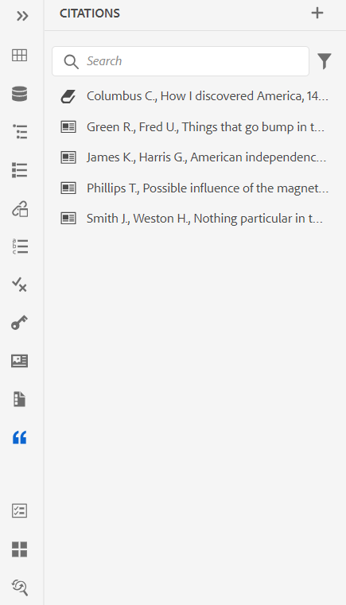

# Ajouter et gérer des citations dans votre contenu

Les citations sont des références à la source d’informations ajoutées à votre contenu. En utilisant des citations, vous pouvez créditer les auteurs des informations sources et aider les lecteurs à suivre les informations sources. Ajouter des citations rend votre contenu plus fiable et évite le plagiat. Ils permettent également d&#39;afficher du contenu bien documenté.

Dans AEM Guides, vous pouvez ajouter et importer des citations et les appliquer à votre contenu. Vous pouvez ajouter ces citations à partir de n’importe quelle source de livres, de sites web et de journaux.

AEM Guides vous aide à modifier, prévisualiser et trier vos citations. Après avoir ajouté vos citations dans le contenu, vous pouvez générer la sortie à l’aide du PDF natif. Vous pouvez également ajouter la bibliographie ou la page de références dans la sortie Native PDF.

AEM Guides prend en charge plusieurs styles de citations, comme Modern Language Association (MLA), American Psychological Association (APA), Chicago, Institute for Electric and Electronics Engineers (IEEE) et American Heart Association (AHA). Il est recommandé de les utiliser de manière claire et cohérente.

>[!NOTE]
>
>Actuellement, AEM Guides ne prend en charge que le PDF natif pour les citations.

## Ajouter des citations

Pour ajouter des citations, procédez comme suit :

1. Sélectionnez l&#39;icône **Citations**  dans le panneau de gauche.
Le panneau **Citations** s’ouvre.

   {width="300" align="left"}

1. Dans le panneau **Citations**, sélectionnez . Dans la liste déroulante, vous pouvez choisir d’ajouter une nouvelle citation ou d’importer une citation.

1. Sélectionnez **Nouvelle citation** pour ajouter une nouvelle citation.
La boîte de dialogue **Ajouter une citation** s’ouvre.

    {width="300" align="left"}

1. Renseignez les champs de la boîte de dialogue **Ajouter une citation** .

   >[!NOTE]
   >
   >Vous pouvez également ajouter l&#39;ISBN, le DOI ou le PubMed ID. AEM Guides renseigne automatiquement les autres champs.

   | Livre | Site Web | Journal |
   | --- | ---|---|
   | **Source**   Dans la liste déroulante, sélectionnez la source de la citation en tant que Livre. | **Source**  Dans la liste déroulante, sélectionnez la source de la citation en tant que site Web. | **Source**   Dans la liste déroulante, sélectionnez la source de la citation en tant que Journal. |
   | **Rechercher par**   Sélectionnez **ISBN** ou **DOI** dans la liste déroulante pour rechercher l’ID numérique associé à la citation.    DOI : identifiant d’objet numérique   ISBN : identifiant unique de livre numérique | **Rechercher par**   Sélectionnez **DOI** dans la liste déroulante pour rechercher l’ID numérique associé à la citation. | **Effectuer une recherche par**   Sélectionnez **DOI** ou PubMed ID dans la liste déroulante pour rechercher l’ID numérique associé à la citation.      |
   | **Auteur**   Ajoutez le prénom et le nom de l’auteur de la citation. Sélectionnez  pour ajouter d’autres noms. | **Auteur**   Ajoutez le prénom et le nom de l’auteur de la citation. Sélectionnez  pour ajouter d’autres noms. | **Auteur**   Ajoutez le prénom et le nom de l’auteur de la citation. Sélectionnez  pour ajouter d’autres noms. |
   | **Titre**   Ajoutez le titre du livre. | **Titre**   Ajoutez le titre de la page web. | **Titre**   Ajoutez le titre de l’article. |
   | **Editor**   Ajoutez l’éditeur du livre. | **Nom du site Web**   Ajoutez le nom du site Web. | **Titre du journal**   Ajoutez le titre du travail dans lequel l’article est trouvé. |
   | **Edition**   Ajoutez l’édition du livre. | **URL**   Ajoutez le lien Web du site Web pour parcourir le contenu. | **Year**   Ajoutez l’année de publication de l’article. |
   | **Ville**   Ajoutez la ville de la publication. | **Date d’accès**  Ajoutez la date d’accès au contenu du site web. | **Volume**   Ajoutez le volume du travail dans la série. |
   | **Publisher**   Ajoutez le nom de l’éditeur du livre. | **Date de publication**   Ajoutez la date de publication du contenu du site web. | **Number**   Ajoutez le numéro du volume dans la série. |
   | **Year**   Ajoutez l&#39;année de publication du livre. | **Date de mise à jour**   Ajoutez la date à laquelle le contenu du site web est mis à jour. | **Pages**   Ajoutez le numéro ou la plage de pages dans laquelle l’article se trouve. |
   | **Version**   Ajoutez la version du livre. | **ID unique**   Ajoutez un ID unique pour la citation. Un identifiant unique est l’identifiant unique de cette citation. | **URL**  Ajoutez le lien Web au journal. |
   | **Series**  Ajoutez la série du livre. |  | **Identifiant unique**   Ajoutez un identifiant unique pour la citation. Un identifiant unique est un identifiant unique pour cette citation. |
   | **URL**   Ajoutez le lien Web au livre. |
   | **ID unique**   Ajoutez un ID unique pour la citation. Un identifiant unique est l’identifiant unique de cette citation. |

1. Sélectionnez **Terminé**.

   Une nouvelle citation est ajoutée au panneau Citation .

>[!NOTE]
>
> L’ajout d’un identifiant unique pour le champ de citation est obligatoire.  Vous ne pouvez pas modifier l’identifiant unique une fois la citation ajoutée.

## Importer des citations

Pour importer des citations, procédez comme suit :

1. Dans le panneau de gauche, sélectionnez **Citations** .

   Le panneau **Citations** s’ouvre.

1. Dans le panneau **Citations**, sélectionnez , puis sélectionnez **Importer** dans la liste déroulante.
1. Parcourez un fichier .bib depuis votre système et importez-le .

   >[!TIP]
   >
   > Une extension de nom de fichier .bib est un fichier de base de données bibliographique BibTeX. Il s’agit d’un fichier texte spécialement formaté qui répertorie les références à une source d’information particulière.

   Une fois le fichier importé, vous pouvez afficher les références dans le panneau des citations.

   >[!NOTE]
   > <ol><li> AEM Guides importe uniquement les citations uniques qui ne sont pas déjà présentes.
    &gt; <li> AEM Guides peut importer des citations à partir d’un livre, d’un journal ou d’un site web. Actuellement, il ne prend pas en charge les citations d’autres sources.

## Gestion des citations

Les citations sont triées par ordre alphabétique dans le panneau de gauche. Recherchez les citations en fonction des sources à utiliser dans votre rubrique.

### Filtrer

Sélectionnez l’icône **Filtrer**  en regard de la barre de recherche et sélectionnez les options source dans la liste déroulante pour filtrer la liste de citations. Il permet des sélections simples et multiples.

* **Toutes les sources** : affiche une liste complète des citations, y compris toutes les sources.

* **Livre** : il affiche la liste des citations provenant de livres.

* **Site Web** : affiche la liste des citations provenant de sites Web.

* **Journal** : il affiche la liste des citations provenant de journaux.

### Recherche

Recherchez votre contenu dans la citation.

1. Dans le panneau de gauche, sélectionnez Citations.
Le panneau **Citations** s’ouvre.

1. Utilisez la barre de recherche pour rechercher la citation appropriée dans une liste longue.

### Changer le style de citation {#change-citation-style}

L’administrateur système peut modifier le style des citations à partir de la liste déroulante **Citations** de l’onglet **Paramètres généraux** dans les **** paramètres de l’éditeur.
Ces styles déterminent la manière dont les citations apparaissent dans le volet d’aperçu ou dans la sortie du PDF natif.

Les options suivantes sont disponibles dans la liste déroulante :

| MLA | APA | Chicago | IEEE | AHA |
|---|---|---|---|---|
| Style d’association de langue moderne   | Le style de l&#39;association psychologique américaine | Manuel de style de Chicago | Style de l&#39;Institut pour les ingénieurs électriques et électroniques | American Heartbeat Association Style |
| Exemple :  Crawford, Claire, et al. *Contenu émotionnel de souvenirs sombres*.Modifié par Memory, vol 16, 2010, Amsterdam. | Exemple :   Crawford, C., J., &amp; , C. (2010). *Contenu émotionnel de souvenirs sombres* (505-16 ed.) 10.1080/09658210902067289 | Exemple :   Crawford, Claire, et al. *Contenu émotionnel de souvenirs sombres*. 505-16, 2010. | Exemple :   C. Crawford, J. et C. , *Contenu émotionnel de souvenirs sombres*. Amsterdam, 2010. | Exemple :   C. Crawford, J. et C. , *Contenu émotionnel de souvenirs sombres*. Amsterdam, 2010. |

## Modifier une citation

Pour éditer la citation, procédez comme suit :

1. Pointez sur le nom de la citation de la liste. Sélectionnez  l&#39;icône **Options** .

1. Sélectionnez **Edit**.

La boîte de dialogue **Modifier la citation** s’ouvre.

1. Effectuez les modifications nécessaires. Sélectionnez **Done**.
La citation sélectionnée est éditée.

>[!NOTE]
>
>Vous ne pouvez pas modifier l’identifiant unique une fois la citation ajoutée.

## Aperçu d’une citation

Pour prévisualiser une citation, procédez comme suit :

Pointez sur le nom de la citation de la liste. Sélectionner     Icône  **Options** .

1. Sélectionnez **Aperçu**.
Vous pouvez prévisualiser le contenu et le format de la citation dans le volet d’aperçu.

   >[!NOTE]
   >
   >L’aperçu est basé sur le style de citation que votre administrateur a sélectionné dans les **Paramètres de l’éditeur**.

1. Cliquez n’importe où sur l’écran pour fermer la zone d’aperçu.

   {width="550" align="left"}

>[!NOTE]
>
> Vous pouvez également prévisualiser une citation insérée dans une rubrique à partir de l’interface utilisateur d’Assets ou de l’onglet Aperçu de l’éditeur web.

## Insérer des citations

Effectuez les étapes suivantes pour insérer des citations vers une rubrique :
1. Sélectionnez la rubrique dans le panneau du référentiel, puis double-cliquez pour l’ouvrir dans la fenêtre d’édition.
1. Placez le curseur à l’emplacement de la rubrique où vous souhaitez ajouter la citation.

Vous pouvez insérer des citations dans la rubrique à partir de la barre d’outils principale ou du panneau de gauche.

### Dans la barre d’outils principale

1. Sélectionnez l&#39;icône **Citations**  dans la barre d&#39;outils principale.
1. Dans la boîte de dialogue **Citations**, sélectionnez la citation. Vous pouvez également sélectionner plusieurs citations.
   {width="300" align="left"}
1. Vous pouvez filtrer les citations en saisissant les premiers alphabets dans le panneau de recherche de la boîte de dialogue **Citation**.

1. Cliquez sur **Terminé**.
La citation sélectionnée est ajoutée à l’emplacement du curseur dans votre rubrique.

### Dans le panneau de gauche

>[!NOTE]
> 
>Pour afficher l’icône **Citations** dans le panneau de gauche, votre administrateur système doit sélectionner l’option **Citations** dans l’onglet **Panneaux** de **Paramètres de l’éditeur**.

1. Sélectionnez l&#39;icône **Citations**  dans le panneau de gauche.
1. Faites glisser la citation depuis le panneau **Citations** et déposez-la à l’emplacement approprié dans la rubrique.

   Vous pouvez également sélectionner **Insérer** depuis  **Options** pour insérer une citation.

   
1. Pour sélectionner plusieurs citations, cliquez avec le bouton droit sur une citation dans la rubrique et sélectionnez **Modifier la citation** dans le menu contextuel.
1. Sélectionnez les citations à insérer dans la boîte de dialogue **Citation**.
1. Sélectionnez **Terminé** pour les ajouter à la rubrique.

Une fois que vous avez inséré des citations dans la rubrique, vous pouvez les prévisualiser dans l’éditeur web. Vous pouvez également publier du contenu avec des citations à l’aide du PDF natif.

## Supprimer une citation

Vous pouvez supprimer des citations à partir du panneau Destinations ou d’une rubrique dans laquelle vous avez inséré le lien.

### Suppression d’une citation du panneau Citations

Pour supprimer une citation du panneau Citations, procédez comme suit :

1. Pointez sur le nom de la citation de la liste.
1. Sélectionnez l&#39;icône  **Options** .
1. Sélectionnez la variable   **Supprimer** .
La boîte de dialogue de confirmation s’ouvre.
1. Sélectionnez **Oui**.
La citation sélectionnée est supprimée du panneau des citations.

### Suppression d’une citation d’une rubrique

Pour supprimer une citation déjà utilisée dans la rubrique, procédez comme suit :

Dans la rubrique , placez le curseur à la fin de la citation.

1. Cliquez avec le bouton droit sur une citation dans la rubrique et sélectionnez **Modifier la citation** dans le menu contextuel. La boîte de dialogue Citation s’ouvre.
   

1. Vous pouvez choisir les citations à insérer dans le document.

   >[!NOTE]
   >
   >Les citations déjà utilisées dans la rubrique sont remplacées par les citations que vous sélectionnez dans la boîte de dialogue.

1. Sélectionnez **Terminé**.

## Générer la sortie du contenu avec les citations

Une fois que vous avez inséré des citations dans la rubrique, vous pouvez publier du contenu avec des citations à l’aide du PDF natif.

Dans la sortie du PDF natif, les citations apparaissent dans le contenu dans lequel vous les avez insérées. Vous pouvez également créer une page de bibliographie. Lorsque vous cliquez sur une citation, vous êtes redirigé vers la page de bibliographie.

Créez une mise en page **Citations** dans les modèles de PDF et incluez-la dans votre document. Toutes les citations utilisées dans le livre sont répertoriées sur une page qui apparaît dans la sortie du PDF. Pour en savoir plus sur la création d’une mise en page, consultez la page [Créer une mise en page](/help/product-guide/native-pdf/components-pdf-template.md#create-page-layout).

Pour modifier l’affichage et l’aspect de la page de citation, consultez la page [Personnaliser les modèles de PDF](/help/product-guide/native-pdf/pdf-template.md).

### Appliquer le style de contenu à une citation

Appliquez la mise en forme à la citation lorsqu’elle est ajoutée à la rubrique.

1. Sélectionnez **Feuilles de style** dans le panneau **Modèles** d’un paramètre prédéfini de sortie de PDF natif.   Il ouvre le panneau **STYLES** qui contient toutes les options de style.

1. Dans le panneau Rechercher, recherchez `<cite>`.

Pour en savoir plus sur les styles, consultez [Utilisation des styles de contenu communs](/help/product-guide/native-pdf/stylesheet.md).
