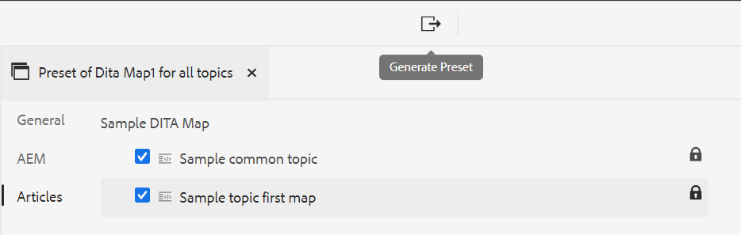

# Création de paramètres prédéfinis de sortie à partir de l’éditeur web {#id218CL400JW3}

Pour créer des paramètres prédéfinis de sortie pour votre plan DITA, procédez comme suit :

1. Dans l’interface utilisateur d’Assets, accédez au fichier de mappage à modifier.

1. Pour obtenir un verrou exclusif sur le fichier de mappage, sélectionnez le fichier de mappage et cliquez sur **Extraire**.

1. Sélectionnez l’option **Modifier les rubriques** dans le menu d’actions du fichier de mappage.

   Le fichier de mappage est ouvert pour modification dans l’éditeur web.

   >[!NOTE]
   >
   > Vous pouvez ajouter ou supprimer n’importe quelle rubrique de la carte à l’aide de l’éditeur de cartes avancé. Pour plus d’informations, voir [&#x200B; Utilisation de l’éditeur de cartes avancé &#x200B;](map-editor-advanced-map-editor.md#).

1. Dans l&#39;onglet **Sortie**, sélectionnez l&#39;icône + pour créer un paramètre prédéfini de sortie pour votre plan DITA.

   {width="350" align="left"}

1. Saisissez le nom du paramètre prédéfini dans la boîte de dialogue Ajouter un paramètre prédéfini , puis cliquez sur **Ajouter**.

1. Saisissez les informations de configuration suivantes.

   1. Sélectionnez les options requises dans l’onglet **Général**. Vous pouvez choisir de créer un paramètre prédéfini de sortie avec ou sans conditions. Vous pouvez également utiliser un fichier DITVAL. AEM Guides vous permet également de sélectionner une ligne de base pour publier une version spécifique de votre plan DITA.
   1. Saisissez les détails du site AEM dans l’onglet **AEM**. **Site** affiche la liste des AEM Sites disponibles dans votre référentiel AEM. **Catégorie**, **Modèle de section** et **Modèle d’article** sont les composants structurels utilisés pour organiser l’aspect de votre sortie. Ils sont prédéfinis dans le modèle de site AEM.

      >[!NOTE]
      >
      > Actualisez chaque liste déroulante pour obtenir la classification supplémentaire dans la liste déroulante suivante.

   1. Dans l’onglet **Articles**, sélectionnez les rubriques pour lesquelles vous souhaitez générer la sortie.
1. Sélectionnez l’icône **Générer le paramètre prédéfini** en haut pour générer la sortie.

   {width="800" align="left"}

1. Vous verrez le statut du processus de génération de sortie. La colonne **Rubriques** répertorie les rubriques pour lesquelles une sortie est générée tandis que la colonne **Statut** affiche le statut de publication de chaque rubrique.

   Pour afficher la sortie, placez le pointeur de la souris sur la rubrique et cliquez sur Afficher la sortie.

   {width="800" align="left"}

>[!NOTE]
>
> Vous pouvez également Modifier, Renommer, Dupliquer ou Supprimer un paramètre prédéfini de sortie existant à partir du menu Options.

{width="550" align="left"}

**Rubrique parente :**&#x200B;[&#x200B; Publication basée sur des articles dans l’éditeur web](web-editor-article-publishing.md)
