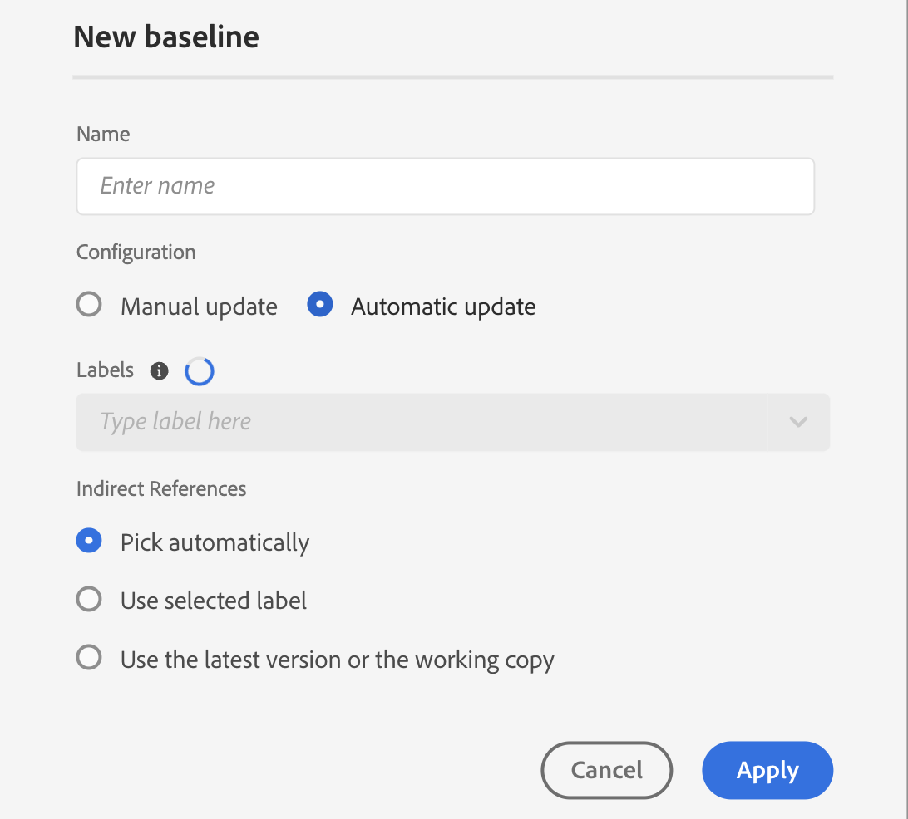
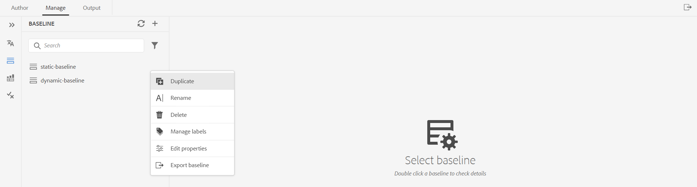

# Créer et gérer des lignes de base à partir de l&#39;éditeur Web {#id223MB0ZF043}

>[!TIP]
>
> Il est recommandé d’utiliser cette fonctionnalité de ligne de base à partir de l’éditeur web si vous avez effectué la mise à niveau vers la version de mars d’AEM Guides as a Cloud Service ou une version ultérieure.

AEM Guides fournit la fonction Ligne de base intégrée à l’éditeur web qui permet aux utilisateurs de créer des lignes de base et de les utiliser pour publier ou traduire des rubriques de différentes versions. Ils peuvent également publier plusieurs paramètres prédéfinis de sortie du même plan DITA en parallèle.

## Créer une ligne de base

Vous pouvez créer une ligne de base à partir de l&#39;éditeur Web en procédant comme suit :

1. Dans le panneau Référentiel, ouvrez le fichier DITA map en mode Carte.
1. Cliquez sur l’onglet **Gérer**. Le panneau **Ligne de base** affiche les lignes de base du plan DITA.

   {width="800" align="left"}

1. Dans le panneau **Ligne de base**, sélectionnez l’icône + en haut à droite pour commencer à créer une ligne de base.
1. Entrez un nom pour la ligne de base dans **Nom**.
1. Dans **Configuration**, vous pouvez choisir l’option **Mise à jour manuelle** ou **Mise à jour automatique** :

   **Mise à jour manuelle** : vous pouvez créer manuellement une ligne de base statique avec une version spécifique des rubriques et du contenu référencé disponible à une date et une heure spécifiques, ou avec un libellé défini pour une version des rubriques :

   - Dans **Sélectionner la version en fonction de** sélectionnez l’une des options suivantes :

      1. **Date** &lt;horodatage\> : sélectionne la version des rubriques à la date et à l’heure spécifiées.
      1. **Libellé** : sélectionnez cette option pour sélectionner les rubriques en fonction du libellé qui leur est appliqué. Si des libellés sont spécifiés pour les rubriques, les libellés sont répertoriés dans la liste déroulante. Vous pouvez choisir un libellé dans la liste. Vous pouvez également ajouter un libellé dans la zone de texte.

         Pour les références directes dans les lignes de base statiques, les libellés sont extraits de la dernière version enregistrée de la carte. Par exemple, si vous avez créé les libellés `Label Release 1.0` et `Label Release 1.1` pour les versions 1.0 et 1.1 de la rubrique A, puis ajoutez la rubrique A à la carte enregistrée en tant que version 1.0. Dans ce cas, vous pouvez afficher les libellés `Label Release 1.0` et `Label Release 1.1` dans la liste déroulante pour les libellés de ligne de base statiques.

         Lorsque vous sélectionnez **Libellé** vous pouvez choisir les références directes et indirectes.
         - Pour les références directes dans le plan DITA, vous avez la possibilité d&#39;utiliser la dernière version des rubriques auxquelles le libellé spécifié n&#39;est pas appliqué.

           >[!NOTE]
           >
           > Si vous saisissez un libellé qui n&#39;existe pas et sélectionnez l&#39;option **Ne pas créer de ligne de base** la création de la ligne de base échoue et affiche un message d&#39;erreur à proximité du nom de la ligne de base dans le panneau Ligne de base.

         - Pour les références indirectes dans le plan DITA, vous disposez d&#39;une option supplémentaire pour utiliser la dernière version des rubriques sur lesquelles le libellé spécifié n&#39;est pas appliqué. Vous pouvez également choisir de **Sélectionner automatiquement** pour le contenu référencé. Le système sélectionne alors automatiquement la version du contenu référencé correspondant à la version du contenu dans lequel il est référencé.

         Une fois que vous avez sélectionné un libellé ou une version en fonction de la date, toutes les rubriques et tous les fichiers multimédias référencés dans la carte sont sélectionnés en conséquence. Cette sélection de rubriques ne s’affiche pas dans l’interface utilisateur, mais elle est enregistrée en arrière-plan.

   **Mise à jour automatique** : sélectionnez cette option pour la création d&#39;une ligne de base afin de sélectionner automatiquement les rubriques en fonction du libellé qui leur est appliqué.

   Les références créées à l&#39;aide de la configuration de mise à jour automatique sont mises à jour dynamiquement. Si vous générez une configuration de référence, téléchargez une configuration de référence ou créez un projet de traduction à l’aide d’une configuration de référence, les fichiers sont sélectionnés de manière dynamique en fonction des libellés mis à jour. Par exemple, si vous avez utilisé la version 1.2 d’une rubrique avec le libellé Version 1.0 pour la ligne de base et la version 1.5 mise à jour ultérieurement avec le libellé Version 1.0, la ligne de base sera mise à jour dynamiquement et la version 1.5 sera utilisée.

   {width="300" align="left"}

   - **Libellés** : si des libellés sont spécifiés pour les rubriques, utilisez la liste déroulante **Libellés** pour effectuer une sélection parmi les [libellés répertoriés](#labels-list).
Les libellés sélectionnés en premier sont prioritaires sur les libellés ultérieurs.

     >[!NOTE]
     >
     >Lorsque les libellés sont extraits, un chargeur s’affiche et la liste déroulante est désactivée.

     Pour les lignes de base dynamiques, les libellés sont extraits de la dernière version enregistrée et de la copie de travail actuelle de la carte. Par exemple, si vous avez créé des libellés   `Label Release A.1.0 ` et `Label Release A.1.1` pour les versions 1.0 et 1.1 de la rubrique A et les libellés `Label Release B.1.0` et `Label Release B.1.1` pour les versions 1.0 et 1.1 de la rubrique B . Vous pouvez ensuite ajouter Topic A à Map A dans la version 1.0 et Topic B à Map A dans la version 1.0* (copie de travail). Dans ce cas, vous pouvez afficher `Label Release A.1.0 `, `Label Release A.1.1`, `Label Release B.1.0` et `Label Release B.1.1` dans la liste déroulante des libellés de ligne de base dynamique.

1. **Références indirectes** : pour les références indirectes dans le plan DITA, les options suivantes sont disponibles :

   - **Sélection automatique** : vous pouvez choisir d’effectuer une **Sélection automatique** pour le contenu référencé. Le système sélectionne alors automatiquement la version du contenu référencé correspondant à la version du contenu dans lequel il est référencé.

   - **Utiliser le libellé sélectionné** : vous pouvez créer une ligne de base avec le libellé sélectionné défini pour une version de rubriques.
   - **Utiliser la dernière version ou la copie de travail** : utilisez la dernière version des rubriques auxquelles le libellé spécifié n&#39;est pas appliqué ou, si aucune version n&#39;a été créée, utilisez la copie de travail des rubriques pour créer la ligne de base.
1. Cliquez sur **Appliquer**.

La ligne de base est créée. La création de la ligne de base se produit de manière asynchrone, de sorte que vous pouvez continuer à travailler sur d’autres fichiers dans l’éditeur web. Une fois la ligne de base créée, un message pop-up s’affiche pour confirmer que la ligne de base a été créée. Vous recevez également une notification de boîte de réception pour la même opération.

## Gérer les niveaux de référence

Vous pouvez gérer vos lignes de base existantes à l&#39;aide des différentes fonctionnalités du tableau de bord Ligne de base.

- Vous pouvez rechercher une ligne de base existante à l&#39;aide de la zone de texte du panneau Ligne de base. Utilisez l&#39;icône **Appliquer le filtre** pour afficher toutes les lignes de base ou les répertorier avec le statut de création Succès, En cours ou Échec.
- Utilisez l&#39;icône **Actualiser** du panneau Ligne de base pour vérifier toutes les lignes de base et afficher une nouvelle liste de lignes de base pour le plan DITA ouvert en mode Carte.
- Vous pouvez afficher ou modifier le contenu d&#39;une ligne de base statique existante en double-cliquant dessus dans la liste du panneau **Ligne de base**. La fenêtre de modification de ligne de base au centre affiche le fichier de plan DITA, le contenu ou les rubriques du plan et le contenu référencé.

  >[!NOTE]
  >
  >L&#39;opération de modification des lignes de base statiques n&#39;est recommandée que pour un petit nombre de changements de référence. L&#39;opération Modifier n&#39;est pas recommandée pour modifier la version du plan DITA principal, car il doit recalculer toutes les références. Cela peut entraîner l&#39;échec de la mise à jour de la ligne de base pour les plans DITA volumineux. Pour les plans DITA plus volumineux, vous pouvez créer une nouvelle ligne de base ou modifier les propriétés de la ligne de base.
  >
  >L&#39;opération Modifier en cas de ligne de base dynamique permet de modifier les propriétés de la ligne de base, car les références des lignes de base dynamiques sont générées au moment de l&#39;exécution à l&#39;aide des libellés.

  {width="800" align="left"}

  Vous pouvez également effectuer les opérations suivantes sur la ligne de base à partir du menu Options :

### Dupliquer une ligne de base

Vous pouvez dupliquer une ligne de base et la modifier en fonction de vos besoins.
{width="300" align="left"}
*Dupliquez une ligne de base en fonction d’un libellé ou créez une copie exacte.*

1. Sélectionnez **Dupliquer** dans le menu Options d&#39;une ligne de base. La boîte de dialogue **Dupliquer la ligne de base** s’ouvre.
>[!NOTE]
>
>Le nom par défaut de la ligne de base est `<selected baseline name>`_suffix (comme sample-baseline_1). Vous pouvez modifier le nom en fonction de vos besoins.

   Dans **Sélectionner la version en fonction de**, vous pouvez choisir l’option **Copie exacte** ou l’option **Libellé** :

   - **Exact copy**: Experience Manager Guides picks the same version of all the topics and creates an exact copy of the duplicated baseline.
   - **Label**: Using the dropdown, you can choose one of the [listed labels](#labels-list). Experience Manager Guides picks those versions of the topics with the selected label defined for them, while for the remaining topics, it picks the version from the duplicated baseline. For example, you select the label `Release 1.0` from the dropdown, then it picks those versions of the topics for which you have defined this label. For all other topics, it picks the version from the duplicated baseline.
1. Click **Duplicate**.

- **Rename**, or **Delete** an existing baseline.
- Add, remove, or make changes to existing labels from the **Manage Labels** option for static baselines. If your administrator has configured pre-defined labels, then you are shown those labels in the Add Label dropdown list. Pour plus d’informations sur l’ajout de libellés, voir [&#x200B; Utiliser des libellés &#x200B;](web-editor-use-label.md#).

  >[!NOTE]
  >
  > The process to add or remove labels happens asynchronously, so you can continue working on other files in the Web Editor. Once the label is added or removed, a pop-up message is displayed confirming that the label has been added or removed, and you also receive an Inbox notification for the same.

- **Edit properties** of an existing static baseline that you have set while creating the baseline.
- Export the snapshot of a baseline in a Microsoft Excel file with the **Export Baseline** option.

### List of labels {#labels-list}

The labels listed in the dropdown are based on the following criteria:
- The labels should be added to one of the versions of the topics in the DITA map (on which the baseline is created).
- And only the first-level references (topics or sub-maps) of the DITA map are considered for picking the labels.

## Baseline filters

Using the Filters icon in the **Baseline Filters** panel you can apply filters on the baseline opened in the baseline editing window:

{width="300" align="left"}

- Filter the files based on filenames, or file location.
- Filter the files based on the values for different columns like File Type, Reference Type and so on.
- Choose the columns to be displayed in the baseline editing window.

>[!NOTE]
>
> You can click a column heading and sort the files based on the columns in the baseline editing window.

**Enregistrer ou réinitialiser une ligne de base**

Une fois la ligne de base modifiée, cliquez sur le bouton **Enregistrer** en haut pour enregistrer les modifications. Vous pouvez cliquer sur le bouton **Réinitialiser** si vous ne souhaitez pas enregistrer la modification et réinitialiser la ligne de base. Lorsque vous cliquez sur le bouton **Réinitialiser**, un avertissement s’affiche indiquant que vos modifications non enregistrées seraient perdues.

**Rubrique parente :**&#x200B;[&#x200B; Utiliser l’éditeur web](web-editor.md)
