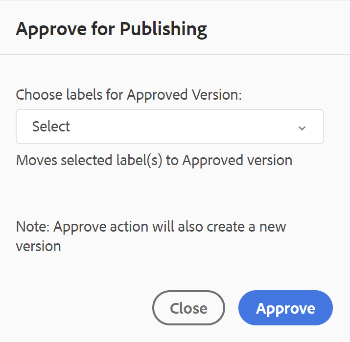
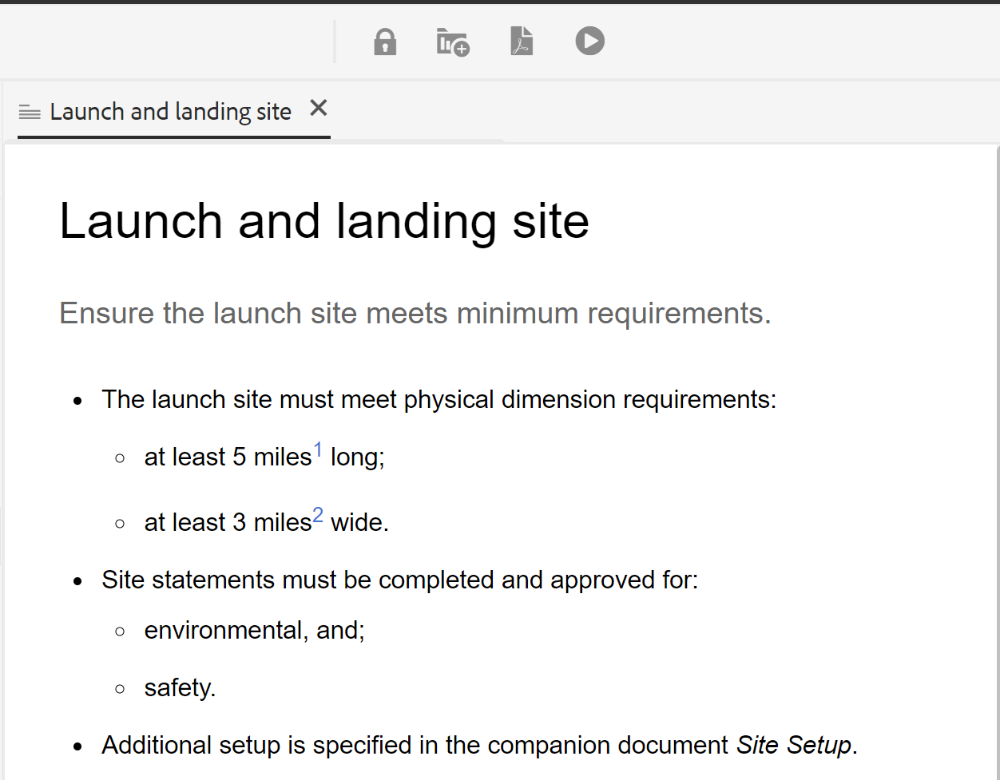

# Etat du document {#id1821HC00URO}

To manage the readiness of the documents, AEM Guides provides document state property to indicate the current state of the document. Document states help you quickly find out whether a document is new, in review, or review completed state.

## Types of document states

A document can have any of the document states defined in the Document State profile. For example, a document may have any one of the following Document States:

- Draft - Indicates that the document is created and saved with new changes.
- In-Review - Indicates that a review workflow has been initiated for the document.
- Reviewed - Indicates that the document has been reviewed by the intended users.

These states are set manually or automatically according to the Document States profile settings. For example, if the Document State profile is configured with start state as Draft, and In-Review state is defined for documents under review. Then, when you create a document, the document state is set to *Draft*. If you initiate a review task, then the state of the document is changed to In-Review.

You can also manually change the document state for a single or multiple documents. However, if you choose to change the document state for multiple documents, then the allowed state is determined by the common states that are allowed for the selected documents. For example, let&#39;s say you have defined the document states as Draft, In-Review, Reviewed, and Ready to Publish, in the same order. On document one.dita the state is set to *Draft* and on document two.dita, the state is set to Reviewed. When you select both—one.dita and two.dita, then the allowed document state will be *Ready to Publish*. As two.dita is in *Reviewed* state, the next possible state for two.dita is only *Ready to Publish*, which is shown when both documents are selected.

>[!NOTE]
>
> A document can exist in only one state at a time.

## Change document state

To change the state of a document, perform the following steps:

1. Dans l’interface utilisateur d’Assets, sélectionnez un ou plusieurs documents dont vous souhaitez modifier l’état.
1. Dans la barre d’outils principale, cliquez sur **Propriétés**.
1. Sélectionnez le nouvel état dans le menu déroulant **État du document**. Vous ne pouvez sélectionner que les états du document autorisés dans la section Transition d’état du profil d’état du document.

   >[!NOTE]
   >
   >Les administrateurs peuvent voir tous les états du document et modifier l’état du document à n’importe quel état possible.

1. Cliquez sur **Enregistrer et fermer**.

## Afficher l’état du document

Le mode Carte de l’interface utilisateur d’Assets affiche le statut actuel, ainsi que la date de création et la taille de la rubrique DITA ou du plan DITA correspondant.

{width="800" align="left"}

## Utiliser les états de document dans DDLC

Les états de document jouent un rôle important dans la gestion du cycle de vie des documents dans DDLC. Si votre organisation suit strictement le DDLC, il devient essentiel de disposer d’un mécanisme pour contrôler la modification des documents en fonction de leur état. Par exemple, vous pouvez autoriser la modification de documents lorsqu’ils sont à l’état *Brouillon* ou *En cours*. Cependant, une fois qu’un document est examiné et prêt à être publié, il doit y avoir un moyen d’empêcher toute modification ultérieure des documents.

AEM Guides fournit un processus d’approbation des documents, qui vous aide à contrôler le cycle de vie de votre processus de développement de documents. Une fois qu’un document est prêt à être publié ou a atteint l’avant-dernier état, vous pouvez le marquer comme approuvé. Une fois qu’un document est approuvé, AEM Guides crée une nouvelle version du document et le rend en lecture seule. Vous pouvez ensuite déplacer le document pour publication ou créer une ligne de base pour un traitement ultérieur.

Pour lancer une nouvelle version des documents marqués comme approuvés, un auteur doit lancer une nouvelle version. Le démarrage d’une nouvelle version modifie l’état du document en *Brouillon*. En modifiant l’état du document sur *Brouillon*, le document devient à nouveau modifiable et vous pouvez continuer à travailler sur la version suivante.

Pour utiliser la fonction d&#39;approbation de document, procédez comme suit :

>[!NOTE]
>
> La fonction de workflow d’approbation doit être activée par votre administrateur. Pour plus d’informations, consultez la section *Activer le workflow d’approbation* dans la section Installation et configuration d’Adobe Experience Manager Guides as a Cloud Service.

1. Dans l’éditeur web, ouvrez le document que vous souhaitez marquer pour approbation.

1. Cliquez sur l’icône **Marquer comme approuvé**.

1. Si votre document est à l’état d’être marqué comme approuvé, la boîte de dialogue suivante s’affiche :

   {width="300" align="left"}

   Si votre document ne peut pas être marqué comme approuvé, le message suivant s’affiche :

   {width="300" align="left"}

1. Si votre document est prêt à être marqué comme approuvé, sélectionnez un libellé dans la liste déroulante et cliquez sur **Approuver**.

   >[!NOTE]
   >
   > Si votre administrateur n’a pas configuré de liste prédéfinie de libellés, un champ de texte à structure libre s’affiche et vous permet de saisir un libellé.

1. Une fois le document marqué comme approuvé, un **Aperçu** du document s’affiche en mode lecture seule.

   {width="650" align="left"}

   >[!NOTE]
   >
   > En mode Aperçu , toutes les options de modification sont supprimées de la barre d’outils. En outre, la vue Auteur et Source du document a également été supprimée de la barre de navigation supérieure.

Une fois qu’un document est marqué comme approuvé, il n’est plus disponible pour modification. Si vous souhaitez utiliser le document pour la prochaine version, vous devez le ramener à l’état *Brouillon*. Pour rétablir le statut d’un document approuvé en mode *Brouillon*, procédez comme suit :

1. Dans un document approuvé, cliquez sur l’icône **Démarrer une nouvelle version** .

   Le message Démarrer une nouvelle version s’affiche.

1. Cliquez sur **Confirmer**.

   Le document passe alors à l’état Brouillon et s’ouvre dans l’éditeur web en mode d’édition.

**Rubrique parente :**&#x200B;[&#x200B; Utiliser l’éditeur web](web-editor.md)
