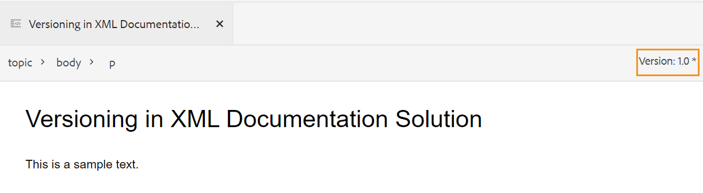

# Modification de rubriques dans l’éditeur web {#id2056B040VUI}

L&#39;éditeur Web est fourni avec un éventail de fonctions d&#39;édition qui vous permettent de créer ou de modifier facilement vos fichiers de rubrique. En règle générale, vous devez effectuer les étapes suivantes pour modifier une rubrique dans l’éditeur web.

>[!IMPORTANT]
>
> Si vous rencontrez une erreur d’application lors de l’utilisation de l’éditeur web, actualisez la page pour continuer à travailler.

1. Pour apporter des modifications à votre rubrique, cliquez dans la limite de texte de l&#39;élément requis et commencez à apporter des modifications.

1. Pour insérer un élément spécifique, cliquez à l’extrémité de l’élément après quoi vous souhaitez insérer le nouvel élément et cliquez sur l’icône de l’élément requis dans la barre d’outils. Vous pouvez également utiliser le raccourci clavier `Alt+Enter` pour appeler la fenêtre contextuelle **Insérer un élément**.

   Une liste d’éléments qui peuvent être utilisés dans la rubrique s’affiche. AEM Guides place intelligemment les éléments en fonction de leur emplacement valide dans la rubrique.

   >[!NOTE]
   >
   > Vous pouvez également choisir l’icône à afficher dans la barre d’outils en configurant le fichier `ui_config.json` situé à l’emplacement - `/etc/designs/fmdita/clientlibs/xmleditor/`. Pour plus d’informations sur la personnalisation des fonctionnalités, contactez votre administrateur système.

1. Une fois la modification du document terminée, cliquez sur **Enregistrer**.

   >[!NOTE]
   >
   > Si vous ne souhaitez pas valider les modifications dans le référentiel AEM, cliquez sur **Fermer**, puis sur **Fermer sans enregistrer** dans la boîte de dialogue Modifications non enregistrées.

## Sélection partielle de contenu entre des éléments

Experience Manager Guides vous permet également de sélectionner du contenu sur plusieurs éléments. Après avoir sélectionné le contenu, vous pouvez effectuer les opérations suivantes :

- Mise en forme et suppression : mettez le contenu sélectionné en gras, en italique, soulignez-le ou même supprimez-le. Le contenu des balises ouvertes valides est ensuite fusionné et s’affiche sous un seul élément. Par exemple, vous pouvez sélectionner le contenu d’un paragraphe et étendre la sélection à un autre paragraphe. Ensuite, si vous mettez le contenu sélectionné en gras, tout le contenu en gras des balises ouvertes est fusionné et apparaît sous un seul élément de paragraphe.

De même, si vous supprimez le contenu sélectionné, le contenu restant après la suppression dans les balises ouvertes est fusionné.

- Entourer le contenu d’un élément valide : effectuez les étapes suivantes pour encapsuler le contenu avec un élément valide :

   - Sélectionnez le contenu dans un élément.
   - Sélectionnez l’icône  dans la barre d’outils secondaire supérieure pour afficher la boîte de dialogue **Entourer avec l’élément**. La boîte de dialogue répertorie les éléments valides pour le contenu sélectionné.

     >[!NOTE]
     >
     > Vous pouvez également afficher la boîte de dialogue Entourer avec un élément en sélectionnant le menu contextuel du contenu sélectionné.

   - Sélectionnez un élément dans la boîte de dialogue. Le contenu sélectionné est encapsulé sous cet élément. Par exemple, si vous sélectionnez le contenu d’un paragraphe, puis choisissez l’élément `<note>` dans la boîte de dialogue **Entourer avec l’élément**, le contenu sélectionné s’affiche sous une note.\
      {width="300" align="left"}

## Actualiser le navigateur lors de la modification des fichiers

Experience Manager Guides permet d’actualiser le navigateur lorsque vous modifiez votre contenu dans l’éditeur web. Cette fonctionnalité vous permet de continuer à modifier le contenu si vous rencontrez une erreur d’application pendant que vous travaillez. Si vous appuyez sur l’actualisation du navigateur alors qu’un ou plusieurs fichiers avec des modifications non enregistrées sont ouverts pour modification, vous êtes averti que les modifications non enregistrées risquent d’être perdues. Vous avez la possibilité d’annuler l’opération d’actualisation et d’enregistrer vos fichiers pour conserver vos modifications.

Même lors de l’actualisation du navigateur, les vues des panneaux de gauche et de droite sont conservées dans l’éditeur web. Experience Manager Guides restaure le dernier état enregistré des fichiers ouverts dans l’éditeur web lorsque vous actualisez le navigateur. Par exemple, les fichiers ouverts dans le panneau Référentiel sont à nouveau ouverts. Le panneau de carte est conservé avec la carte précédemment ouverte.

La rubrique active ou le plan DITA est rouverte dans la zone d&#39;édition du contenu.

Le panneau de droite est également rouvert et affiche la même vue qu’avant l’actualisation.

## Indicateur de copie de travail

AEM Guides fournit l’indicateur de copie de travail qui indique si la \(copie de travail\) actuelle du fichier est synchronisée avec la version enregistrée ou non. Si vous avez apporté des modifications à votre copie actuelle et que vous n&#39;avez pas enregistré votre fichier, une marque \* apparaît avec le titre dans l&#39;onglet Fichier de la rubrique. Cet indicateur sert de rappel pour enregistrer vos modifications et disparaît lorsque vous enregistrez votre fichier.

{width="550" align="left"}

AEM Guides indique également si la dernière copie \(working\) enregistrée du fichier est synchronisée avec la version enregistrée ou non. Si des modifications n&#39;ont pas été enregistrées entre la copie de travail et la dernière version enregistrée, une marque \* apparaît avec les informations de version affichées dans le coin supérieur droit de l&#39;onglet Fichier de la rubrique. Cet indicateur sert de rappel pour enregistrer et créer une version de votre copie \(working\) actuelle du fichier.

{width="550" align="left"}

## Ouvrir les fichiers verrouillés en modes Auteur et Source

Lorsqu&#39;un fichier DITA ou Markdown est verrouillé ou extrait par un autre utilisateur, la modification du contenu n&#39;est pas possible. Cependant, vous pouvez toujours afficher le fichier en lecture seule dans les modes **Auteur** et **Source**, en plus du mode **Aperçu**.

En mode lecture seule, vous pouvez afficher le contenu, les balises et les attributs dans les modes **Auteur** ou **Source**. Vous pouvez également modifier les propriétés du fichier.

La barre d’outils affiche les icônes suivantes pour un accès en lecture seule :

- Activer/désactiver la vue Balises
- Historique des versions
- Libellé de version

Experience Manager Guides affiche également un indicateur **Accès en lecture seule** près du numéro de version.

Vous pouvez accéder à la vue **Disposition** pour les plans DITA en lecture seule. Cette vue vous permet d&#39;afficher le plan DITA et ses propriétés, mais empêche les modifications.

>[!NOTE]
>
> Vos utilisateurs administrateurs au niveau du dossier doivent mettre à jour *ui_config.json* afin que vous puissiez accéder harmonieusement aux fichiers en lecture seule en modes Auteur, Source et Disposition.

## Recherchez un fichier ouvert dans la vue du référentiel.

Lorsque vous ouvrez un fichier dans l’éditeur web, Experience Manager Guides permet de le localiser dans la vue du référentiel. Par exemple, il localise la rubrique active pendant que vous la modifiez.

Vous pouvez désactiver la fonction de localisation du fichier à l’aide de l’option **Toujours localiser les fichiers dans le référentiel** de l’onglet **Apparence** des **Préférences utilisateur**.

**Rubrique parente :**&#x200B;[&#x200B; Utiliser l’éditeur web](web-editor.md)
