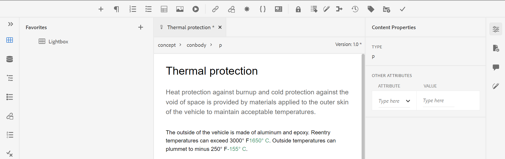

# Lancement de l’éditeur web {#id2056B0140HS}

Vous pouvez lancer l’éditeur Web à partir des emplacements suivants :

- [Page de navigation AEM](#id2056BG00RZJ)
- [Interface utilisateur d’AEM Assets](#id2056BG0307U)
- [Console de mappage DITA](#id2056BG090BF)

Les sections suivantes présentent les détails de la manière dont vous pouvez accéder à l’éditeur Web et le lancer à partir de différents emplacements.

## Page de navigation AEM {#id2056BG00RZJ}

Lorsque vous vous connectez à AEM, la page Navigation s’affiche :

{width="800" align="left"}

Cliquez sur le lien **Guides** pour accéder directement à l’éditeur Web.

{width="800" align="left"}

Comme vous avez lancé l’éditeur Web sans sélectionner de fichier, un écran d’éditeur Web vierge s’affiche. Vous pouvez ouvrir un fichier pour le modifier à partir du référentiel AEM ou de votre collection Favoris.

- Cliquez sur l’icône **Guides** ( ) pour revenir à la page de navigation AEM.

- Le bouton **Fermer** permet d’accéder à une destination en fonction de votre configuration :

  

  
 Services cloud 

  Si vous utilisez des Cloud Service, cliquez sur le bouton **Fermer** pour revenir à la page de navigation AEM.
  

  

  
 Logiciel On-Premise

  Si vous utilisez le logiciel AEM Guides On-premise (4.2.1 et versions ultérieures), cliquez sur le bouton **Fermer** situé à droite pour revenir à votre chemin d’accès au fichier actuel dans l’interface utilisateur d’Assets.

  

## Interface utilisateur d’AEM Assets {#id2056BG0307U}

L’interface utilisateur d’AEM Assets vous permet également de lancer l’éditeur web. Vous pouvez sélectionner une ou plusieurs rubriques et les ouvrir directement dans l’éditeur web. Pour ouvrir une rubrique dans l’éditeur web, procédez comme suit :

1. Dans l’interface utilisateur d’Assets, accédez à la rubrique que vous souhaitez modifier.

   >[!NOTE]
   >
   > Vous pouvez également voir l’UUID de la rubrique.

   .

   {width="800" align="left"}

   >[!IMPORTANT]
   >
   > Assurez-vous que vous disposez des autorisations de lecture et d’écriture sur le dossier contenant la rubrique que vous souhaitez modifier.

1. Pour obtenir un verrou exclusif sur la rubrique, sélectionnez la rubrique et cliquez sur **Extraire**.

   >[!IMPORTANT]
   >
   > Si votre administrateur a configuré l’option **Désactiver la modification sans extraction**, vous devez extraire le fichier avant de le modifier. Si vous n’extrayez pas le fichier, vous ne pourrez pas voir l’option de modification.

1. Fermez le mode de sélection de la ressource et cliquez sur la rubrique à modifier.

   L’aperçu de la rubrique s’affiche.

   Vous pouvez ouvrir l’éditeur Web en mode Liste, Carte et Aperçu.

   >[!IMPORTANT]
   >
   > Si vous souhaitez ouvrir plusieurs rubriques en vue de les modifier, sélectionnez-les dans l’interface utilisateur d’Assets, puis cliquez sur Modifier. Assurez-vous que le bloqueur de fenêtres contextuelles n’est pas activé dans votre navigateur. Sinon, seule la première rubrique de la liste sélectionnée est ouverte pour modification.

   {width="800" align="left"}

   Si vous ne souhaitez pas prévisualiser une rubrique et que vous souhaitez l’ouvrir directement dans l’éditeur web, cliquez sur l’icône Modifier du menu d’actions rapides en mode Carte :

   {width="800" align="left"}

1. Cliquez sur **Modifier** pour ouvrir la rubrique dans l’éditeur web.

   {width="800" align="left"}

## Console de mappage DITA {#id2056BG090BF}

Pour ouvrir l’éditeur web à partir de la console de mappage DITA, procédez comme suit :

1. Dans l’interface utilisateur d’Assets, accédez au fichier de mappage DITA contenant la rubrique à modifier, puis cliquez dessus.

   La console de mappage DITA s’affiche.

1. Cliquez sur **Rubriques**.

   Une liste des rubriques du fichier de mappage s’affiche. L’UUID des rubriques s’affiche sous le titre de la rubrique.

1. Sélectionnez le fichier de rubrique à modifier.

1. Cliquez sur **Modifier la rubrique**.

   {width="800" align="left"}

1. La rubrique s’ouvre dans l’éditeur Web.

   >[!IMPORTANT]
   >
   > Si votre administrateur a configuré l’option **Désactiver la modification sans extraction**, vous devez extraire le fichier avant de le modifier. Si vous n’extrayez pas le fichier, le document s’ouvre dans l’éditeur en mode lecture seule.

**Rubrique parente :**[ Utilisation de l’éditeur web](web-editor.md)
