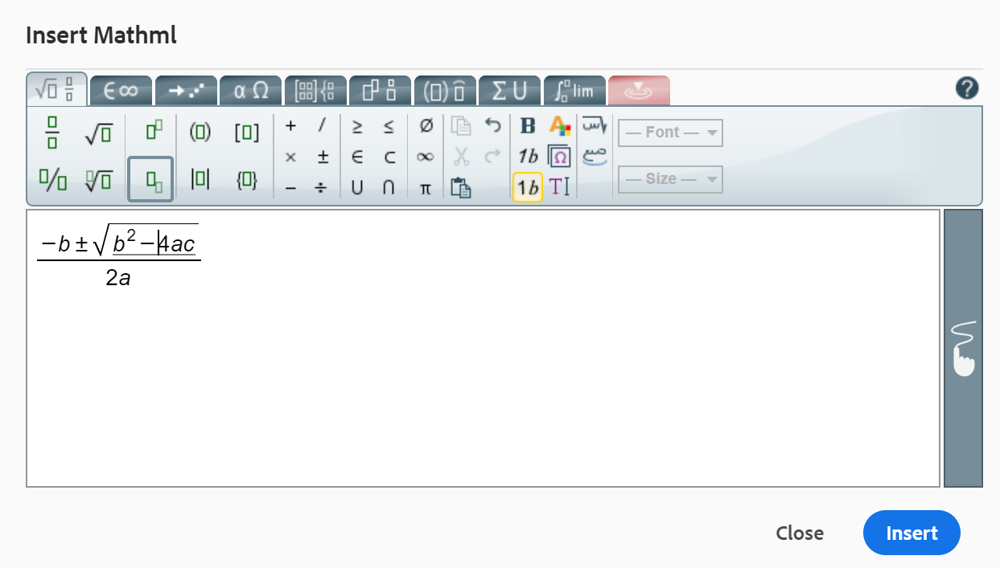
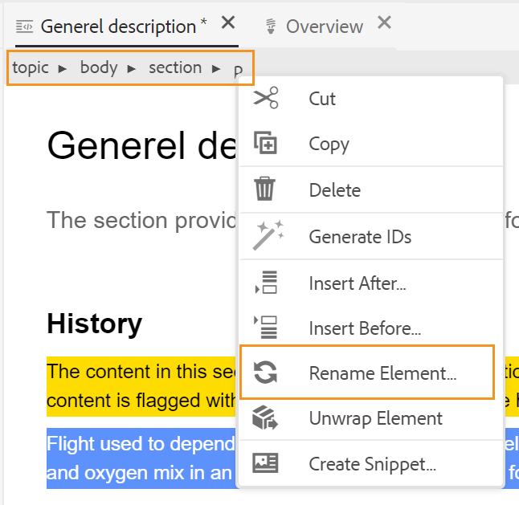

# Autres fonctionnalités de l’éditeur web {#id2056B0B0YPF}

Il existe d’autres fonctionnalités utiles dans l’éditeur web que vous pouvez utiliser :

**Fonctions du menu contextuel sur l’onglet d’un fichier**

Lorsque vous ouvrez un fichier dans l’éditeur Web, vous pouvez effectuer diverses actions à partir du menu contextuel. Vous pouvez afficher différentes options selon que vous ouvrez un fichier multimédia, un fichier DITA unique ou plusieurs fichiers.

**Fichier multimédia**

Vous obtenez les fonctions suivantes dans le menu contextuel de l’onglet d’un fichier multimédia ouvert :

{width="300" align="left"}

**Fichier DITA unique**

Vous obtenez les fonctions suivantes dans le menu contextuel de l’onglet d’un fichier ouvert :

:   {width="300" align="left"}

**Plusieurs fichiers**

Lorsque plusieurs fichiers sont ouverts, vous obtenez d’autres options dans le menu contextuel :

{width="550" align="left"}

Les différentes options du menu contextuel sont expliquées ci-dessous :

***Enregistrer*** : vous pouvez choisir parmi les options suivantes :

- **Enregistrer** : pour enregistrer un fichier sans créer de version, sélectionnez **Enregistrer**. Chaque fois que vous créez une rubrique, une copie de travail sans version de la rubrique est créée dans la gestion des ressources numériques. L’enregistrement de votre document met à jour la copie de travail de votre document dans DAM. L’enregistrement simple de cette version ne crée pas de nouvelle version d’une rubrique. Si votre rubrique est en cours de révision, l’enregistrement d’une rubrique ne permet pas aux réviseurs d’accéder au contenu modifié de la rubrique.

- **Enregistrer tout** : s’il existe plusieurs documents ouverts dans l’éditeur web, vous avez également la possibilité de **Enregistrer tout** les documents ouverts.

***Enregistrer comme nouvelle version***

Pour créer une version du fichier, sélectionnez **Enregistrer comme nouvelle version**. Pour plus d’informations sur **Save** et **Save As New Version**, voir [Know the Web Editor features](web-editor-features.md#) (Connaître les fonctionnalités de l’éditeur web).

***Copier*** : vous pouvez choisir parmi les options suivantes :

- **Copier UUID** : pour copier l’UUID du fichier actuellement actif dans le Presse-papiers, sélectionnez **Copier \> Copier UUID**.
- **Copier le chemin** : pour copier le chemin d’accès complet du fichier actuellement actif dans le Presse-papiers, sélectionnez **Copier \> Copier le chemin d’accès**.

***Localiser dans*** : vous pouvez choisir parmi les options suivantes :

- **Carte** : si vous avez ouvert une carte DITA volumineuse et que vous souhaitez trouver l’emplacement exact d’un fichier dans la carte, sélectionnez **Localiser dans \> Carte**. Lorsque vous sélectionnez l’option Localiser dans la carte , le fichier \(à partir duquel l’option est appelée\) est situé et mis en surbrillance dans la hiérarchie de la carte. Pour pouvoir utiliser cette fonctionnalité, vous devez ouvrir le fichier map dans l’éditeur web. Si la vue Carte est masquée, l’appel de cette fonction affiche la vue Carte et le fichier est mis en surbrillance dans la hiérarchie de la carte.

- **Référentiel** : tout comme Locate in Map, le **Locate In \> Repository** indique l’emplacement du fichier dans le référentiel \(ou DAM\). La vue Repository est ouverte et le fichier sélectionné est mis en surbrillance dans le référentiel. Si le fichier se trouve dans un dossier, ce dossier est développé afin d’afficher l’emplacement du fichier sélectionné dans le référentiel.

***Ajouter à*** : vous pouvez choisir parmi les options suivantes :

- **Favoris** : pour ajouter le fichier sélectionné à la collection préférée, sélectionnez **Ajouter à \> Favoris**. Pour plus d’informations, voir la description de la fonctionnalité **Favoris** dans la section [Panneau de gauche](web-editor-features.md#id2051EA0M0HS) .

- **Contenu réutilisable** : pour copier le fichier sélectionné dans la liste de contenu réutilisable, sélectionnez **Ajouter au contenu réutilisable**. Pour plus d’informations, voir la description de la fonctionnalité **Contenu réutilisable** dans la section [Panneau de gauche](web-editor-features.md#id2051EA0M0HS) .

***Propriétés***

Pour afficher la page des propriétés AEM du fichier sélectionné, sélectionnez **Propriétés**.

***Partage*** : vous pouvez choisir parmi les options suivantes :

**Haut, Bas, Gauche ou Droite**

Par défaut, l’éditeur web vous permet d’afficher une rubrique à la fois. Il peut y avoir des cas où vous souhaitez voir deux rubriques ou plus en même temps. Le fractionnement de l’écran de l’éditeur vous permet d’afficher plusieurs rubriques en même temps. Par exemple, si vous avez deux rubriques - A et B ouvertes dans l’éditeur. Cliquez avec le bouton droit de la souris sur la rubrique B et choisissez **Partage \> Haut** pour diviser la fenêtre de l’éditeur en deux parties. La rubrique B s’affiche dans la moitié supérieure et la rubrique A dans la moitié inférieure. De même, vous pouvez également fractionner l’écran horizontalement en sélectionnant **Partage \> Gauche** ou **Partage \> Droite**. La capture d’écran suivante de l’éditeur web affiche les rubriques divisées horizontalement et verticalement. Dans chaque partage, vous pouvez avoir une vue différente. Par exemple, dans la capture d’écran suivante, l’écran 1 est en mode Source, l’écran 2 comporte deux documents ouverts en mode Création et l’écran 3 en mode Aperçu. Vous pouvez déplacer vos documents d’un écran à l’autre en faisant glisser l’onglet Fichier et en le déposant à l’écran où vous souhaitez les placer. De même, vous pouvez réorganiser les onglets des fichiers en les faisant glisser et en les déplaçant selon vos préférences.

{width="800" align="left"}

***Génération rapide***

Générez la sortie du fichier sélectionné. La sortie ne peut être générée que pour les fichiers faisant partie d’un paramètre prédéfini de sortie. Pour plus d’informations, voir [Publication basée sur un article à partir de l’éditeur web](web-editor-article-publishing.md#id218CK0U019I).

***Fermer*** : vous pouvez choisir parmi les options suivantes :

**Fermer**, **Fermer d’autres** ou **Fermer tout**

Si vous souhaitez fermer le fichier à partir duquel vous avez appelé le menu contextuel, sélectionnez **Fermer \> Fermer**. Utilisez **Fermer \> Fermer les autres** pour fermer tous les autres fichiers ouverts, à l’exception du fichier actuellement actif. Pour fermer tous les fichiers ouverts, sélectionnez l’option **Fermer \> Tout fermer** dans le menu contextuel ou vous pouvez également choisir de fermer l’éditeur Web. Si votre session contient des fichiers non enregistrés, vous êtes invité à les enregistrer.

**Fermeture du fichier et enregistrement de scénarios**

Lorsque vous essayez de fermer un fichier ouvert dans l’éditeur Web à l’aide du bouton **Fermer** de l’onglet du fichier ou de l’option **Fermer** du menu Options, AEM Guides vous invite à enregistrer vos modifications et à déverrouiller un fichier verrouillé.

Les invites sont basées sur les configurations suivantes sélectionnées par votre administrateur :

- **Demandez l’archivage à la fermeture :** Vous avez la possibilité d’archiver le fichier \(que vous avez extrait\) lorsque vous fermez l’éditeur.
- **Demandez une nouvelle version à la fermeture** : vous avez la possibilité d’enregistrer le fichier \(que vous avez modifié\) en tant que nouvelle version lorsque vous fermez l’éditeur.

Votre expérience d’enregistrement de fichier dépendra des trois scénarios suivants, selon lesquels vous aurez :

- Aucune modification du contenu n’a été apportée.
- Modification du contenu et enregistrement des modifications.
- Modification du contenu sans enregistrement des modifications.

Les options suivantes peuvent s’afficher selon que le fichier est verrouillé/déverrouillé et que des modifications ont été enregistrées ou non :

- **Déverrouiller et fermer** : le verrouillage sur le fichier est libéré et le fichier est fermé.

  {width="400" align="left"}

- **Enregistrer comme nouvelle version** : enregistre les modifications que vous avez apportées à votre contenu et crée une nouvelle version de votre fichier. Vous pouvez également ajouter des libellés et des commentaires pour la nouvelle version enregistrée. Pour plus d’informations sur l’enregistrement d’une nouvelle version, voir [Enregistrer comme nouvelle version](web-editor-features.md#save-as-new-version-id209ME400GXA).

- **Déverrouiller le fichier** : si vous choisissez de déverrouiller un fichier, le verrouillage sera libéré sur votre fichier et les modifications seront enregistrées dans la version actuelle du fichier.

  >[!NOTE]
  >
  > Si vous désélectionnez l’option de déverrouillage du fichier, vous avez également la possibilité de fermer le fichier sans enregistrer les modifications.

  Par exemple, l’une des invites s’affiche dans la capture d’écran suivante :

  {width="400" align="left"}

**Indications visuelles pour les références rompues**

- Si votre rubrique contient des références croisées rompues ou des références de contenu, elles s’affichent en rouge.

**Smart copy-paste**

- Vous pouvez facilement copier-coller du contenu dans et entre les rubriques. La structure de l’élément source est conservée à la destination. En outre, si le contenu copié contient des références de contenu, même celles-ci sont copiées.

**Mémoriser le dernier emplacement parcouru**

- L’éditeur web fournit une boîte de dialogue de navigation des fichiers intelligents. L’éditeur se souvient du dernier emplacement utilisé lors de l’insertion d’une référence ou d’un contenu. La première fois que vous appelez la boîte de dialogue de navigation des fichiers \(via Insérer une référence ou Insérer réutiliser du contenu\), vous êtes dirigé vers l’emplacement où le document actif est enregistré. Au cours de la même session, si vous essayez d’insérer une autre référence, la boîte de dialogue de recherche de fichier accède automatiquement à l’emplacement à partir duquel vous avez inséré la dernière référence.

>[!NOTE]
>
> Dans le cas d’un fichier image, audio ou vidéo, la boîte de dialogue de recherche de fichier prend par défaut l’emplacement du fichier et non le dernier emplacement utilisé.

**Prise en charge de la publication basée sur les articles**

- À partir de l’éditeur web, vous pouvez générer la sortie pour une ou plusieurs rubriques, ou l’ensemble du mappage DITA. Vous devez créer des paramètres prédéfinis de sortie pour votre mappage DITA, puis vous pouvez facilement générer la sortie pour une ou plusieurs rubriques. Si vous avez mis à jour quelques rubriques dans votre carte, vous pouvez également générer la sortie uniquement pour ces rubriques à partir de l’éditeur web. Pour plus d’informations, voir [Publication basée sur un article à partir de l’éditeur web](web-editor-article-publishing.md#id218CK0U019I).

**Prise en charge des documents Markdown**

- L’éditeur web vous permet d’utiliser des documents Markdown \(.md\) avec vos documents DITA. Vous pouvez facilement créer et prévisualiser un document Markdown dans l’éditeur web et également l’ajouter à votre fichier de mappage via l’éditeur de mappage DITA. Pour plus d’informations, voir [Création de documents Markdown à partir de l’éditeur web](web-editor-markdown-topic.md#).

**Prise en charge de la rubrique de terme du glossaire DITA**

- L’éditeur web prend en charge les termes du glossaire DITA que vous pouvez insérer en ajoutant des éléments `term` ou `abbreviated-form`.

**Insérer des équations MathML**

- Experience Manager Guides offre une prise en charge prête à l’emploi pour l’insertion d’équations MathML par intégration à l’application [MathType Web](https://docs.wiris.com/en/mathtype/mathtype_web/intro) . Pour insérer une équation MathML, sélectionnez l’icône **Insérer l’élément** et saisissez mathml. Lorsque vous sélectionnez un élément mathml dans la liste, la boîte de dialogue **Insérer MathML** s’affiche :

{width="550" align="left"}

À l’aide des outils d’équation MathML, créez votre équation et cliquez sur **Insérer** pour l’ajouter à votre document. L’équation est insérée avec un arrière-plan gris clair, comme illustré ci-dessous :

{width="400" align="left"}

Vous pouvez à tout moment mettre à jour une équation en cliquant avec le bouton droit de la souris sur une équation existante et en sélectionnant **Modifier MathML** dans le menu contextuel.

- **Validation des équations dans l’éditeur MathML**

  Experience Manager Guides valide les équations MathML lorsque vous enregistrez une rubrique qui les contient.
Lorsque vous insérez une équation à l’aide de l’éditeur MathML, Experience Manager Guides surligne l’équation en rouge en cas de problème de syntaxe. Vous pouvez le corriger avant de l’insérer. Si vous n’effectuez aucune modification, mais que vous sélectionnez **Insérer**, un avertissement s’affiche.

  {width="400" align="left"}

  Si vous insérez l’équation MathML qui contient une erreur de syntaxe, une erreur de validation se produit lorsque vous essayez d’enregistrer la rubrique.

**Insérer des notes de bas de page**

- Insérez une note de bas de page dans votre contenu à l’aide de l’élément `fn` . En mode création, la valeur de la note de bas de page s’affiche en ligne avec le contenu. Cependant, lorsque vous passez en mode Aperçu ou publiez votre document, la note de bas de page apparaît à la fin de la rubrique.

**Renommer ou remplacer un élément**

- L’éditeur web affiche le chemin de navigation de l’élément en haut de la rubrique. Si vous souhaitez permuter ou remplacer un élément par un autre élément, vous pouvez le faire à partir du menu contextuel du chemin de navigation. Par exemple, vous pouvez permuter un élément `p` avec `note` ou tout autre élément valide au niveau du contexte.

{width="400" align="left"}

Dans le chemin de navigation, cliquez avec le bouton droit sur le nom d’un élément que vous souhaitez remplacer, puis sélectionnez Renommer l’élément dans le menu contextuel. La boîte de dialogue Renommer l’élément affiche tous les éléments valides autorisés à l’emplacement actuel. Dans la boîte de dialogue Renommer l’élément , sélectionnez l’élément à utiliser. L’élément d’origine est remplacé par le nouvel élément .

Outre le menu contextuel du chemin de navigation, la boîte de dialogue Renommer l’élément est également accessible à partir d’autres emplacements :

- Cliquez sur le nom de l’élément dans le chemin de navigation pour sélectionner le contenu de l’élément et cliquez avec le bouton droit sur le contenu sélectionné pour afficher le menu contextuel.

- Activez la vue Balises, cliquez sur la balise d’ouverture d’un élément, puis cliquez avec le bouton droit sur le contenu sélectionné pour afficher le menu contextuel.

- Vous pouvez accéder à la boîte de dialogue Renommer l’élément en appelant le menu Options d’un élément dans le panneau Contour .

**Placer un élément**

- Le placement d’un élément à la ligne permet d’ajouter une balise d’élément au texte sélectionné. Vous pouvez renvoyer le texte à n’importe quel élément enfant suivant les normes DITA. Par exemple, si vous avez du texte sous un élément `note`, vous pouvez renvoyer le texte à un élément `p`.

  L’option **Placer l’élément** est disponible dans le menu contextuel du chemin de navigation de la rubrique. Pour encapsuler un élément, cliquez avec le bouton droit de la souris sur l’élément et ouvrez le menu contextuel. Sélectionnez l’élément dans la boîte de dialogue **Placer l’élément** . Le texte apparaît dans le nouvel élément.

  Vous pouvez également sélectionner le texte ou l’élément dans le contenu, puis sélectionner l’option **Placer l’élément** dans le menu contextuel.

**Déplacer un élément**

- Le déballage d’un élément vous permet de supprimer la balise d’élément du texte sélectionné et de le fusionner avec son élément parent. Par exemple, si vous disposez d’un élément `p` à l’intérieur d’un élément `note`, vous pouvez décompresser l’élément `p` pour fusionner le texte directement dans l’élément `note`. L’option **Déplacer l’élément** est disponible dans le menu contextuel du chemin de navigation de la rubrique. Pour retirer le retour à la ligne d’un élément, cliquez avec le bouton droit de la souris sur l’élément pour ouvrir le menu contextuel, puis sélectionnez enfin **Déplacer l’élément** pour supprimer l’élément et fusionner le texte de l’élément avec son élément parent.

**Gestion des espaces blancs pour les éléments DITA**

- Dans XML, les espaces blancs comprennent des espaces, des tabulations, des retours chariot et des lignes vierges. Experience Manager Guides convertit plusieurs espaces blancs consécutifs en un seul espace. Cela vous permet de conserver la vue WYSIWYG de l’éditeur web.

  >[!NOTE]
  >
  >Dans certains éléments où les espaces blancs doivent être préservés conformément aux règles DITA, les espaces blancs multiples consécutifs sont conservés. Par exemple, les éléments `<pre>` et `<codeblock>` .

**Préserver les sauts de ligne et la mise en retrait**

- Les éléments DITA contenant des sauts de ligne et des espaces sont pris en charge et rendus selon leur définition en mode Auteur, Source ou Aperçu, ainsi que dans la sortie finale publiée. La capture d’écran suivante montre le contenu de l’élément `msgblock` dans lequel les sauts de ligne et les espaces \(retrait\) ont été conservés :

{width="500" align="left"}

**Gestion des espaces insécables dans l’éditeur web**

- Vous pouvez insérer des espaces insécables dans votre document à l’aide de l’icône **Insérer des caractères spéciaux**  ou des touches de raccourci **Alt** + **Espace**.  Ces espaces insécables apparaissent comme un indicateur lorsque vous modifiez une rubrique dans l’éditeur web. Vous pouvez désactiver l&#39;affichage des espaces insécables avec l&#39;option **Afficher l&#39;indicateur d&#39;espace insécable en mode création** de l&#39;onglet **Apparence** de l&#39;icône **Préférences utilisateur** ...

- Si vous copiez et collez du contenu avec un espace insécable provenant de sources externes dans la vue **Auteur**, l’espace insécable est converti en espace.
Cependant, si vous copiez et collez du contenu avec un espace insécable à partir de la vue **Auteur**, il est conservé.

**ID d’élément auto-généré**

- Vous pouvez générer automatiquement des identifiants pour les éléments de votre rubrique DITA. Ces identifiants sont uniques dans une rubrique DITA. Par exemple, si vous générez des identifiants pour un élément de paragraphe, les identifiants seront p\_1, p2, p\_3, etc. Vous pouvez sélectionner plusieurs éléments et générer des identifiants pour chaque élément sélectionné.

Pour générer automatiquement l’identifiant d’un ou de plusieurs éléments, procédez comme suit :

1. Ouvrez la rubrique dans l’éditeur Web.
1. Sélectionnez le contenu auquel vous souhaitez attribuer des identifiants.
1. Cliquez avec le bouton droit et sélectionnez **Générer les identifiants dans le menu contextuel.**

   Vous pouvez également cliquer avec le bouton droit dans le chemin de navigation et sélectionner **Générer les identifiants**.

**Rubrique parente :**[ Utilisation de l’éditeur web](web-editor.md)
