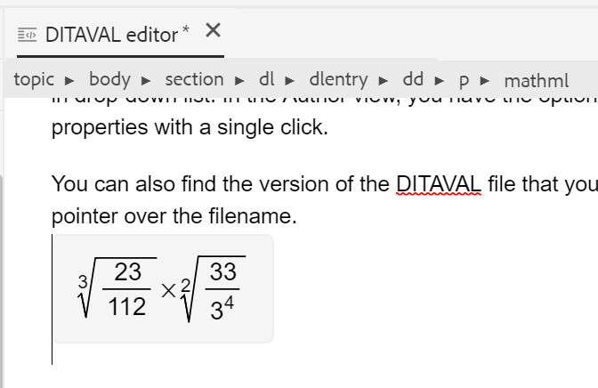
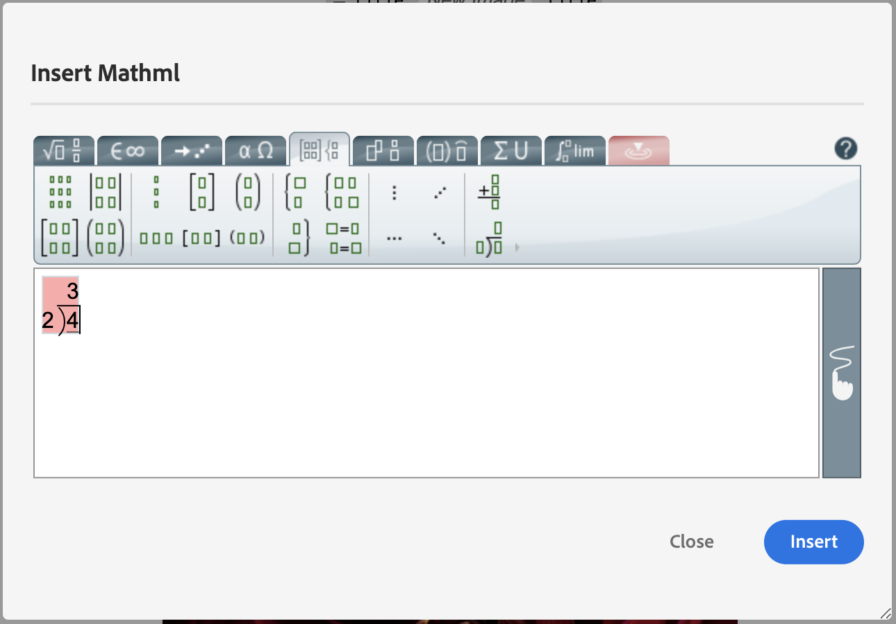

# Autres fonctionnalités de l’éditeur web {#id2056B0B0YPF}

L’éditeur web comporte d’autres fonctionnalités utiles que vous pouvez utiliser :

**Fonctions du menu contextuel dans l’onglet d’un fichier**

Lorsque vous ouvrez un fichier dans l’éditeur web, vous pouvez effectuer différentes actions à partir du menu contextuel. Différentes options peuvent s&#39;afficher selon que vous ouvrez un fichier multimédia, un fichier DITA unique ou plusieurs fichiers.

**Fichier multimédia**

Les fonctions suivantes sont disponibles dans le menu contextuel de l’onglet d’un fichier multimédia ouvert :

{width="300" align="left"}

**Fichier DITA unique**

Le menu contextuel de l’onglet d’un fichier ouvert contient les fonctions suivantes :

:   {width="300" align="left"}

**Plusieurs fichiers**

Lorsque plusieurs fichiers sont ouverts, le menu contextuel propose d’autres options :

{width="550" align="left"}

Les différentes options du menu contextuel sont expliquées ci-dessous :

***Enregistrer*** : vous pouvez choisir parmi les options suivantes :

- **Enregistrer** : pour enregistrer un fichier sans créer de nouvelle version, sélectionnez **Enregistrer**. Chaque fois que vous créez une rubrique, une copie de travail sans version de la rubrique est créée dans la gestion des ressources numériques. L’enregistrement de votre document met à jour la copie de travail de votre document dans la gestion des ressources numériques. Un simple enregistrement sur cette version ne crée pas de nouvelle version d’une rubrique. Si votre rubrique est en cours de révision, l&#39;enregistrement d&#39;une rubrique ne permet pas à vos réviseurs d&#39;accéder au contenu de la rubrique modifiée.

- **Enregistrer tout** : si plusieurs documents sont ouverts dans l’éditeur web, vous avez également la possibilité d’**Enregistrer tout** les documents ouverts.

***Enregistrer Comme Nouvelle Version***

Pour créer une nouvelle version du fichier, sélectionnez **Enregistrer comme nouvelle version**. Pour plus d’informations sur **Enregistrer** et **Enregistrer en tant que nouvelle version**, consultez [Connaître les fonctionnalités de l’éditeur web](web-editor-features.md#).

***Copier*** : vous pouvez choisir parmi les options suivantes :

- **Copier l’UUID** : pour copier l’UUID du fichier actif dans le Presse-papiers, sélectionnez **Copier \> Copier l’UUID**.
- **Copier le chemin** : pour copier dans le presse-papiers le chemin d’accès complet du fichier actif, sélectionnez **Copier \> Copier le chemin**.

***Localiser dans*** : vous pouvez choisir parmi les options suivantes :

- **Mappage** : si vous avez ouvert un plan DITA volumineux et que vous souhaitez trouver l&#39;emplacement exact d&#39;un fichier dans le plan, sélectionnez **Localiser dans \> Mappage**. Lorsque vous sélectionnez l’option Localiser dans le mappage , le fichier \(d’où l’option est appelée\) est situé et mis en surbrillance dans la hiérarchie du mappage. Pour pouvoir utiliser cette fonctionnalité, vous devez ouvrir le fichier de mappage dans l’éditeur web. Si la vue de carte est masquée, l’appel de cette fonction affiche la vue de carte et le fichier est mis en surbrillance dans la hiérarchie de carte.

- **Référentiel** : tout comme Localiser dans Map, **Localiser dans \> référentiel** indique l’emplacement du fichier dans le référentiel \(ou DAM\). La vue du référentiel est ouverte et le fichier sélectionné est mis en surbrillance dans le référentiel. Si le fichier se trouve dans un dossier, ce dossier est développé pour afficher l’emplacement du fichier sélectionné dans le référentiel.

***Ajouter à*** : vous pouvez choisir parmi les options suivantes :

- **Favoris** : pour ajouter le fichier sélectionné à la collection de favoris, sélectionnez **Ajouter aux favoris**. Pour plus d’informations, consultez la description de la fonctionnalité **Favoris** dans la section [Panneau de gauche](web-editor-features.md#id2051EA0M0HS).

- **Contenu réutilisable** : pour copier le fichier sélectionné dans la liste de contenu réutilisable, sélectionnez **Ajouter à \> Contenu réutilisable**. Pour plus d’informations, reportez-vous à la description de la fonctionnalité **Contenus réutilisables** dans la section [Panneau de gauche](web-editor-features.md#id2051EA0M0HS).

***Propriétés***

Pour afficher la page des propriétés AEM du fichier sélectionné, sélectionnez **Propriétés**.

***Fractionner*** : vous pouvez choisir parmi les options suivantes :

**Haut, Bas, Gauche ou Droite**

Par défaut, l’éditeur web vous permet d’afficher une rubrique à la fois. Il peut y avoir des cas où vous souhaitez voir deux sujets ou plus en même temps. Le fractionnement de l’écran de l’éditeur vous permet d’afficher plusieurs rubriques en même temps. Par exemple, si vous avez deux rubriques : A et B ouvertes dans l’éditeur. Cliquez avec le bouton droit sur la rubrique B et choisissez **Fractionner \> vers le haut** pour diviser la fenêtre de l’éditeur en deux parties. La rubrique B est affichée dans la moitié supérieure et la rubrique A est affichée dans la moitié inférieure. De même, vous pouvez également fractionner l’écran horizontalement en sélectionnant **Fractionner \> à gauche** ou **Fractionner \> à droite**. La capture d’écran suivante de l’éditeur web affiche les rubriques divisées horizontalement et verticalement. Dans chaque division, vous pouvez avoir une vue différente. Par exemple, dans la capture d’écran suivante, l’écran 1 est en mode Source, l’écran 2 comporte deux documents ouverts en mode Création et l’écran 3 est en mode Aperçu. Vous pouvez déplacer vos documents d&#39;un écran à l&#39;autre en faisant glisser l&#39;onglet Fichier et en le déposant sur l&#39;écran où vous souhaitez le placer. De même, vous pouvez réorganiser les onglets de fichiers en les faisant glisser et en les déplaçant selon vos préférences.

{width="800" align="left"}

***Génération rapide***

Générer la sortie pour le fichier sélectionné. La sortie ne peut être générée que pour les fichiers qui font partie d’un paramètre prédéfini de sortie. Pour plus d’informations, consultez la section [ Publication basée sur des articles à partir de l’éditeur web ](web-editor-article-publishing.md#id218CK0U019I).

***Fermer*** : vous pouvez choisir parmi les options suivantes :

**Fermer**, **Fermer les autres** ou **Tout fermer**

Pour fermer le fichier à partir duquel vous avez appelé le menu contextuel, sélectionnez **Fermer \> Fermer**. Utilisez **Fermer \> Fermer les autres** pour fermer tous les autres fichiers ouverts, à l’exception du fichier actif. Pour fermer tous les fichiers ouverts, sélectionnez l’option **Fermer \> Fermer tout** dans le menu contextuel. Vous pouvez également choisir de fermer l’éditeur web. Si votre session contient des fichiers non enregistrés, vous êtes invité à les enregistrer.

**Fermer un fichier et enregistrer des scénarios**

Lorsque vous tentez de fermer un fichier ouvert dans l&#39;éditeur Web à l&#39;aide du bouton **Fermer** de l&#39;onglet du fichier ou de l&#39;option **Fermer** du menu Options, AEM Guides vous invite à enregistrer vos modifications et à déverrouiller un fichier verrouillé.

Les invites sont basées sur les configurations suivantes sélectionnées par votre administrateur :

- **Demander l’archivage à la fermeture :** vous avez la possibilité d’archiver le fichier \(que vous avez extrait\) lorsque vous fermez l’éditeur.
- **Demander la nouvelle version à la fermeture** : l’option permettant d’enregistrer le fichier \(que vous avez modifié\) en tant que nouvelle version s’affiche à la fermeture de l’éditeur.

Votre expérience d’enregistrement de fichier dépend des trois scénarios suivants, dans lesquels vous disposez des éléments suivants :

- Aucune modification n’a été apportée au contenu.
- Modifiez le contenu et enregistrez les modifications.
- A modifié le contenu mais n’a pas enregistré les modifications.

Selon que le fichier est verrouillé/déverrouillé et que des modifications ont été enregistrées ou non, les options suivantes peuvent s’afficher :

- **Déverrouiller et fermer** : le verrouillage du fichier est désactivé et le fichier est fermé.

  {width="400" align="left"}

- **Enregistrer en tant que nouvelle version** : les modifications que vous avez apportées à votre contenu seront enregistrées et une nouvelle version de votre fichier sera créée. Vous pouvez également ajouter des libellés et des commentaires pour la version nouvellement enregistrée. Pour plus d’informations sur l’enregistrement d’une nouvelle version, voir [Enregistrer comme nouvelle version](web-editor-features.md#save-as-new-version-id209ME400GXA).

- **Déverrouiller le fichier** : si vous choisissez de déverrouiller un fichier, le verrouillage de votre fichier sera relâché et les modifications seront enregistrées dans la version actuelle du fichier.

  >[!NOTE]
  >
  > Si vous désélectionnez l’option pour déverrouiller le fichier, vous obtenez également une option pour fermer le fichier sans enregistrer les modifications.

  Par exemple, l’une des invites est affichée dans la capture d’écran suivante :

  {width="400" align="left"}

**Repères visuels pour les références rompues**

- Si votre rubrique contient des références croisées ou des références de contenu rompues, elles s&#39;affichent en rouge.

**Copie-collage intelligent**

- Vous pouvez facilement copier et coller du contenu dans et entre des rubriques. La structure de l’élément source est conservée au niveau de la destination. En outre, si le contenu copié contient des références de contenu, même celles-ci sont copiées.

**Mémoriser le dernier emplacement parcouru**

- L’éditeur web fournit une boîte de dialogue de navigation dynamique dans les fichiers. L’éditeur mémorise le dernier emplacement utilisé lors de l’insertion d’une référence ou d’un contenu. La première fois que vous appelez la boîte de dialogue de recherche de fichier \(via Insérer une référence ou Insérer réutiliser le contenu\), vous accédez à l’emplacement où le document actif est enregistré. Au cours de la même session, si vous essayez d’insérer une autre référence, la boîte de dialogue de recherche de fichier permet d’accéder automatiquement à l’emplacement à partir duquel vous avez inséré la dernière référence.

>[!NOTE]
>
> Dans le cas d’un fichier image, audio ou vidéo, la boîte de dialogue de recherche de fichier correspond par défaut à l’emplacement du fichier et non au dernier emplacement utilisé.

**Prise en charge de la publication d’articles**

- Dans l&#39;éditeur Web, vous pouvez générer la sortie pour une ou plusieurs rubriques ou l&#39;ensemble du plan DITA. Vous devez créer des paramètres prédéfinis de sortie pour votre plan DITA, puis vous pouvez facilement générer la sortie pour une ou plusieurs rubriques. Si vous avez mis à jour quelques rubriques dans votre carte, vous pouvez également générer la sortie uniquement pour ces rubriques à partir de l’éditeur web. Pour plus d’informations, consultez la section [ Publication basée sur des articles à partir de l’éditeur web ](web-editor-article-publishing.md#id218CK0U019I).

**Prise en charge des documents Markdown**

- L&#39;éditeur Web vous permet d&#39;utiliser les documents Markdown \(.md\) avec vos documents DITA. Vous pouvez facilement créer et prévisualiser un document Markdown dans l’éditeur web et l’ajouter dans votre fichier map via l’éditeur de map DITA. Pour plus d’informations, voir [Créer des documents Markdown à partir de l’éditeur web](web-editor-markdown-topic.md#).

**Prise en charge du terme de glossaire DITA**

- L&#39;éditeur Web prend en charge les termes du glossaire DITA que vous pouvez insérer en ajoutant des éléments `term` ou `abbreviated-form`.

**Insérer des équations MathML**

- Experience Manager Guides vous offre une prise en charge prête à l’emploi pour insérer des équations MathML par intégration à l’application [MathType Web](https://docs.wiris.com/en/mathtype/mathtype_web/intro). Pour insérer une équation MathML, sélectionnez l&#39;icône **Insérer un élément** et saisissez mathml. Lorsque vous sélectionnez l’élément mathml dans la liste, la boîte de dialogue **Insérer un MathML** s’affiche :

{width="550" align="left"}

À l&#39;aide des outils d&#39;équation de MathML, créez votre équation et cliquez sur **Insérer** pour l&#39;ajouter à votre document. L&#39;équation est insérée avec un arrière-plan gris clair, comme illustré ci-dessous :

{width="400" align="left"}

Vous pouvez à tout moment mettre à jour une équation en cliquant avec le bouton droit de la souris sur une équation existante et en sélectionnant **Modifier MathML** dans le menu contextuel.

- **Validation des équations dans l&#39;éditeur MathML**

  Experience Manager Guides valide les équations de MathML lorsque vous enregistrez une rubrique qui les contient.
Lorsque vous insérez une équation à l’aide de l’éditeur MathML, Experience Manager Guides met l’équation en surbrillance rouge en cas de problèmes de syntaxe. Vous pouvez le corriger avant de l’insérer. Si vous n&#39;apportez aucune modification, mais que vous sélectionnez **Insérer**, un avertissement s&#39;affiche.

  {width="400" align="left"}

  Si vous insérez l&#39;équation MathML qui contient une erreur de syntaxe, une erreur de validation se produit lorsque vous essayez d&#39;enregistrer la rubrique.

**Insérer des notes de bas de page**

- Insérez une note de bas de page dans votre contenu à l’aide de l’élément `fn`. En mode création, la valeur de la note de bas de page s’affiche en ligne avec le contenu. Cependant, lorsque vous basculez en mode Aperçu ou que vous publiez votre document, la note de bas de page s’affiche à la fin de la rubrique.

**Renommer ou remplacer un élément**

- L’éditeur web affiche le chemin de navigation de l’élément en haut de la rubrique. Si vous souhaitez permuter ou remplacer un élément par un autre élément, vous pouvez le faire à partir du menu contextuel du chemin de navigation. Par exemple, vous pouvez permuter `p` élément avec `note` ou tout autre élément valide au niveau du contexte.

{width="400" align="left"}

Dans le chemin de navigation, cliquez avec le bouton droit sur le nom d’un élément à remplacer, puis sélectionnez Renommer l’élément dans le menu contextuel. La boîte de dialogue Renommer l’élément affiche tous les éléments valides autorisés à l’emplacement actuel. Dans la boîte de dialogue Renommer l’élément , sélectionnez l’élément que vous souhaitez utiliser. L’élément d’origine est remplacé par le nouvel élément .

Outre le menu contextuel du chemin de navigation, la boîte de dialogue Renommer l’élément est également accessible à partir d’autres emplacements :

- Cliquez sur le nom de l’élément dans le chemin de navigation pour sélectionner le contenu de l’élément et cliquez avec le bouton droit sur le contenu sélectionné pour afficher le menu contextuel.

- Activez la vue Balises, cliquez sur la balise d’ouverture d’un élément, puis cliquez avec le bouton droit sur le contenu sélectionné pour afficher le menu contextuel.

- Vous pouvez accéder à la boîte de dialogue Renommer l’élément en appelant le menu Options d’un élément dans le panneau Plan.

**Enrouler un élément**

- Envelopper un élément permet d’ajouter une balise d’élément au texte sélectionné. Vous pouvez renvoyer le texte à la ligne sur n&#39;importe quel élément enfant en respectant les normes DITA. Par exemple, si vous avez du texte sous un élément `note`, vous pouvez encapsuler le texte dans un élément `p`.

  L’option **Développer** est disponible dans le menu contextuel du chemin de navigation de la rubrique. Pour encapsuler un élément, cliquez avec le bouton droit de la souris sur l’élément et ouvrez le menu contextuel. Sélectionnez l’élément dans la boîte de dialogue **Enrouler l’élément**. Le texte apparaît dans le nouvel élément.

  Vous pouvez également sélectionner le texte ou l’élément dans le contenu, puis sélectionner l’option **Enrouler l’élément** dans le menu contextuel.

**Déplier un élément**

- Déplier un élément vous permet de supprimer la balise d’élément du texte sélectionné et de le fusionner avec son élément parent. Par exemple, si vous disposez d’un élément `p` dans un élément `note`, vous pouvez déplier l’élément `p` pour fusionner le texte directement dans l’élément `note`. L’option **Déplier l’élément** est disponible dans le menu contextuel du chemin de navigation de la rubrique. Pour déplier un élément, cliquez avec le bouton droit de la souris sur l’élément pour ouvrir le menu contextuel, puis sélectionnez **Déplier l’élément** pour supprimer l’élément et fusionner le texte de l’élément avec son élément parent.

**Gestion des espaces pour les éléments DITA**

- Dans le langage XML, les espaces comprennent les espaces, les tabulations, les retours à la ligne et les lignes vides. Experience Manager Guides convertit plusieurs espaces blancs conséquents en un seul espace. Cela permet de conserver l’affichage WYSIWYG de l’éditeur web.

  >[!NOTE]
  >
  >Dans certains éléments où les espaces blancs doivent être conservés conformément aux règles DITA, les multiples espaces blancs qui en résultent sont conservés. Par exemple, les éléments `<pre>` et `<codeblock>`.

**Conserver les sauts de ligne et la mise en retrait**

- Les éléments DITA contenant des sauts de ligne et des espaces sont pris en charge et rendus conformément à leur définition dans les modes Auteur, Source ou Aperçu, ainsi que dans la sortie publiée finale. La capture d’écran suivante montre le contenu de l’élément `msgblock` dans lequel les sauts de ligne et les espaces \(retrait\) ont été conservés :

{width="500" align="left"}

**Gestion des espaces insécables dans l’éditeur web**

- Vous pouvez insérer des espaces insécables dans votre document à l&#39;aide de l&#39;icône **Insérer des caractères spéciaux**  ou des touches de raccourci **Alt** + **Espace**.  Ces espaces insécables s&#39;affichent en tant qu&#39;indicateurs lorsque vous modifiez une rubrique dans l&#39;éditeur Web. Vous pouvez désactiver l’affichage des espaces insécables à l’aide de l’option **Afficher l’indicateur d’espace insécable en mode création** dans l’onglet **Apparence** de l’**Icône Préférences utilisateur** .

- Si vous copiez et collez du contenu avec un espace insécable à partir de sources externes dans la vue **Auteur**, l’espace insécable est converti en espace.
Cependant, si vous copiez et collez du contenu avec un espace insécable à partir de la vue **Auteur**, il est conservé.

**Générer automatiquement l’identifiant de l’élément**

- Vous pouvez générer automatiquement des identifiants pour les éléments de votre rubrique DITA. Ces identifiants sont uniques dans une rubrique DITA. Par exemple, si vous générez des identifiants pour un élément de paragraphe, les identifiants seront p\_1, p2, p\_3, etc. Vous pouvez sélectionner plusieurs éléments et générer des identifiants pour chaque élément sélectionné.

Procédez comme suit pour générer automatiquement un identifiant pour un ou plusieurs éléments :

1. Ouvrez la rubrique dans l&#39;éditeur Web.
1. Sélectionnez le contenu auquel vous souhaitez attribuer des identifiants.
1. Cliquez avec le bouton droit et sélectionnez **Générer des identifiants dans le menu contextuel**.

   Vous pouvez également cliquer avec le bouton droit dans le chemin de navigation et sélectionner **Générer des identifiants**.

**Rubrique parente :**[ Utiliser l’éditeur web](web-editor.md)
