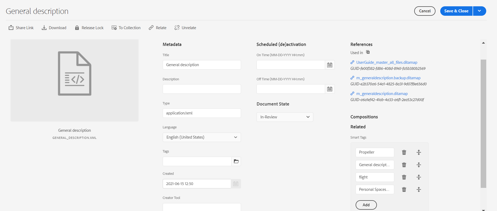

# Balisage intelligent {#id216KH0ID0Y8}

>[!IMPORTANT]
>
> La fonction de balisage intelligent n’est pas disponible par défaut et nécessite une implémentation personnalisée pour laquelle vous devez consulter votre administrateur système.

AEM Guides est fourni avec la fonctionnalité d’ajout de balises intelligentes. Vous pouvez utiliser l’outil d’extraction de mots-clés XML pour extraire des balises intelligentes. Cet outil utilise l’intelligence artificielle pour comprendre le contenu et fournir des mots-clés pertinents. Vous pouvez utiliser des balises intelligentes pour améliorer l’optimisation de votre moteur de recherche \(SEO\) et aider les utilisateurs à trouver votre contenu associé.

Pour créer des balises intelligentes, procédez comme suit :

1. Dans l’interface utilisateur d’Assets, accédez à la rubrique pour laquelle vous souhaitez créer les balises intelligentes.
1. Ouvrez la rubrique en mode Aperçu et sélectionnez l’icône **Retraiter Assets** dans la barre d’outils principale.
1. Sélectionnez Extraction de mots-clés XML pour extraire les mots-clés pertinents.

   {width="300" align="left"}

1. Sélectionnez l’option Exécuter le post-traitement . Un message s’affiche lorsque l’outil a été lancé avec succès.
1. Les balises sont automatiquement extraites et sont visibles dans la page Propriétés de la rubrique sélectionnée.

   {width="800" align="left"}

   >[!NOTE]
   >
   > Outre l’extraction des mots-clés par le biais de l’outil d’extraction de mots-clés XML, vous pouvez également ajouter, supprimer ou personnaliser les balises intelligentes dans la page de propriétés.

*Contactez votre équipe du succès client pour que cette fonctionnalité soit activée dans l’environnement. Cette fonctionnalité n’est pas activée dans le cadre de la prise en charge prête à l’emploi.*

**Rubrique parente :**[ Gérer les métadonnées](manage-metadata.md)
