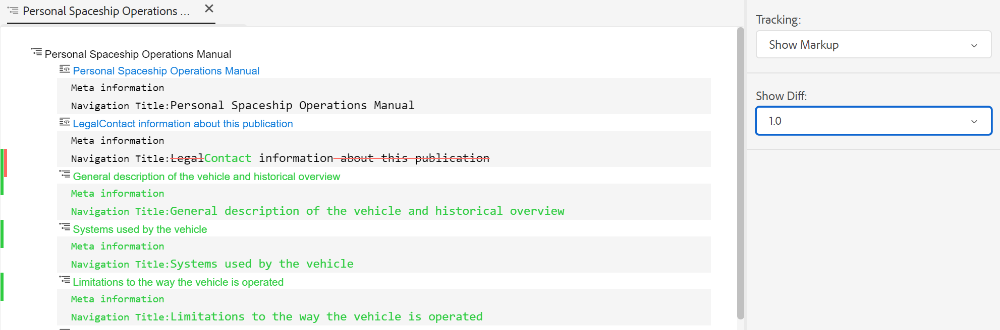
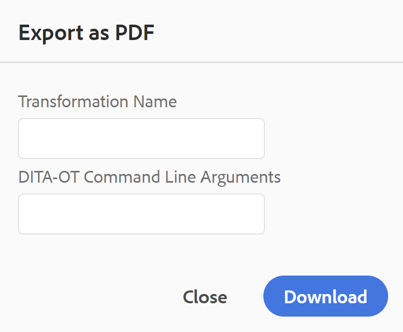

# Affichages de l’éditeur web {#id204GK0D0V5Z}

L’éditeur web d’AEM Guides prend en charge l’affichage de documents dans trois modes ou modes différents :

## Création

Il s’agit d’une vue standard de ce que vous voyez est ce que vous obtenez \(WYSISYG\) de l’éditeur web. Vous pouvez modifier une rubrique comme vous le feriez dans n’importe quel éditeur de texte enrichi ordinaire. Dans la vue Auteur, vous disposez des options permettant d’enregistrer une révision du document, de rechercher et de remplacer le contenu, d’insérer un élément, d’insérer un hyperlien, d’insérer une référence de contenu, etc.

>[!NOTE]
>
> Lorsque vous utilisez la référence au contenu, le contenu référencé s’affiche également en mode Auteur en bleu. Le contenu référencé n’est pas modifiable.

## Source

La vue Source affiche le code XML sous-jacent qui constitue la rubrique. Si vous maîtrisez l’utilisation directe de XML, vous devez utiliser la vue Source. En plus d’effectuer des modifications de texte régulières dans cette vue, vous pouvez également ajouter des éléments et des attributs à l’aide du catalogue dynamique ou rechercher et remplacer du texte, des éléments ou des attributs.

- Pour appeler le catalogue dynamique, placez le curseur à la fin de toute balise d’élément dans laquelle vous souhaitez insérer le nouvel élément et saisissez &quot;&lt;&quot;. L’éditeur affiche la liste de tous les éléments XML valides que vous pouvez insérer à cet emplacement. Utilisez les touches fléchées pour sélectionner l&#39;élément à insérer et appuyez sur Entrée. Lorsque vous saisissez le crochet de fermeture &quot;\>, la balise de fermeture de l’élément est automatiquement ajoutée.

  {width="400" align="left"}

- Vous pouvez également modifier facilement un élément à partir de la vue Source. Par exemple, si vous définissez la balise d’ouverture d’un élément `p` sur `note`, la balise de fermeture `p` est automatiquement remplacée par `/note`. Si vous remplacez un élément par un élément incorrect, l’erreur de validation s’affiche immédiatement.

- Si vous souhaitez ajouter un attribut à un élément, placez le curseur à l’intérieur de la balise d’élément et appuyez sur la barre Espace . Une liste des attributs valides pour cet élément est affichée dans le catalogue dynamique. Utilisez les touches fléchées pour sélectionner l’élément de votre choix et appuyez sur Entrée pour insérer l’élément. Pour spécifier une valeur pour l’attribut, saisissez le signe égal \(=\) et l’éditeur saisit automatiquement les guillemets d’ouverture et de fermeture &quot;&quot; dans lesquels vous pouvez spécifier la valeur de l’attribut.

  {width="350" align="left"}

- Dans la vue Source, il existe une option Retrait automatique qui réorganise le code XML dans un format présentable et facile à lire. En outre, si vous sélectionnez du texte et passez de l’auteur à Source ou de Source à la vue Auteur, le texte sélectionné est également mis en surbrillance dans l’autre vue.
- La validation XML dans votre document constitue une autre fonctionnalité puissante de la vue Source. Si vous ouvrez un document contenant du code XML non valide, il est ouvert dans la vue Source avec les informations sur le code XML non valide. Par exemple, dans la capture d’écran suivante, les informations exactes sur le XML erroné sont données dans la fenêtre contextuelle Erreur d’analyse .

  {width="650" align="left"}

  Dans la capture d’écran ci-dessus, une mise en surbrillance croisée est utilisée pour pointer la ligne contenant du code XML erroné.

- La fonction Rechercher et remplacer vous permet de rechercher n’importe quel texte, élément ou attribut dans la vue Source.
Pour plus d’informations, voir la description de la fonction **Chercher et Remplacer** dans la section [Barre d’outils principale](web-editor-features.md#id#id2051EA0G05Z) .

- La vue Source propose de nombreux raccourcis pour vous aider à naviguer et à travailler rapidement sur un document. Le tableau suivant répertorie les actions prises en charge et leurs raccourcis clavier :

  | Pour ce faire | Utiliser ce raccourci |
  |----------|-----------------|
  | Ajouter plusieurs curseurs | **Ctrl**+Clic gauche |
  | Plusieurs sélections de texte non consécutives | **Ctrl** + clic gauche pour faire glisser et sélectionner du texte |
  | Sélectionner le texte entre les lignes | **Alt**+clic gauche pour faire glisser et sélectionner du texte |
  | Annulation de plusieurs sélections ou fermeture du mode plein écran | **Esc** |
  | Afficher la saisie automatique | **Ctrl**+**Espace** |
  | Accédez à la balise d’ouverture ou de fermeture de la balise active. | **Ctrl**+**J** |
  | Développer ou réduire la balise active et son contenu | **Ctrl**+**Q** |
  | Sélectionner l’élément actif et son contenu | **Ctrl**+**L** |
  | Retrait de l’élément actif | **Shift**+**Tab** |
  | Supprimer l’élément actif et son contenu | **Shift**+**Ctrl**+**K** |
  | Déplacer le curseur d’un mot vers la gauche | **Alt**+**Flèche gauche** |
  | Déplacer le curseur d’un mot vers la droite | **Alt**+**Flèche vers la droite** |
  | Faites défiler une ligne vers le haut sans modifier l’emplacement du curseur. | **Ctrl**+**Flèche vers le haut** |
  | Faites défiler une ligne vers le bas sans modifier l’emplacement du curseur. | **Ctrl**+**Flèche Bas** |
  | Activer/désactiver le mode plein écran | **F11** |
  | Insérer une nouvelle ligne après l’élément actif | **Ctrl**+**Entrée** |
  | Insérer une nouvelle ligne avant l’élément actif | **Maj**+**Ctrl**+**Entrée** |
  | Rechercher et sélectionner l’occurrence suivante du mot actif | **Ctrl**+**D** |
  | Déplacer l’élément actif et son contenu d’un élément vers le haut | **Maj**+**Ctrl**+**Flèche vers le haut** |
  | Déplacer l’élément actif et son contenu d’un élément vers le bas | **Maj**+**Ctrl**+**Flèche vers le bas** |
  | Placer l’élément actif dans la balise de commentaire | **Ctrl**+**/** |
  | Dupliquer l&#39;élément courant et son contenu | **Maj**+**Ctrl**+**D** |
  | Supprimez le texte qui suit le curseur. Si le curseur se trouve avant un élément d’ouverture, l’élément entier est supprimé. | **Ctrl**+**K**+**K** |
  | Supprimez le texte à gauche du curseur sur la ligne actuelle. Si le curseur se trouve après la balise de fermeture d’un élément, l’élément entier est supprimé. | **Ctrl**+**K**+**Retour arrière** |
  | Convertir le texte actuel en majuscules | **Ctrl**+**K**+**U** |
  | Convertir le texte actuel en minuscules | **Ctrl**+**K**+**L** |
  | Faites défiler l’élément actuel vers le centre de l’éditeur. | **Ctrl**+**K**+**C** |
  | Ajouter un curseur au-dessus de la position actuelle | **Ctrl**+**Alt**+**Flèche vers le haut** |
  | Ajoutez un curseur sous la position actuelle. | **Ctrl**+**Alt**+**Flèche vers le bas** |
  | Rechercher de manière récursive le mot actuel \(dans la direction vers l’avant\) | **Ctrl**+**F3** |
  | Recherchez de manière récursive le mot actif \(dans la direction opposée\) | **Shift**+**Ctrl**+**F3** |

## Prévisualisation

L’ouverture d’une rubrique en mode Aperçu affiche l’affichage d’une rubrique lorsqu’elle est consultée par un utilisateur dans son navigateur. Dans le cas d’un mappage DITA, un aperçu du mappage s’affiche, dans lequel un seul document composite de toutes les rubriques du mappage s’affiche.

Le mode Aperçu offre les fonctionnalités suivantes :

- [Affichage du contenu selon des filtres conditionnels](#id2114BI00VXA)
- [Afficher les balises de suivi des modifications](#id2114BJ00CE8)
- [Exportation d’une rubrique en tant que PDF](#id2114BL00B5U)

### Affichage du contenu selon des filtres conditionnels {#id2114BI00VXA}

Si vous avez utilisé des conditions dans votre rubrique ou mappage, celles-ci s’affichent dans le panneau Filtres . Par défaut, toutes les conditions sont sélectionnées et l’intégralité du contenu est affichée. Si vous désélectionnez une condition, le contenu comportant cette condition est supprimé de la vue. Vous pouvez également choisir de mettre en surbrillance le contenu conditionnel.

L’image suivante présente une rubrique qui utilise deux conditions : `Audience` et `Product`. Le contenu conditionnel est mis en surbrillance avec un arrière-plan jaune.

{width="800" align="left"}

### Afficher les balises de suivi des modifications {#id2114BJ00CE8}

Si un document contient des balises de suivi des modifications \(ou des repères visuels\), vous pouvez également prévisualiser le document avec ou sans ces balises. Lors de la prévisualisation d’un document, le panneau de droite contient les options Filtres et Tracking .

{width="400" align="left"}

Vous avez le choix entre trois options **Tracking** :

- **No Markup** : dans cette vue, toutes les insertions et suppressions sont acceptées et une vue simple du document est présentée. Dans cet affichage, vous ne voyez aucune balise de changement de suivi.
- **Original** : dans cette vue, toutes les insertions sont rejetées, toutes les suppressions sont restaurées, puis un aperçu s’affiche. Il vous suffit d’obtenir le formulaire d’origine du document avant d’activer le mode de suivi des modifications.
- **Afficher le balisage** : dans cette vue, vous obtenez toutes les balises pour le contenu inséré et supprimé.

  L’image suivante présente l’aperçu d’un fichier map avec des balises :

  {width="800" align="left"}

### Exportation d’une rubrique en tant que PDF {#id2114BL00B5U}

PDF est l’un des formats de sortie les plus courants utilisés à chaque étape possible du cycle de développement de documents. AEM Guides vous offre la possibilité de générer le PDF d’une rubrique individuelle ou d’un fichier de mappage entier. La fonction Exporter en tant que PDF permet à l’auteur, à l’éditeur ou à un administrateur de générer facilement la sortie du PDF pour une rubrique individuelle. Il utilise les configurations DITA-OT enregistrées au niveau du profil au niveau du dossier pour générer le PDF.

Cette fonctionnalité prend en charge les fonctionnalités suivantes :

- Générez le PDF de la copie de travail active d’une rubrique.
- Acceptez les arguments de ligne de commande et nom de transformation DITA-OT pour générer le PDF.
- Enregistrez la sortie générée sur le système local.
- Résolvez les références de clé et de contenu utilisées dans la rubrique avant de générer la sortie.

Pour exporter une rubrique en tant que PDF, procédez comme suit :

1. Ouvrez la rubrique en mode Aperçu .

1. Cliquez sur l’icône **Exporter en tant que PDF** \(\).

   La boîte de dialogue Exporter en tant que PDF s’affiche.

   {width="350" align="left"}

1. *\(Facultatif\)* Spécifiez le nom de la transformation DITA-OT et tous les arguments de ligne de commande que vous souhaitez utiliser.

1. Cliquez sur **Télécharger**.

   >[!NOTE]
   >
   > Assurez-vous que vous avez activé la fenêtre contextuelle dans la configuration du navigateur, sinon le PDF ne sera pas téléchargé.

   Le PDF est généré et ouvert dans un nouvel onglet ou une boîte de dialogue s’affiche pour enregistrer le PDF sur votre système local.

**Rubrique parente :**[ Utilisation de l’éditeur web](web-editor.md)
