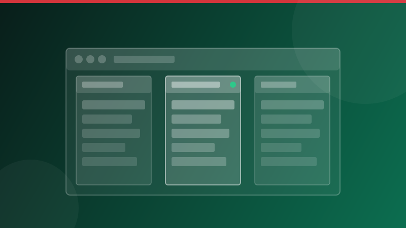
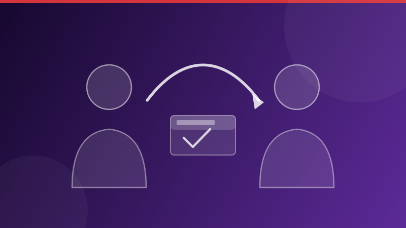

# Documentation de Experience Manager Guides

Experience Manager Guides est un système de gestion de contenu d’entreprise avec prise en charge native de DITA pour la création structurée, la publication multicanal et la gestion du cycle de vie du contenu.

**Déploiement :** [!BADGE Cloud Service]{type=Positive} [!BADGE On-Premise]{type=Informative}

## Commencer par votre rôle

::::landing-cards-container
:::card

Administrateurs

Configurez les profils de dossier, les autorisations, les paramètres de workflow et les modèles de sortie.

[Guide d’administration](./install-conf-guide/introduction.md)
:::

:::card

Auteurs

Créez et gérez des rubriques, des mappages, une réutilisation du contenu et des workflows de révision DITA.

[Présentation de la création](./user-guide/authoring-content.md)
:::

:::card

Editeurs

Configurez les paramètres prédéfinis de sortie, gérez les lignes de base et générez une sortie sur plusieurs canaux.

[Gestion et publication des cartes](./user-guide/map-console-overview.md)
:::

::::

<!--
:::card

Architects

Design DITA specializations, schemas, and content architecture for your implementation.

[DITA specialization](./install-conf-guide/dita-ot-specialization.md)
:::

::::
-->

## Explorer par domaine

<!-- Author note: Six cards wrap to two rows of three in production. The landing-cards-container component is in beta — verify rendering in production before publishing. -->

::::landing-cards-container

:::card

Création

Éditeur web, intégration de FrameMaker, contenu réutilisable et cycles de révision.

[Créer votre contenu](./user-guide/web-editor.md)
:::

:::card

Révision

Consultez les rubriques, gérez les tâches et les notifications de révision.

[Présentation de la révision](./user-guide/review.md)
:::

:::card

Publication

Types de sortie PDF, AEM Sites, HTML5, EPUB et JSON.

[Publier votre contenu](./user-guide/generate-output.md)
:::

:::card

Traduction

Workflows de traduction humaine et automatique de contenu multilingue.

[Traduction du contenu](./user-guide/translation.md)
:::

:::card

Rapports

Liste de rubriques, multimédia, liens rompus et rapports de métadonnées.

[Génération de rapports](./user-guide/reports-intro.md)
:::

:::card

Configuration

Profils de dossier, personnalisation DITA-OT et modèles de sortie.

[Configuration des profils de dossier](./install-conf-guide/conf-profiles.md)
:::

::::

## Nouveautés

<!-- Author note: Update images, badge labels, feature titles, descriptions, and links each release cycle. Images are stored in /assets/. The shade box with a borderless HTML table provides the three-column layout. Blank lines inside each <td> are required for ExL to process badge and bold-link markdown syntax. -->

>[!BEGINSHADEBOX]

<table>
<tr style="border: 0;">
<td>

**[Importer du contenu à l’aide du connecteur Git](./user-guide/web-editor-git-connector.md)**

Importez le contenu dans les guides directement à partir des référentiels Git.

</td>
<td>

**[Nouvelle collection de cartes](./user-guide/generate-output-use-new-map-collection-output-generation.md)**

Interface unifiée pour la gestion des cartes et la publication des sorties.

</td>
<td>

**[Déléguer une tâche de révision](./user-guide/review-complete-review-tasks.md#delegate-a-review-task-to-another-reviewer)**

Les réviseurs peuvent déléguer une tâche de révision à un autre réviseur.

</td>
</tr>
</table>

>[!ENDSHADEBOX]

## Ressources supplémentaires

* [Notes de mise à jour de Cloud Service](./release-info/latest-release-info-cs.md)
* [Notes de mise à jour d’On-Premise](./release-info/latest-release-info.md)
* [Communauté AEM Guides](https://experienceleaguecommunities.adobe.com/adobe-experience-manager-guides-11){target="_blank"}
* [Référentiel GitHub](https://github.com/AdobeDocs/experience-manager-guides.en){target="_blank"}
* [Assistance](https://experienceleague.adobe.com/support/v2/en/){target="_blank"}
* [Tutoriels vidéo](https://experienceleague.adobe.com/en/docs/experience-manager-guides-learn/videos/getting-started/overview){target="_blank"}
