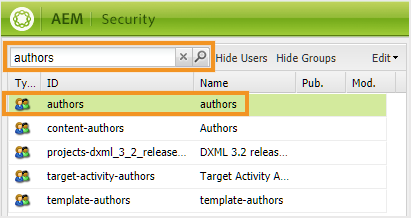

# Configuration de la recherche dans l’interface utilisateur d’AEM Assets {#id192SC800MY4}

Par défaut, AEM ne reconnaît pas le contenu DITA, il ne fournit donc aucun mécanisme pour rechercher le contenu DITA dans son référentiel. En outre, il n’existe aucune fonctionnalité prête à l’emploi pour rechercher du contenu en fonction de leur UUID. AEM Guides vous permet d’ajouter les fonctionnalités de recherche de contenu DITA et de recherche UUID dans le référentiel AEM.

La configuration de la recherche de contenu DITA implique les tâches suivantes :

1. [Ajout d’un composant de recherche d’éléments DITA dans l’interface utilisateur d’Assets](#id192SF0F50HS)
1. [Ajout d’un composant de recherche basé sur l’UUID dans l’interface utilisateur Assets](#id2034F04K05Z)
1. [Octroi d’autorisations aux utilisateurs](#id192SF0G0RUI)
1. [Ajout d’éléments ou d’attributs personnalisés dans la recherche](#id192SF0G10YK)
1. [Extraction des métadonnées du contenu existant](#id192SF0GA0HT)

Outre la fonctionnalité de recherche, vous pouvez configurer les dossiers qui ne doivent pas être inclus dans la recherche. Pour plus d’informations, voir [Exclure les fichiers temporaires des résultats de recherche](#id197AHI0035Z).

## Ajout d’un composant de recherche d’éléments DITA dans l’interface utilisateur d’Assets {#id192SF0F50HS}

Procédez comme suit pour ajouter le composant de recherche de contenu DITA dans l’interface utilisateur d’AEM Assets :

1. Connectez-vous à Adobe Experience Manager en tant qu’administrateur.

1. Cliquez sur le bouton **Adobe Experience Manager** lien dans la partie supérieure et choisissez **Outils**.

1. Sélectionner **Général** dans la liste des outils, puis cliquez sur le **Rechercher dans Forms** mosaïque.

1. Dans le **Rechercher dans Forms** , sélectionnez la variable **Rail de recherche d’administrateurs de ressources**.

1. Cliquez sur **Modifier**.
1. Dans le **Sélectionner un prédicat** , faites défiler jusqu’à la fin de la liste.

1. Glisser-déposer **Prédicat d’élément DITA** à l’emplacement requis dans le formulaire de recherche.

   

1. Cliquez sur **Terminé** pour enregistrer vos modifications.

   Lorsque vous accédez à l’option Filtres dans l’interface utilisateur d’Assets, vous obtenez l’option Filtrage de la recherche des éléments DITA.

   


## Ajout d’un composant de recherche basé sur l’UUID dans l’interface utilisateur Assets {#id2034F04K05Z}

Procédez comme suit pour ajouter un composant de recherche basé sur l’UUID dans l’interface utilisateur d’AEM Assets :

1. Connectez-vous à Adobe Experience Manager en tant qu’administrateur.

1. Cliquez sur le bouton **Adobe Experience Manager** lien dans la partie supérieure et choisissez **Outils**.

1. Sélectionner **Général** dans la liste des outils, puis cliquez sur le **Rechercher dans Forms** mosaïque.

1. Dans le **Rechercher dans Forms** , sélectionnez la variable **Rail de recherche d’administrateurs de ressources**.

1. Cliquez sur **Modifier**.
1. Dans le **Sélectionner un prédicat** , choisissez **Prédicat de propriété** et faites-le glisser à l’emplacement requis dans le formulaire de recherche.

1. Dans le **Paramètres** , fournissez les détails suivants pour la **Prédicat de propriété** component :

   - **Libellé du champ**: UUID
   - **Nom de la propriété**: jcr:content/fmUuid
1. Cliquez sur **Terminé** pour enregistrer vos modifications.

   Lorsque vous accédez à l’option Filtres dans l’interface utilisateur d’Assets, vous obtenez l’option Filtrage de la recherche basé sur l’UUIS.


## Octroi d’autorisations aux utilisateurs {#id192SF0G0RUI}

Les auteurs et les éditeurs doivent disposer d’autorisations explicites pour pouvoir accéder aux fonctionnalités de recherche à partir de l’interface utilisateur d’Assets. Si vous n’accordez pas ces autorisations, vos utilisateurs ne pourront pas rechercher du contenu DITA en fonction de leurs valeurs d’élément/attribut ou UUID.

Effectuez les étapes suivantes pour accorder l’accès à la fonction de recherche DITA :

1. Accédez à la page des autorisations des utilisateurs et des groupes.

1. Recherchez le groupe d’utilisateurs ou un utilisateur individuel auquel vous souhaitez accorder l’accès. Par exemple, pour donner accès à tous les utilisateurs du groupe d’auteurs, saisissez les auteurs dans la variable **Requête de filtre** champ et appuyez sur **Entrée**.

   

1. Sélectionnez la variable **authors** groupe.

1. Dans le volet de droite, sélectionnez la variable **Autorisations** .

1. Accédez à l’emplacement de dossier suivant :

   /conf/global/settings/dam/search

1. Donnez à **Lecture** autorisation sur le dossier de recherche.

   

1. Cliquez sur **Enregistrer**.


L’utilisateur ou le groupe d’utilisateurs sélectionné aura désormais accès à la fonctionnalité de contenu DITA de recherche dans l’interface utilisateur d’Assets.

## Ajout d’éléments ou d’attributs personnalisés dans la recherche {#id192SF0G10YK}

Pour que la recherche DITA fonctionne, un certain prétraitement du contenu DITA est requis. Cette étape de prétraitement extrait le contenu sélectif des différents mappages et rubriques DITA afin qu’il puisse être indexé pour une recherche plus rapide. En interne, ce processus est appelé *Sérialisation*. La sérialisation des fichiers DITA a lieu pendant le chargement du contenu ou peut également être exécutée à la demande. Il utilise un fichier de configuration pour déterminer la quantité de contenu de chaque fichier DITA à indexer. L’emplacement par défaut du fichier de sérialisation est le suivant :

/libs/fmdita/config/serializationconfig.xml

La configuration de recherche par défaut vous permet de rechercher tous les éléments et attributs dans le DITA. `prolog` élément . Si vous souhaitez effectuer une recherche en fonction d’autres éléments ou attributs, vous devez configurer le fichier de sérialisation de la recherche.

>[!NOTE]
>
> Si vous souhaitez utiliser la configuration de recherche par défaut dans la variable `prolog` , vous pouvez ensuite ignorer ce processus.

Ce fichier contient deux sections principales : jeu d’attributs et jeu de règles. Vous trouverez ci-dessous un extrait de la section du jeu de règles :

```
<ruleset filetypes="xml dita"><!-- Element rules --><rule xpath="//[contains(@class, 'topic/topic')]/[contains(@class, 'topic/prolog')]//*[not(*)]" text="yes" attributeset="all-attrs" /><!-- Attribute rules --><rule xpath="//[contains(@class, 'topic/topic')]/[contains(@class, 'topic/prolog')]///@[local-name() != 'class']" /></ruleset>
```

Dans la section du jeu de règles, vous pouvez spécifier :

- Règles d’extraction des éléments

- Règles d’extraction d’attributs


Une règle se compose des éléments suivants :

xpath : il s’agit de la requête XPath qui récupère les éléments ou les attributs des fichiers DITA. La configuration par défaut de la règle d’élément récupère toutes les `prolog` éléments . Et la configuration par défaut de la règle d’attribut récupère tous les attributs de `prolog` éléments . Vous pouvez spécifier une requête XPath pour sérialiser les éléments ou attributs que vous souhaitez rechercher.

La requête XPath contient le nom de classe du type de document. La variable `topic/topic` est utilisée pour les documents DITA de type rubrique. Si vous souhaitez créer une règle pour d’autres documents DITA, vous devez utiliser les noms de classe suivants :

| Type de document | Nom de la classe |
|-------------|----------|
| Thème | - rubrique/rubrique |
| Tâche | - tâche/tâche de rubrique/de rubrique |
| Concept | - concept/thème/thème |
| Référence | - référence/référence de rubrique |
| Map | - map/map |

text : si vous souhaitez rechercher le texte dans l’élément spécifié, indiquez la valeur oui. Si vous spécifiez non comme valeur, seuls les attributs de l’élément sont sérialisés. Les attributs que vous souhaitez rechercher doivent être spécifiés dans la section du jeu d’attributs .

attributeset : spécifiez l’identifiant du jeu d’attributs que vous souhaitez associer à cette règle. La valeur all-attrs est un cas spécial pour indiquer que tous les attributs de cette règle doivent être sérialisés.

Un jeu d’attributs contient une liste d’attributs que vous souhaitez rechercher dans le contenu DITA. Le jeu d’attributs contient les éléments suivants :

id : identifiant unique du jeu d’attributs. Cet identifiant est spécifié dans le paramètre attributeset d’un jeu de règles.

attribute : liste des attributs que vous souhaitez rechercher. Pour chaque attribut, vous devez créer une entrée individuelle dans la variable `attribute` élément .

Effectuez les étapes suivantes pour ajouter des éléments ou des attributs DITA personnalisés dans le fichier de sérialisation de recherche :

1. Utilisez le gestionnaire de modules pour télécharger le fichier /libs/fmdita/config/serializationconfig.xml .

1. Créez un noeud de recouvrement du `config` dans le dossier `apps` noeud .

1. Accédez au fichier de configuration disponible dans le `apps` node:

   `/apps/fmdita/config/serializationconfig.xml`

1. Ajoutez les jeux de règles d’élément ou d’attribut requis.

1. Validez les modifications et exécutez le pipeline Cloud Manager \(CI/CD\) pour déployer les modifications de configuration.


Les nouvelles informations de sérialisation sont stockées et activées pour la recherche. Cependant, vous devez extraire les métadonnées de votre contenu DITA existant pour pouvoir les rechercher.

## Extraction des métadonnées du contenu existant {#id192SF0GA0HT}

Une fois que vous avez apporté des modifications au fichier de sérialisation de recherche par défaut, vous devez activer l’option Extraction des métadonnées DITA dans la variable *com.adobe.config.ConfigManager* regroupez et exécutez ensuite le workflow pour extraire les métadonnées. Cette opération extrait les métadonnées requises des fichiers DITA existants, puis les rend disponibles pour la recherche.

Si vous créez des fichiers ou modifiez un fichier après la mise à jour du fichier de sérialisation, les métadonnées sont automatiquement extraites de ces fichiers. Le processus d’extraction des métadonnées n’est nécessaire que pour les fichiers qui existent déjà dans le référentiel AEM.

L’extraction de métadonnées à partir de fichiers DITA existants implique deux tâches :

1. Activation de l’option d’extraction des métadonnées dans configMgr
1. Exécution du workflow d’extraction des métadonnées

Suivez les instructions de la section [Remplacements de configuration](download-install-additional-config-override.md#) pour créer le fichier de configuration. Dans le fichier de configuration, fournissez les détails \(propriété\) suivants pour configurer l’option d’extraction des métadonnées :

| PID | Clé de propriété | Valeur de la propriété |
|---|------------|--------------|
| `com.adobe.fmdita.config.ConfigManager` | `dita.serialization` | Booléen \(true/false\).<br> **Valeur par défaut**: `false` |

Effectuez les étapes suivantes pour exécuter le workflow d’extraction de métadonnées :

1. Connectez-vous à Adobe Experience Manager en tant qu’administrateur.

1. Cliquez sur le bouton **Adobe Experience Manager** lien dans la partie supérieure et choisissez **Outils**.

1. Sélectionner **Guides** dans la liste des outils, puis cliquez sur l’icône **Extraction de métadonnées DITA** mosaïque.

1. Si vous souhaitez extraire les métadonnées d’un seul fichier et de ses dépendances, cliquez sur le bouton **Sélectionner un fichier** et recherchez un fichier.

1. Si vous souhaitez extraire des métadonnées de plusieurs fichiers dans un dossier, cliquez sur le bouton **Sélectionnez Dossier\(s\)** , recherchez et sélectionnez le dossier requis. Cliquez sur le bouton **Ajouter** pour ajouter le dossier à la liste des tâches de sérialisation.

   >[!NOTE]
   >
   > Vous pouvez sélectionner et ajouter plusieurs dossiers à une tâche de sérialisation.

1. Cliquez sur **Démarrer**.

1. Dans la boîte de dialogue Confirmer l’extraction des métadonnées, cliquez sur **OK**.


## Exclure les fichiers temporaires des résultats de recherche {#id197AHI0035Z}

Par défaut, la recherche est effectuée sur l’ensemble du référentiel d’AEM. Il peut y avoir certains emplacements que vous souhaitez exclure de la recherche. Par exemple, lorsque vous lancez le processus de traduction de contenu, les fichiers non approuvés restent dans un emplacement de dossier temporaire. Lorsque vous effectuez la recherche, les fichiers de cet emplacement temporaire sont également renvoyés dans les résultats de la recherche.

Pour empêcher AEM Guides de rechercher l’emplacement du dossier de traduction temporaire, vous devez ajouter un emplacement de dossier temporaire dans la liste d’exclusion.

Pour exclure le dossier de traduction temporaire de la recherche, procédez comme suit :

>[!NOTE]
>
> Vous pouvez ajouter tout autre emplacement de dossier à la liste d’exclusion en suivant cette procédure. Pour plus d’informations sur l’utilisation des index, voir [Recherche et indexation de contenu](https://experienceleague.adobe.com/docs/experience-manager-cloud-service/operations/indexing.html?lang=fr).

1. Ajoutez la propriété suivante à l’index personnalisé damAssetLucene :

   | Nom de la propriété | Type | Valeur |
   |-------------|----|-----|
   | excludedPaths | String\[\] | Ajoutez la valeur suivante à cette propriété :<br> `/content/dam/projects/translation\_output` |

1. Accédez au noeud lucene disponible à l’emplacement suivant :

   /oak:index/lucene

1. Ajoutez la propriété suivante dans le noeud lucene :

   | Nom de la propriété | Type | Valeur |
   |-------------|----|-----|
   | excludedPaths | String\[\] | Ajoutez les valeurs suivantes à cette propriété :<br> `/content/dam/projects/translation\_output` |
