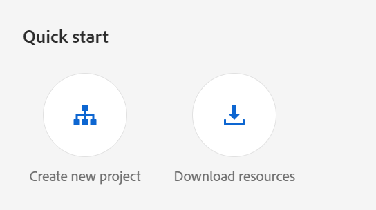

# Configuration de l’assistant de guides optimisé par l’IA pour rechercher du contenu

En tant qu’administrateur, vous pouvez configurer la fonction de l’assistant de Guides pour les auteurs. Le service d’assistant de guides est sécurisé par l’authentification basée sur l’authentification Adobe IMS. Intégrez votre environnement aux processus d’authentification sécurisés par jeton d’Adobe et commencez à utiliser la nouvelle fonctionnalité de l’assistant de guides. Les configurations suivantes vous aident à ajouter l’onglet **Configuration de l’IA** à un profil de dossier. Une fois l’ajout effectué, vous pouvez utiliser la fonction de l’assistant de Guides dans l’éditeur web.

## Création de configurations IMS dans Adobe Developer Console

Effectuez les étapes suivantes pour créer des configurations IMS dans Adobe Developer Console :

>[!NOTE]
>
>Si vous avez déjà créé un projet OAuth pour configurer la fonction de suggestions intelligentes ou la publication basée sur un microservice, vous pouvez ignorer les étapes suivantes pour créer le projet.

1. Lancez [Adobe Developer Console](https://developer.adobe.com/console).
1. Après vous être connecté à Developer Console, vous verrez l’écran **Accueil**. L’écran **Accueil** vous permet de trouver facilement des informations et des liens rapides, y compris des liens de navigation supérieure vers Projets et téléchargements.
1. Pour créer un projet vide, sélectionnez **Créer un projet** à partir des liens **Démarrage rapide**.
    {width="550" align="left"}
   *Créez un projet.*

1. Sélectionnez **Ajouter une API** dans l’écran **Projets** .  L’écran **Ajouter une API** s’affiche. Cet écran affiche toutes les API, événements et services disponibles pour les produits et technologies d’Adobe avec lesquels vous pouvez développer des applications.

1. Sélectionnez l’ **API de gestion I/O** pour l’ajouter à votre projet.
   
   *Ajoutez l’API de gestion I/O à votre projet.*

1. Créez un nouveau **OAuth credential** et enregistrez-le.
    {width="3000" align="left"}
   *Configurez les informations d’identification OAuth sur votre API.*

1. Dans l’onglet **Projects** , sélectionnez l’option **OAuth Server to Server** , puis sélectionnez les informations d’identification nouvellement créées.

1. Sélectionnez le lien **OAuth Server-to-Server** pour afficher les informations d’identification de votre projet.

    {width="800" align="left"}

   *Connectez-vous au projet pour afficher les informations d’identification.*

1. Revenez à l’onglet **Projets** et sélectionnez **Aperçu du projet** sur la gauche.

   

   *Commencez le nouveau projet.*

1. Cliquez sur le bouton **Télécharger** en haut pour télécharger le service JSON.

   

   *Téléchargez les détails du service JSON.*

Vous avez configuré les détails de l’authentification OAuth et téléchargé les détails du service JSON. Conservez ce fichier à portée de main, car cela est nécessaire dans la section suivante.

### Ajout de la configuration IMS à l’environnement

Effectuez les étapes suivantes pour ajouter la configuration IMS à l’environnement :

1. Ouvrez l’Experience Manager, puis sélectionnez votre programme, qui contient l’environnement que vous souhaitez configurer.
1. Passez à l’onglet **Environnements** .
1. Sélectionnez le nom de l&#39;environnement que vous souhaitez configurer. Cela devrait vous permettre d’accéder à la page **Environment Information**.
1. Passez à l’onglet **Configuration** .
1. Mettez à jour le champ JSON SERVICE_ACCOUNT_DETAILS . Assurez-vous d’utiliser le même nom et la même configuration que ceux indiqués dans la capture d’écran suivante.

{width="800" align="left"}


*Ajoutez les détails de configuration de l&#39;environnement.*


Une fois la configuration IMS ajoutée à l’environnement, procédez comme suit pour lier ces propriétés à AEM Guides à l’aide d’OSGi :

1. Dans le code de votre projet Git Cloud Manager, ajoutez les deux fichiers ci-dessous (pour le contenu du fichier, consultez [Annexe](#appendix)).

   * `com.adobe.aem.guides.eventing.ImsConfiguratorService.cfg.json`

1. Assurez-vous que les fichiers nouvellement ajoutés sont couverts par votre `filter.xml`.
1. Validez et poussez vos modifications Git.
1. Exécutez le pipeline pour appliquer les modifications à l’environnement.

Une fois cette opération terminée, vous devriez pouvoir utiliser la fonctionnalité **Guides Assistant**.


## Annexe {#appendix}

**Fichier** :
`com.adobe.aem.guides.eventing.ImsConfiguratorService.cfg.json`

**Contenu** :

```
{
 "service.account.details": "$[secret:SERVICE_ACCOUNT_DETAILS]",
}
```


Une fois que vous avez configuré l’icône **Assistant de guides**  s’affiche dans le panneau droit de l’éditeur Web. Sélectionnez l’icône pour afficher le panneau **Guides Assistant**.
Pour plus d’informations, consultez la section [Assistant de guides optimisé par l’IA pour rechercher du contenu](../user-guide/ai-based-guides-assistant.md) du Guide de l’utilisateur Experience Manager.
