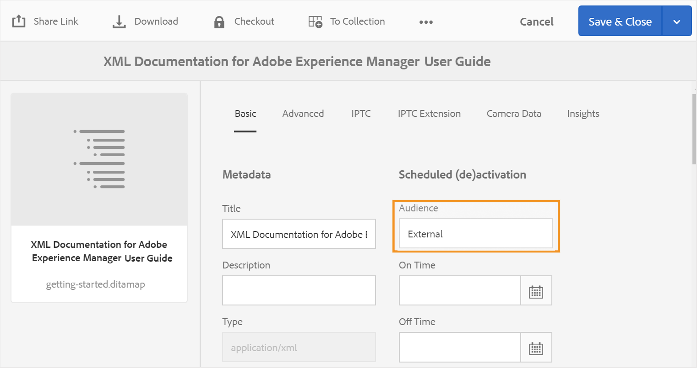

# Configurer les paramètres de génération de sortie {#id181AI0B0E30}

AEM Guides s’accompagne de nombreuses options de configuration vous permettant de personnaliser le processus de génération de sortie. Cette rubrique couvre toutes les configurations et personnalisations qui vous aideraient à configurer votre processus de génération de sortie.

## Configurer l&#39;onglet Ligne de base dans le tableau de bord du plan DITA {#id223MD0D0YRM}

Pour masquer l&#39;onglet Ligne de base dans le tableau de bord du plan DITA, procédez comme suit :

1. Suivez les instructions fournies dans [Remplacements de la configuration](download-install-additional-config-override.md#) pour créer le fichier de configuration.
1. Dans le fichier de configuration, fournissez les détails \(property\) suivants pour configurer l’onglet de ligne de base sur le tableau de bord de mappage.

| PID | Clé de la propriété | Valeur de la propriété |
|---|------------|--------------|
| `com.adobe.fmdita.config.ConfigManager` | `hide.tabs.baseline` | Booléen\(`true/false`\).**Valeur par défaut** : `true` |

>[!NOTE]
>
> Cette configuration est activée par défaut et l’onglet Ligne de base n’est pas disponible sur le tableau de bord des cartes.

## Configuration de la publication mixte dans un site AEM existant {#id1691I0V0MGR}

Si vous disposez d&#39;un site AEM contenant du contenu DITA, vous pouvez configurer la sortie de votre site AEM pour publier du contenu DITA vers un emplacement prédéfini de votre site. Par exemple, dans la capture d&#39;écran ci-dessous d&#39;une page de site AEM, le nœud `ditacontent` est réservé au stockage du contenu DITA :


Les nœuds restants dans la page sont créés directement à partir de l’éditeur de site AEM. La configuration du paramètre de publication pour publier du contenu DITA à un emplacement prédéfini garantit qu&#39;aucun de vos contenus non DITA existants ne sera modifié par le processus de publication AEM Guides.

Vous devez effectuer les configurations suivantes sur votre site existant pour autoriser la publication de contenu DITA sur un nœud prédéfini :

- Configurer les propriétés du modèle de votre site

- Ajouter des nœuds dans votre site pour publier du contenu DITA


Pour configurer les propriétés de modèle de votre site existant, procédez comme suit :

1. Utilisez le gestionnaire de packages pour télécharger le fichier /libs/fmdita/config/templates/default.

   >[!NOTE]
   >
   > Ne rendez aucune personnalisation dans les fichiers de configuration par défaut disponibles dans le nœud `libs`. Vous devez créer un recouvrement du nœud `libs` dans le nœud `apps` et mettre à jour les fichiers requis dans le nœud `apps` uniquement.

1. Ajoutez les propriétés suivantes :

   | Nom de la propriété | Type | Valeur |
   |-------------|----|-----|
   | `topicContentNode` | Chaîne | Indiquez le nom du nœud dans lequel vous souhaitez publier le contenu DITA. Par exemple, le nœud par défaut dans lequel AEM Guides publie le contenu DITA est : <br> `jcr:content/contentnode` |
   | `topicHeadNode` | Chaîne | Indiquez le nom du nœud dans lequel vous souhaitez stocker les informations de métadonnées de votre contenu DITA. Par exemple, le nœud par défaut où AEM Guides stocke les informations de métadonnées est : <br> `jcr:content/headnode` |


La prochaine fois que vous publierez du contenu DITA à l&#39;aide des configurations de modèle de votre site, le contenu sera publié dans les nœuds spécifiés dans les propriétés `topicContentNode` et `topicHeadNode`.

## Personnaliser la sortie du site AEM {#id166TG0B30WR}

AEM Guides prend en charge la création de sorties dans les formats suivants :

- Site AEM
- PDF
- HTML5
- EPUB
- Sortie personnalisée via DITA-OT

Pour la sortie du site AEM, vous pouvez affecter différents modèles de conception avec différentes tâches de sortie. Ces modèles de conception peuvent effectuer le rendu du contenu DITA dans différentes dispositions. Par exemple, vous pouvez spécifier différents modèles de conception pour les audiences internes et externes.

Vous pouvez également utiliser des modules externes DITA Open Toolkit \(DITA-OT\) personnalisés avec AEM Guides. Vous pouvez charger ces plug-ins DITA-OT personnalisés pour générer une sortie PDF d’une manière spécifique.

>[!TIP]
>
> Consultez la section *Publication sur le site AEM* dans le guide des bonnes pratiques pour connaître les bonnes pratiques concernant la création d’une sortie de site AEM.


### Personnaliser le modèle de conception pour générer la sortie {#customize_xml-add-on}

AEM Guides utilise un ensemble de modèles de conception prédéfinis pour générer une sortie de site AEM. Vous pouvez personnaliser les modèles de conception AEM Guides pour générer une sortie conforme à la valorisation de marque de votre entreprise. Un modèle de conception est un ensemble de différents styles \(CSS\), scripts \(côté serveur et côté client\), ressources \(images, logos et autres ressources\) et nœuds JCR qui lient toutes ces ressources. Un modèle de conception peut être aussi simple qu’un script côté serveur unique avec seulement quelques nœuds JCR ou une combinaison complexe de styles, de ressources et de nœuds JCR. Les modèles de conception sont utilisés par le sous-système de publication d’AEM Guides lors de la génération de la sortie du site AEM et contrôlent la structure, l’aspect et la fonctionnalité de la sortie générée.

Il n’existe aucune restriction quant à l’emplacement des ressources du modèle de conception sur le serveur, mais elles sont généralement organisées de manière logique en fonction de leur fonction. Par exemple, tous les fichiers JavaScript et CSS du modèle par défaut sont stockés dans `/etc/designs/fmdita/clientlibs/siteoutput/default` dossier . Où que se trouvent ces fichiers, ils sont liés entre eux par un ensemble de nœuds JCR. Ensemble, ces nœuds JCR et les fichiers constituent l’ensemble du modèle de conception.

Le modèle de conception par défaut fourni avec AEM Guides vous permet de personnaliser les composants des pages de destination, de rubrique et de recherche. Vous pouvez faire une copie de la conception par défaut et des modèles de référence correspondants et spécifier différents composants pour générer la sortie souhaitée.

Effectuez les étapes suivantes pour spécifier votre propre modèle de conception à utiliser pour la génération de sortie du site AEM :

1. Utilisez le gestionnaire de packages pour télécharger le modèle de conception par défaut à partir de l’emplacement suivant :

   /libs/fmdita/config/templates

1. Créez une copie des fichiers téléchargés à l’emplacement suivant dans votre référentiel Git Cloud Manager :

   /apps/fmdita/config/templates

1. Vous devez également télécharger et copier les modèles référencés à partir du nœud de modèle par défaut. Les modèles référencés sont placés sous :

   /libs/fmdita/templates/default/cqtemplates

   Les propriétés du modèle de conception AEM Guides sont décrites dans le tableau ci-après.

   | Propriété | Description |
   |--------|-----------|
   | `landingPageTemplate`, `searchPageTemplate`, `topicPageTemplate`, `shadowPageTemplate` | Spécifiez le nœud `cq:Template` pour ces pages correspondantes \(destination, recherche et rubrique\). Par défaut, le nœud `cq:Template` de ces pages se trouve dans `/libs/fmdita/templates/default/cqtemplates` nœud . Ce nœud définit la structure et les propriétés des pages de destination, de recherche et de rubrique.<br> Le `shadowPageTemplate` est utilisé pour optimiser le contenu segmenté. Vous devez définir la valeur de cette propriété sur : `fmdita/templates/default/cqtemplates/shadowpage` <br> **Remarque :** vous devez spécifier une valeur pour le `topicPageTemplate`. Les propriétés `landingPageTemplate` et `searchPageTemplate` sont facultatives. Si vous ne souhaitez pas que les pages de recherche et de destination soient générées, ne spécifiez pas ces propriétés. |
   | `title` | Nom descriptif de votre modèle de conception. |
   | `topicContentNode` | Emplacement du nœud qui contiendra le contenu DITA dans une page de rubrique. Le chemin d’accès est relatif à la page du topic. |
   | `topicHeadNode` | Emplacement du nœud qui contiendra les valeurs head \(ou metadata\) dérivées du contenu DITA. Le chemin d’accès est relatif à la page du topic. |
   | `tocNode` | Emplacement du nœud qui contiendra la table des matières. Le chemin est relatif à la page de destination ou au chemin de destination. |
   | `basePathProp` | Nom de la propriété servant à stocker le chemin d’accès de la racine du site publié. |
   | `indexPathProp` | Nom de la propriété servant à stocker le chemin d’accès de la page de destination/d’index du site publié. |
   | `pdfPathProp` | Nom de la propriété permettant de stocker le chemin d’accès au PDF de rubrique, si la génération du PDF de rubrique est activée. |
   | `pdfTypeProp` | Nom de la propriété permettant de stocker le type de génération PDF. Actuellement, cette propriété contient toujours « Topic ». |
   | `searchPathProp` | Nom de la propriété servant à stocker le chemin d’accès à la page de recherche, si le modèle inclut une page de recherche. |
   | `siteTitleProp` | Nom de la propriété servant à stocker le titre du site en cours de publication. Ce titre est généralement identique au titre de la carte en cours de publication. |
   | `sourcePathProp` | Nom de la propriété servant à stocker le chemin d&#39;accès de la rubrique DITA source pour la page active. |
   | `tocPathProp` | Nom de la propriété servant à stocker le chemin d’accès de la racine de la table des matières pour le site publié. |


>[!NOTE]
>
> Après avoir créé un nœud de modèle de conception personnalisé, vous devez mettre à jour l’option Conception dans les paramètres prédéfinis de sortie du site AEM pour utiliser le nœud du modèle de conception personnalisé.

Pour plus d’informations, consultez les sections [Création de votre premier site web Adobe Experience Manager](https://experienceleague.adobe.com/docs/experience-manager-learn/getting-started-wknd-tutorial-develop/overview.html?lang=fr) et [Principes de base](https://experienceleague.adobe.com/docs/experience-manager-cloud-service/implementing/developing/full-stack/develop-wknd-tutorial.html?lang=en) du développement de votre propre site web sur AEM.

### Utiliser le titre du document pour générer la sortie du site AEM

Lors de la génération de la sortie du site AEM, la manière dont les URL sont générées joue un rôle important dans la capacité de découverte de votre contenu. Si vous utilisez des noms de fichiers basés sur l’UUID, la génération d’URL basées sur l’UUID de vos fichiers ne sera pas adaptée à la recherche. En tant qu’administrateur ou éditeur, vous avez le contrôle sur la manière dont vous souhaitez générer les URL pour la sortie de votre site AEM. AEM Guides vous offre une configuration qui vous permet de générer les URL de sortie du site AEM à l’aide du titre du fichier plutôt que des noms de fichier basés sur l’UUID. Par défaut, pour les systèmes de fichiers basés sur UUID, cette option est activée. Cela signifie que lorsque vous générez une sortie AEM Site pour des systèmes de fichiers basés sur l’UUID, les titres des fichiers sont utilisés pour générer les URL et non les UUID des fichiers.

>[!NOTE]
>
> Vous pouvez continuer à configurer des règles pour n’autoriser qu’un ensemble de caractères dans les URL d’une sortie de site AEM. Pour plus d’informations, consultez [Configuration des règles d’assainissement de nom de fichier pour créer des rubriques et publier la sortie du site AEM](#id2164D0KD0XA).

Suivez les instructions fournies dans [Remplacements de la configuration](download-install-additional-config-override.md#) pour créer le fichier de configuration. Dans le fichier de configuration, fournissez les détails \(property\) suivants pour configurer la génération des URL dans la sortie du site AEM :

| PID | Clé de la propriété | Valeur de la propriété |
|---|------------|--------------|
| `com.adobe.fmdita.config.ConfigManager` | `aemsite.pagetitle` | Booléen \(true/false\). Si vous souhaitez générer une sortie à l’aide du titre de la page, définissez cette propriété sur true. Par défaut, il est défini pour utiliser le nom de fichier <br>. **Valeur par défaut** : false |

### Configurez l’URL de sortie du site AEM pour utiliser le titre du document

Vous pouvez utiliser les titres du document dans l’URL de la sortie Site AEM. Si le nom de fichier n’existe pas ou contient tous les caractères spéciaux, vous pouvez configurer le système pour remplacer les caractères spéciaux par un séparateur dans l’URL de la sortie du site AEM. Vous pouvez également le configurer pour les remplacer par le nom de la première rubrique enfant.


Pour configurer les noms de page, procédez comme suit :

1. Suivez les instructions fournies dans [Remplacements de la configuration](download-install-additional-config-override.md#) pour créer le fichier de configuration.
1. Dans le fichier de configuration, fournissez les détails (propriété) suivants pour configurer les noms de page pour les rubriques.

| PID | Clé de la propriété | Valeur de la propriété |
|---|------------|--------------|
| `com.adobe.fmdita.common.SanitizeNodeName` | `nodename.systemDefinedPageName` | Booléen (`true/false`). **Valeur par défaut** : `false` |

Par exemple, si le caractère *@navtitle* dans `<topichead>` contient tous les caractères spéciaux et que vous définissez la propriété `aemsite.pagetitle` sur true, alors, par défaut, il utilise un séparateur. Si vous définissez la propriété `nodename.systemDefinedPageName` sur true, elle affiche le nom de la première rubrique enfant.


### Configurez les règles d’assainissement de nom de fichier pour créer des rubriques et publier la sortie dans AEM Sites et d’autres formats {#id2164D0KD0XA}

En tant qu’administrateur, vous pouvez définir une liste de caractères spéciaux valides autorisés dans les noms de fichier, qui constituent à terme l’URL d’une sortie de site AEM. Dans les versions antérieures, les utilisateurs étaient autorisés à définir des noms de fichier contenant des caractères spéciaux tels que `@`, `$`, `>`, etc. Ces caractères spéciaux entraînaient un encodage de l’URL lors de la génération des pages du site AEM.

À partir de la version 3.8, des configurations ont été ajoutées pour définir une liste de caractères spéciaux autorisés dans les noms de fichier. Par défaut, la configuration de nom de fichier valide contient « `a-z A-Z 0-9 - _` ». Cela signifie que lors de la création d’un fichier, vous pouvez avoir n’importe quel caractère spécial dans le titre du fichier, mais qu’en interne, il sera remplacé par un trait d’union \(`-`\) dans le nom du fichier. Par exemple, si le titre du fichier est Introduction 1 ou Introduction@1, le nom de fichier correspondant généré pour ces deux cas serait Introduction-1.

Lorsque vous définissez une liste de caractères valides, n&#39;oubliez pas que ces caractères « `*/:[\]|#%{}?&<>"/+` » et `a space` seront toujours remplacés par un trait d&#39;union \(`-`\).

>[!NOTE]
>
> Si vous ne configurez pas la liste de caractères spéciaux valide, le processus de création de fichier peut vous donner des résultats inattendus.

Suivez les instructions fournies dans [Remplacements de la configuration](download-install-additional-config-override.md#) pour créer le fichier de configuration. Dans le fichier de configuration, fournissez les détails \(property\) suivants pour configurer les caractères spéciaux valides dans les noms de fichier et la sortie de site AEM :

| PID | Clé de la propriété | Valeur de la propriété |
|---|------------|--------------|
| `com.adobe.fmdita.common.SanitizeNodeNameImpl` | `aemsite.DisallowedFileNameChars` | Assurez-vous que la propriété est définie sur ``'<>`@$``. Vous pouvez ajouter d’autres caractères spéciaux à cette liste. |

>[!NOTE]
> 
> La configuration ci-dessus s’applique à tous les formats de sortie. Cela signifie que lors de la génération d’une sortie PDF, HTML ou personnalisée, la sortie finale suivra les règles d’assainissement de nom de fichier configurées.

Vous pouvez également configurer d’autres propriétés, telles que l’utilisation de minuscules dans les noms de fichier, un séparateur pour gérer les caractères non valides et le nombre maximal de caractères autorisés dans les noms de fichier. Pour configurer ces propriétés, ajoutez les paires clé-valeur suivantes dans le fichier de configuration :

| Clé de la propriété | Valeur de la propriété |
|------------|--------------|
| `nodename.uselower` | Booléen \(true/false\).<br> **Valeur par défaut** : true |
| `nodename.separator` | N’importe quel caractère. <br> **Valeur par défaut** : \_ *\(trait de soulignement\)* |
| `nodename.maxlength` | Valeur entière.<br> **Valeur par défaut** : 50 |

### Configuration de l’aplatissement de la structure du nœud de site AEM

Lorsque vous générez une sortie de site AEM, un nœud pour chaque élément des rubriques est créé en interne. Pour un plan DITA comportant des milliers de rubriques, cette structure de nœud peut devenir trop profonde. Ce type de structure de nœud profondément imbriquée peut présenter des problèmes de performances pour les sites de plus grande taille. L’instantané suivant affiche la structure de nœud profondément imbriquée pour une sortie de site AEM :


Dans l’instantané ci-dessus, notez qu’un nœud est créé pour chaque élément `p` et ses sous-éléments suivants et qu’une structure similaire est créée pour tous les autres éléments utilisés dans la rubrique.

AEM Guides vous permet de configurer la manière dont la structure de nœud de sortie du site AEM est créée en interne. Vous pouvez aplatir la structure du nœud sur des éléments spécifiés, ce qui signifie que vous pouvez définir un élément qui sera considéré comme l’élément principal et tous les sous-éléments qu’il contient seront fusionnés avec l’élément principal. Par exemple, si vous décidez d’aplatir l’élément `p`, tout élément apparaissant dans l’élément `p` sera fusionné avec l’élément `p` principal. Aucune note distincte ne serait créée pour un sous-élément dans l’élément `p`. L’instantané suivant affiche la structure du nœud aplatie au niveau de `p` élément :


Pour aplatir la structure du nœud du site AEM, procédez comme suit :

1. Identifiez le ou les éléments auxquels vous souhaitez aplatir la structure de nœud :

1. Recouvrez le nœud `libs` dans le nœud `apps` et ouvrez le fichier elementmapping.xml .

1. Ajoutez la propriété `<flatten>true</flatten>` dans la définition de l’élément au niveau duquel vous souhaitez aplatir la structure de nœud. Par exemple, si vous souhaitez aplatir la structure du nœud au niveau de l’élément `p`, ajoutez l’attribut flatten dans la définition de `p`’élément comme illustré ci-dessous :

   ```XML
   <ditaelement>
         <name>p</name>
         <class>- topic/p</class>
         <componentpath>fmdita/components/dita/wrapper</componentpath>
         <type>COMPOSITE</type>
         <target>para</target>
         <flatten>true</flatten>
         <wrapelement>div</wrapelement>
      </ditaelement>
   ```

   >[!NOTE]
   >
   > Par défaut, la propriété de nœud flatten a été configurée au niveau de l’élément `p`.

1. Suivez les instructions fournies dans [Remplacements de la configuration](download-install-additional-config-override.md#) pour créer le fichier de configuration.
1. Dans le fichier de configuration, fournissez les détails \(property\) suivants :

   | PID | Clé de la propriété | Valeur de la propriété |
   |---|------------|--------------|
   | `com.adobe.dxml.flattening.FlatteningConfigurationService` | `flattening.enabled` | Booléen \(true/false\).<br> **Valeur par défaut** : `false` |


Désormais, lorsque vous générez la sortie du site AEM, les nœuds de l’élément `p` sont aplatis et stockés dans l’élément `p` lui-même. Vous trouverez les nouvelles propriétés d’aplatissement de l’élément `p` dans CRXDE.


**Rechercher une chaîne dans le contenu dans la sortie du site AEM**

Par défaut, vous pouvez rechercher une chaîne dans les titres uniquement dans la sortie du site AEM. Vous pouvez configurer le système pour rechercher une chaîne à la fois dans les titres et dans le contenu ou le corps de la sortie du site AEM.

>[!NOTE]
>
> Parfois, votre recherche peut fonctionner pour certains éléments du contenu, mais vous pouvez la configurer pour qu’elle fonctionne pour l’ensemble du contenu.


Pour activer la recherche, vous devez configurer l’aplatissement de la structure de nœud du site AEM.

ATTENTION :

Vous pouvez rechercher jusqu’à 1 Mo de contenu aplati. Par exemple, dans la capture d’écran précédente, vous pouvez rechercher si le contenu situé sous la balise &lt;p\> est &lt;= 1 Mo.

>[!NOTE]
>
> La recherche fonctionne sur les éléments uniquement si l’attribut `<flatten>` est défini sur true. Par défaut, l’attribut `<flatten>` d’AEM Guides est défini sur true pour les éléments de texte couramment utilisés, tels que &lt;p\> &lt;ul\> &lt;lI\>. Cependant, si vous avez créé des éléments personnalisés, vous devez définir l’attribut `<flatten>` sur true dans le fichier elementmapping.xml.

**Empêcher l’aplatissement de la structure du nœud du site AEM**

Tout comme pour la spécification du nœud à aplatir dans la sortie du site AEM, vous pouvez également spécifier un élément que vous souhaitez exclure de cette configuration. Par exemple, si vous souhaitez aplatir les nœuds au niveau de `body` élément, mais que vous ne souhaitez pas aplatir les éléments `table` dans `body`, vous pouvez ajouter la propriété exclude dans la définition de l’élément `table`.

Pour exclure l’élément `table` de l’aplatissement, ajoutez la propriété suivante à la définition de l’élément `table` :

`<preventancestorflattening>true|false</preventancestorflattening>`

### Configurer le contrôle de version des pages supprimées dans la sortie du site AEM

Lorsque vous générez une sortie de site AEM avec les options **Supprimer et** Créer **&#x200B;**&#x200B;sélectionnées pour le paramètre Pages de sortie existantes , une version est créée pour la ou les pages en cours de suppression. Vous pouvez configurer le système pour arrêter la création d’une version avant la suppression.

Effectuez les étapes suivantes pour arrêter la création d’une version pour la ou les pages en cours de suppression :

1. Suivez les instructions fournies dans [Remplacements de la configuration](download-install-additional-config-override.md#) pour créer le fichier de configuration.
1. Dans le fichier de configuration, fournissez les détails \(property\) suivants pour configurer l’option **Ne pas créer de version pour les pages supprimées** :

   | PID | Clé de la propriété | Valeur de la propriété |
   |---|------------|--------------|
   | `com.adobe.fmdita.confi g.ConfigManager` | `no.version.creation.on.deletion` | Booléen \(true/false\).<br> **Valeur par défaut** : `true` |

   >[!NOTE]
   >
   > Lorsque cette option est sélectionnée, les utilisateurs peuvent supprimer directement une ou plusieurs pages sans créer de version pour eux. Si l’option n’est pas sélectionnée, une version est créée avant la suppression de la ou des pages .

### Configuration d’une réécriture personnalisée avec Experience Manager Guides {#custom-rewriter}

Experience Manager Guides dispose d’un module sling [**rewriter**](https://sling.apache.org/documentation/bundles/output-rewriting-pipelines-org-apache-sling-rewriter.html) personnalisé destiné à gérer les liens générés en cas de mappages croisés (liens entre les rubriques de deux mappages différents). Cette configuration de réécriture est installée au chemin suivant : <br> `/apps/fmdita/config/rewriter/fmdita-crossmap-link-patcher`.

Si votre base de code contient un autre module de réécriture Sling personnalisé, utilisez une valeur de `'order'` supérieure à 50, car le module de réécriture Sling de Experience Manager Guides utilise `'order'` 50.  Pour remplacer ce paramètre, vous avez besoin d’une valeur > 50 . Pour plus d’informations, consultez la section [Pipelines de réécriture de sortie](https://sling.apache.org/documentation/bundles/output-rewriting-pipelines-org-apache-sling-rewriter.html).


## Utilisation des métadonnées dans la publication d’une sortie via DITA-OT {#id191LF0U0TY4}

AEM Guides permet de transmettre des métadonnées personnalisées lors de la publication d’une sortie à l’aide de DITA-OT. En tant qu’administrateur et éditeur, vous devez effectuer les tâches suivantes pour configurer et utiliser des métadonnées personnalisées dans la sortie publiée :

- En tant qu&#39;administrateur, ajoutez les métadonnées requises dans le système afin qu&#39;elles soient disponibles dans la page Propriétés du plan DITA.

- En tant qu&#39;administrateur, ajoutez les métadonnées personnalisées dans la liste de métadonnées afin qu&#39;elles s&#39;affichent dans la console de mappage DITA.

- En tant qu&#39;éditeur, configurez et ajoutez les métadonnées personnalisées avec le plan DITA et générez la sortie requise.


Pour ajouter les métadonnées requises dans le système, procédez comme suit :

1. Connectez-vous à Adobe Experience Manager en tant qu’administrateur.

1. Cliquez sur le lien Adobe Experience Manager en haut et choisissez **Outils**.

1. Sélectionnez **Assets** dans la liste des outils.

1. Cliquez sur la mosaïque **Schémas de métadonnées**.

   La page Forms du schéma de métadonnées s’affiche.

1. Sélectionnez le formulaire **par défaut** dans la liste.

   >[!NOTE]
   >
   > Les propriétés affichées sur la page Propriétés d&#39;un plan DITA sont extraites de ce formulaire.

1. Cliquez sur **Modifier**.

1. Ajoutez les métadonnées personnalisées que vous souhaitez utiliser dans les sorties publiées. Par exemple, nous ajouterons des métadonnées d’audience en procédant comme suit :

   1. Dans la liste des composants **Créer le formulaire**, faites glisser et déposez le composant **Une seule ligne de texte** sur le formulaire.

   2. Sélectionnez le nouveau champ pour ouvrir la **Paramètres** du champ.

   3. Dans le **Libellé du champ**, saisissez le nom des métadonnées : Audience.

   4. Dans le paramètre **Mapper à la propriété**, spécifiez ./jcr:content/metadata/&lt;nom des métadonnées\>. Dans notre exemple, nous la définirons sur ./jcr:content/metadata/audience.

   En procédant comme suit, ajoutez tous les paramètres de métadonnées requis.

1. Cliquez sur **Enregistrer**.


Le nouveau paramètre apparaît désormais dans la page Propriétés de tous les mappages DITA.


Vous devez ensuite rendre les métadonnées personnalisées disponibles dans la console de plan DITA. Effectuez les étapes suivantes pour rendre les métadonnées personnalisées disponibles sur le tableau de bord du plan DITA :

1. Utilisez le gestionnaire de packages pour accéder au fichier metadataList disponible à l’emplacement suivant de votre référentiel Git Cloud Manager :

   /libs/fmdita/config/metadataList

   >[!NOTE]
   >
   > Le fichier metadataList contient une liste des propriétés affichées dans la liste déroulante **Propriétés** d&#39;un plan DITA dans le tableau de bord du plan. Par défaut, ce fichier répertorie quatre propriétés : docstate:language dc:description, dc et dc:title.

1. Ajoutez les métadonnées personnalisées que vous avez ajoutées à la page Forms de schéma de métadonnées . Dans notre exemple, ajoutez le paramètre audience à la fin de la liste par défaut.


Désormais, les métadonnées personnalisées s&#39;affichent dans la liste déroulante **Propriétés** de la console Plan DITA.

Enfin, en tant qu’éditeur, vous devez inclure les métadonnées personnalisées dans la sortie publiée. Pour traiter les métadonnées personnalisées lors de la génération de la sortie, procédez comme suit :

1. Dans l’interface utilisateur d’Assets, accédez au plan DITA à publier.

1. Sélectionnez le fichier de mappage DITA et ouvrez sa page de propriétés.

1. Sur la page Propriétés , spécifiez la valeur des métadonnées personnalisées. Dans notre exemple, nous avons spécifié une valeur externe pour le paramètre d’audience.

   

1. Cliquez sur **Enregistrer et fermer**.

1. Cliquez sur le fichier de plan DITA pour ouvrir la console de plan DITA.

1. Dans l’onglet **Paramètres prédéfinis de sortie**, sélectionnez le paramètre prédéfini de sortie que vous souhaitez utiliser pour générer la sortie.

1. Cliquez sur **Modifier**.

1. Dans la liste déroulante **Propriétés**, sélectionnez les propriétés que vous souhaitez transmettre au processus de publication.

   


Les propriétés/métadonnées sélectionnées sont transmises au processus de publication et sont mises à disposition dans la sortie finale.

### Validation des métadonnées transmises au DITA-OT pour traitement

Pour valider les valeurs de métadonnées transmises à DITA-OT, vous pouvez utiliser un environnement local à l’aide d’un fichier jar prêt pour le cloud. Comme nous ne pouvons pas accéder au système de fichiers local sur le cloud, la seule façon de valider le fichier de métadonnées est via le fichier jar prêt pour le cloud.

- Nom de fichier : metadata.xml
- Emplacement du fichier : crx-quickstart/profiles/ditamaps/&lt;ditamap-1234\>

  Pour accéder au fichier metadata.xml :

   - Connectez-vous à l’emplacement du serveur sur lequel l’instance AEM est en cours d’exécution.
   - Migrez vers crx-quickstart/profiles/ditamaps/&lt;newly-created-directory-name\>/metadata.xml.
- Exemple de format de fichier :

  **metadata.xml**

  ```XML
  <?xml version="1.0" encoding="UTF-8" standalone="no"?>
  <root>
     <Path id="/absolutePath/sampleMap.ditamap">
        <metadata>
           <meta isArray="false" key="dc:description">This is a file</meta>
           <meta isArray="false" key="dc:title">Myfile</meta>
           <meta isArray="true" key="multivalueText">One;Two;Three</meta>
        </metadata>
     </Path>
     <Path id="/absolutePath/sampleTopic.dita">
        <metadata>
           <meta isArray="false" key="dc:description">description for the accountability</meta>
           <meta isArray="false" key="dc:title">accountability title</meta>
           <meta isArray="true" key="multivalueText">value1</meta>
        </metadata>
     </Path>
  </root>
  ```


- isArray : attribut booléen qui définit si les métadonnées sont une propriété \(Array\) à plusieurs valeurs ou non. Les valeurs sont délimitées par un point-virgule.
- ID de chemin d’accès : chemin d’accès absolu au fichier stocké dans le répertoire temporaire.

>[!NOTE]
>
> Si des métadonnées particulières ne sont pas présentes pour le fichier, la balise &lt;meta\> avec la clé n’apparaîtra pas comme propriété pour ce fichier dans le fichier metadata.xml.

## Configurez le champ d&#39;argument de ligne de commande DITA-OT pour accepter les métadonnées de carte racine

Pour utiliser le champ d&#39;argument de ligne de commande DITA-OT afin de transmettre des métadonnées de carte racine, procédez comme suit :

1. Suivez les instructions fournies dans [Remplacements de la configuration](download-install-additional-config-override.md#) pour créer le fichier de configuration.
1. Dans le fichier de configuration, fournissez les détails \(property\) suivants pour configurer le champ d’argument de ligne de commande DITA-OT dans le préréglage :

| PID | Clé de la propriété | Valeur de la propriété |
|---|------------|--------------|
| `com.adobe.fmdita.config.ConfigManager` | `pass.metadata.args.cmd.line` | Booléen\(`true/false`\).**Valeur par défaut** : `true` |

- La définition de la valeur de la propriété sur **true** active la fonctionnalité de ligne de commande DITA-OT, ce qui vous permet de transmettre les métadonnées via la ligne de commande DITA-OT.
- Définir la valeur de la propriété sur **false** désactive la fonctionnalité de ligne de commande DITA-OT. Vous pouvez ensuite utiliser le champ Propriété dans le paramètre prédéfini pour transmettre les métadonnées.


## Personnaliser le mappage d&#39;éléments DITA avec des composants AEM {#id1679J600HEL}

Les éléments DITA dans AEM Guides sont mappés à leurs composants AEM correspondants. AEM Guides utilise ce mappage dans des workflows tels que la publication et la révision pour convertir un élément DITA en composant AEM correspondant. Le mappage est défini dans le fichier `elementmapping.xml`, accessible à l’aide du gestionnaire de packages.

>[!NOTE]
>
> Ne rendez aucune personnalisation dans les fichiers de configuration par défaut disponibles dans le nœud ``libs``. Vous devez créer un recouvrement du nœud ``libs`` dans le nœud ``apps`` et mettre à jour les fichiers requis dans le nœud ``apps`` uniquement.

Vous pouvez utiliser les mappages d&#39;éléments DITA prédéfinis ou mapper des éléments DITA à vos composants AEM personnalisés. Pour utiliser vos composants AEM personnalisés, vous devez connaître la structure du fichier `elementmapping.xml`.

### structure elementmapping.xml

Vous trouverez ci-dessous un aperçu général de la structure `elementmapping.xml` :

1. Chaque élément DITA est d&#39;abord recherché pour un mappage de composant correspondant en fonction du nom de l&#39;élément. Par exemple :

   ```XML
   <ditaelement>     
      <name>**substeps**</name>  
      <class>- topic/ol task/substeps</class>  
      <componentpath>dita/components/ditaolist</componentpath>  
      <type>COMPOSITE</type>  
      <target>para</target>
   </ditaelement>
   ```

   Dans l&#39;exemple ci-dessus, tous les éléments DITA `substeps` sont rendus à l&#39;aide du composant `dita/components/ditaolist`.

1. Si un élément DITA ne trouve pas de correspondance basée sur le nom, une correspondance basée sur le `class` est effectuée. Par exemple :

   ```XML
   <ditaelement>  
      <name>topic</name>  
      <class>**- topic/topic**</class>  
      <componentpath>fmdita/components/dita/topic</componentpath>  
      <type>COMPOSITE</type>  
      <target>para</target>  
      <attributemap> 
         <attribute from="id" to="id" />  
      </attributemap>
   </ditaelement>
   ```

   Dans l’exemple ci-dessus, si aucun mappage n’est défini pour l’élément `task`, l’élément `task` est mappé au composant ci-dessus, car `task` est hérité du composant `topic`.

1. Lorsqu’un élément possède un mappage de composant correspondant, le traitement ultérieur de ses éléments enfants est déterminé par `type`. Par exemple :

   ```XML
   <ditaelement>  
      <name>title</name>  
      <class>- topic/title</class>  
      <componentpath>foundation/components/title</componentpath>  
      <type>**STANDALONE**</type>  
      <target>para</target>  
      <textprop>jcr:title</textprop>
   </ditaelement>
   ```

   `type` prend les valeurs suivantes :

   - COMPOSITE : le mappage élément à composant *continue pour les éléments enfants* également.

   - AUTONOME : les éléments enfants de l’élément actif ne sont *plus mappés*.

   Dans l’exemple ci-dessus, si l’élément `<title>` comporte des éléments enfants, ils ne seront mappés à aucun autre composant. Le composant de `<title>`’élément est responsable du rendu de tous les éléments enfants dans l’élément `<title>`.

1. S&#39;il existe plusieurs composants mappés à un seul élément DITA, la meilleure correspondance pour l&#39;élément est sélectionnée. Pour sélectionner le composant qui correspond le mieux, une spécialisation de domaine et de structure des éléments DITA est prise en compte.

   S’il existe des éléments DITA avec une spécialisation de domaine et qu’un composant est mappé pour la spécialisation de domaine, la priorité élevée est accordée à ce composant.

   De même, si des éléments DITA sont dotés d&#39;une spécialisation structurelle et qu&#39;un composant est mappé pour la spécialisation structurelle, la priorité est accordée à ce composant.

1. Vous pouvez utiliser des `<attributemap>` dans le mappage d’éléments pour mapper des valeurs d’attribut aux propriétés de nœud correspondantes.
1. `textprop` peut être utilisé pour sérialiser le contenu texte d&#39;un élément DITA en une propriété de nœud. En outre, elle peut être utilisée plusieurs fois dans une balise d’élément pour sérialiser le contenu du texte à plusieurs emplacements dans la hiérarchie publiée. Vous pouvez également personnaliser l’emplacement et le nom de la propriété cible. Par exemple :

   ```XML
   <ditaelement>
      <name>title</name>
      <componentpath>foundation/components/title</componentpath>
      <type>STANDALONE</type>
      <target>para</target>
       <textprop>**jcr:title**</textprop>
   </ditaelement>
   ```

   Le mappage de l’élément ci-dessus indique que le contenu textuel de `<title>`’élément sera enregistré en tant que valeur d’une propriété nommée `jcr:title` sur le nœud de sortie.

1. `xmlprop` peut être utilisé pour sérialiser l’intégralité du code XML d’un élément donné en une propriété de nœud. Le composant peut ensuite lire cette propriété de nœud et effectuer un rendu personnalisé. Par exemple :

   ```XML
   <ditaelement>
       <name>svg-container</name>
      <class>+ topic/foreign svg-d/svg-container</class>
       <componentpath>fmdita/components/dita/svg</componentpath>
       <type>STANDALONE</type>
       <target>para</target>
      <xmlprop>**data**</xmlprop>
   </ditaelement>
   ```

   Le mappage d’éléments ci-dessus indique que l’intégralité du balisage XML pour l’élément `<svg-container>` sera enregistrée en tant que valeur d’une propriété nommée `data` sur le nœud de sortie.

1. Il existe un mappage d’attributs spécial pour gérer la résolution de chemin dans le processus de génération de sortie. Par exemple :

   ```XML
   <attributemap>
      <attribute from="href" to="fileReference" ispath="true" rel="source" />
      <attribute from="height" to="height" />
       <attribute from="width" to="width" />
   </attributemap>
   ```

   Pour l&#39;`attributemap` ci-dessus, l&#39;attribut `href` dans votre élément DITA sera mappé à une propriété de nœud nommée `fileReference`. Maintenant que `ispath` est défini sur `true`, le processus de génération de sortie résout ce chemin d’accès, puis le définit dans `fileReference` propriété de nœud .

   Le mode de résolution est déterminé en fonction de la valeur de l’attribut `rel` dans le mappage des attributs.

   - Si `rel=source`, la valeur de `href` est résolue par rapport au fichier source DITA en cours de traitement. La valeur de `href` est résolue et placée dans la valeur de `fileReference` propriété .

   - Si `rel=target`, la valeur de `href` est résolue par rapport à l’emplacement de publication racine. La valeur de `href` est résolue et placée dans la valeur de `fileReference` propriété .

   Si vous ne souhaitez pas qu’un prétraitement ou une résolution se produise sur les attributs de chemin, vous n’avez pas besoin de spécifier l’attribut `ispath`. La valeur est copiée telle quelle et le composant peut effectuer la résolution requise.


### Schéma de l&#39;élément DITA

Voici un exemple du schéma d&#39;élément DITA dans `elementmapping.xml` fichier :

```XML
<ditaelement>        
    <name>element_name</name>    
    <class>element_class</class>    
    <componentpath>fmdita/components/dita/component_name</componentpath>    
    <type>COMPOSITE|STANDALONE</type>     
    <attributeprop>propname_a</attributeprop>      
    <textprop>propname_t</textprop>    
    <xmlprop>propname_x</xmlprop>     
    <xpath>xpath expression string</xpath>     
    <target>head|para</target>     
    <wrapelement>div</wrapelement>     
    <wrapclass>class_name</wrapclass>     
    <attributemap>         
        <attribute from="attrname"         to="propname"         ispath="true|false"         rel="source|target" />    
    </attributemap>    
    <skip>true|false</skip> 
</ditaelement>
```

Le tableau suivant décrit les éléments du schéma d&#39;élément DITA :

| Elément | Description |
|-------|-----------|
| `<ditaelement>` | Nœud de niveau supérieur pour chaque élément de mappage. |
| `<class>` | Attribut class de l&#39;élément DITA cible pour lequel vous créez le composant.<br> Par exemple, l&#39;attribut class pour la rubrique DITA est : <br> `- topic/topic` |
| `<componentpath>` | Chemin CRXDE du composant AEM mappé. |
| `<type>` | Valeurs possibles : <br> -   **COMPOSITE** : traitez également les éléments enfants <br> -   **AUTONOME** : ignore le traitement des éléments enfants |
| `<attributeprop>` | Utilisé pour mapper des attributs et des valeurs DITA sérialisés aux nœuds AEM en tant que propriété. Par exemple, si vous disposez d’`<note type="Caution">` élément et que le composant mappé pour cet élément a `<attributeprop>attr_t</ attributeprop>`, l’attribut et la valeur du nœud sont sérialisés sur `attr_t` propriété du nœud AEM correspondant \( `attr_t->type="caution"`\). |
| `<textprop>propname_t</textprop>` | Enregistrez la sortie `getTextContent()` dans la propriété définie par `propname_t.` <br> **Remarque :** il s’agit d’une propriété optimisée. |
| `<xmlprop>propname_x </xmlprop>` | Enregistrez le code XML sérialisé de ce nœud dans la propriété définie par `propname_x.<br> `**Remarque :** il s’agit d’une propriété optimisée. |
| `<xpath>` | Si l’élément XPath est fourni dans le mappage d’éléments, alors, avec le nom et la classe de l’élément, la condition XPath doit également être remplie pour le mappage de composants à utiliser. |
| `<target>` | Placez l&#39;élément DITA dans le référentiel crx à l&#39;emplacement spécifié.<br> Valeurs possibles : <br> - **head** : sous le nœud head <br> - **text** : sous le nœud paragraph |
| `<wrapelement>` | Élément HTML dans lequel encapsuler le contenu. |
| `<wrapclass>` | La valeur de l’élément dans la propriété `wrapclass.` |
| `<attributemap>` | Nœud conteneur contenant un ou plusieurs nœuds `<attribute>`. |
| `<attribute from="attrname" to="propname" ispath="true\|false" rel="source\|target" />` | Mappe les attributs DITA aux propriétés AEM : <br> -   **`from`** : nom d&#39;attribut DITA <br> -   **`to`** : nom de propriété du composant AEM <br> -   **`ispath`** : si l’attribut est une valeur de chemin \(par exemple : *image*\) <br> -   **`rel`** : si le chemin d’accès est le <br> source ou cible **Remarque :** si `attrname` commence par `%`, mappez `attrname minus '%'` à la prop &#39; `propname`&#39;. |

**Remarques complémentaires**

- Si vous prévoyez de remplacer le mappage d’élément par défaut, il est recommandé de ne pas apporter les modifications dans le fichier `elementmapping.xml` par défaut. Créez un fichier XML de mappage et placez-le à un autre emplacement, de préférence dans le dossier d’applications personnalisées que vous créez.

- Dans le fichier `elementmapping.xml`, il existe de nombreuses entrées de mappage faisant référence au composant fmdita/components/dita/wrapper. Wrapper est un composant générique qui effectue le rendu de constructions DITA relativement simples à l’aide de propriétés sur le nœud de leur site pour générer des HTML pertinentes. Elle utilise la propriété `wrapelement` pour générer des balises englobantes et délègue le rendu enfant aux composants correspondants. Cela s’avère utile dans les cas où vous ne souhaitez qu’un composant de conteneur. Au lieu de créer un composant qui effectue le rendu d’une balise conteneur spécifique telle que `div` ou `p`, vous pouvez utiliser le composant Wrapper avec les propriétés `wrapelement` et `wrapclass` pour obtenir le même effet.

- Il n’est pas recommandé d’enregistrer de grandes quantités de texte dans les propriétés String JCR. Le calcul du type de propriété optimisé dans la génération de sortie garantit que le contenu de texte volumineux n’est pas enregistré en tant que type de chaîne. Au lieu de cela, lorsque du contenu supérieur à un certain seuil doit être enregistré, le type de la propriété est remplacé par binaire. Par défaut, ce seuil est configuré sur 512 octets, mais peut être modifié dans Configuration Manager \(*com.adobe.fmdita.config.ConfigManager*\) en modifiant le paramètre **Enregistrer en tant que seuil binaire**.

- Si vous prévoyez de remplacer certains \(et pas tous\) des mappages d’éléments, vous n’avez pas à répliquer le fichier `elementmapping.xml` entier. Vous devez créer un nouveau fichier de mapping XML et définir uniquement les éléments que vous remplacez.

- Après avoir créé le fichier XML à l’emplacement personnalisé, mettez à jour le paramètre `Override Element Mapping` dans le lot `com.adobe.fmdita.config.ConfigManager`.


## Personnaliser la console de plan DITA {#id188HC08M0CZ}

AEM Guides vous offre la possibilité d&#39;étendre les fonctionnalités de la console de plan DITA. Par exemple, si vous disposez d’un ensemble de rapports différent de celui disponible dans AEM Guides, vous pouvez ajouter ces rapports à la console Carte. Pour personnaliser la console de mappage, vous devez créer une bibliothèque cliente AEM \(ou ClientLib\) qui contiendra le code permettant d’exécuter les fonctionnalités dont vous avez besoin.

>[!NOTE]
>
> Il n’est pas recommandé de modifier directement les composants de page, car ils seront remplacés par de nouvelles versions du produit.

AEM Guides fournit la catégorie `apps.fmdita.dashboard-extn` pour la personnalisation de Map Console. Chaque fois que la console de mappage est chargée, la fonctionnalité créée sous la catégorie `apps.fmdita.dashboard-extn` est exécutée et chargée.

>[!NOTE]
>
> Pour plus d’informations sur la création de la bibliothèque cliente AEM, voir [&#x200B; Utilisation de bibliothèques côté client &#x200B;](https://experienceleague.adobe.com/docs/experience-manager-cloud-service/implementing/developing/full-stack/clientlibs.html?lang=en).

## Gérer le rendu des images pendant la génération de la sortie {#id177BF0G0VY4}

AEM s’accompagne d’un ensemble de workflows et de descripteurs de médias par défaut destinés au traitement des ressources. Dans AEM, il existe des workflows prédéfinis pour gérer le traitement des ressources pour les types MIME les plus courants. En règle générale, pour chaque image chargée, AEM crée plusieurs rendus de la même image au format binaire. Ces rendus peuvent être de tailles différentes, avec une résolution différente, avec un filigrane ajouté ou une autre caractéristique modifiée. Pour plus d’informations sur la façon dont AEM gère les ressources, voir [Traitement d’Assets à l’aide de gestionnaires de médias et de workflows](https://experienceleague.adobe.com/docs/experience-manager-cloud-service/assets/asset-microservices-overview.html?lang=en) dans la documentation d’AEM.

AEM Guides vous permet de configurer le rendu d’image à utiliser au moment de la génération de la sortie de vos documents. Par exemple, vous pouvez choisir l’un des rendus d’image par défaut ou en créer un et l’utiliser pour publier vos documents. Le mappage de rendu d’image pour la publication de vos documents est stocké dans le fichier `/libs/fmdita/config/ **renditionmap.xml**`. Un extrait de fichier `renditionmap.xml` est le suivant :

>[!NOTE]
>
> Il est recommandé de créer une copie du fichier `renditionmap.xml` dans le dossier `apps` pour toutes les personnalisations.

```XML
<renditionmap>
   <mapelement>
      <mimetype>image/png</mimetype>
      <rendition output="AEMSITE">cq5dam.web.1280.1280.jpeg</rendition>
      <rendition output="PDF">original</rendition>
      <rendition output="HTML5">cq5dam.web.1280.1280.jpeg</rendition>
      <rendition output="EPUB">cq5dam.web.1280.1280.jpeg</rendition>
      <rendition output="CUSTOM">cq5dam.web.1280.1280.jpeg</rendition>
   </mapelement>
...
</renditionmap>
```

L’élément `mimetype` spécifie le type MIME du format de fichier. L’élément `rendition output` spécifie le type de format de sortie et le nom du rendu \(par exemple, `cq5dam.web.1280.1280.jpeg`\) qui doit être utilisé pour publier la sortie spécifiée. Vous pouvez spécifier les rendus d’image à utiliser pour tous les formats de sortie pris en charge (AEMSITE, PDF, HTML5, EPUB et CUSTOM).

Si le rendu spécifié n’est pas présent, le processus de publication AEM Guides recherche d’abord le rendu web de l’image donnée. Si le rendu web est introuvable, le rendu original de l’image est utilisé.

>[!NOTE]
>
> Ces rendus d’image contrôlent uniquement la génération de sortie. Le rendu web d’une image est utilisé lorsque vous ouvrez un document pour le prévisualiser ou le réviser.

## Configurer la période de purge automatique pour l’historique de sortie {#id19AAI070V8Q}

Lorsque vous générez une sortie, celle-ci est créée avec les journaux de sortie. Pour les plans DITA volumineux, ces journaux peuvent occuper une grande quantité d&#39;espace dans votre référentiel. Par défaut, les journaux sont stockés à l’emplacement suivant dans le référentiel :

`/var/dxml/metadata/outputHistory`

Sur une période de temps, la taille collective de tous les fichiers journaux pouvait atteindre Go. AEM Guides vous permet de configurer une période pour conserver ces fichiers journaux dans le référentiel. Au bout de la période spécifiée, les journaux ainsi que l’historique de génération de sortie sont supprimés du référentiel.

>[!NOTE]
>
> L’historique de génération des sorties est l’entrée du journal dans la liste Sorties générées de l’onglet Sorties .

La configuration de la fonction de purge de l&#39;historique a un impact sur la génération de sortie pour tous les plans DITA du référentiel. Dans l&#39;onglet Sorties d&#39;un plan DITA, l&#39;historique est purgé après le nombre de jours spécifié et à l&#39;heure spécifiée dans le paramètre.

>[!NOTE]
>
> La suppression des fichiers journaux et de l’historique de génération de sortie n’a aucun impact sur la sortie générée.

Suivez les instructions fournies dans [Remplacements de la configuration](download-install-additional-config-override.md#) pour créer le fichier de configuration. Dans le fichier de configuration, fournissez les détails \(property\) suivants pour définir le jour et l’heure de la purge de l’historique et des journaux de sortie :

| PID | Clé de la propriété | Valeur de la propriété |
|---|------------|--------------|
| `com.adobe.fmdita.config.ConfigManager\|output.history.purgeperiod` | Spécifiez le nombre de jours après lesquels l’historique de sortie et les journaux de sortie sont purgés. Si vous souhaitez désactiver cette fonctionnalité, définissez cette propriété sur 0.Everyday à l’heure spécifiée pour l’exécution du processus de purge sur les sorties générées avant le nombre de jours spécifié dans cette propriété. | **Valeur par défaut** : 5 |
| `output.history.purgetime` | Spécifiez l’heure à laquelle le processus de purge est lancé. | **Valeur par défaut** : 0:00 \(ou 12:00 minuit\) |

## Modifier la limite de la liste de sorties récemment générée {#id1679JH0H0O2}

Vous pouvez modifier le nombre maximal de sorties générées affichées dans l&#39;onglet Sorties d&#39;un plan DITA.

Suivez les instructions fournies dans [Remplacements de la configuration](download-install-additional-config-override.md#) pour créer le fichier de configuration. Dans le fichier de configuration, fournissez les détails \(property\) suivants pour modifier le nombre de sorties à afficher dans la liste :

| PID | Clé de la propriété | Valeur de la propriété |
|---|------------|--------------|
| `com.adobe.fmdita.config.ConfigManager` | `output.historylimit` | Valeur entière.<br> **Valeur par défaut** : 25 |

>[!TIP]
>
> Voir la section *Historique de sortie* dans le guide des bonnes pratiques pour connaître les bonnes pratiques relatives à l’utilisation de l’historique de sortie.

