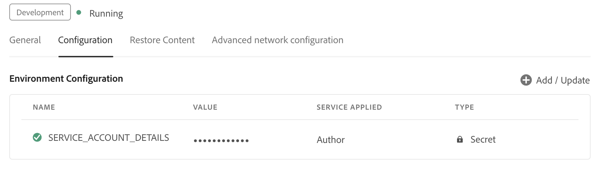

# Configurer l’aide intelligente optimisée par l’IA pour rechercher du contenu

En tant qu’administrateur, vous pouvez configurer la fonction d’aide dynamique pour les auteurs. Le service d’aide dynamique est sécurisé par l’authentification basée sur l’authentification Adobe IMS. Intégrez votre environnement aux workflows d’authentification basée sur les jetons sécurisés d’Adobe et commencez à utiliser la nouvelle fonctionnalité d’aide dynamique. Les configurations suivantes vous aident à ajouter l’onglet **Configuration de l’IA** à un profil de dossier. Une fois l’ajout effectué, vous pouvez utiliser la fonction Aide dynamique dans l’éditeur web.

## Création de configurations IMS dans Adobe Developer Console

Pour créer des configurations IMS dans Adobe Developer Console, procédez comme suit :

>[!NOTE]
>
>Si vous avez déjà créé un projet OAuth pour configurer la fonctionnalité de suggestions intelligentes ou la publication basée sur un microservice, vous pouvez ignorer les étapes suivantes pour créer le projet. Vous pouvez commencer par l’étape 8.

1. Lancer [&#128279;](https://developer.adobe.com/console).
1. Une fois la connexion à Developer Console établie, l’écran **Accueil** s’affiche. L’écran **Accueil** vous permet de trouver facilement des informations et des liens rapides, y compris des liens de navigation supérieure vers les projets et les téléchargements.
1. Pour créer un projet vide, sélectionnez **Créer un projet** parmi les liens **Démarrage rapide**.
    {width="550" align="left"}
   *Créer un projet.*

1. Sélectionnez **Ajouter une API** dans l’écran **Projets**.  L’écran **Ajouter une API** s’affiche. Cet écran affiche tous les API, événements et services disponibles pour les produits et technologies Adobe avec lesquels vous pouvez développer des applications.

1. Sélectionnez l’**API I/O Management** pour l’ajouter à votre projet.
   
   *Ajoutez l’API I/O Management à votre projet.*

1. Créez des informations d’identification **OAuth** et enregistrez-les.
    {width="3000" align="left"}
   *Configurer les informations d’identification OAuth dans votre API.*

1. Dans l’onglet **Projets**, choisissez l’option **OAuth de serveur à serveur** puis sélectionnez les informations d’identification nouvellement créées.

1. Cliquez sur le lien **OAuth de serveur à serveur** pour afficher les informations d’identification de votre projet.

    {width="800" align="left"}

   *Connectez-vous au projet pour afficher les informations d’identification.*

1. Revenez à l’onglet **Projets** et sélectionnez **Présentation du projet** sur la gauche.

   

   *Commencer le nouveau projet.*

1. Cliquez sur le bouton **Télécharger** en haut pour télécharger le fichier JSON du service.

   

   *Téléchargez les détails du service JSON.*

Vous avez configuré les détails d’authentification OAuth et téléchargé les détails du service JSON. Gardez ce fichier à portée de main car il est requis dans la section suivante.

### Ajouter la configuration IMS à l’environnement

Pour ajouter la configuration IMS à l’environnement, procédez comme suit :

1. Ouvrez Experience Manager, puis sélectionnez votre programme, qui contient l’environnement à configurer.
1. Passez à l’onglet **Environnements**.
1. Sélectionnez le nom de l’environnement à configurer. Vous devriez y accéder à la page **Informations sur l’environnement**.
1. Passez à l’onglet **Configuration**.
1. Mettez à jour le champ JSON SERVICE_ACCOUNT_DETAILS . Assurez-vous que vous utilisez le même nom et la même configuration que dans la capture d’écran suivante.

{width="800" align="left"}


*Ajoutez les détails de la configuration de l’environnement.*


Une fois que vous avez ajouté la configuration IMS à l’environnement, procédez comme suit pour lier ces propriétés à AEM Guides à l’aide d’OSGi :

1. Dans le code de votre projet Git Cloud Manager, ajoutez les deux fichiers ci-dessous (pour le contenu des fichiers, consultez l’[Annexe](#appendix)).

   * `com.adobe.aem.guides.eventing.ImsConfiguratorService.cfg.json`

1. Assurez-vous que les fichiers nouvellement ajoutés sont couverts par votre `filter.xml`.
1. Validez et envoyez vos modifications Git.
1. Exécutez le pipeline pour appliquer les modifications à l’environnement.

Une fois cette opération effectuée, vous devriez être en mesure d’utiliser la fonctionnalité **Aide intelligente**.


## Annexe {#appendix}

**Fichier** :
`com.adobe.aem.guides.eventing.ImsConfiguratorService.cfg.json`

**Contenu** :

```
{
 "service.account.details": "$[secret:SERVICE_ACCOUNT_DETAILS]",
}
```


Une fois la configuration effectuée, l’icône **Aide dynamique**  s’affiche dans le panneau droit de l’éditeur web. Sélectionnez l’icône pour afficher le panneau **Aide dynamique**.
Pour plus d’informations, consultez la section Aide intelligente optimisée par [IA pour rechercher du contenu](../user-guide/ai-based-smart-help.md) dans le Guide de l’utilisateur d’Experience Manager.
