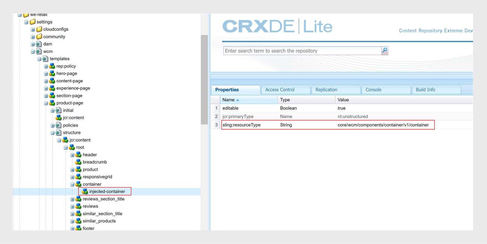

# Télécharger et installer des modèles AEM Sites

Effectuez les étapes suivantes pour télécharger et installer des modèles AEM Sites sur Experience Manager Guides as Cloud Service :

## Installation du package{#package-installation}

Pour utiliser les modèles, installez le package de composants via le déploiement cloud :
- [guides-components-all.zip](https://github.com/adobe/aemg-sites-components/releases/tag/v1.0.0)

Effectuez les étapes suivantes pour créer une AEM Sites à l’aide du modèle :

1. Créez AEM Sites à l’aide du modèle :
1. Dans l’interface utilisateur de Sites, cliquez sur le bouton **Créer** dans le coin supérieur droit.
1. Sélectionnez **Site à partir du modèle** dans la liste déroulante **Créer** .

1. Modèles de sites d&#39;import : [aemg-docs-1.0.0.zip](https://github.com/adobe/aemg-sites-template/releases/tag/v1.0.0) à l&#39;aide de l&#39;option **Importer** .
1. Sélectionnez `AEMG Docs 1.0.0`, puis cliquez sur **Suivant**.
1. Saisissez `Site title` et `Site name`.
1. Cliquez sur **Créer**. Le package est installé et un modèle AEM Sites est créé.

En savoir plus sur [l’ajout d’un modèle de site à AEM](https://experienceleague.adobe.com/en/docs/experience-manager-cloud-service/content/sites/administering/site-creation/site-templates#adding).

>[!NOTE]
>
>Une fois que vous avez créé la page d’accueil, vous pouvez utiliser ce chemin comme **Chemin Publish** pour générer la sortie de vos paramètres prédéfinis AEM Sites. Par exemple, `aemg-docs-en/docs/product-abc`.

## Configuration des modèles à utiliser avec les paramètres prédéfinis AEM Sites

Une fois le package installé, un site nommé **AEMG** est créé dans l’interface utilisateur de Sites. Cet exemple de site montre comment configurer la structure du site pour générer la sortie AEM Sites. Ce n&#39;est qu&#39;un échantillon. Vous pouvez créer des sites personnalisés en fonction de vos besoins.

**AEMG** contient les composants suivants.
- Un dossier pour la langue anglaise (en) est présent dans le dossier **AEMG**. Vous pouvez créer des copies de langue similaires en fonction de vos besoins. Par exemple, un site web multilingue comprend des copies de langue anglaise (en), allemande (de) et française (fr).  Découvrez comment créer une copie de langue à l’aide de l’ [assistant Copie de langue](https://experienceleague.adobe.com/en/docs/experience-manager-65/content/sites/administering/introduction/tc-wizard).
- Dans le dossier English(en) language, Experience Manager Guides fournit de nombreuses pages d’exemple prêtes à l’emploi telles que **Search**, **Sign in**, **Docs** et **Support**.

- **Docs** est l’exemple de page d’accueil de la documentation. Il sert d’emplacement central pour toute la documentation relative aux produits.
et affiche chaque produit pour lequel la documentation est disponible sous la forme de mosaïques individuelles.

- Outre la page d’accueil de la documentation, il existe des exemples de pages pour **Rechercher**, **Se connecter** et **Assistance**. Vous pouvez personnaliser ces exemples selon vos besoins.
- Vous pouvez avoir des pages d’accueil pour des produits individuels tels que Product1. Un exemple de page **Product1** est présent sous **Docs**, qui est la page d’accueil de la documentation.

- Experience Manager Guides fournit également les modèles prédéfinis suivants :

   - Modèle **Page de contenu** : utilisez ce modèle pour créer les pages standard qui contiennent la plupart du contenu du site de produits. Ils peuvent inclure du texte, des images, des vidéos et d’autres éléments de contenu. Ce modèle contient uniquement l’en-tête et le pied de page. Personnalisez et utilisez-la pour créer n’importe quelle page selon vos besoins. Vous pouvez par exemple créer la page d’assistance ou la page de connexion de votre produit.
   - Modèle **Page d’accueil** : page d’entrée principale d’un site web, qui comprend une présentation, des sections clés telles que les éléments et fonctionnalités clés et des liens de navigation. Par exemple, la page principale d’un produit ABC se connecte aux autres pages de contenu ou de fonctionnalités.
   - Modèle **Page de rubrique** : pages utilisées pour organiser et présenter du contenu basé sur des rubriques. Par exemple, un guide de l’utilisateur contient différentes pages de rubrique, chacune d’elles contenant une rubrique spécifique liée aux fonctionnalités et à la résolution des problèmes.

  

Utilisez ces exemples et modèles pour générer vos sorties AEM Sites :
- Une page d’accueil de produit correspond à une page d’accueil de carte et est créée à l’aide du modèle Page d’accueil . Sélectionnez ce chemin dans le paramètre prédéfini AEM Sites pour publier le contenu de la carte sous celui-ci. La page d’accueil du produit peut inclure d’autres pages d’accueil.
- Par exemple, vous disposez d’un produit comme Experience Manager Guides et vous avez besoin de trois manuels pour les utilisateurs, les administrateurs et les développeurs.  Créez une page d’accueil pour chaque manuel à l’aide du modèle Page d’accueil , puis sélectionnez la page d’accueil correspondante dans le paramètre prédéfini de sortie AEM Sites.

Découvrez comment créer et configurer des [paramètres prédéfinis AEM Sites dans l’éditeur web](../user-guide/generate-output-aem-site-web-editor.md).

## Créer une page d’accueil à l’aide du modèle{#create-a-home-page-using-the-template}

Pour créer la page d’accueil de votre produit, procédez comme suit :
1. Une fois le package installé, sélectionnez **Sites** dans la navigation globale.
1. Sélectionnez le modèle &quot;Documents AEM&quot; installé dans l’interface utilisateur de Sites.
1. Dans l’interface utilisateur de Sites, cliquez sur le bouton **Créer** dans le coin supérieur droit.
1. Sélectionnez **Page** dans la liste déroulante **Créer** .
1. Sélectionnez **Home Page**, puis cliquez sur **Next**.
1. Saisissez le Titre du site et le Nom du site, puis cliquez sur **Créer** dans le coin supérieur droit. Un modèle de site AEM est créé à l’aide du modèle de site **Page d’accueil**. Par exemple, vous pouvez créer une page d’accueil pour votre produit `Product ABC`.

>[!NOTE]
>
>Une fois que vous avez créé la page d’accueil, vous pouvez utiliser ce chemin comme **Chemin Publish** pour générer la sortie de vos paramètres prédéfinis AEM Sites. Par exemple, `aemg-docs-en/docs/product-abc`.

## Modification des modèles de rubrique pour AEM Sites

Vous pouvez également personnaliser les modèles de rubrique pour votre AEM Sites. Vous pouvez modifier le contenu ou configurer les propriétés des différents composants d’AEM dans votre rubrique. Par exemple, vous pouvez ajouter ou supprimer des composants selon vos besoins.\
Pour modifier les modèles de rubrique, procédez comme suit :
1. Sélectionnez le modèle que vous souhaitez modifier.
1. Sélectionnez l&#39;icône **Modifier** en haut.

L’éditeur de modèles d’AEM s’ouvre. Vous pouvez modifier le modèle de rubrique. En savoir plus sur la [création de modèles de page](https://experienceleague.adobe.com/en/docs/experience-manager-65/content/sites/authoring/siteandpage/templates#editing-a-template-structure-template-author).

## Personnalisation des modèles AEM Sites existants {#customize-existing-aem-sites-templates}

Outre les modèles prédéfinis, vous pouvez également utiliser vos modèles existants avec les paramètres prédéfinis AEM Sites. Effectuez les étapes suivantes pour personnaliser les modèles AEM Sites existants :

### Configuration de modèle

Vous avez besoin des deux types de modèles suivants :

- Catégorie ou modèle d’entrée : ce modèle est utilisé pour la page d’entrée de la documentation du produit et correspond à un mappage DITA.  AEM Page de site pour un mappage DITA est générée à l’aide de ce modèle. Vous pouvez utiliser ce modèle à n’importe quel niveau.
- Ajoutez un composant de texte à votre modèle existant. Le composant de texte doit avoir une propriété obligatoire, `text="$category.html$"`.
- Par exemple, vous pouvez sélectionner des modèles we-retail et utiliser le modèle section-page comme modèle de page d’entrée pour le mappage DITA. Pour ce faire, effectuez les modifications comme illustré dans la capture d’écran suivante :
  
   - Page de détails ou modèle de page de rubrique : utilisez ce modèle pour le contenu des rubriques d’une carte. Toutes les pages Sites de contenu DITA/XML sont créées à l’aide de modèles de page de rubrique. Pour créer ces modèles, deux conditions préalables sont nécessaires :
      - Ajoutez un composant de texte au modèle, contenu dans un composant de conteneur, avec une propriété obligatoire. `text="$topic.content$"`.

        
      - Reflétez le même conteneur et composant de texte dans la structure du même modèle, comme illustré dans la capture d’écran suivante :

        

### Balisage d’une page de catégorie en tant que conteneur de documentation

En supposant qu’une hiérarchie de site soit créée pour les pages de documentation utilisant le modèle précédent, sélectionnez l’une des pages de catégorie créées dans cette hiérarchie de site. Balisez la page de catégorie en tant que conteneur de documentation en lui attribuant un identifiant.
Pour ce faire, affectez à sa propriété `id` une valeur `category-page`. Reportez-vous à la capture d’écran suivante :

