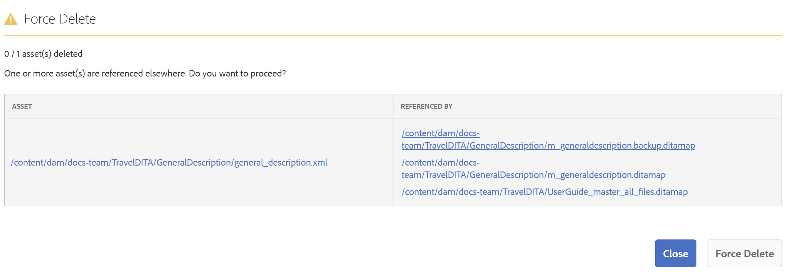

# Gestion des versions {#id181GB000XY4}

Le contrôle de version est un aspect important de tout système de gestion de contenu. Il vous permet de créer un instantané de votre ressource numérique à un moment donné. Une fois la version d’une ressource numérique en place, vous pouvez restaurer la version requise de la ressource et la mettre à jour. En règle générale, pour créer une version d’une ressource, vous devez extraire et archiver la ressource requise.

En tant qu’administrateur, vous pouvez appliquer des règles qui empêchent les utilisateurs de modifier un fichier sans l’extraire. De même, vous pouvez vous assurer que tous les fichiers extraits sont archivés afin d’éviter toute perte de données.

Dans un environnement à plusieurs utilisations, il est également important de s’assurer que les utilisateurs ne suppriment pas les fichiers du système. Cette exigence est plus critique pour les fichiers extraits par d’autres utilisateurs. Pour empêcher les utilisateurs de supprimer accidentellement des fichiers extraits du système, AEM Guides fournit une configuration que vous pouvez utiliser. Outre les fichiers extraits, vous pouvez également contrôler la suppression des fichiers qui contiennent des références ou qui sont référencés à partir d’autres fichiers.

## Créer une version pour le fichier téléchargé

>[!NOTE]
>
> Cette configuration s’applique uniquement lors du téléchargement de fichiers.

Pour activer l’option **Créer une version pour le fichier téléchargé**, procédez comme suit :

1. Suivez les instructions de la section [Remplacements de configuration](download-install-additional-config-override.md#) pour créer le fichier de configuration.
1. Dans le fichier de configuration, fournissez les détails \(propriété\) suivants pour configurer l’option **Créer une version pour le fichier téléchargé** :

   | PID | Clé de propriété | Valeur de la propriété |
   |---|------------|--------------|
   | `com.adobe.fmdita.confi g.ConfigManager` | `create.ver.new.content` | Booléen \(true/false\).  **Valeur par défaut** : `true` |

>[!NOTE]
>
> Lorsque l’option est sélectionnée, un nouveau mécanisme de gestion de version a lieu et remplace le comportement de chargement par défaut pour tout chargement ultérieur ; il enregistre le contenu du fichier chargé en tant que nouvelle version. Si cette option est désélectionnée, AEM Guides utilise le mécanisme de gestion de version par défaut AEM.

## Configuration des paramètres pour permettre la modification des fichiers extraits

L’éditeur web AEM Guides vous permet de créer et de mettre à jour des rubriques DITA. Vous pouvez configurer l’éditeur Web pour autoriser la modification des documents qui ont été extraits du référentiel uniquement. Cela permet qu’aucun autre auteur ne remplace accidentellement un sujet ouvert pour modification par un autre auteur. Une fois qu’une rubrique est ouverte pour modification, un auteur peut archiver le fichier au moment de la fermeture du fichier.

Une autre règle importante consiste à s’assurer que les fichiers qui ont été extraits sont réarchivés dans le système. Cela empêche les utilisateurs de fermer accidentellement les fichiers sans les réarchiver.

Suivez les instructions de la section [Remplacements de configuration](download-install-additional-config-override.md#) pour créer le fichier de configuration. Dans le fichier de configuration, fournissez les détails \(propriété\) suivants pour configurer la modification des fichiers extraits :

| PID | Clé de propriété | Valeur de la propriété |
|---|------------|--------------|
| `com.adobe.fmdita.xmleditor.config.XmlEditorConfig` | `xmleditor.autocheckout` | Booléen \(true/false\).  **Valeur par défaut** : `false` |

En outre, vous pouvez également configurer pour afficher un message d’avertissement chaque fois qu’un fichier extrait est fermé sans l’enregistrer ni le réarchiver dans le référentiel.

| PID | Clé de propriété | Valeur de la propriété |
|---|------------|--------------|
| `com.adobe.fmdita.xmleditor.config.XmlEditorConfig` | `xmleditor.checkin` | Booléen \(true/false\).  **Valeur par défaut** : `false` |

>[!NOTE]
>
> Que vous activiez ou non cette fonction, les options Extraction et Archivage du fichier sont toujours disponibles dans l’aperçu d’une rubrique.

## Remplacer le fichier extrait lors du chargement

>[!NOTE]
>
> *Cette configuration s’applique uniquement lorsque vous créez des fichiers à partir de l’interface utilisateur d’Assets et non lorsque vous chargez des fichiers à l’aide de l’outil WebDAV.*

Pour permettre aux utilisateurs de remplacer le fichier qu’ils ont extrait lors du téléchargement par un autre utilisateur ou un autre, procédez comme suit :

1. Suivez les instructions de la section [Remplacements de configuration](download-install-additional-config-override.md#) pour créer le fichier de configuration.
1. Dans le fichier de configuration, fournissez les détails \(propriété\) suivants pour configurer l’option **Remplacer le fichier extrait lors du téléchargement** :

| PID | Clé de propriété | Valeur de la propriété |
|---|------------|--------------|
| `com.adobe.fmdita.confi g.ConfigManager` | `overwrite.checkout.onupload` | Booléen \(true/false\).  **Valeur par défaut** : `false` |

>[!NOTE]
>
> Par défaut, cette option est désactivée. Lorsque cette option est sélectionnée, les utilisateurs peuvent remplacer les fichiers extraits. Si cette option n’est pas sélectionnée, le fichier ne peut pas être remplacé s’il est extrait par lui ou par un autre utilisateur.

## Empêcher la suppression des fichiers extraits

Suivez les instructions de la section [Remplacements de configuration](download-install-additional-config-override.md#) pour créer le fichier de configuration. Dans le fichier de configuration, fournissez les détails \(propriété\) suivants pour empêcher les utilisateurs de supprimer accidentellement les fichiers qui ont été extraits :

| PID | Clé de propriété | Valeur de la propriété |
|---|------------|--------------|
| `com.adobe.fmdita.xmleditor.config.XmlEditorConfig` | `xmleditor.preventcheckedoutcontentdeletion` | Booléen \(true/false\).   **Valeur par défaut** : `true` |

## Empêcher la suppression des fichiers référencés

En tant qu’administrateur, vous pouvez contrôler qui peut supprimer des fichiers du référentiel AEM. Plus précisément, si un fichier contient des références ou est référencé par un autre fichier, vous pouvez définir qui peut supprimer ces fichiers.

Cette configuration vous permet d’autoriser ou d’interdire à tous les utilisateurs la suppression de fichiers, ou d’autoriser uniquement un groupe d’utilisateurs spécifique à supprimer des fichiers. Si la suppression de fichier est autorisée, le processus suivant est suivi :

- Si vous supprimez un dossier contenant tous les fichiers référencés et référencés, tous les fichiers sont alors supprimés. Le processus supprime d’abord tous les fichiers qui ne contiennent aucune référence, puis les fichiers qui contiennent des références ou qui sont référencés.

- Si vous supprimez un dossier et que tout fichier du dossier est référencé par un fichier situé en dehors de ce dossier, vous serez invité à supprimer la référence avant de supprimer le fichier.

Suivez les instructions de la section [Remplacements de configuration](download-install-additional-config-override.md#) pour créer le fichier de configuration. Dans le fichier de configuration, fournissez les détails \(propriété\) suivants pour définir qui peut supprimer un fichier contenant des références ou référencé par d’autres fichiers :

| PID | Clé de propriété | Valeur de la propriété |
|---|------------|--------------|
| `com.adobe.fmdita.config.ConfigManager` | `block.unsafe.delete` | Les valeurs possibles sont :   - allow\_unsafe\_delete\_for\_all   -   allow\_unsafe\_delete\_for\_delete\_assets\_group   - block\_unsafe\_delete\_for\_all   **Valeur par défaut** : `allow_unsafe_delete_for_delete_assets_group`   Les détails de ces constantes sont présentés ci-dessous. |

Selon qui vous souhaitez accorder l’accès à la suppression, spécifiez l’une des constantes suivantes :

- allow\_unsafe\_delete\_for\_all : autorisez tous les utilisateurs à supprimer des fichiers. Dans ce cas, si le fichier\(s\) contient des références ou est référencé par d’autres fichiers, vous pouvez également supprimer ce(s\) fichier(s\) de manière forcée. Avant de supprimer le fichier, une invite s’affiche avec les références. Vous pouvez annuler l’opération de suppression, supprimer les références, puis supprimer le fichier\(s\). Vous pouvez également supprimer le fichier\(s\) sans supprimer les références.

  

- allow\_unsafe\_delete\_for\_delete\_assets\_group : un administrateur ou un utilisateur appartenant au groupe *delete-assets* est autorisé à supprimer des fichiers. Si un autre utilisateur tente de supprimer des fichiers contenant des références, il n’est pas autorisé à les supprimer tant que toutes les références ne sont pas supprimées. La capture d’écran suivante s’affiche lorsqu’un utilisateur, qui ne dispose pas d’autorisations, tente de supprimer des fichiers.

  

- block\_unsafe\_delete\_for\_all : interdire à tous les utilisateurs \(y compris les administrateurs\) de supprimer des fichiers jusqu’à ce que les références au fichier\(s\) soient supprimées.

## Purge des anciennes versions des fichiers DITA

Lorsque vous mettez à jour le contenu et créez de nouvelles versions, les versions précédentes des fichiers DITA sont conservées dans le référentiel. De nombreuses versions peuvent être créées pour vos fichiers DITA sur une période donnée et peuvent occuper collectivement une grande quantité d’espace dans votre référentiel. AEM Guides vous permet de configurer les anciennes versions qui doivent être supprimées du référentiel.

Vous pouvez accéder à cet utilitaire à l’aide de l’URL donnée si vous disposez de droits d’administration :

`<server folder path> /libs/fmdita/clientlibs/xmleditor_version_purge/page.html`

La version d’un fichier DITA qui répond à l’un des critères donnés est conservée et non purgée :

- Est la première version d’un fichier
- Est inclus dans une ligne de base
- Est inclus dans tout processus de traduction ou de révision
- Est associé à un libellé
- Respecte l’âge ou le nombre défini de critères de version

Pour purger les anciennes versions, procédez comme suit :

1. Saisissez les informations suivantes sur les fichiers à purger :

   

1. &#x200B;
   - **Nombre de versions à conserver à partir de la dernière version** : entrez le nombre de versions qui doivent être conservées et non purgées. Par exemple, si nous saisissons 5 , les 5 dernières versions sont conservées, et les versions antérieures à peuvent être purgées si d’autres conditions de purge sont remplies.
- **Conserver les versions créées pendant la période \(En jours\)** : saisissez la page maximale d’une version en jours. Les versions antérieures au nombre de jours donné peuvent être purgées si d’autres conditions de purge sont remplies. Par exemple, si nous entrez 100, toutes les versions créées avant 100 jours sont éligibles pour être purgées si d’autres conditions de purge sont remplies.
- **Chemin** : sélectionnez le chemin d’accès du fichier ou du dossier dont vous souhaitez purger les fichiers.

  >[!NOTE]
  >
  > Vous pouvez uniquement purger les fichiers DITA.

1. Cliquez sur **Aperçu du rapport de purge**.

   >[!NOTE]
   >
   > Il ne peut y avoir qu’une seule tâche de purge à la fois. Si une version est en cours de traitement, vous ne pouvez pas lancer une autre opération de purge de version.

   Le rapport de purge de version est généré.

1. Téléchargez le rapport Purge de version et vérifiez les fichiers et les versions qui seront purgés.
1. Vous pouvez choisir de **Annuler la purge** ou **Démarrer la purge**.

   

   L’état de la purge s’affiche.

   Cliquez sur **Télécharger le rapport Purge de version** pour afficher les versions purgées. Ce rapport fournit l’état de purge de toutes les versions ainsi que les raisons pour lesquelles une version spécifique a été conservée ou pourquoi elle a été purgée.

>[!NOTE]
>
> Le rapport est téléchargé à l’emplacement suivant : `/var/dxml/versionpurge`
