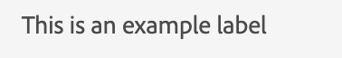

# Libellé

Pour afficher n’importe quel texte ou chaîne, nous utilisons le composant, son libellé.
Le composant de libellé de l’interface utilisateur JSON représente un code HTML. `<label/>`.

Vous trouverez ci-dessous un exemple d’ajout d’une étiquette statique.

```js title="staticLabel.js"
const staticLabelJSON =  {
    "component": "label", //tells the component name
    "label": "This is an example label", // the string to be displayed
}
```

Sous JSON, une chaîne dynamique s’affiche :

```js title="dynamicLabel.js"
const labelJSON =  {
    "component": "label", //tells the component name
    "label": "@name", // the variable storing the text to be displayed
},
```

Le libellé rendu ressemblera à ceci :

