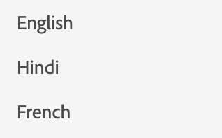

# Liste

Pour afficher une liste, nous utilisons la liste des composants.

```js title="list.js"
const listJSON =  {
    "component": "list", //tells the component name
    "data": "@languages", // an array of list items
},
```

Ici, la langue est un tableau simple de chaînes. `languages = ["English", "Hindi", "French"]`
Si nous souhaitons effectuer le rendu d’une liste d’objets, nous pouvons spécifier la structure à l’aide de la configuration de l’élément.

```js title="list.js"
const listJSON =  {
    "component": "list", //tells the component name
    "data": "@projects", // an array of list items
    "itemConfig": { // used to define the structure of the list items.
    "component": "widget",
    "id": "checkbox_label"
    }
},
```

En règle générale, itemConfig est un `widget`. Pour en savoir plus sur les widgets, accédez à [Widgets](../Widgets/basic_widget.md)

La liste rendue se présente comme suit :


