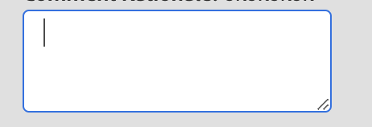

# Champ de texte et zone de texte

Pour utiliser le texte comme entrée, nous utilisons les composants, le champ de texte et la zone de texte.
Le composant de zone de texte dans l’interface utilisateur de JUI représente un fichier HTML `<textarea/>`.

```js title="textArea.js"
const textAreaJSON =  {
    "component": "textarea", //tells the component name
    "id": "input_name", // can be used to give a unique identifier to a component
    "data": "@name", // the variable storing the inputted text
    "on-keyup": {
        "name": "submitName",
        "eventArgs": {
            "keys": [
            "ENTER"
            ]
        }
    },
},
```

`on-keyup` est ici la syntaxe permettant d’appeler les commandes dans les contrôleurs.
Cela produira une zone de texte dans laquelle l’action appuyez sur ENTRÉE pour appeler l’événement `submitName`.

La zone de texte rendue se présente comme suit :


