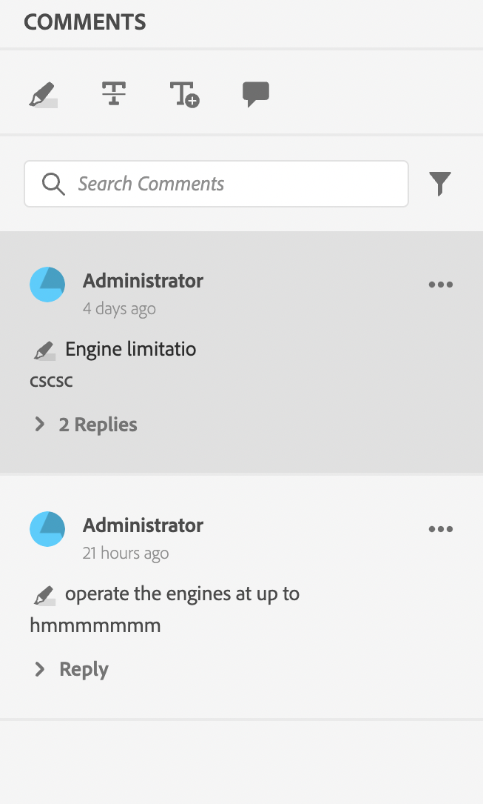

# Composants de l’application de révision

Voici les principaux composants de l’application de révision :

- Panneau de révision intégré : `id: inline_review_panel`
   - Panneau de droite dans lequel les commentaires de révision sont rendus du côté de l’éditeur XML.

- Examens de sujets : `id: topic_reviews`
   - Panneau de droite dans lequel les commentaires sont rendus sur l’application de révision.

- Commentaire de révision : `id: review_comment`
   - Widget pour chaque commentaire de révision.

Commentaire de révision sur l’application de révision :

Commentaire de révision côté éditeur xml :

- Review Comment Reply: `id: comment_reply`
   - Le widget pour chaque réponse de commentaire de révision.
     

- Nouveau commentaire de révision Réponse : `id: comment_new_reply`
   - Le widget pour la nouvelle réponse de commentaire de révision.
     

- Boîte à outils d’annotation : `id: annotation_toolbox`
   - Barre d’outils supérieure droite de l’application de révision.
     
