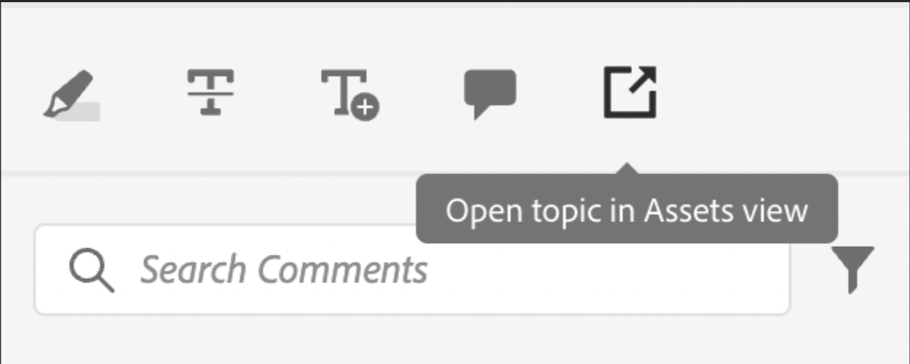

# Exemple de personnalisation simple

Découvrez comment intégrer ces personnalisations dans notre application AEM Guides.

Supposons que nous souhaitions ajouter ce bouton dans une vue existante de l’application.
Pour cela, nous avons besoin de 3 éléments de base :

1. `id` de la vue JSON à laquelle nous voulons ajouter notre composant.
2. Le `target`, c’est-à-dire l’emplacement dans le fichier JSON auquel nous voulons ajouter le nouveau composant. La `target` est définie à l’aide d’un `key` et d’un `value`. La paire clé-valeur peut être n’importe quel attribut utilisé pour définir le composant qui peut aider à son identification unique.
Nous pouvons également utiliser des index pour référencer la cible.
Nous avons 3 viewStates : `APPEND`, `PREPEND`, `REPLACE`.
3. Le JSON du composant nouvellement créé et les méthodes correspondantes.

Supposons que nous souhaitions ajouter un bouton à la boîte à outils d’annotation utilisée dans la révision, qui ouvre le fichier dans AEM.

```typescript
export default {
  id: 'annotation_toolbox', 
  view: {
    items: [
      {
        component: 'button',
        icon: 'linkOut',
        title: 'Open topic in Assets view',
        'on-click': 'openTopicInAEM',
        target: {
          key: 'value',
          value: 'addcomment',
          viewState: VIEW_STATE.APPEND

        },
      },
    ],
  },
  controller: {
    openTopicInAEM: function (args) {
        const topicIndex = tcx.model.getValue(tcx.model.KEYS.REVIEW_CURR_TOPIC)
        const {allTopics = {}} = tcx.model.getValue(tcx.model.KEYS.REVIEW_DATA) || {}
        tcx.appGet('util').openInAEM(allTopics[topicIndex])
    },
  },
}
```

Dans l’exemple ci-dessus, nous avons :

1. le `id` du fichier JSON dans lequel nous voulons insérer notre composant, c’est-à-dire `annotation_toolbox`
2. la cible est le bouton `addcomment`. Nous ajoutons notre bouton après le bouton `addcomment` à l’aide de la `append` viewState.
3. Nous définissons l&#39;événement on-click du bouton dans le contrôleur.

Le JSON de la `.src/jsons/review_app/annotation_toolbox.json` « annotation_toolbox »

Avant la personnalisation, la boîte à outils de l’annotation ressemblait à ceci :


Après la personnalisation, la boîte à outils de l’annotation ressemble à ceci :



## Ajout de CSS

Pour des raisons de cohérence, nous fournissons le composant déjà mis en forme. Des styles inhérents seront appliqués au fichier JSON inséré
La principale façon de gérer le CSS est par le biais de la clé extraClass dans les extensions.

```js
{    
    "view":{
        items:[
            {
                compoenent:"button",
                extraClass:"underline bg-red",
            }
        ]
    }
}
```

Vous pouvez placer des styles personnalisés avec des classes CSS en ajoutant un fichier CSS aux bibliothèques clientes. Pendant la génération, nous créons également une sortie [Tailwind](https://tailwindcss.com/docs/utility-first) pour les classes d’utilitaires dans tailwind. La configuration pour le même se trouve dans le `tailwind.config.js` de l’extension à l’adresse `./tailwind.config.js`
