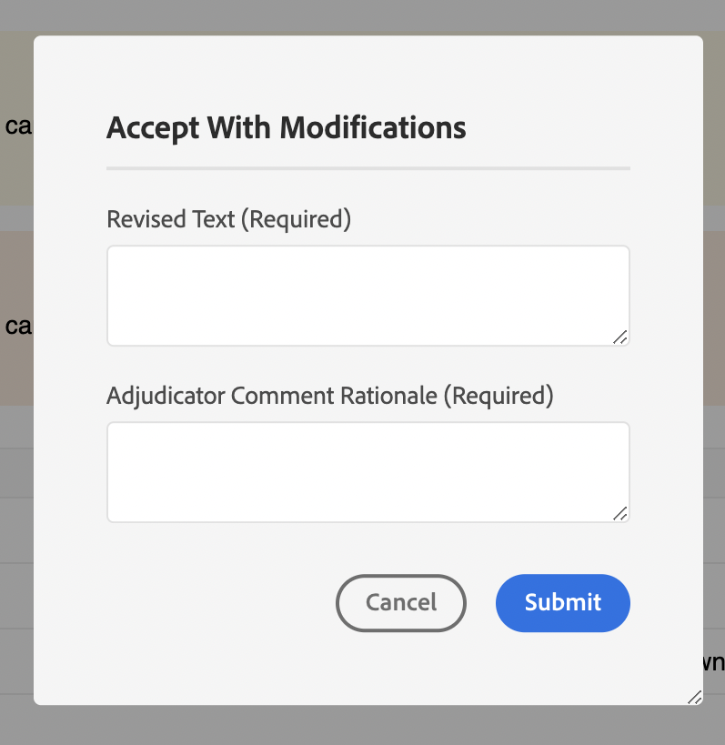

# Exemples

Dans ce package, nous avons également fourni quelques exemples de personnalisation (disponibles à l’adresse `guides_extension/src`) . Vous trouverez ci-dessous une brève description de chacun d’eux.

1. [Menu contextuel](./examples/file_options.ts)
Dans cet exemple, nous avons personnalisé le menu contextuel `file_options` afin de supprimer les options `Delete` et `Edit`, puis de remplacer l’option `Duplicate` par une option `Download`.

2. [Panneau de gauche](./examples/left_panel_container.ts)
Dans cet exemple, nous avons personnalisé le `left tab panel` pour obtenir un autre `tab` intitulé « EXTENSION DE TEST » et un `tab panel` correspondant avec un libellé : `Test Tab Panel`

3. [Panneau de droite](./examples/right_panel_container.ts)
Dans cet exemple, nous avons personnalisé l’`right tab panel` afin d’avoir un autre `tab` appelé « EXTENSION DE TEST », ainsi qu’un `tab panel` correspondant avec un libellé : `New Tab Panel`

4. [Panneau Référentiel](./examples/repository_panel.ts)

5. [Barre d’outils](./examples/toolbar.ts)
Dans cet exemple, nous avons remplacé les boutons `Insert Element`, `Insert Paragraph`, `Insert Numbered List` et `Insert Bulleted List` par un seul bouton `More Insert Options` contenant tous ces éléments.

6. Bouton [ Gérer dans le panneau Métadonnées](./examples/metadata_report_manage_button.ts)
Dans cet exemple, nous avons personnalisé le bouton **Gérer** (situé dans le panneau Métadonnées de la page Rapports) afin qu’il soit désactivé lorsque le ou les fichiers sélectionnés sont en mode lecture seule. Cela permet d’éviter les modifications accidentelles des métadonnées dans les fichiers qui ne sont pas destinés à être modifiés.

[Consulter les exemples d’applications]

1. [Boîte à outils d’annotation](./examples/review_app_examples/annotation_extension.ts)
Dans cet exemple, nous avons ajouté un autre bouton à la boîte à outils d’annotation qui ouvre la rubrique de révision actuelle dans AEM.

2. [Commentaire sur la révision](./examples/review_app_examples/review_comment.ts)
Dans cet exemple, nous avons remplacé le nom d’utilisateur par les informations utilisateur (qui comprennent le nom complet et le titre du commentateur), ajouté un ID de commentaire unique, une icône mailTo et ajouté des champs de saisie pour mentionner la gravité et la raison du commentaire.
Nous avons également ajouté un bouton `accept with modification` dans les commentaires du côté de l’éditeur XMLE qui ouvre une boîte de dialogue.

3. [Réponse au commentaire](./examples/review_app_examples/comment_reply.ts)
Dans cet exemple, nous avons remplacé le nom d’utilisateur par les informations utilisateur (qui comprennent le nom complet et le titre du commentateur) et ajouté une icône mailTo dans l’en-tête du commentaire.

4. [Panneau de révision intégré](./examples/review_app_examples/inline_review_panel.ts)
Dans ce fichier, nous calculons et attribuons l’ID de commentaire unique, mentionné dans les exemples `Review Comment` et `Comment Reply`.
   - La méthode `setCommentId` définit l’ID de commentaire unique pour chaque commentaire en fonction du nombre de commentaires.

   - Le `setUserInfo` définit la valeur de userInfo en utilisant le nom complet et le titre de chaque commentaire.

   - Le `onNewCommentEvent` garantit que la méthode `setUserInfo` est appelée pour chaque nouveau commentaire ou réponse.

   - La fonction `updatedProcessComments` s’exécute pour chaque nouvel événement de commentaire et s’assure que `setCommentId` est appelé si nous obtenons un nouvel événement de commentaire.

5. [Panneau de révisions de rubrique](./examples/review_app_examples/topic_reviews.ts) : ce fichier étend [Panneau de révision intégré](./examples/review_app_examples/inline_review_panel.ts) afin que les personnalisations ajoutées fonctionnent également du côté de l’application de révision.

6. [Boîte de dialogue Accepter avec modification](./examples/review_app_examples/accept_with_modification_dialog.ts)
Il s’agit d’un exemple d’ajout de nouveaux widgets à l’application. Nous avons créé ici une boîte de dialogue qui comporte deux champs de texte d’entrée : `Revised Text` et `Adjudicator Comment Rationale`

7. [Enregistrer la révision](./examples/save_revision.ts)
Voici un exemple de mise à jour d’une boîte de dialogue existante. Nous ajoutons un bouton pour la publication dans ce . Nous autorisons la modification du contenu de la boîte de dialogue. Reportez-vous à son fichier json ici : [`save_revision`](./jsons/dialogs/save_revision.json)

Voici le panneau de révision avant et après la personnalisation :

