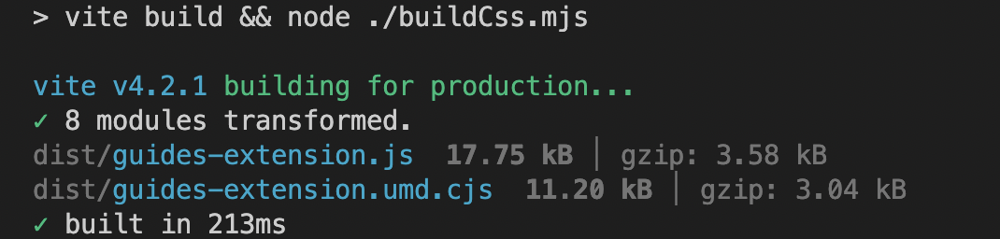

# Installation et utilisation du package d’extension AEM Guides

Les extensions vous donnent la possibilité de personnaliser votre application AEM Guides pour mieux répondre à vos besoins. Ce framework d’extension est pris en charge avec AEM Guides v4.3 et versions ultérieures (on-prem) et 2310 (cloud).

## Conditions requises

Ce package nécessite [git bash](https://github.com/git-guides/install-git) et npm

## Installation

Le moyen le plus simple d’amorcer l’installation du framework AEM Guides est via l’interface de ligne de commande

```bash
npx @adobe/create-guides-extension
```

## Ajout de code de personnalisation

1. Ajoutez des fichiers de code pour chaque composant à étendre dans le répertoire `src/`. Certains fichiers d’exemple ont déjà été ajoutés pour vous.
2. Désormais, dans le fichier `index.ts` situé dans le répertoire `src/` :
   - Importez les fichiers `.ts` avec les personnalisations que vous souhaitez ajouter à votre version.
   - Ajouter les imports à `window.extension`
   - Enregistrez le `id` du composant personnalisé et l’importation correspondante dans `tcx extensions`
   - Consultez l’exemple de `/src/index.ts`

## Création du code personnalisé

- Exécutez `npm run build` dans le répertoire racine. Vous obtiendrez 3 fichiers dans le répertoire `dist/` :
   - `build.css`
   - `guides-extension.js`
   - `guides-extension.umd.cjs`



## Ajout de la personnalisation à AEM

- Accéder à `CRXDE` `crx/de/index.jsp#/`
- Sous le dossier `apps` , créez un nœud du type `cq:ClientLibraryFolder`


- Dans la `properties` du nœud, sélectionnez `Multi` ajoutez la propriété suivante :
Nom : `categories`
Type : `String []`
Valeur : `apps.fmdita.review_overrides`, `apps.fmdita.xml_editor.page_overrides`

>[!NOTE]
>
> Pour l’avant-dernière interface utilisateur, les valeurs sont les suivantes : `apps.fmdita.penultimate.xml_editor.page_overrides` et `apps.fmdita.review_overrides`


- Pour ajouter les fichiers js créés, créez un fichier, par exemple, `tcx1.js` dans le nœud créé ci-dessus. Ici, ajoutez le code provenant de l’adresse `dist/guides-extension.umd.cjs` ou `dist/guides-extension.js`. Créez maintenant un nouveau fichier `js.txt`, ici nous ajoutons le nom de notre fichier js, qui dans ce cas serait :

```t
#base=.
tcx1.js
```

- Pour ajouter le fichier css créé, créez un fichier, par exemple `tcx1.css` dans le nœud créé ci-dessus. Ici, ajoutez le code de `dist/build.css`. Créez maintenant un nouveau fichier `css.txt`, ici nous ajoutons le nom de notre fichier css, qui dans ce cas serait :

```t
#base=.
tcx1.css
```

- Effectuez une `shift + refresh` pour charger l’application avec les personnalisations.

## Résolution des problèmes

Vérifiez que toutes les étapes ci-dessus ont été effectuées correctement.
Après avoir ajouté votre code au fichier tcx.js, veillez à effectuer une actualisation complète (maj+actualisation).
Ouvrez maintenant AEM, effectuez un clic droit, puis cliquez sur `Inspect`
Accédez à Sources et recherchez votre fichier `[node_name].js` (par exemple : extensions.js). Effectuez un Ctrl/Cmd + D pour rechercher votre fichier. Si le fichier `.js` existe avec le code JS que vous avez collé à partir de `dist/guides-extension.umd.cjs` ou `dist/guides-extension.js`, votre configuration est terminée
