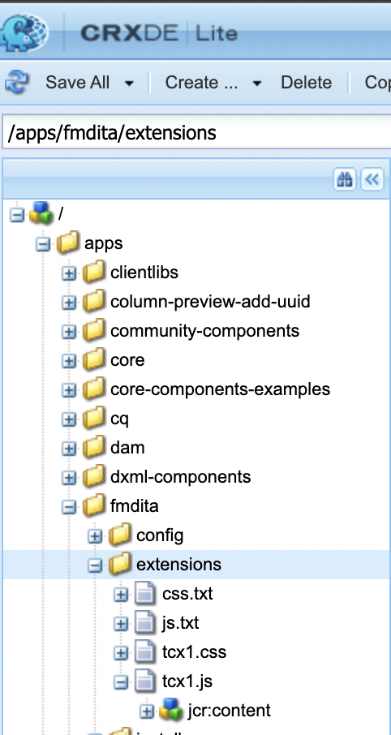

# Installation et utilisation du package d’extension AEM Guides

Les extensions vous donnent la possibilité de personnaliser votre application AEM Guides afin de mieux répondre à vos besoins. Cette infrastructure d’extension est prise en charge avec AEM Guides v4.3 et versions ultérieures (on-prem) et 2310 (cloud).

## Conditions requises

Ce module nécessite [git bash](https://github.com/git-guides/install-git) et npm

## Installation

Le moyen le plus simple d’amorcer l’installation de la structure AEM Guides consiste à utiliser l’interface de ligne de commande.

```bash
npx @adobe/create-guides-extension
```

## Ajout de code de personnalisation

1. Ajoutez des fichiers de code pour chaque composant que vous souhaitez étendre dans le répertoire `src/`. Certains fichiers d’exemple ont déjà été ajoutés pour vous.
2. Maintenant, dans le fichier `index.ts` situé dans le répertoire `src/` :
   - Importez les fichiers `.ts` avec les personnalisations que vous souhaitez ajouter dans votre version.
   - Ajoutez les importations à `window.extension`
   - Enregistrez le `id` du composant personnalisé et l’importation correspondante vers `tcx extensions`
   - Reportez-vous à l’exemple `/src/index.ts`

## Création du code personnalisé

- Exécutez `npm run build` dans le répertoire racine. Vous obtiendrez 3 fichiers dans le répertoire `dist/` :
   - `build.css`
   - `guides-extension.js`
   - `guides-extension.umd.cjs`


## Ajout de la personnalisation à AEM

- Accédez à `CRXDE` `crx/de/index.jsp#/`
- Sous le dossier `apps`, créez un noeud du type `cq:ClientLibraryFolder`



- Dans le `properties` du noeud, sélectionnez `Multi` et ajoutez la propriété suivante :
Nom : `categories`
Type : `String []`
Valeur : `apps.fmdita.review_overrides`, `apps.fmdita.xml_editor.page_overrides`


- Pour ajouter le fichier js généré, créez un fichier, `tcx1.js` par exemple, dans le noeud créé ci-dessus. Ici, ajoutez le code de `dist/guides-extension.umd.cjs` ou `dist/guides-extension.js`. Créez maintenant un fichier `js.txt`, nous ajoutons ici le nom de notre fichier js, qui dans ce cas serait :

```t
#base=.
tcx1.js
```

- Pour ajouter le CSS créé, créez un fichier, `tcx1.css` par exemple, dans le noeud créé ci-dessus. Ajoutez ici le code de `dist/build.css`. Créez maintenant un fichier `css.txt`, nous ajoutons ici le nom de notre fichier CSS, qui dans ce cas serait :

```t
#base=.
tcx1.css
```

- Effectuez un `shift + refresh` pour charger l’application avec les personnalisations.

## Résolution des problèmes

Vérifiez que toutes les étapes ci-dessus ont été effectuées correctement.
Après avoir ajouté votre code à tcx.js, effectuez une actualisation irréversible (Maj+Actualiser).
Maintenant, ouvrez AEM, cliquez avec le bouton droit et cliquez sur `Inspect`.
Accédez à Sources et recherchez votre fichier `[node_name].js` (par exemple : extensions.js). Effectuez un contrôle/Cmd + D pour rechercher votre fichier. Si le fichier `.js` existe avec le code JS que vous avez collé à partir de `dist/guides-extension.umd.cjs` ou `dist/guides-extension.js`, votre configuration est terminée.
